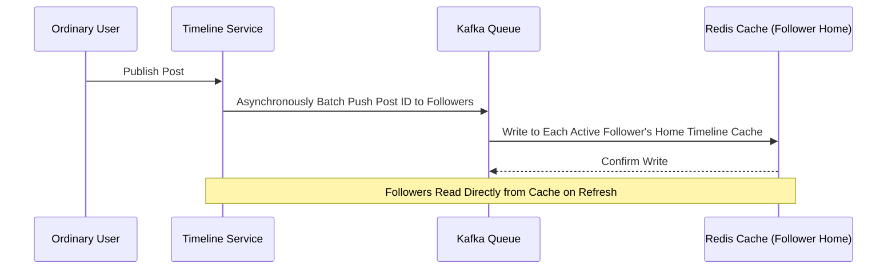
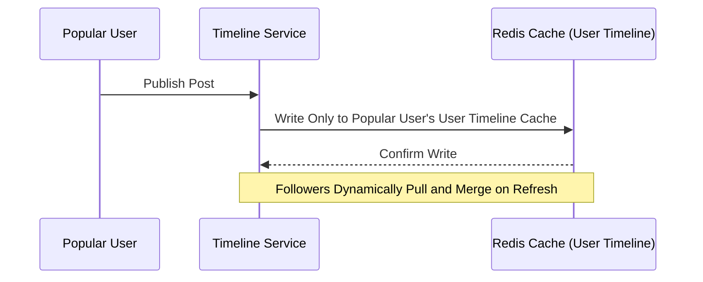
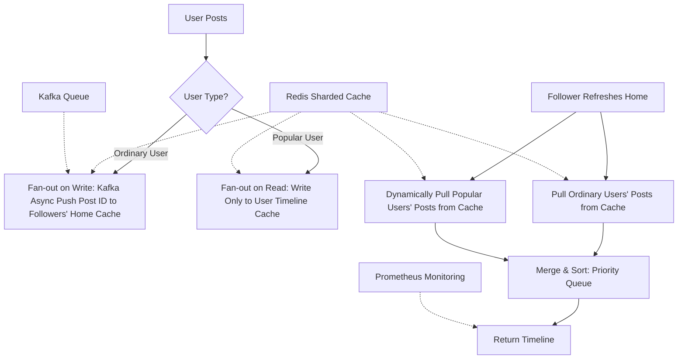
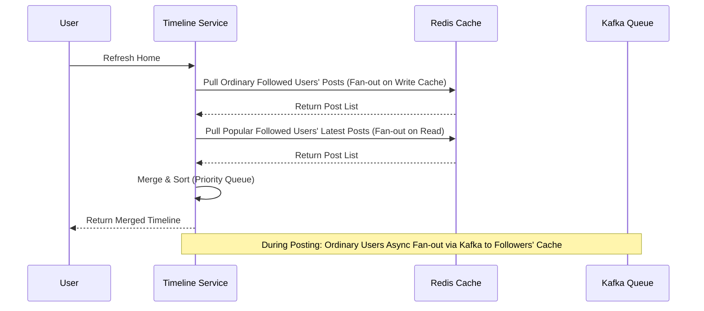

---
toc:
    sidebar: left
layout: post
pretty_table: true
mermaid:
    enabled: true
    zoomable: true
giscus_comments: true
layout: post
title: "Detailed System Design of Twitter Timeline Generation"
date: "2025-07-31"
categories: 
  - "System Design Other"
---


## Introduction

The timeline is a core feature of social platforms like Twitter/X. The home timeline must aggregate the latest posts from hundreds to millions of followed users in real-time, demanding high concurrency handling, low latency, and high availability. This article systematically introduces mainstream architectural approaches for timeline generation, trade-offs, engineering implementation details, and common interview follow-up questions.

---

## 1. Requirements and Challenges

- **High Concurrency**: Billions of DAU, with home refresh peaks reaching tens of thousands of TPS.
- **Extreme Read-Write Imbalance**: Read-write ratio up to 100:1, with the majority of requests being home timeline reads.
- **Celebrity Effect**: Posts from popular users must impact millions of followers, easily creating hotspots.
- **Low Latency**: Home refresh <200 ms, post publishing <100 ms.
- **Consistency**: Eventual consistency is acceptable, with some scenarios tolerating a few seconds of delay.

---

## 2. Scheme Comparison and Trade-offs

### 2.1 Fan-out on Write (Push Model)

- **Principle**: When a user publishes a post, the system immediately "pushes" (writes) the post ID to the home timeline caches of all followers. This is like an express delivery system: the poster prepares the package, and the system automatically distributes it to each follower's "mailbox" (cache), so followers can directly retrieve it from their mailbox upon refresh. In simple terms, it's "preparing everything in advance" to ensure efficient reads, but it assumes the follower list isn't too large.
- **Advantages**: Extremely fast reads, O (1) cache hits, suitable for high-read scenarios.
- **Disadvantages**: High write pressure; a celebrity post requires millions of write operations, prone to write avalanches.

### 2.2 Fan-out on Read (Pull Model)

- **Principle**: When a user refreshes their home timeline, the system dynamically "pulls" (queries) the latest posts from all followed users' timelines and aggregates/sorts them. This is similar to shopping at a supermarket: each refresh, the follower goes to each followed user's "shelf" (cache or database) to pick the latest items and combines them into their shopping cart. In simple terms, it's "on-demand fetching," with simple writes but real-time computation during reads, prone to lag during peaks.
- **Advantages**: Easy writes; a celebrity post only needs one write.
- **Disadvantages**: Slow reads, requiring cross-shard/cross-service aggregation, high latency, poor scalability.

### 2.3 Hybrid Fan-out

- **Principle**: Combines the above two, differentiating by user type—ordinary users use fan-out on write (pre-push), while popular users use fan-out on read (on-demand pull). This is like a hybrid delivery model: direct door delivery for ordinary friends' packages, but fans self-pickup for celebrities' to avoid overwhelming the delivery staff. In simple terms, it's a "tailored" intelligent strategy that balances read-write loads but requires extra logic for type judgment and data merging.
- **Advantages**: Balances read-write efficiency; popular users don't overwhelm writes, ordinary users get fast reads.
- **Disadvantages**: Complex implementation, needing dynamic user type judgment and some computational overhead for merging.

---

## 3. Recommended Architecture: Hybrid Fan-out + Caching

### 3.1 User Classification

- Set a threshold (e.g., followers >10,000 for popular users); ordinary users use fan-out on write, popular users use fan-out on read.
- Cache user type results in Redis (TTL=1 hour) to reduce frequent database queries.

### 3.2 Fan-out on Write (Ordinary Users)

- After a user posts, the post ID is asynchronously batched via Kafka and pushed to all active followers' home timeline caches (Redis List/ZSet).
- Inactive followers are not pushed to save resources.

The following is the sequence diagram for fan-out on write (ordinary users) (Mermaid syntax):



#### Java Code Example: Fan-out on Write Handling (During Posting)

```java
// In TimelineService, handle ordinary user posting with fan-out on write (simplified; actual should be async via Kafka)
public void fanOutOnWrite(long userId, long tweetId) {
    // Fetch active followers list (assume from DB or cache)
    List<Long> activeFollowers = getActiveFollowers(userId);
    
    // Use Redis Pipeline for batch writes to optimize performance
    Pipeline pipeline = redis.pipelined();
    for (long followerId : activeFollowers) {
        // Push post ID to follower's home timeline (use LPUSH to keep newest on top)
        pipeline.lpush("home_timeline:" + followerId, tweetId);
    }
    pipeline.sync();  // Execute batch operations
}
```

### 3.3 Fan-out on Read (Popular Users)

- Popular users' posts are only written to their own user timeline cache.
- When followers refresh home, the timeline service dynamically pulls these popular users' latest posts and merges/sorts them with ordinary users' posts (using a priority queue).

The following is the sequence diagram for fan-out on read (popular users) (Mermaid syntax, focusing on write phase; read phase in home generation flow):



#### Java Code Example: Fan-out on Read Handling (During Posting, Write to Own Timeline Only)

```java
// In TimelineService, handle popular user posting with fan-out on read (write to own timeline only)
public void writeToUserTimeline(long userId, long tweetId) {
    // Push post ID to user's personal timeline (use LPUSH to keep newest on top)
    redis.lpush("user_timeline:" + userId, tweetId);
}
```

### 3.4 Caching and Pre-warming

- Home timelines, user timelines, and post contents use sharded Redis caches; regularly pre-warm for popular/active users.
- Combine TTL and LRU to ensure hot data resides in memory.

### 3.5 Monitoring and Degradation

- Use Prometheus to monitor fan-out latency, cache hit rates, etc.
- Under high load, automatically degrade to return cached data only, prompting users to "refresh for latest."

### 3.6 Architecture Diagram

The following is a simplified architecture diagram of the recommended approach (Mermaid syntax, viewable in Mermaid-supported Markdown renderers):



This diagram illustrates the overall flow for posting and home refresh, highlighting the hybrid fan-out branching logic.

---

## 4. Key Data Structures and Flows

### 4.1 Redis Cache Structures

- `home_timeline:{user_id}`: Home timeline cache, stores post IDs, TTL=1 hour.
- `user_timeline:{user_id}`: User timeline cache, stores post IDs, TTL=1 hour.
- `tweet:{tweet_id}`: Post content cache.

### 4.2 Home Timeline Generation Flow

The following is the sequence diagram for the flow (Mermaid syntax):



#### Java Code Example (Merge & Sort During Home Refresh)

```java
// 1. Pull ordinary followed users' posts from Redis (pre-pushed via fan-out on write)
// Assume nonHotKey is the current user's home cache key, limit is posts per page (e.g., 20)
List<Tweet> nonHotTweets = redis.lrange(nonHotKey, 0, limit);

// 2. Pull all popular users' (celebrities) latest posts from Redis
// hotKey is the popular user's user timeline cache key, pull up to 500 to prevent overload
List<Tweet> hotTweets = redis.lrange(hotKey, 0, 500);

// 3. Create a priority queue (max-heap) for merging posts in descending timestamp order
// This ensures the final home timeline has newest posts first
PriorityQueue<Tweet> pq = new PriorityQueue<>(
    (a, b) -> Long.compare(-a.timestamp, -b.timestamp) // Larger timestamps rank first
);

// 4. Add ordinary and popular users' posts to the priority queue
pq.addAll(nonHotTweets);
pq.addAll(hotTweets);

// 5. Pop newest posts from the queue sequentially until reaching the page limit (e.g., 20)
List<Tweet> merged = new ArrayList<>();
while (!pq.isEmpty() && merged.size() < limit) {
    merged.add(pq.poll());
}

// 6. Return the merged home timeline post list
return merged;
```

---

## 5. Performance Optimizations and Engineering Details

- **Batch Operations**: Kafka messages and Redis Pipeline for batch writes to reduce network IO.
- **Async Decoupling**: All fan-out on write operations handled asynchronously via Kafka to avoid blocking main flows.
- **Merge & Sort**: Use efficient heap sort for merging popular and ordinary posts, with memory pre-allocation to prevent GC jitter.
- **Sharding & Scaling**: Shard Redis, Kafka, and timeline services for horizontal scaling to support DAU growth.
- **Pagination Support**: Support page_token for users to pull more historical posts on scroll.

---

## 6. Common Interview Follow-ups and Real Engineering Pitfalls

### High-Frequency Follow-ups
- How to handle write pressure for celebrity posts? (Hybrid fan-out, async batching, push only to active followers)
- How to self-protect during cache avalanches? (Pre-warming, rate limiting, degradation)
- How to ensure no interruptions during shard migrations? (Dual-write sync, throttled migration, graceful degradation)

### Engineering Pitfalls
- Kafka queue backlogs causing post delays, requiring dynamic consumer scaling.
- Unsynchronized cache invalidations leading to stale data, needing dual-write consistency or Pub/Sub.
- Untimely hotspot shard migrations causing single-point bottlenecks affecting the whole system.

### Common Misconceptions
- Using fan-out on write for all users, leading to system crashes under celebrity effects.
- Relying only on TTL without pre-warming, high risk of cache avalanches.
- No load balancing after sharding, with hot shards dragging down the system.

---

## 7. Summary

Home timeline generation is a core challenge in social platform system design. Adopting a hybrid fan-out + caching + async decoupling + monitoring/degradation architecture balances high concurrency, low latency, and high availability, handling celebrity effects and sudden hotspots while ensuring smooth experiences for most users. Engineering implementations must focus on batching, async, sharding, cache consistency, and degradation strategies to avoid common misconceptions and pitfalls.
