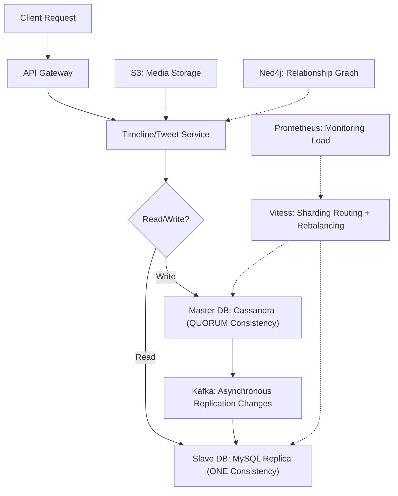
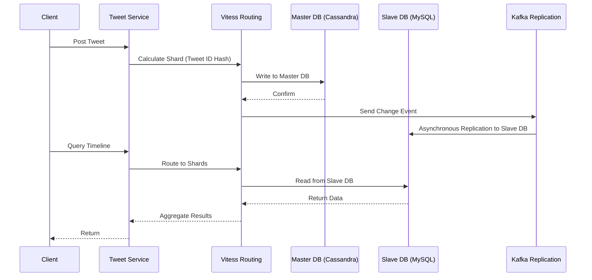

---
toc:
    sidebar: left
layout: post
pretty_table: true
mermaid:
    enabled: true
    zoomable: true
giscus_comments: true
layout: post
title: "Twitter Database Read and Write and Sharding System Design Detailed Guide"
date: "2025-08-01"
categories: 
  - "System Design Other"
---


## Introduction

The database is the foundational infrastructure of social platforms like Twitter/X, responsible for storing massive user data, tweets, and relationship graphs. Facing billions of DAU and hundreds of millions of daily tweets, the read/write operations are extremely unbalanced (read/write ratio 100:1), with data hotspots (e.g., celebrity tweets) and cross-query complexity becoming major bottlenecks. This article systematically introduces the architecture schemes for database read/write and sharding, trade-offs, engineering implementation details, and common interview follow-up questions, based on hybrid storage (SQL for users, NoSQL for tweets, Graph DB for relationships) and sharding strategies, aiming to achieve high throughput, low latency, and high availability.

---

## 1. Requirements and Challenges

- **Massive Data Scale**: Daily writes of 24 TB+ (text, media), PB-level storage over 5 years; total accounts 15 billion, tweets in trillions.
- **Read/Write Imbalance**: Read operations dominate (e.g., timeline aggregation requires cross-user queries), write operations require strong consistency (e.g., tweet posting).
- **Hotspot Issues**: Celebrity user data concentration, single shard load >80%; new data hotspots cause IO contention.
- **Low Latency and Consistency**: Queries <100 ms, strong consistency scenarios (e.g., authentication) allow no delay, eventual consistency (e.g., follower counts) can tolerate second-level delays.
- **Fault Tolerance**: Continue operating during node failures or network partitions, with data replication across data centers.

---

## 2. Scheme Comparison and Trade-offs

### 2.1 Sharding by Creation Time

- **Principle**: Distribute data to different shards based on tweet creation time (e.g., by day/week), similar to archiving file cabinets by date, facilitating time-range queries.
- **Advantages**: Efficient time queries, only accessing a few shards; easy to archive historical data.
- **Disadvantages**: Uneven hot/cold distribution, high write pressure on new shards (hotspots), resource waste on old shards.

### 2.2 Sharding by User ID Hash

- **Principle**: Hash user ID (e.g., Murmur 3), store same-user data in the same shard, similar to classifying phone books by name initials.
- **Advantages**: Localized user timeline queries, simple implementation.
- **Disadvantages**: Homepage timeline requires cross-shard aggregation; hot users cause uneven shards, severe hotspots.

### 2.3 Sharding by Tweet ID Hash

- **Principle**: Hash tweet ID to distribute data evenly, similar to randomly assigning lottery numbers to avoid concentration.
- **Advantages**: Even data distribution, reduced hotspots; high availability, minimal fault impact.
- **Disadvantages**: Timeline aggregation requires accessing multiple shards, high query cost (relies on caching).

Comparison Table:

| Sharding Scheme    | Advantages                                                           | Disadvantages                                                        | Applicable Scenario Comparison |
|--------------------|----------------------------------------------------------------------|----------------------------------------------------------------------|--------------------------------|
| **By Creation Time** | - Efficient time queries<br>- Easy historical data archiving        | - New shard hotspots, resource waste<br>- Frequent creation for quick filling | Suitable for historical data analysis, but poor for real-time read/write. |
| **By User ID Hash** | - Localized user timeline<br>- Simple implementation                | - Many cross-shard homepage queries<br>- Uneven hot users, severe hotspots | Superior to time sharding in user queries, but poor large-scale scaling. |
| **By Tweet ID Hash** | - Even data distribution<br>- Reduced hotspots, high availability   | - Complex timeline queries, requires strong caching support          | Best for large-scale: Balanced with caching for high read performance. |

---

## 3. Recommended Architecture: Sharding by Tweet ID Hash + Read/Write Separation

### 3.1 Storage Selection

- **SQL (MySQL)**: User profiles, authentication (strong consistency).
- **NoSQL (Cassandra)**: Tweet storage (high throughput).
- **Graph DB (Neo 4 j)**: Follow relationships (graph queries).
- **Object Storage (S 3)**: Media files.

### 3.2 Sharding Mechanism

- Use consistent hash ring (1024 shards), with tweet ID as the key for even distribution.
- Tool: Vitess as the sharding routing layer, supporting automatic rebalancing.

### 3.3 Read/Write Separation

- Master DB (Cassandra) dedicated to writes, consistency level QUORUM.
- Slave DB (MySQL replicas) for multiple reads, consistency level ONE; asynchronous replication tools like Debezium + Kafka to sync changes (latency <1 s).

### 3.4 Fault Tolerance and Rebalancing

- Multi-AZ deployment, Vitess automatic failover (<10 s).
- Rebalancing script monitors load hourly (>70% triggers), gradual data migration.

The following is a simplified architecture diagram of the recommended architecture (Mermaid syntax):



This diagram shows the overall process of read/write separation and sharding routing.

---

## 4. Key Data Structures and Processes

### 4.1 Table Design

- **User Table (MySQL)**:
  | Field        | Type         | Description                  |
  |--------------|--------------|------------------------------|
  | userId      | BIGINT      | User ID (Primary Key)       |
  | name        | VARCHAR (100)| Username                    |
  | email       | VARCHAR (100)| Email                       |
  | creationTime | DATETIME   | Creation Time               |
  | lastLogin   | DATETIME    | Last Login                  |
  | isHotUser   | BOOLEAN     | Whether Hot User            |

- **Tweet Table (Cassandra)**:
  | Field        | Type         | Description                  |
  |--------------|--------------|------------------------------|
  | tweetId     | BIGINT      | Tweet ID (Partition Key)    |
  | userId      | BIGINT      | Author ID                   |
  | content     | VARCHAR (280)| Content                     |
  | creationTime | TIMESTAMP  | Creation Time (Clustering Key) |

- **Follow Table (Neo 4 j)**: Nodes as User, relationships as FOLLOWS.

### 4.2 Tweet Write and Read Process

The following is the process sequence diagram (Mermaid syntax):



#### Java Code Example (Writing Tweet)

```java
// Handle write in tweet service (sharding by tweet ID hash)
public void insertTweet(long tweetId, long userId, String content, Timestamp creationTime) {
    // Calculate hash shard
    long hash = MurmurHash3.hash(tweetId);
    int shard = (int) (hash % numShards);

    // Insert using Vitess or Cassandra client
    PreparedStatement stmt = session.prepare("INSERT INTO tweets (tweetId, userId, content, creationTime) VALUES (?, ?, ?, ?)");
    BoundStatement bound = stmt.bind(tweetId, userId, content, creationTime);
    session.execute(bound);  // QUORUM consistency

    // Asynchronously deliver to Kafka for replication
    kafkaProducer.send(new ProducerRecord<>("tweet_changes", String.valueOf(tweetId), serializeTweet(tweetId, userId, content)));
}
```

#### Java Code Example (Reading Tweet)

```java
// Handle read in timeline service (from slave DB)
public List<Tweet> queryTweetsByUser(long userId, long sinceTime) {
    // Vitess routes to relevant shards
    QueryBuilder qb = QueryBuilder.select().from("tweets");
    qb.where(eq("userId", userId)).and(gt("creationTime", sinceTime));
    ResultSet results = vitessSession.execute(qb.build());

    // Convert to Tweet list
    List<Tweet> tweets = new ArrayList<>();
    for (Row row : results) {
        tweets.add(new Tweet(row.getLong("tweetId"), row.getString("content"), row.getTimestamp("creationTime")));
    }
    return tweets;
}
```

---

## 5. Performance Optimization and Engineering Details

- **Index Optimization**: Cassandra secondary indexes (creationTime + userId), reducing scans.
- **Asynchronous Replication**: Debezium captures changes, Kafka buffering, latency <1 s.
- **Rebalancing**: Vitess moveTables for gradual migration, rate-limited <1 GB/min to avoid interruptions.
- **Media Processing**: Asynchronous upload to S 3, CDN pre-warming for hot files.
- **Monitoring**: Grafana tracks IO/CPU, shard load, alerts >80% to trigger autoscaling.

---

## 6. High-Frequency Interview Follow-Ups and Real Engineering Pitfalls

### High-Frequency Follow-Ups
- How to detect and migrate hotspot shards? (Monitor load, Vitess automatic rebalancing)
- How to ensure consistency under read/write separation? (QUORUM writes, ONE reads + asynchronous replication)
- How to dynamically adjust shard count with data growth? (Consistent hash ring expansion, virtual nodes for evenness)

### Engineering Pitfalls
- Replication latency peaks >5 s, causing dirty reads; solution: Prioritize high-priority changes, monitor lag.
- Rebalancing interrupts service; solution: Dual-write synchronization, test with Chaos Engineering.
- High index maintenance overhead; solution: Periodic rebuilds, test query plans.

### Common Misconceptions
- Using only user ID sharding, ignoring hotspots leading to single-shard crashes.
- No read/write separation, writes drag down read performance.
- Ignoring cross-data center replication, data loss during network partitions.

---

## 7. Summary

Twitter database read/write and sharding are key to handling massive data. Through sharding by tweet ID hash + read/write separation + asynchronous replication architecture, balanced load, low latency, and high availability can be achieved. Engineering focuses on sharding routing (Vitess), consistency management (QUORUM/ONE), and monitoring degradation to avoid hotspots and fault risks. In practice, combine with caching (e.g., Redis) and message queues (e.g., Kafka) to support overall system scaling.