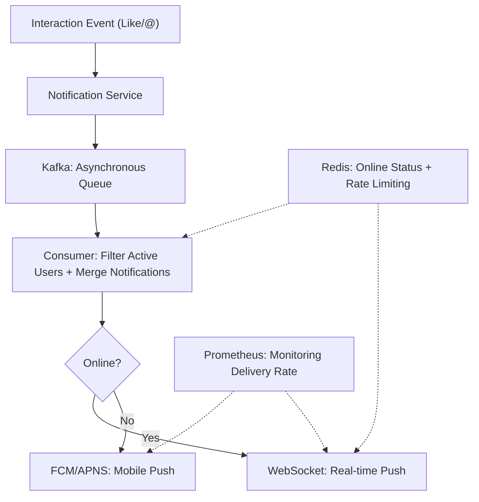
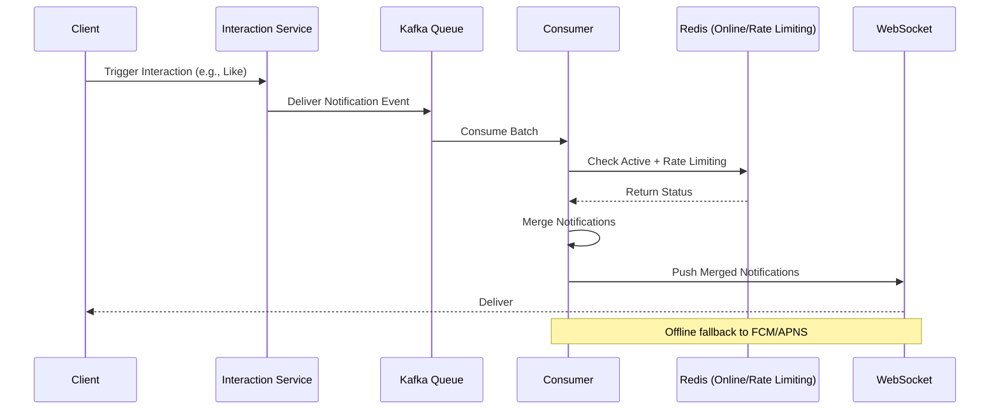

---
toc:
    sidebar: left
layout: post
pretty_table: true
mermaid:
    enabled: true
    zoomable: true
giscus_comments: true
layout: post
title: "Twitter Notification and Real-Time Push System Design Detailed Guide"
date: "2025-08-01"
categories: 
  - "System Design Other"
---


## Introduction

Notifications and real-time pushes are key interactive mechanisms in Twitter/X social platforms, used to handle events such as likes, @mentions, and replies, ensuring users receive updates promptly. Facing billions of DAU and daily billions of interactions, the system must support high-concurrency pushes, low-latency delivery, and high availability. This article systematically introduces the architecture schemes for notification pushes, trade-offs, engineering implementation details, and common interview follow-up questions, based on asynchronous decoupling (Kafka) and real-time communication (WebSocket), aiming to balance resource consumption and user experience.

---

## 1. Requirements and Challenges

- **High-Frequency Interactions**: Billions of notifications daily (such as likes/@), with peak TPS in the tens of thousands; hot events can trigger millions of pushes instantly.

- **Real-Time Performance**: Delivery latency <1 s, with frequent mobile reconnections (>10% users).

- **Resource Contention**: Long connections consume memory (each >1 KB), peak CPU >80%; queue backlogs lead to losses.

- **Consistency and Filtering**: Eventual consistency can tolerate second-level delays, but active users must be distinguished to avoid invalid pushes.

- **Fault Tolerance**: Limit rates and degrade during DDoS attacks or network partitions; support multi-channels (Web/mobile).

---

## 2. Scheme Comparison and Trade-offs

### 2.1 WebSocket (Push Mode)

- **Principle**: Establish a persistent bidirectional connection where the server actively pushes notifications, similar to a real-time phone call: once there's a message, the system directly "calls" the user's connection.

- **Advantages**: Real-time low latency (<1 s), efficient bandwidth usage.

- **Disadvantages**: Complex connection management, high memory/CPU under high concurrency; high reconnection overhead on disconnections.

### 2.2 Polling (Pull Mode)

- **Principle**: The client periodically polls the server for new notifications, similar to checking a mailbox: the user asks "Any new messages?" every few seconds.

- **Advantages**: Simple implementation, no need for long connections.

- **Disadvantages**: High latency (average > interval time), bandwidth waste (many empty polls); unsuitable for real-time scenarios.

### 2.3 Hybrid Mode (Push + Pull)

- **Principle**: Use push (WebSocket) for online users, and pull (FCM/APNS fallback) for offline/mobile, similar to smart mail: instant notifications when online, batch delivery when offline.

- **Advantages**: Balances real-time and resources, reduces invalid pushes.

- **Disadvantages**: Complex multi-channel management, consistency challenges.

Comparison Table:

| Scheme             | Advantages                                                           | Disadvantages                                                        | Applicable Scenario Comparison |
|--------------------|----------------------------------------------------------------------|----------------------------------------------------------------------|--------------------------------|
| **WebSocket**     | - Real-time delivery <1 s<br>- Low bandwidth consumption            | - High connection memory<br>- High DDoS risk                         | Superior to Polling in interaction-intensive scenarios, but requires rate limiting for high-concurrency scaling. |
| **Polling**       | - Simple implementation, stateless<br>- Easy fault tolerance        | - High latency (> a few seconds)<br>- High bandwidth/server pressure | Suitable for low-frequency notifications, but poor real-time performance, not recommended as primary. |
| **Hybrid Mode**   | - Balances online/offline<br>- Resource optimization, delivery >99% | - Complex implementation, multi-channel synchronization<br>- Filtering logic overhead | Best for large-scale: Reduces pressure by 50% compared to pure push, high real-time performance. |

---

## 3. Recommended Architecture: WebSocket Combined with Kafka Asynchronous Push

### 3.1 Notification Type Classification

- Distinguish high-priority (@mentions/replies) and low-priority (likes), prioritize hot notifications.

- Prioritize pushes for active users (Redis online status, TTL=5 min).

### 3.2 Asynchronous Push

- After interaction triggers, deliver to Kafka queue; consumers filter and batch push.

- Merge notifications (e.g., "5 people liked") to reduce frequency.

### 3.3 Multi-Channel Delivery

- Web/App: WebSocket as the main channel.

- Mobile: Fallback to FCM/APNS.

### 3.4 Rate Limiting and Degradation

- Redis token bucket rate limiting (1000/min/user).

- Batch merge pushes every 5 s during high load.

The following is a simplified architecture diagram of the recommended architecture (Mermaid syntax):



This diagram shows the overall process from event triggering to delivery.

---

## 4. Key Data Structures and Processes

### 4.1 Redis Structure

- `online:{userId}`: Online status, value "1", TTL=5 min.

- `rate:{userId}`: Push rate limiting count, EX=60 s.

- `notification:{userId}`: Temporary storage for merged notifications (HashMap).

### 4.2 Notification Push Process

The following is the process sequence diagram (Mermaid syntax):



#### Java Code Example (Delivering Notifications)

```java
// Deliver notifications to Kafka in the interaction service
public void sendNotification(long fromUserId, long toUserId, String type, long tweetId) {
    // Serialize notification data
    String notificationJson = serializeNotification(fromUserId, toUserId, type, tweetId);
    // Configure Producer and send
    kafkaProducer.send(new ProducerRecord<>("notification-queue", String.valueOf(toUserId), notificationJson));
}
```

#### Java Code Example (Consumer Processing and Pushing)

```java
// Kafka consumer processing logic
public void processNotifications() {
    KafkaConsumer<String, String> consumer = new KafkaConsumer<>(props);
    consumer.subscribe(Collections.singleton("notification-queue"));
    while (true) {
        ConsumerRecords<String, String> records = consumer.poll(Duration.ofMillis(100));
        Map<String, List<Notification>> batchMap = groupByUser(records); // Aggregate by user
        for (Map.Entry<String, List<Notification>> entry : batchMap.entrySet()) {
            String userId = entry.getKey();
            List<Notification> notifications = entry.getValue();
            // Check online and rate limiting
            if ("1".equals(redis.get("online:" + userId)) && redis.incr("rate:" + userId) <= 1000) {
                // Merge notifications
                Map<String, Integer> merged = aggregateNotifications(notifications);
                // Push
                Session ws = connections.get(userId);
                if (ws != null && ws.isOpen()) {
                    ws.getAsyncRemote().sendText(JSON.toString(merged));
                } else {
                    // Fallback to mobile push
                    fcm.sendToDevice(getDeviceToken(userId), merged);
                }
            }
            redis.expire("rate:" + userId, 60);
        }
    }
}
```

---

## 5. Performance Optimization and Engineering Details

- **Batch Processing**: Consumers process 500 notifications per batch, Redis MGET for batch online checks.

- **Heartbeat Detection**: WebSocket ping/pong every 30 s to update online status.

- **Security Protection**: IP rate limiting, encrypted pushes to prevent DDoS.

- **Scaling**: Kafka partitions=100, WebSocket nodes autoscaling (>80% CPU).

- **Monitoring**: Grafana tracks delivery rate/latency, alerts for losses >1%.

---

## 6. High-Frequency Interview Follow-Ups and Real Engineering Pitfalls

### High-Frequency Follow-Ups

- How to prevent queue backlogs under high concurrency? (Dynamic consumer scaling, priority queues)

- How to handle consistency losses? (Kafka persistence, retry mechanisms)

- How to ensure multi-channel synchronization? (Unified JSON format, Redis temporary storage)

### Engineering Pitfalls

- Connection memory overflow; solution: Horizontal scaling, limit connections/node <100 k.

- DDoS amplification; solution: Token bucket + Captcha.

- Merge logic bugs leading to duplicate notifications; solution: HashMap aggregation + test scripts.

### Common Misconceptions

- Using only Polling, poor real-time performance leading to user churn.

- Unlimited flows, peak crashes the system.

- Ignoring offline pushes, poor mobile user experience.

---

## 7. Summary

Twitter notifications and real-time pushes are core to enhancing user stickiness. Through WebSocket + Kafka asynchronous + multi-channel architecture, efficient delivery and resource optimization can be achieved. Engineering focuses on filtering merges, rate limiting degradation, and monitoring to ensure >99% delivery rate. Combined with upstream (such as timeline events), avoid high-frequency bottlenecks, and emphasize trade-offs in interviews (such as real-time vs. Resources). Actual deployment requires testing billions-scale loads to support platform growth.