---
toc:
    sidebar: left
layout: post
pretty_table: true
mermaid:
    enabled: true
    zoomable: true
giscus_comments: true
title: "Why Shopify Moved Inventory Reservations from Redis to MySQL"
date: "2026-09-19"
categories:
  - "System Design Other"
---

> 参考：Shopify Engineering，[We replaced Redis with MySQL for inventory reservations—and it scaled](https://shopify.engineering/scaling-inventory-reservations)（2026）；方案灵感来自 37signals 的 Solid Queue。表结构、SQL 和幂等、对账等补充内容是本文在原文基础上的推演。

## 介绍

库存预留系统负责在买家点击"完成购买"到支付成功的这段时间里，为购物车中的商品打一个短期的保护标记，保证同一件库存不会被两个买家同时买走，也不会在明明有货的情况下被误报售罄。Shopify 的这套系统多年来跑在 Redis 上，2026 年迁回了 MySQL，并在黑五峰值下达成了吞吐目标。本文复盘这次迁移：为什么 Redis 方案有结构性缺陷，为什么单行计数在 MySQL 上撑不住，`SKIP LOCKED` 加有界池是怎么把两者的优点合到一起的，以及上线后发现真正的瓶颈根本不在预留本身。

## 需求与挑战

- **两个操作**
    - **预留（Reserve）**：支付开始时锁定 N 件，返回预留 ID 和过期时间，几分钟后自动失效。
    - **认领（Claim）**：支付成功时从库存台账永久扣减，预留标记同时消失。
- **正确性**：不超卖，不丢预留；预留和台账之间保持 ACID。这是第一优先级。
- **高并发**：闪购时单个商品单个仓位每秒数千次预留。Shopify 2025 年黑五峰值每分钟 510 万美元销售额，每一笔都要走这条路径。
- **多仓位**：只能从真正能发货的仓位预留。
- **好邻居**：预留和购物车、支付、订单共用一个数据库，不能吃满连接或长时间持锁。
- **优先级**：一致性 > 可用性 > 可扩展性

## 方案演进

### 方案 A：单行计数加行锁

一行 quantity 加条件 UPDATE：

```sql
UPDATE inventory SET available = available - 1
WHERE item_id = 1001 AND available >= 1;
```

这个写法是**正确的**，条件判断和扣减在同一条语句里，由 InnoDB 行锁保证原子性。拆成"先 SELECT 再 UPDATE"才是 check-then-act 竞态。它的问题是吞吐：所有买家抢同一行的同一把锁，处理完全串行。持锁窗口按 5ms 算，这个商品的上限就是每秒 200 次，和机器数量无关。Shopify 早期往 MySQL 迁移时试过这条路，没能扛住热点争用。

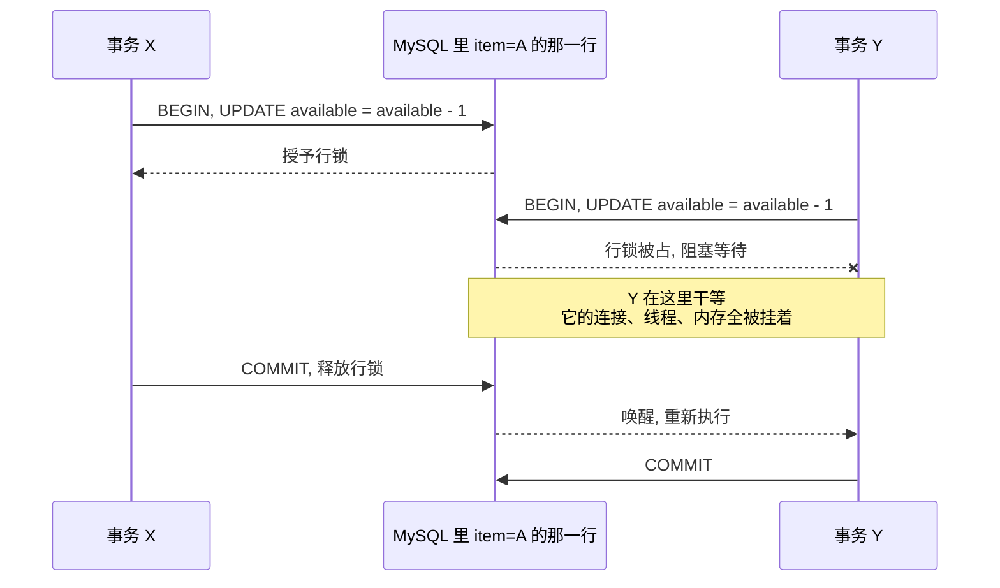

### 方案 B：Redis 计数器

每个商品一个 key，`DECR` 预留，`INCR` 释放。Redis 单线程执行，天然原子，并发没问题。这是 Shopify 多年来的生产方案，缺陷在于预留和台账分属两个系统，认领时的两步写无法放进同一个事务，细节见问题 2。

### 方案 C：一单位一行加 SKIP LOCKED

一个商品 10 件就是 10 行，预留 3 件就是选出 3 行移走。`SELECT ... FOR UPDATE SKIP LOCKED` 遇到被别人锁住的行直接跳过，并发事务各拿各的行，互不等待。预留和台账同库同事务，正确性回来了；热点被打散，吞吐也回来了。代价是池的维护、InnoDB 锁的一堆细节，以及所有压力回到数据库。

|维度|A 单行计数|B Redis 计数|C 单位池 + SKIP LOCKED|
|---|---|---|---|
|正确性|✅|❌ 跨系统双写必有窗口|✅ 同库事务|
|热点吞吐|❌ 单行锁串行|✅|✅ 各拿各的行|
|多仓位|⚠️ 加列，热点依旧|❌ 一个数字没有仓位|✅ 仓位在主键里|
|运维|✅ 最简单|❌ 多一套集群|⚠️ 池、补货、对账|
|适用|QPS 不高|能接受最终一致|正确性零容忍且有热点|

## 核心设计

### 表结构与不变式

1. **inventory_ledger（库存台账，source of truth）**
    - shop_id、inventory_item_id、inventory_group_id 为联合主键，on_hand
    - `on_hand` 只在 claim 时减少；预留和入池都不改它，池中的行是从 `on_hand` "借"出来的。

2. **reservation_units（可用单位池）**
    - shop_id、inventory_item_id、inventory_group_id、id 为联合主键
    - 一行代表一个可预留的单位，每个（商品，仓位）最多 1,000 行。主键顺序即过滤顺序，查询直接走聚簇索引。

3. **reserved_quantities（活跃预留）**
    - reservation_id 主键，shop_id、inventory_item_id、inventory_group_id、quantity、expires_at、idempotency_key
    - 二级索引：`UNIQUE (shop_id, idempotency_key)` 支撑幂等；`(shop_id, inventory_item_id, inventory_group_id)` 支撑补货时的额度聚合；`(expires_at)` 支撑过期清理。

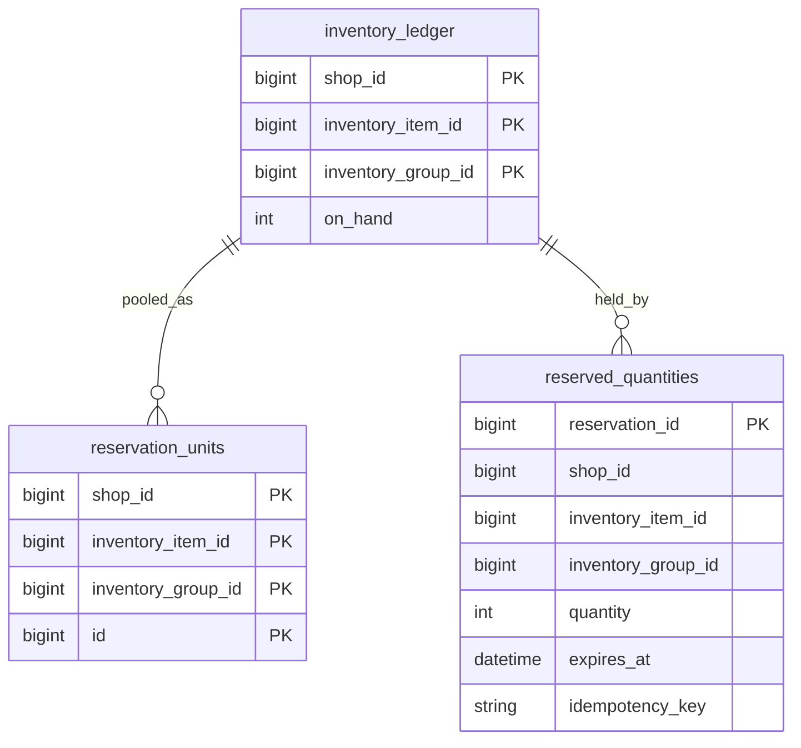

**对账不变式**，对任意（商品，仓位）：

```
池中行数 + 活跃预留 quantity 之和 <= on_hand
```

必须写成不等式。"尚未入池的余量"没有独立存储，它就是三者的差值，写成等式会变成恒成立的定义式，对账任务校验不出任何东西。对账在从库跑，容忍复制延迟，只告警持续超过 N 个周期的差异。

### 预留流程

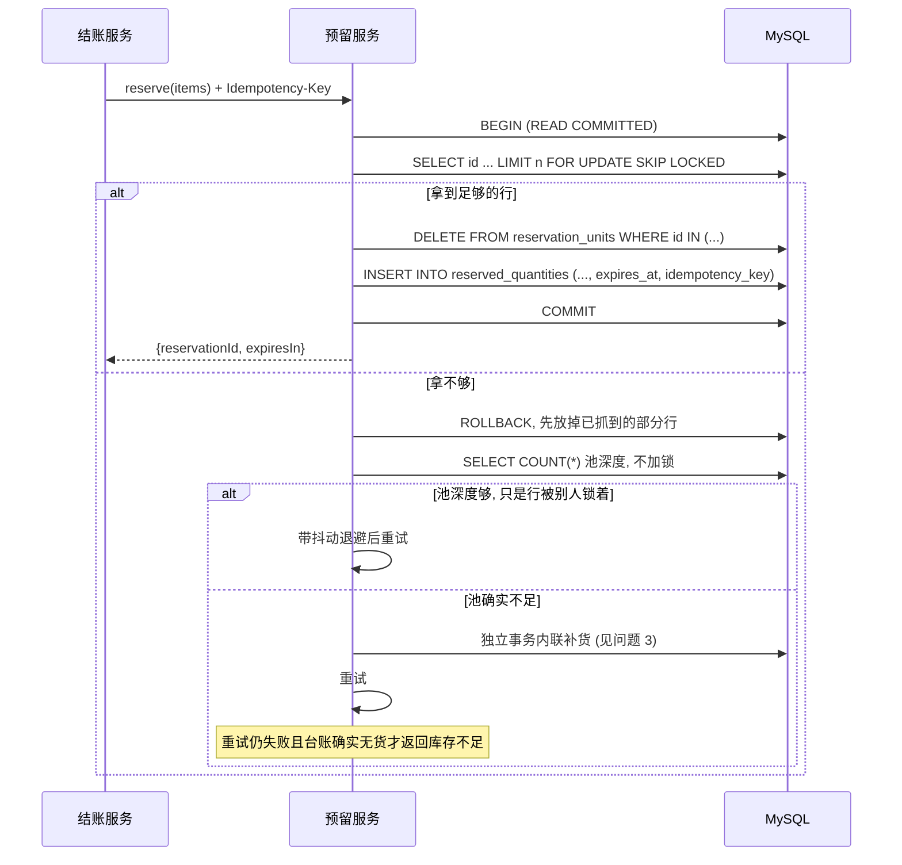

两个并发预留在池上互不等待，这是全部的性能来源：

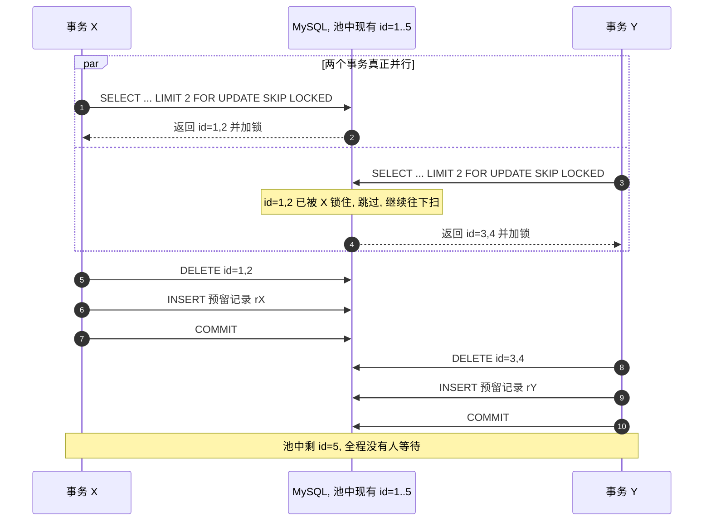

### 认领流程

先无锁读预留拿到商品和仓位，再按全局顺序锁台账行、锁预留行，扣减和删除在同一个事务里（见问题 5）。

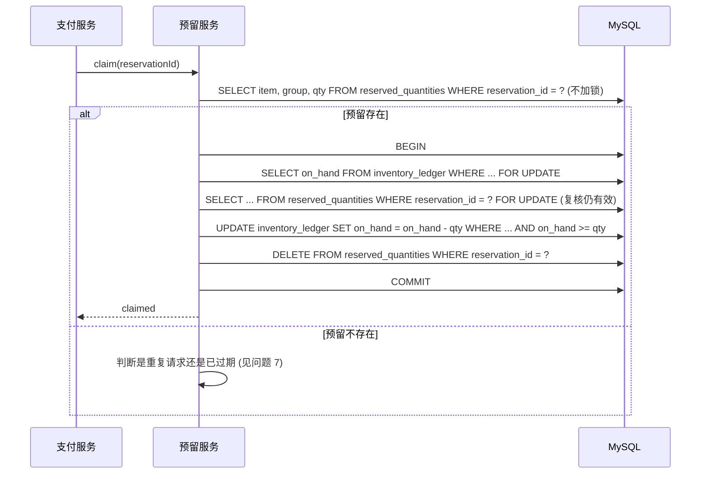

### 单位的生命周期

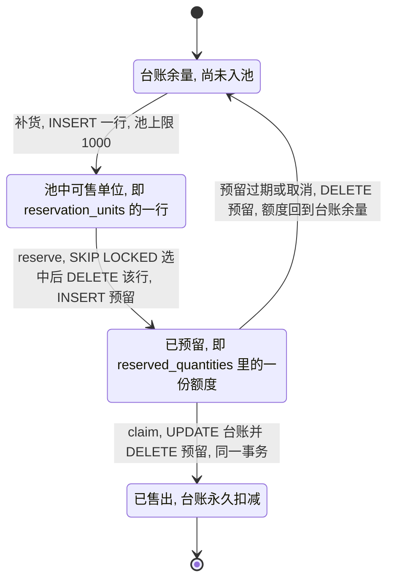

### 架构图

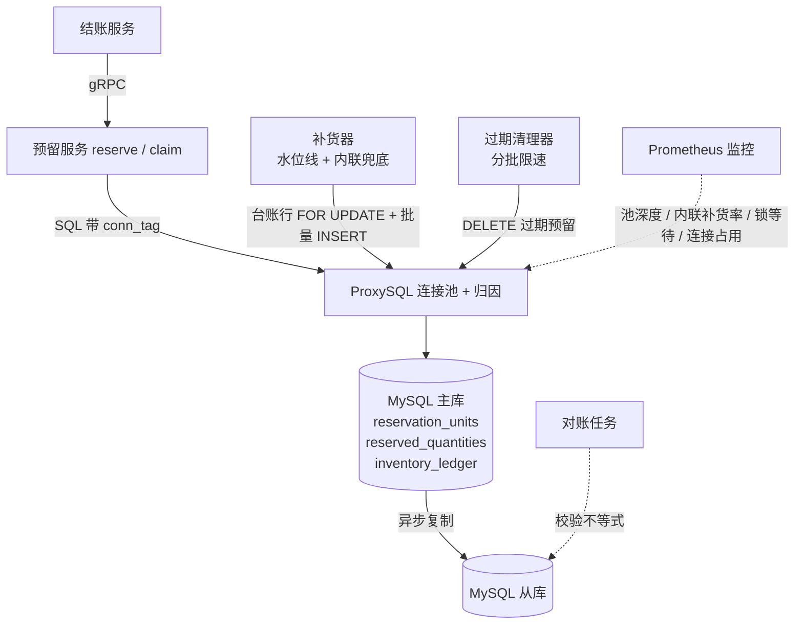

## 关键难题

### 问题 1：热点行锁与锁的数量

**现象**：闪购开始，一个爆款商品每秒涌入数千次预留，延迟从几毫秒涨到几秒，加应用服务器没有任何改善。

**原因**：方案 A 的单行锁串行化。换成一单位一行之后还有第二层：最初原型用自增 id 做主键、走二级索引过滤，`SHOW ENGINE INNODB STATUS` 显示一次预留加两把锁，二级索引一把，回表聚簇索引一把。

**解决方案**：

1. **一单位一行加 SKIP LOCKED**。前提是单位可互换，买家不在乎拿到第几号；有序列号、批次、有效期的场景不适用。

|写法|遇到已被别人锁住的行|
|---|---|
|`FOR UPDATE`|等待，直到对方提交或超时|
|`FOR UPDATE NOWAIT`|立即报错返回|
|`FOR UPDATE SKIP LOCKED`|跳过它，返回其他可用行|

2. **复合主键** `(shop_id, inventory_item_id, inventory_group_id, id)`，过滤列全在主键里，直接走聚簇索引，一次预留只加一把锁。索引设计决定锁数量，锁数量决定吞吐。

```sql
SELECT id
FROM reservation_units
WHERE shop_id = 1
  AND inventory_item_id = 1001    -- 商品 A
  AND inventory_group_id = 1      -- 广州仓
LIMIT 2
FOR UPDATE SKIP LOCKED;
```

**必须记住的语义**：MySQL 官方文档明确指出，跳过被锁行的查询返回的是**数据的不一致视图**，`SKIP LOCKED` 不适合一般的事务性工作，只适合这种队列式的取用场景。直接后果是"返回行数不足"**不等于**"没货"，问题 3 会反复用到。

**权衡**：一单位一行把一次 UPDATE 变成 DELETE 加 INSERT，用写放大换热点分散；乐观锁在低冲突下更简单，热点场景下重试风暴反而更差。

### 问题 2：Redis 预留与 MySQL 台账的跨系统双写

**现象**：Redis 方案并发没问题，但支付成功后要同时扣 MySQL 台账和清 Redis 预留，进程在两步之间崩溃时库存对不上，出现少卖或超卖，只能靠人工或对账任务修。

**原因**：

- 两步分属两个存储，不可能放进同一个事务，无论怎么排顺序都有崩溃窗口。
- 先扣台账后清 Redis：预留标记残留到被清理为止，这份额度对谁都不可用，**少卖**。
- 先清 Redis 后扣台账：预留没了，台账没扣，下一个买家拿到同一件，**超卖**。
- Redis 主从异步复制，AOF 默认每秒刷盘，failover 可能丢掉一次 `DECR`，也是超卖。Redis 提供的是高性能的原子操作，不是持久可靠的账本。
- Redis 里只有一个数字，没有仓位概念。拆成每仓一个 key 后跨仓扣减又是无事务保护的多步操作，只能靠 Lua 硬扛，Cluster 下还得用 hash tag 把同一商品各仓的 key 放进同一个 slot。

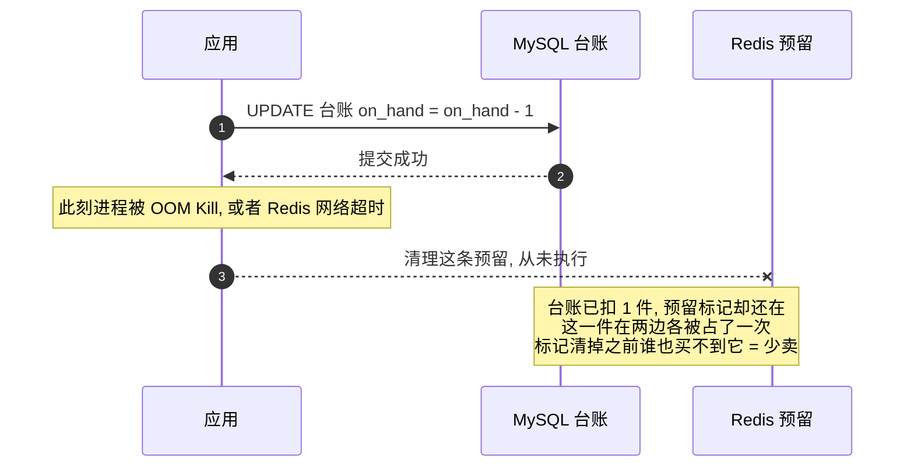

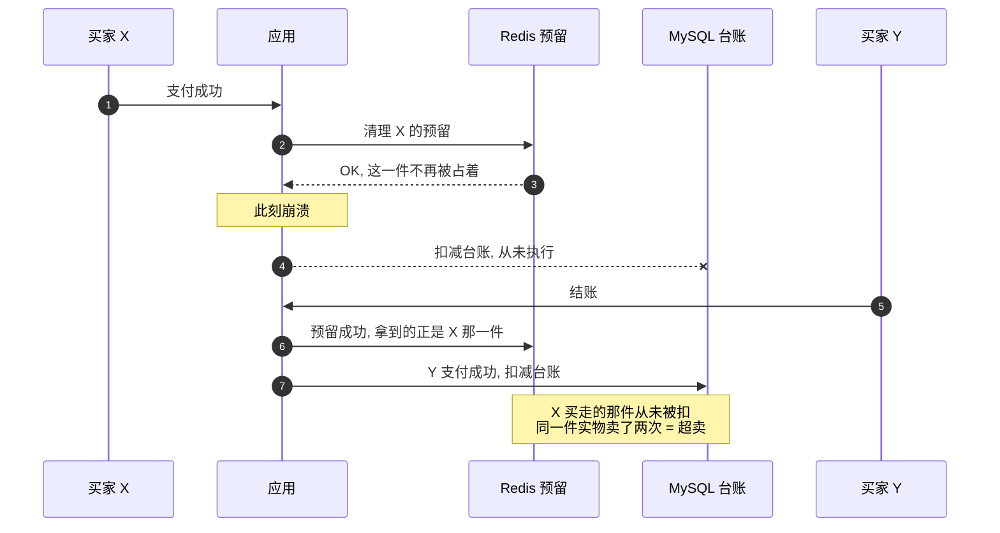

**解决方案**：预留搬进台账所在的数据库，认领是一个事务里的 UPDATE 加 DELETE，要么都成功要么都回滚；仓位进入主键，跨仓预留同事务完成；下线 Redis 集群。

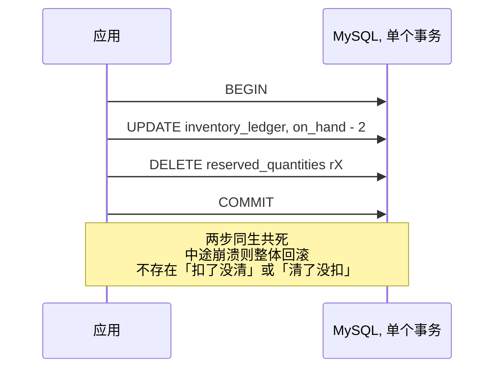

**权衡**：补偿机制（本地消息表、TCC、对账）只能缩小窗口，不能消除；同库事务从根上消除这类 bug，代价是写压力全部回到数据库。MySQL 和 Redis 的复制默认都是异步的，切换都可能丢最后几笔，真正的差别在单机：InnoDB 每次提交刷 redo log，Redis AOF 每秒一次。

### 问题 3：池膨胀、池抽干，以及"拿不够"的两种含义

**现象**：如果为每一件库存都建一行，一个商品 50,000 件分布在 10 个仓会产生数十万行，`SKIP LOCKED` 扫描越来越慢。反过来，闪购时热点商品的池在半秒内被抽干，后续请求拿不到行。

**原因**：

- 行数跟库存量线性增长，表膨胀。
- 池空时如果所有请求各自补货，会重复插入、互相争抢，形成惊群。
- **最隐蔽的一条**：`SKIP LOCKED` 返回行数不足，可能是池里真的没行，也可能是行都被别的事务临时锁着。把后者当成前者去补货，会在池还有 800 行时白跑一趟：不会突破上限（补货量公式里有 `1000 - 池中行数` 的封顶），但会平白锁一次台账行、拖慢同时在跑的 claim。

**解决方案**：

1. **有界池**：每个（商品，仓位）最多 1,000 行。太小则补货频繁成为瓶颈，太大则表膨胀扫描变慢。

2. **水位线后台补货为主，内联补货为辅**。算一笔账：热点商品每秒 2,000 次预留，1,000 行的池 0.5 秒就抽干一次。如果只在池空时内联补货，每 0.5 秒就有一批请求撞上补货延迟，P99 会彻底崩掉。所以补货器持续监控池深度，低于 30% 就异步补充，内联补货只在后台没跟上时兜底。**内联补货触发率是 P99 的先行指标，必须上监控。**

3. **先 ROLLBACK，再分辨"池空"和"行被锁"**：本次 SELECT 已经锁住了部分行时先回滚放掉它们，否则这些行在整个重试期间对所有人不可见，事务也白白占着连接。然后跑一个不加锁的 `SELECT COUNT(*)`：池深度够就是瞬时锁竞争，带抖动退避后重试；池深度确实不足才补货。

4. **补货走独立事务，并锁住台账行**：

```sql
BEGIN;
  SELECT on_hand FROM inventory_ledger
   WHERE shop_id = ? AND inventory_item_id = ? AND inventory_group_id = ?
   FOR UPDATE;                          -- 一把锁做两件事
  DELETE FROM reserved_quantities        -- 顺手清理本组合的过期预留
   WHERE shop_id = ? AND inventory_item_id = ? AND inventory_group_id = ?
     AND expires_at < NOW();
  -- 可补数量 = min(1000 - 池中行数, on_hand - 池中行数 - 活跃预留之和)
  INSERT INTO reservation_units (...) VALUES (...);
COMMIT;
```

这把台账行锁同时解决两个问题：**互斥**，同一（商品，仓位）只有一个补货者，后来者拿到锁时发现池已满就直接提交；**正确性**，计算补货量期间 `on_hand` 不会被并发的 claim 改小，否则补货者按旧值灌行，池加预留就超过台账，埋下超卖。

5. **不用 `GET_LOCK`**：它是连接级的咨询锁，而所有 SQL 都走 ProxySQL 的连接多路复用。ProxySQL 对 `GET_LOCK` 有专门处理，但这是隐藏前提，而且这条连接被钉住无法复用，主从切换时锁还会直接失效。用台账行锁更稳。

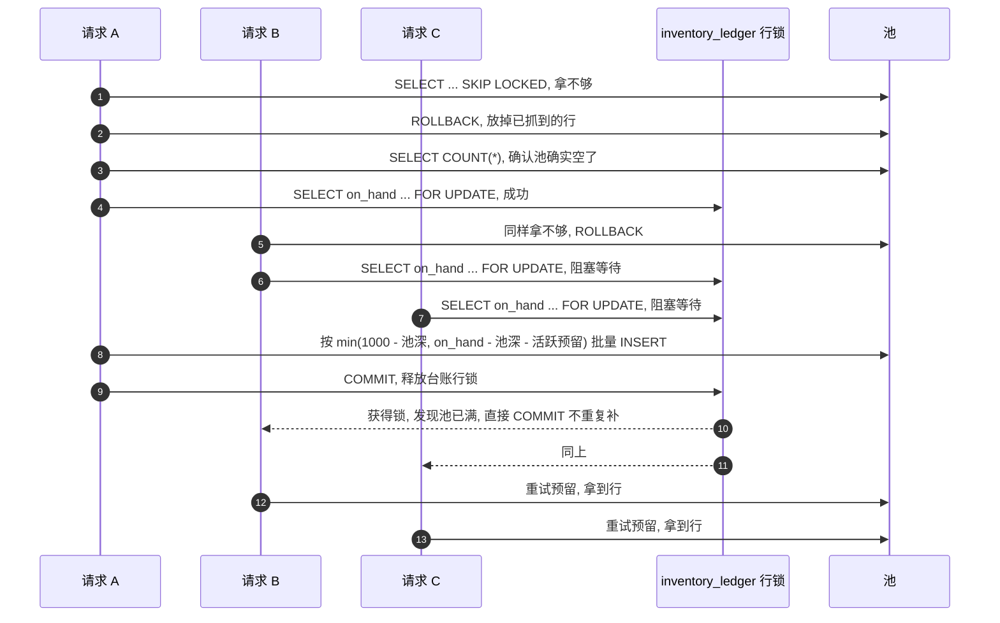

**权衡**：水位线补货把成本摊到平时，尾延迟平滑，代价是持续消耗写入配额；内联补货让少数请求延迟变高，换来只要台账有货买家绝不会被误告售罄。

### 问题 4：空池上的间隙锁

**现象**：池被抽干后，补货的 INSERT 迟迟不返回，最终 `Lock wait timeout`；如果补货和发现池空的那个查询互相等待，则直接报死锁。

**原因**：MySQL 默认的 `REPEATABLE READ` 下，在空范围上执行 `SELECT ... FOR UPDATE SKIP LOCKED` 会加 next-key lock，包括对 supremum 伪记录（表示比最大值还大的那段空间）加间隙锁，这把锁挡住了补货事务往这个范围里 INSERT。

**解决方案**：

1. **预留和补货事务降为 READ COMMITTED**。RC 下 InnoDB 不再使用 next-key lock，只对命中的记录加记录锁，空范围上的 supremum 间隙锁不再产生。隔离级别按事务设置，不改全库。这是 Shopify 代码库里第一次使用非默认隔离级别，为此加了一点框架支持。

2. **binlog 必须是 ROW 格式**，两条独立理由：RC 下 InnoDB 要求 ROW；使用 `NOWAIT` 或 `SKIP LOCKED` 的语句对基于语句的复制不安全，**即使不降隔离级别也必须 ROW**。MySQL 8 默认 ROW，老库升级前要确认。

3. **逐个事务确认不依赖可重复读**，不能全库一刀切。

**权衡**：RC 去掉 next-key lock，代价是不可重复读和当前读下的幻读；RR 保住可重复读，但空池场景必然阻塞甚至死锁。

### 问题 5：多路径加锁顺序

**现象**：预留、认领、补货三条路径并发时偶发死锁，重试后成功，高峰期死锁率上升。

**原因**：最初各路径触碰表的顺序不一致：

|路径|加锁顺序|
|---|---|
|reserve|`reservation_units` → `reserved_quantities`|
|claim|`reserved_quantities` → `inventory_ledger`|
|补货|`inventory_ledger` → `reservation_units`|

连起来是 `units → reserved → ledger → units`，三条路径首尾相接。

**这个环有多危险要说准。** 三条路径的第二步分别是 INSERT 预留、UPDATE 台账、INSERT 池行。在 READ COMMITTED 下，INSERT 拿的是插入意向锁，它只和间隙锁冲突，不会等待别人持有的记录锁；所以"reserve 等 reserved 表""补货等 units 表"这两段等待在实践中基本不成立，真正会互相等待的是 claim 和补货在台账行上的记录锁。环画得出来，但按本方案的语句组合很难真的跑出来。

尽管如此，定义一个全局顺序是**零成本的纪律**：它不依赖当前语句碰巧都是 INSERT，将来任何一条路径改成 UPDATE 或 SELECT FOR UPDATE 时，无环的结论依然成立。

**解决方案**：

1. 全局顺序 `inventory_ledger → reservation_units → reserved_quantities`，所有路径无条件遵守。

|路径|修正后的顺序|说明|
|---|---|---|
|reserve|units → reserved|跳过 ledger，顺序不逆|
|claim|**ledger → reserved**|把锁台账行提到锁预留行之前|
|补货|ledger → units → reserved（清理过期）|
|释放 / 过期清理|只碰 reserved|

2. 跨仓位按 `inventory_group_id` 升序处理，避免同一张表内部的环。

3. 死锁数上监控，回归测试覆盖三条路径的并发组合。

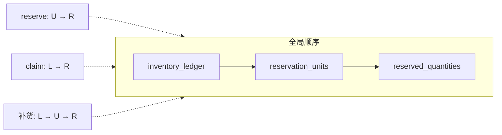

**权衡**：这是打破死锁四条件中"循环等待"的经典手法，代价是每新增一张表或一条路径都要重新验证全局无环。只看两张表得出的"无环"结论，加上第三张表就可能不再成立。

### 问题 6：真正的瓶颈是连接，不是 CPU

**现象**：上线后吞吐远低于目标，但预留 P90 正常，CPU 没打满，查询已经优化到位。压测看到 MySQL 内部线程排队，排队的活一旦放行 CPU 出现尖刺，ProxySQL 到 MySQL 后端的连接被耗尽。

**原因**：

- 连接是共享资源。按 Little 定律算一下，每秒 850 个预留事务、每个占连接 5ms，只需要 4 到 5 个并发连接；认领同理。预留链路本身只占十几个连接，**如果连接耗尽，问题不在预留**。
- 结账链路上其他代码长期持有连接，它们从没被优化过，因为它们不是第一个撞到上限的。预留只是压垮骆驼的最后一根稻草。
- "连接耗尽"只告诉你结果，没告诉你谁占着。慢查询报表回答的是哪条 SQL 执行久，回答不了哪个业务流程长期占着连接：**一条 SQL 可以只跑 1ms，但它所在的事务因为中间夹了一次 RPC 调用把连接占了 200ms。**

**解决方案**：

1. **按业务给连接归因**：应用层给每条 SQL 加注释标签，例如 `SELECT ... /* conn_tag:checkout_completion */`；ProxySQL 解析标签，记录连接借出和归还的时间，得到按业务进程维度的总连接持有时长。这个"应用层打标、代理层聚合"的模式非常通用，实现成本低，回报立竿见影。

2. **清理结账链路**：拆掉长事务里的外部调用，去掉不必要的读，主库读请求减少 50%，事务数减少 33%。

3. **UNION ALL 批量**：购物车有 5 个商品原本要 5 次往返，拼成一次。表面收益是减少 RTT，真正的收益是缩短事务持有连接的时间。

```sql
-- MySQL 8.0 起加锁子句只允许出现在非 UNION 查询中，
-- 因此每个带 FOR UPDATE 的 SELECT 必须用括号包起来。
-- 不加括号在 5.7 能跑，在 8.0 直接语法报错，这是常见的升级坑。
(SELECT id, 1001 AS item FROM reservation_units
   WHERE shop_id = 1 AND inventory_item_id = 1001 AND inventory_group_id = 1
   LIMIT 2 FOR UPDATE SKIP LOCKED)
UNION ALL
(SELECT id, 1002 AS item FROM reservation_units
   WHERE shop_id = 1 AND inventory_item_id = 1002 AND inventory_group_id = 1
   LIMIT 1 FOR UPDATE SKIP LOCKED);
```

4. **重新审视老配置**：`innodb_thread_concurrency` 多年前被保守设定，之后再没人动过，而工作负载和硬件早已变化。调高后又拆掉一道瓶颈。

5. **结果**：大促期间 writer CPU 低于 50%，reader CPU 低于 16%，仍有余量。

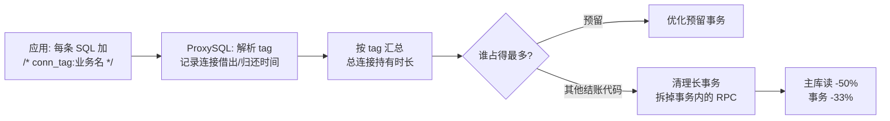

**权衡**：归因看的是事务级的连接占用，能定位"快 SQL 慢事务"，慢查询报表看不到这一层；调高线程并发要有 CPU 余量，否则只是把排队从连接层移到 CPU 层。先归因再动手。

### 问题 7：重试、幂等，以及支付回调晚于 TTL

这一块原文没有展开，但它是生产事故最集中的地方。

**现象**：

- 结账服务调用预留超时后重试，产生两条预留，同一个购物车占掉双倍库存，少卖。
- 支付网关在 TTL 之后才回调成功，预留已被清理，claim 找不到记录：钱收了，货没扣。
- 支付服务重试 claim，第二次收到冲突，误判为认领失败，触发错误的退款流程。

**原因**：预留在结账关键路径上，超时重试是常态；预留 TTL 和支付超时是两个独立参数，没对齐就必然有"预留先于支付结束"的窗口；重复请求和业务冲突混用同一个错误码，调用方无法区分。

**解决方案**：

1. **预留幂等**：`Idempotency-Key` 落库并建 `UNIQUE (shop_id, idempotency_key)`，重复请求命中唯一键冲突时查回原预留返回，不新建。

2. **TTL 覆盖支付超时上限**：`预留 TTL > 支付网关最大超时 + 回调重试窗口 + 时钟偏差余量`。这是参数约束，不是拍脑袋的默认值，支付侧调超时时必须同步评审。

3. **claim 幂等**：认领时同事务写一条认领流水（或在预留表上留状态列）。预留不存在但流水里有记录，是重复请求，返回成功；预留不存在也无流水，是已过期，进入兜底。

4. **过期兜底**：已过期但支付成功时，尝试 `UPDATE inventory_ledger SET on_hand = on_hand - qty WHERE ... AND on_hand >= qty`。成功则告警说明 TTL 偏紧；失败则进入退款流程并告警。**要说清楚强扣在做什么选择**：预留过期后这份额度已回到池里，可能已被买家 Y 预留。给 X 强扣后，池加预留可能超过 on_hand，对账会告警；Y 到 claim 时若台账归零会被守卫拦下。强扣不能消除超卖，它是在收了钱的 X 和只是预留了的 Y 之间选择让谁失望，同时保证账目是平的、可追溯。**绝不能静默失败。**

5. **过期清理器分批限速**，每批 500 条，避免大事务和 binlog 尖刺；补货路径顺手清理本组合的过期预留，不把额度回收全押在一个后台单点上。

**权衡**：长 TTL 减少兜底触发但库存占用更久；强扣可能把超卖转嫁给后来的买家但账是平的，直接拒绝则钱货分离事后极难核对。

## 上线迁移

预留在结账关键路径上，切换出错直接影响下单；预留有几分钟生命周期，切换瞬间总有在途状态；新系统的正确性只有在真实生产流量下才能验证。所以没有"切开关"这回事。

1. **影子模式**：每笔预留同时写 Redis 和 MySQL，Redis 仍是真源，用真实流量对比两边的业务结果和性能。
2. **不迁移在途数据**：两套系统都是活的，Redis 上的预留继续被履行，MySQL 自己慢慢积累状态。
3. **切真源保留双写**：切到 MySQL 后双写路径不拆，Redis 始终有完整视图，kill switch 随时可退。
4. **按 pod 灰度**：从低流量 pod 开始，最大商家最后。

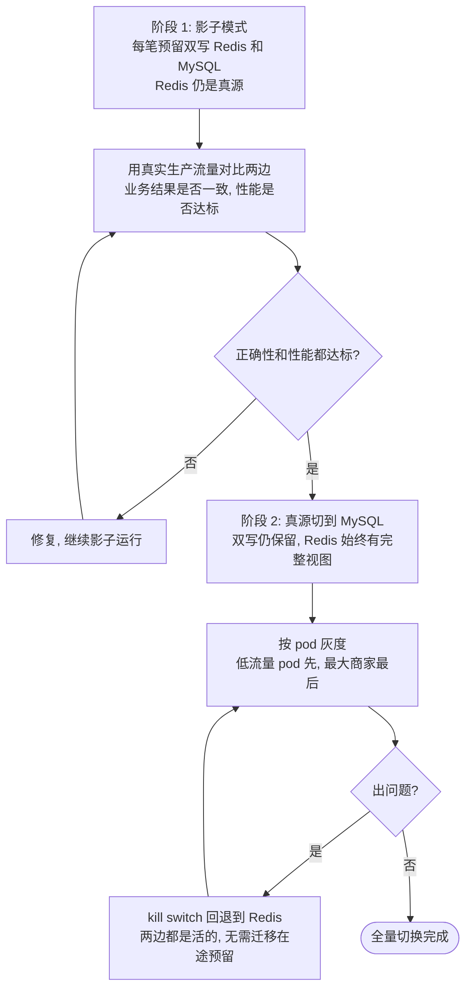

双写期间写成本翻倍，要维护两套系统，换来的是随时可退。这套剧本适用于任何存储迁移：**双写 → 影子对比 → 切真源 → 保留回滚 → 按流量灰度**。

## 权衡与适用边界

|业务场景|选择|核心策略|牺牲了什么|
|---|---|---|---|
|**预留与台账的一致性**|强一致，同库同事务|一单位一行 + `SKIP LOCKED`|写压力全部回到数据库，单分片内只有一个写节点|
|**热点商品吞吐**|分散行锁|有界池，每个（商品，仓位）最多 1,000 行|引入池和补货子系统，每一项都要保证正确|
|**补货策略**|尾延迟优先|水位线后台补货为主，内联兜底|后台补货持续消耗写入配额|
|**"拿不够"的判定**|先分辨再动作|`COUNT(*)` 区分池空与行被锁|多一次非加锁查询，换不白跑补货|
|**补货互斥**|用数据本身做锁|台账行 `FOR UPDATE`，不用 `GET_LOCK`|补货与 claim 在台账行上串行|
|**隔离级别**|`READ COMMITTED`|避开空表上的 supremum 间隙锁|不可重复读；binlog 必须 ROW|
|**加锁顺序**|全局唯一顺序|`ledger → units → reserved`|每新增表或路径都要重新验证无环|
|**幂等与 TTL**|覆盖支付超时上限|幂等键、认领流水、过期强扣兜底|库存周转变慢；强扣把超卖转嫁给后来的买家|
|**连接资源**|视为全局稀缺资源|短事务、事务内禁止 RPC、批量、按业务归因|你的优化会被别人的长事务吃掉|
|**上线方式**|可回滚|影子双写、按 pod 灰度|双倍写成本，维护两套系统|

什么时候**不该**这么做：QPS 不高时一行 quantity 足够；数据库已是瓶颈时再压进来只会更糟；单位不可互换（序列号、批次、有效期）时 `SKIP LOCKED` 的前提直接不成立；团队没人能 debug InnoDB 锁时故障很难查。

## 面试追问

- **单行条件 UPDATE 为什么不超卖，为什么还是被淘汰？** 条件和扣减同语句，行锁下原子；但所有买家串行在一把锁上，热点场景有硬上限。
- **能不能设计一种顺序让 Redis 双写既不超卖也不少卖？** 不能。两步分属不共享事务的存储，中间必有崩溃窗口，补偿只能缩小不能消除。
- **`SKIP LOCKED` 会不会明明有货却返回不足？** 会。被别人锁住的行会被跳过，那些事务可能回滚。所以拿不够要先回滚再数池深，不能直接当售罄。
- **补货进程挂了会怎样？** 内联补货在预留路径里，不会立刻售罄；真正的风险是补货互斥的持有者崩溃，所以要用会随事务结束自动释放的行锁，不用连接级锁。
- **池和台账对不上怎么发现？** 对账不等式 `池中行数 + 活跃预留 <= on_hand`，在从库跑，容忍复制延迟。
- **换成 PostgreSQL 哪些结论会变？** 没有间隙锁，问题 4 不存在；`SKIP LOCKED` 语义相同；但一删一插的高频写会制造死元组，要盯 autovacuum。
- **为什么不用乐观锁？** 低冲突下更简单；热点商品冲突率高时重试风暴反而更差。看的是冲突率不是 QPS。

## 总结

这次迁移的三条教训比方案本身更值得记住：

1. **先问要不要强一致，再决定用什么存储。** Redis 预扣方案太普遍，以至于很多人忘了它本质上是用最终一致换吞吐。预留和台账放进同一个事务，一整类"付款成功但没扣库存"的 bug 从根上消失。
2. **`SKIP LOCKED` 返回行数不足不等于没货。** 它返回的是数据的不一致视图，先回滚再数池深，才知道该退避还是该补货。
3. **真正的上限不在预留查询本身，而在整条结账链路的连接占用。** 他们花了几周优化查询和锁，最后是按业务给连接归因才看见问题。答案常常在管道里，不在引擎里。

这件事的目标不是让预留变快，而是让它成为一个"好邻居"：在不损害共享数据库整体健康的前提下维持吞吐。

## 附录：本地复现

本地起 MySQL 8，开两个终端，用上面的表结构：

1. 建 `reservation_units` 表，灌入 5 行；
2. 终端 A：`BEGIN; SELECT ... LIMIT 2 FOR UPDATE;`，先不提交；
3. 终端 B：执行同样语句，观察卡死；
4. 终端 B 改用 `FOR UPDATE SKIP LOCKED`，观察立刻返回另外两行；
5. 第三个终端观察锁：

    ```sql
    SELECT * FROM performance_schema.data_locks;
    SHOW ENGINE INNODB STATUS\G
    ```

6. 把主键从自增 `id` 换成复合主键，对比 `data_locks` 的行数，看到 2 变 1；
7. 在空表上执行 `SELECT ... FOR UPDATE SKIP LOCKED`，在 `data_locks` 里找到 supremum 间隙锁；再 `SET TRANSACTION ISOLATION LEVEL READ COMMITTED` 重跑，看它消失；
8. 终端 A 在空表上持有 RR 的 SKIP LOCKED 查询不提交，终端 B 往同一范围 INSERT，观察 `Lock wait timeout`，这就是问题 4。

原文作者自己强调，他们最大的收获来自一个极简原型：一个小脚本加一个 MySQL，在另一个终端直接看锁，比读理论快十倍。
