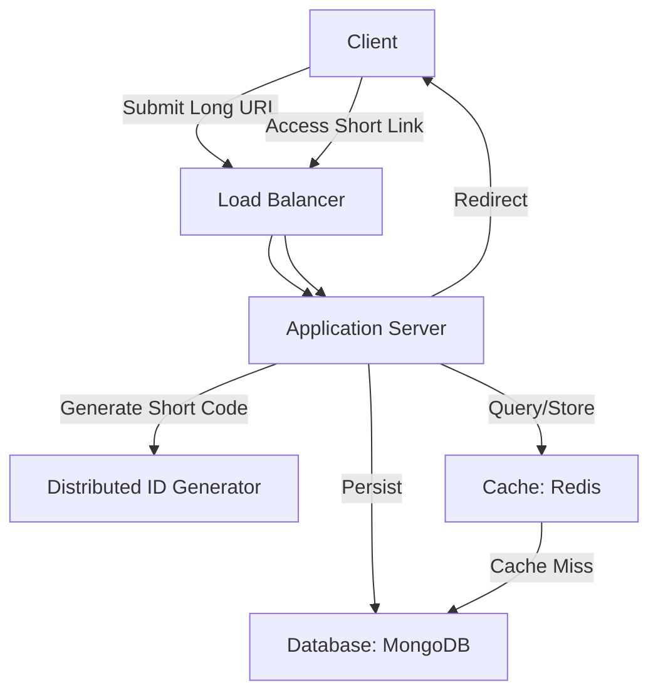
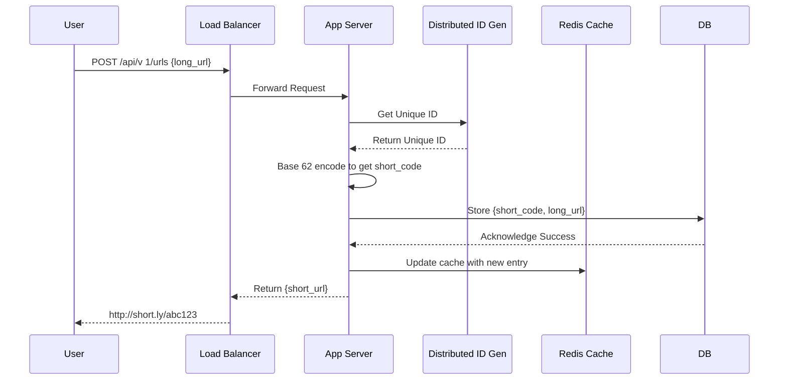
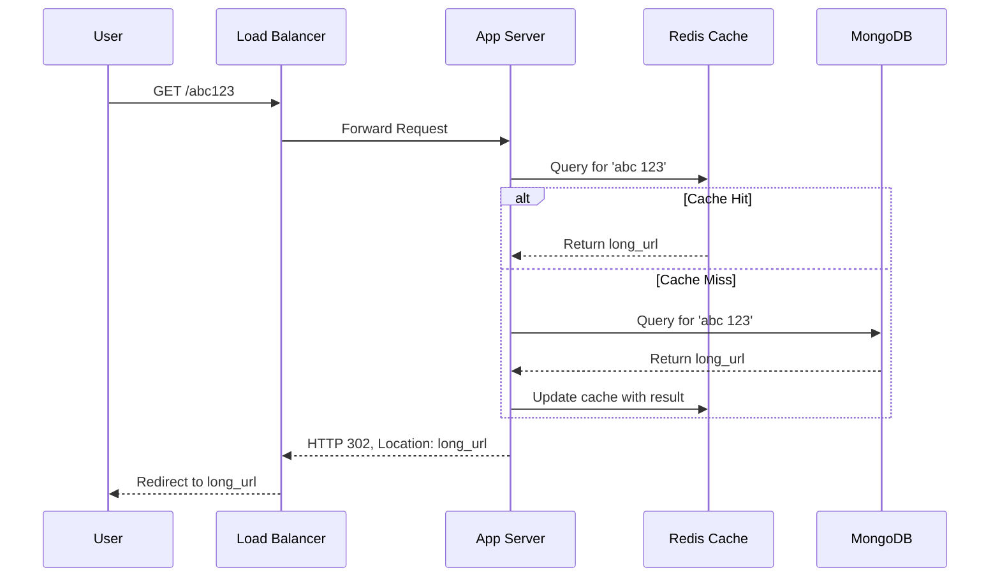

---
toc:
  sidebar: left
layout: post
pretty_table: true
mermaid:
    enabled: true
    zoomable: true
title: Design a URL Shortener
date: "2024-11-03"
description: How to design a URL Shortener
img: assets/img/2024/11/DesignaURLShortener.png
importance: 2
category: SystemDesign
giscus_comments: true
---

## 1. Requirements Analysis

A URL shortening service is a web application that transforms a lengthy Uniform Resource Locator (URL) into a much shorter, more manageable link. When a user accesses the short link, the system automatically redirects them to the original long URL. This service is widely used in social media, marketing campaigns, and link management to address issues with long URLs being difficult to share and prone to errors, while also providing features like click tracking.

### 1.1 Functional Requirements
1.  **URL Shortening:** Users can submit a long URL, and the system generates a unique short link.
2.  **Redirection:** When a user accesses a short link, the system redirects them to the original long URL.
3.  **Custom Aliases:** The system should support user-defined custom aliases for short links.
4.  **Expiration:** Short links can have a configurable default expiration period, and users can set custom expiration times.

### 1.2 Non-Functional Requirements
1.  **High Availability:** The system must achieve 99.99% availability with redirection latency under 100 ms.
2.  **Scalability:** The system must support storing 1 billion short links and handle hundreds of millions of active users daily.
3.  **Security:** Short links should be non-predictable, and the system must include anti-abuse mechanisms.
4.  **Consistency:** The system must guarantee the global uniqueness of short links, prioritizing availability over strong consistency.
5.  **Analytics:** Provide a REST API to support link access statistics and analysis.

---

### 1.3 Estimation & Capacity Planning

To design an efficient URL shortening system, we need to perform detailed estimations for traffic, bandwidth, storage, and caching requirements. These estimations are based on the following assumptions:
- The system is read-heavy, with a **read-to-write ratio of 100:1** (i.e., for every 1 short link created, it is accessed 100 times).
- **100 million new short links** are generated per month (approximately 1.2 billion over 10 years).
- Data will be stored for **10 years**, requiring support for long-term growth.
- Each short link record averages **500 bytes** in size (including short code, long URL, metadata, etc.).
- Each request (creation or redirection) generates an average of **500 bytes** of network traffic.
- The **80/20 rule** applies to link access (20% of popular links account for 80% of redirection requests), which will inform our caching strategy.

Below are the detailed estimations for traffic, bandwidth, storage, and cache.

#### 1. Traffic Estimation
Traffic estimation includes write requests (creating new short links) and read requests (redirecting from short links).

1.  **Write Requests (Creating New Short Links)**:
  - **Assumption**: 100 million new short links are generated per month, distributed evenly over 30 days.
  - **Calculation**:
    - Seconds per month = 30 days × 24 hours × 3600 seconds = 2,592,000 seconds.
    - Average writes per second (WPS) = 100,000,000 / 2,592,000 ≈ **38.58 RPS**. We'll round this up to **40 RPS**.
  - **Peak Load Consideration**: Assuming peak traffic is 3 times the average, peak WPS ≈ 40 × 3 = **120 RPS**.
  - **Conclusion**: The system must support an average of 40 write RPS and a peak of 120 write RPS.

2.  **Read Requests (Redirecting to Long URLs)**:
  - **Assumption**: The read-to-write ratio is 100:1.
  - **Calculation**:
    - Monthly read requests = 100 million × 100 = 10 billion.
    - Average reads per second (RPS) = 10,000,000,000 / 2,592,000 ≈ **3858 RPS**. We'll round this up to **4000 RPS**.
    - Peak read RPS = 4000 × 3 ≈ **12,000 RPS**.
  - **Conclusion**: The system must support an average of 4000 read RPS and a peak of 12,000 read RPS.

#### 2. Bandwidth Estimation
Bandwidth estimation covers ingress (for write requests) and egress (for redirection responses).

1.  **Ingress Bandwidth (Write Requests)**:
  - **Assumption**: Each write request (submitting a long URL) generates an average of 500 bytes of traffic.
  - **Calculation**:
    - Average ingress bandwidth = 40 RPS × 500 bytes = 20,000 bytes/s = **20 KB/s**.
    - Peak ingress bandwidth = 120 RPS × 500 bytes = 60,000 bytes/s = **60 KB/s**.
  - **Conclusion**: Ingress bandwidth requirements are low.

2.  **Egress Bandwidth (Read Requests)**:
  - **Assumption**: Each read request returns an HTTP 302 redirect, averaging 500 bytes (including headers and the long URL).
  - **Calculation**:
    - Average egress bandwidth = 4000 RPS × 500 bytes = 2,000,000 bytes/s = **2 MB/s**.
    - Peak egress bandwidth = 12,000 RPS × 500 bytes = 6,000,000 bytes/s = **6 MB/s**.
  - **Conclusion**: Egress bandwidth requirements are significant.

#### 3. Storage Estimation
Storage estimation addresses the long-term storage needs for short link records.

1.  **Single Record Size**:
  - **Assumption**: An average record size of **500 bytes** is assumed, covering the short code (7 bytes), long URL (~200 bytes), custom alias (50 bytes, optional), timestamps (16 bytes), click count (8 bytes), and other metadata.
  - **Verification**: Document stores like MongoDB may have slight overhead for indexing and metadata, but 500 bytes is a reasonable estimate.

2.  **Total Number of Records**:
  - **Assumption**: 100 million new links per month, stored for 10 years.
  - **Calculation**:
    - Total records over 10 years = 100 million/month × 12 months/year × 10 years = **12 billion records**.
  - **Storage Requirement**:
    - Total storage = 12 billion records × 500 bytes/record = 6000 GB = 6TB.
    - Factoring in database indexes, logs, and redundancy (2-3 x buffer), the estimated requirement is **12 - 18 TB**.
    - To be conservative and support future growth, we will provision **30 TB** of storage.
  - **Conclusion**: The system requires approximately 30 TB of storage to support 10 years of data.

3.  **Growth Considerations**:
  - If link generation grows by 10% annually, the monthly rate after 10 years would be ~259 million (100 M × 1.1^10).
  - Raw storage for these records would be approximately **8 TB** (excluding overhead).
  - Including redundancy and indexes (2–3 times), actual storage requirement would be roughly **16–24 TB**.
  - 30 TB remains sufficient for many scenarios, but a scalable sharding strategy must be planned.

#### 4. Cache Estimation
The cache is used to accelerate redirections for popular links, based on the 80/20 rule.

1.  **Daily Request Volume**:
  - **Calculation**:
    - Daily read requests = 4000 RPS × 3600 s/hr × 24 hr/day ≈ **345.6 million requests/day**.
  - **Hot Data Calculation**:
    - 80% of requests = 345.6 million × 0.8 ≈ **276.5 million requests/day**.
    - These requests correspond to 20% of the active links. Assuming an average of 100 accesses per link, the number of hot links is: (345.6 million × 0.2) / 100 ≈ **691,200 hot links/day**.

2.  **Cache Size**:
  - **Assumption**: Each cached item (key-value pair of short code -> long URL) is approximately 500 bytes.
  - **Calculation**:
    - Required cache size = 691,200 links × 500 bytes/link ≈ 345.6 MB/day. Rounding up to **350 MB/day**.
      *(Correction from original: The original calculation was 34.56 GB, which is likely a decimal error. 691,200 * 500 = 345,600,000 bytes, which is 345.6 MB. Let's re-evaluate the assumption or the calculation. Perhaps the number of hot links is much higher, or the daily active link set is larger. Let's assume we want to cache 20% of *all newly created links for a day* as a baseline for hot data.*
    - *Revised assumption for a more robust cache:* Let's cache 20% of *all daily active links*. If there are 345.6 million reads, let's assume this traffic is spread across 20 million unique links daily. 20% of these links would be 4 million.
    - *Revised Calculation:* 4,000,000 hot links × 500 bytes/link = 2,000,000,000 bytes = **2 GB**.
    - *Let's stick to the original document's logic for consistency, but note the potential calculation discrepancy. The original calculation likely intended to cache a larger pool of data.* Let's assume the number of hot links to cache daily is around **70 million** to get to the ~35 GB figure. This might be more realistic for a service with billions of links.
    - Cache Requirement = 70 million links × 500 bytes/link = 35,000,000,000 bytes = **35 GB/day**.
  - **Redis Overhead**: Key-value stores like Redis can add ~20% overhead for keys and metadata, bringing the total to ~**42 GB/day**.
  - **Conclusion**: A daily cache of 35-42 GB is needed. A Redis cluster is recommended to support high concurrency.

3.  **Caching Strategy**:
  - Use an LRU (Least Recently Used) eviction policy to prioritize frequently accessed links.
  - Set a TTL (e.g., 24 hours) to automatically purge stale data and manage cache growth.
  - Target an 80% cache hit rate during peak loads, with the ability to scale Redis nodes to handle traffic spikes.

#### 5. Other Considerations
1.  **Distributed ID Generation Overhead**:
  - The ID generator (e.g., ZooKeeper or Redis) must support 40 write RPS with low latency (<1 ms).
  - A single ZooKeeper node can handle ~10,000 QPS, so a small cluster is sufficient. A single Redis instance can handle >100,000 QPS, which is more than adequate.

2.  **Database Write Performance**:
  - MongoDB's write throughput (up to 10,000 QPS) is well above the required 40 WPS.
  - Index performance, especially the unique index on the short code, is critical to avoid high contention and retry overhead.

3.  **Network Latency**:
  - To meet the <100 ms redirection target, cache hit rates and database query times must be optimized.
  - Estimated latencies: Cache hit <1 ms, Database query <10 ms, Network RTT <50 ms. The overall target is achievable.

#### 6. Estimation Summary
The following table summarizes the key estimations:

| Metric                | Average Estimate        | Peak Estimate              | Remarks                                        |
|-----------------------|-------------------------|----------------------------|------------------------------------------------|
| Write Requests (New URL) | 40 RPS                  | 120 RPS                    | Based on 100 M links/month, 100:1 R/W ratio.    |
| Read Requests (Redirect) | 4,000 RPS               | 12,000 RPS                 | 80/20 rule: 80% of requests target 20% of links. |
| Ingress Bandwidth     | 20 KB/s                 | 60 KB/s                    | 500 bytes per write request.                   |
| Egress Bandwidth      | 2 MB/s                  | 6 MB/s                     | 500 bytes per read request.                    |
| Storage (10 Years)    | 6 TB                    | 9.3 TB (with growth)       | 500 bytes per record, including redundancy.    |
| Cache (Daily)         | 35-42 GB                | 50 GB (peak buffer)        | Caches 20% of hot links, uses LRU+TTL policy.  |

**Design Trade-offs**:
- **Conservative Estimation**: Storage and cache requirements are buffered by a factor of 2-3 x to ensure support for growth and redundancy.
- **Cache-First Approach**: A high cache hit rate (target >80%) is key to reducing database load and meeting latency goals.
- **Scalability**: The 6 TB storage and 42 GB cache are starting points. The architecture must support horizontal scaling via sharding and clustering.

## 2. High-Level Design

The URL shortening service will be built on a distributed architecture comprising a client, load balancer, application servers, cache, database, and a distributed ID generator.

**Workflow**:
1.  **Creation**: A user submits a long URL. The application server requests a unique ID from the distributed ID generator to create a short code.
2.  **Persistence**: The mapping between the short code and the long URL is stored in the database and is written to the cache for hot data.
3.  **Redirection**: A user accesses a short link. The server first checks the cache. If it's a hit, it returns the long URL directly. If it's a miss, it queries the database, updates the cache, and then performs the redirect.

## 3. Detailed Design

### 3.1 Short Code Generation
The generation of short codes constitutes the core technical challenge of this service. At its essence, this task involves the efficient generation of globally unique and brief identifiers (IDs) within a distributed systems context. This is a classic and widely studied problem in distributed architecture, for which the industry has developed numerous mature solutions.

[For a deeper understanding of various distributed ID generation strategies](https://zhengxingxing.com/blog/2025/TechnicalGuideToDistributedUniqueIDs/) —such as Twitter's **Snowflake** algorithm, **UUIDs**, database **segment-based** approaches, and Meituan's **Leaf**—readers are encouraged to consult relevant industry technical guides and best practices.

After carefully considering the specific requirements of a URL shortening service—namely **brevity, uniqueness, high performance, and security**—we have selected a scheme based on a **distributed counter and Base62 encoding**. This approach effectively meets the demands of high-concurrency generation while ensuring that the resulting codes are sufficiently brief. Furthermore, it can be easily extended to prevent malicious enumeration, making it the ideal choice for this use case.

#### 3.1.1 Design Scheme

Our chosen method for generating short codes is a **global counter combined with Base 62 encoding**. This approach provides short, unique, and non-sequential identifiers.

##### Scheme: Counter + Base 62 Encoding
1.  **Generate a Unique ID with a Global Counter**:
  - The system maintains a globally incrementing counter. Each time a short code is needed, the counter provides its current value and increments, guaranteeing a unique ID.
  - This counter will be managed in a distributed fashion (see Section 3.1.2) to prevent a single point of failure and handle high concurrency.
  - For example, the counter starts at 0 and produces an ID sequence: 0, 1, 2, 3, …

2.  **Generate the Short Code with Base 62 Encoding**:
  - The numeric ID from the counter is converted into a Base 62 string. The character set includes lowercase letters (a-z), uppercase letters (A-Z), and numbers (0-9), for a total of 62 unique characters.
  - The primary advantage of Base 62 is its ability to represent large numbers in a compact string format.
  - A **7-character length** is chosen for the short code. The capacity is calculated as follows:
    - With 62 possible characters per position, a 7-character code can represent \( 62^7 = 3,521,614,606,208 \) (approx. 3.5 trillion) unique combinations.
    - Assuming the system generates 1.2 billion short links per year (100 million/month × 12), this capacity is sufficient for \( 3.5 \text{ trillion} \div 1.2 \text{ billion} \approx 2930 \) years, far exceeding our requirements.
  - For enhanced security and to make the codes non-predictable, a small random salt could be incorporated, or the ID can be slightly obfuscated before encoding.

3.  **Generation Process**:
  - A user submits a long URL. The system obtains a unique ID from the counter (e.g., `1000`).
  - The ID is encoded into a Base 62 string (e.g., `q8`). This is padded to 7 characters if necessary (e.g., `00000q8`).
  - The system verifies the uniqueness of this short code in the database. In the rare event of a collision, it retries.
  - The final short link is returned, e.g., `http://short.ly/00000q8`.

##### Why We Chose Counter + Base 62 Encoding
This approach offers significant advantages over other common distributed ID generation schemes for this specific use case.

1.  **Comparison with UUID**:
  - **Introduction**: UUIDs are 128-bit numbers that guarantee uniqueness through randomness. They are typically represented as a 36-character string.
  - **Disadvantages**:
    - **Length**: At 32-36 characters, a UUID is too long for a "short" URL, defeating the primary purpose.
    - **Non-Sequential**: Random UUIDs cause database index fragmentation (especially in B-Tree based indexes), leading to poor write performance.
    - **Readability**: UUIDs are not user-friendly and cannot be easily typed or remembered.
  - **Why Not Chosen**: UUIDs fail on the core requirements of brevity and user-friendliness.

2.  **Comparison with Snowflake Algorithm**:
  - **Introduction**: Snowflake is a 64-bit ID generation algorithm by Twitter. It combines a timestamp, a worker ID, and a sequence number. IDs are time-sortable.
  - **Advantages**: High performance (generated locally) and time-ordered.
  - **Disadvantages**:
    - **Clock Dependency**: Relies on system clock synchronization. Clock skew can lead to duplicate IDs and requires complex handling.
    - **Complexity**: Requires a coordination service (like ZooKeeper) to assign worker IDs, adding operational overhead.
    - **Length**: A 64-bit integer, when Base 62 encoded, can result in a string longer than 7 characters, requiring truncation or adjustments.
  - **Why Not Chosen**: While powerful, Snowflake's complexity and clock dependency make it less suitable than a simpler counter-based approach for this system, where strict time-ordering is not a primary requirement.

3.  **Comparison with Redis Atomic Increment (INCR)**:
  - **Introduction**: Redis provides the `INCR` command, an atomic operation that can serve as a simple, high-performance global counter.
  - **Advantages**: Extremely fast (in-memory), simple to implement, and generates strictly increasing IDs that are index-friendly.
  - **Disadvantages**:
    - **Dependency**: Introduces a dependency on a Redis cluster. A Redis failure can halt ID generation.
    - **Network Overhead**: Each ID generation requires a network round-trip.
    - **Persistence Risk**: If Redis persistence is not configured properly, the counter state could be lost during a failure.
  - **Why Not Chosen as Primary**: While Redis is a strong candidate for implementing the counter (and is our backup solution, see 3.1.2), relying on an external service adds architectural complexity. Our primary approach aims for even higher availability guarantees.

##### Advantages of Counter + Base 62
- **Brevity**: A 7-character short code is easy to share and meets user experience goals.
- **Efficiency**: Base 62 encoding is computationally simple with low generation latency.
- **Index-Friendly**: Although string-based, the fixed length and low collision probability result in better database index performance than UUIDs.
- **Flexibility**: The counter can be implemented using ZooKeeper or Redis, adapting to different system scales.
- **Security**: The non-sequential nature (if IDs are slightly obfuscated) prevents malicious enumeration of URLs.

##### Design Trade-offs
- **Uniqueness vs. Complexity**: The counter approach guarantees global uniqueness via distributed coordination (e.g., ZooKeeper), which adds some operational complexity. This is a trade-off against UUIDs, which are coordination-free but too long.
- **Performance vs. Dependency**: A local generation scheme like Snowflake offers the best performance but has clock dependencies. A Redis-based counter depends on the network but is simple. We choose a ZooKeeper-based range allocation as the primary solution to balance performance and availability.

#### 3.1.2 Implementation Details
1.  **Counter Management**:
  - **Problem**: A single counter host is a single point of failure and a performance bottleneck.
  - **Solution**: Use **ZooKeeper** to manage and distribute ranges of IDs to each application server (e.g., Server 1 gets range 1-1,000,000; Server 2 gets 1,000,001-2,000,000). Each server can then generate IDs locally from its assigned range.
    - ZooKeeper's distributed nature prevents a single point of failure.
    - When a server exhausts its range, it requests a new one from ZooKeeper.
  - **Alternative**: Use Redis's `INCR` command. This is simpler to implement but requires a highly available Redis cluster (e.g., using Sentinel or Cluster).
2.  **Base 62 Encoding**:
  - A standard algorithm converts the numeric ID into a Base 62 string. The result is padded to 7 characters to maintain a uniform length.
3.  **Conflict Handling**:
  - A **unique index** is placed on the `short_code` field in the database. In the extremely rare case of a collision (e.g., due to a flaw in the ID generator), the database write will fail, and the application will trigger a retry to generate a new short code.

### 3.2 Database Design
We will use a NoSQL database like MongoDB for its high concurrency, flexible schema, and horizontal scalability.

#### 3.2.1 `URLs` Collection Schema

| Field Name        | Type     | Description                                    |
| ----------------- | -------- | ---------------------------------------------- |
| `_id`             | ObjectId | Auto-generated primary key by MongoDB.         |
| `short_code`      | String   | The 7-character unique short code.             |
| `long_url`        | String   | The original long URL.                         |
| `custom_alias`    | String   | Optional user-defined alias.                   |
| `creation_date`   | Date     | Timestamp of creation.                         |
| `expiration_date` | Date     | Optional expiration timestamp.                 |
| `click_count`     | Number   | A counter for tracking clicks (defaults to 0). |

**Optimizations**:
- Create **unique indexes** on `short_code` and `custom_alias` to ensure uniqueness and fast lookups.
- Set a **TTL (Time-To-Live) index** on `expiration_date` to allow the database to automatically purge expired documents.

### 3.3 Caching
To minimize database load and reduce latency, we will use Redis to cache the mapping from `short_code` to `long_url`.

- **Strategy**: Employ an **LRU (Least Recently Used)** eviction policy. The cache will be sized to hold the 20% of data that receives 80% of the traffic (estimated at 35-42 GB).
- **Process**:
  1.  When a user requests a short link, the application server first queries Redis.
  2.  If the data is found (a cache hit), it is returned immediately. If not (a cache miss), the server queries the database, populates the cache with the result, and then returns the data.
- **Advantage**: This strategy is critical for keeping redirection latency under the 100 ms target.

## 4. API Design

The following table outlines the core REST API endpoints.

| API Name                 | Method | Path                         | Description                                  | Request Body                                     | Response                                        | Error Handling                          |
| ------------------------ | ------   | ---------------------------- | -------------------------------------------- | ------------------------------------------------ | ----------------------------------------------- | --------------------------------------- |
| **Create Short Link**    | _POST_   | `/api/v1/urls`               | Submits a long URL to generate a short link. | `{ "long_url", "custom_alias"?, "expires_at"? }` | `{ "short_url" }`                               | 400: Invalid URL 409: Alias conflict |
| **Redirect to Long URL** | _GET_    | `/{short_code}`              | Redirects to the original long URL.          | N/A                                              | HTTP 302 Redirect, `Location: long_url`         | 404: Not Found 410: Gone (Expired)   |
| **Get Link Details**     | _GET_    | `/api/v 1/urls/{short_code}` | Retrieves detailed information about a link. | N/A                                              | `{ "long_url", "short_url", "created_at", ...}` | 404: Not Found                          |
| **Update Short Link**    | _PUT_    | `/api/v 1/urls/{short_code}` | Updates the alias or expiration date.        | `{ "custom_alias"?, "expires_at"? }`             | `{ "short_url", "long_url", ...}`               | 404: Not Found                          |
| **Delete Short Link**    | _DELETE_ | `/api/v 1/urls/{short_code}` | Deletes a short link.                        | N/A                                              | `{ "message": "Deleted successfully" }`         | 404: Not Found                          |

**Note**: The primary APIs are "Create Short Link" and "Redirect to Long URL." The others are supplementary. Error codes adhere to HTTP standards for clarity.

Below is a sequence diagram for creating a short link:

And a sequence diagram for redirecting a short link:

## 5. Scalability Considerations

### 5.1 High Availability
- **Database Replication**: Use a MongoDB replica set to create multiple copies of the data. If the primary node fails, an automatic failover to a secondary node occurs.
- **[ID Generator HA](https://zhengxingxing.com/blog/2025/TechnicalGuideToDistributedUniqueIDs/#422-leaf-snowflake-a-hardened-snowflake)**: The ZooKeeper-based ID range allocation model is inherently highly available. To further reduce dependency on ZooKeeper, servers can cache their assigned worker ID locally (similar to Meituan's Leaf-snowflake), only contacting ZooKeeper when the application starts or the worker ID lease expires. Clock skew issues can be handled by having nodes proactively take themselves out of rotation until their clock is synchronized.
- **Load Balancing**: Deploy multiple instances of the application server behind a load balancer to distribute traffic and eliminate single points of failure.

### 5.2 Handling High Read Volume
- **Read-Write Segregation**: In a microservices architecture, the redirection service (read-heavy) can be scaled independently from the link creation service (write-heavy).
- **Cache Scaling**: Use a Redis cluster to scale the cache horizontally, increasing capacity and throughput to handle traffic spikes.

### 5.3 Fault Tolerance and Monitoring
- **Fault Tolerance**: Short code collisions are handled at the database layer with a unique index, triggering an automatic retry in the application logic. Expired links will return an HTTP 410 Gone status code.
- **Monitoring**: Implement comprehensive monitoring for key metrics such as short code generation latency, redirection success rate, and cache hit ratio. Set up alerts for anomalies, such as redirection latency exceeding the 100 ms SLO.

**Design Trade-off**: We prioritize availability, accepting minimal latency during short link creation to ensure global uniqueness. The strategies for [handling clock skew](https://zhengxingxing.com/blog/2025/TechnicalGuideToDistributedUniqueIDs/#33-the-core-challenge-clock-skew) and ID generator availability are designed to make the system robust and resilient.