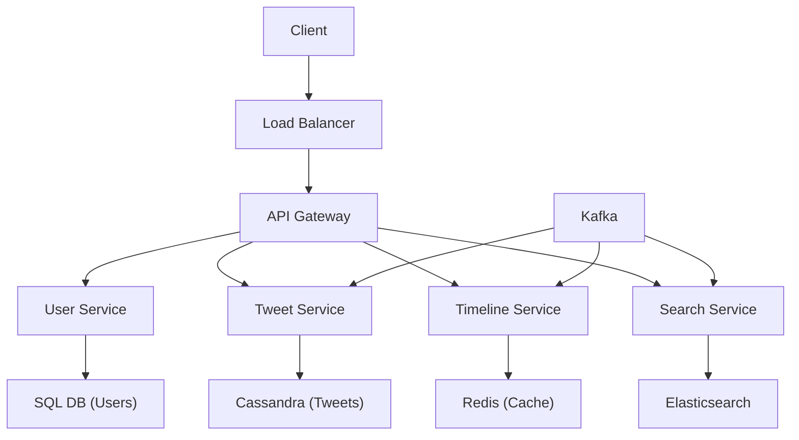
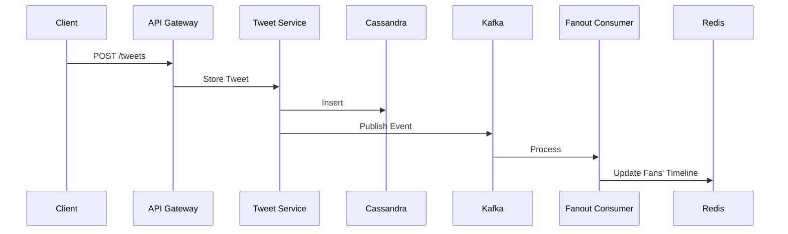
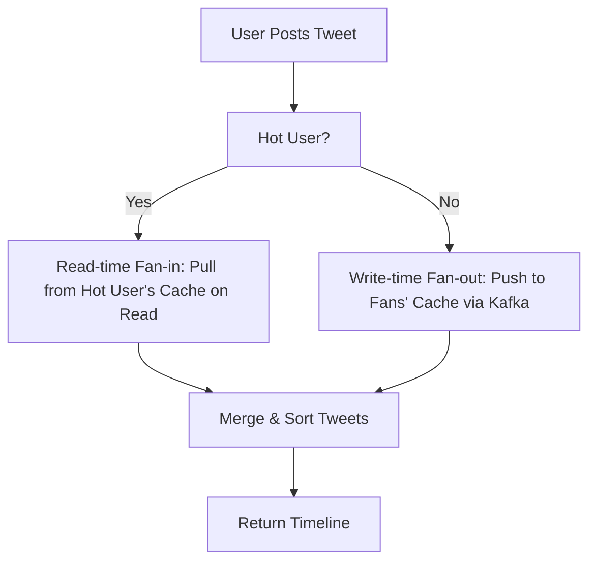
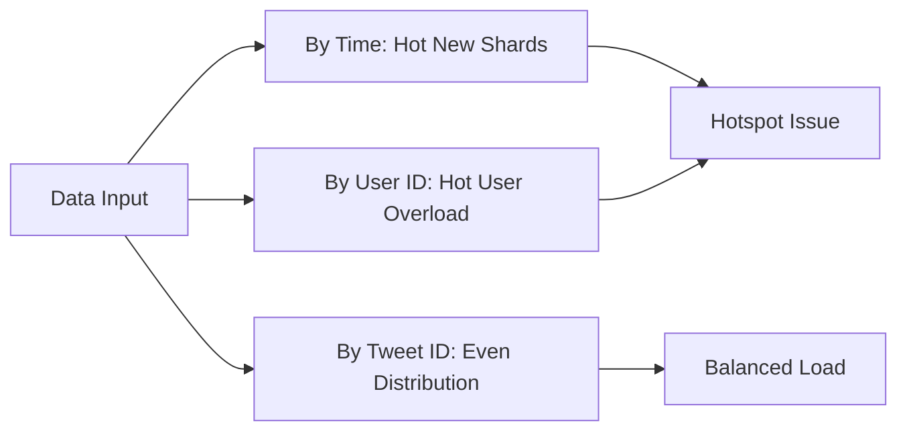

---
toc:
    sidebar: left
layout: post
title: Design Twitter
pretty_table: true
mermaid:
    enabled: true
    zoomable: true
date: "2025-08-01"
description: How to design Twitter
img: assets/img/2024/twitter/7.png
importance: 3
category: SystemDesign
giscus_comments: true
---


## Introduction: Core Principles of Twitter System Design

Twitter (now renamed X) is a large social media platform where users can post short messages (tweets), follow others, interact with content, and view personalized feeds. Designing such a system requires handling high concurrency (billion-level users), read-write imbalance (read operations far exceed write operations), and the celebrity effect (popular users have massive followers).

Key design principles:
- **Microservices Architecture**: Break the system into independent services for easy scaling and maintenance.
- **Read-Write Separation**: Prioritize optimizing read performance using caching and precomputation.
- **Hybrid Fan-Out Strategy**: Combine "fan-out on write" (push mode) and "fan-out on read" (pull mode) for timeline generation.
- **Data Diversity**: Select appropriate storage based on data type (e.g., SQL for user info, NoSQL for tweets, object storage for media).

System goals: Support 2.45 billion DAU (daily active users), handle 500 million new tweets daily, ensure low latency (<200 ms) and high availability (99.999%).

Twitter is a microblogging platform where users can share short messages called tweets. These tweets can be seen by anyone who chooses to follow the user.

After clarifying the core principles of the system, we first start with requirements analysis to lay the foundation for the design.

---

## Step 1: Requirements Analysis

Clarifying functional and non-functional requirements is the starting point of the design. Communicate with the interviewer to define the scope (for example, this design focuses on core functions and excludes advertising or real-time chat).

### Functional Requirements

1. **User Management**:
  - Create account, login, edit profile.
  - Follow/unfollow other users (one-way relationship).

2. **Content Publishing and Interaction**:
  - Publish, edit, delete tweets (text up to 280 characters, support images/videos).
  - Like, reply, retweet, quote tweets.
  - Use @ to mention users or # for hashtags.
  - Retweet and quote other users' tweets.
  - Reply to tweets to create conversations.

3. **Feeds (Timeline)**:
  - **Home Timeline**: Display tweets from followed users, sorted by time.
  - **User Timeline**: Display tweets from a specific user.
  - **Search Timeline**: Display tweets matching keywords.
  - **Trending Topics Timeline**: Display popular topics.

4. **Search and Discovery**:
  - Search by keywords, usernames, or hashtags.
  - Filter results (by time, popularity, media type).
  - Search tweets by keywords, hashtags, or usernames.
  - Filter search results by time, popularity, or media type.
  - Discover trending topics and recommended users.

5. **Social Interactions**:
  - Follow/unfollow other users.
  - Like/unlike tweets.
  - Mention other users with @username.
  - Create and participate in hashtag discussions.

### Non-Functional Requirements

1. **Consistency**:
  - **Eventual Consistency**: Applicable to timeline updates, like counts, follower counts (allow a few seconds delay).
  - **Strong Consistency**: Applicable to user authentication, tweet publishing.
  - Each read receives the latest write or an error.
  - Eventual consistency can be sacrificed in: timeline feed updates, like and follower counts, tweet delivery to followers.
  - Strong consistency is required in: publishing tweets, user authentication.

2. **Availability**:
  - 24/7 operation, uptime 99.999%.
  - Support massive users: 2.45 billion DAU, 100 million MAU, total accounts 1.5 billion.
  - High scalability: Handle peak 12,000 TPS (tweets per second), average 5,700 TPS.
  - System runs around the clock, achieving 99.99% uptime.
  - High scalability to handle: millions of concurrent users, 500 K tweets per second.
  - Low latency performance: Timeline loading < 200 ms, tweet publishing < 100 ms.

3. **Performance**:
  - Low latency: Timeline loading <200 ms, tweet publishing <100 ms.
  - Read-intensive: Read-write ratio about 100:1, prioritize read optimization.

4. **Partition Tolerance (Fault Tolerance)**:
  - Continue operating during network partitions or node failures.
  - Data replication across data centers, graceful degradation.
  - System continues to run in case of network partitions.
  - Handle node failures without service interruption.
  - Data replication across multiple data centers.
  - Graceful degradation during partial system failures.

5. **Security and Privacy**:
  - Data encryption, rate limiting, input validation.
  - Protect user privacy, prevent attacks like DDoS.

Requirements analysis establishes the system's functional boundaries and performance expectations. Next, we evaluate resource needs through capacity estimation to guide technology selection.

---

## Step 2: Capacity Estimation

Estimate storage and bandwidth needs through assumptions to help select the technology stack.

### Assumptions

- DAU: 2.45 billion.
- Daily new tweets: 500 million.
- User behavior: Each user visits home timeline 5 times daily, user timeline 3 times; 20 tweets per page.
- Tweet size: Text 280 bytes + metadata 30 bytes = 310 bytes.
- Media: 20% tweets with images (200 KB each), 10% with videos (2 MB each), 30% videos viewed.
- Each user: Visits home timeline 5 times; other user timelines 3 times.
- Each tweet size 280 (140 characters) bytes, metadata 30 bytes.
  - Each photo: 200 KB, 20% of tweets have images.
  - Each video: 2 MB, 10% of tweets have videos, 30% of videos are viewed.

### Storage Estimation

- **Daily Writes**:
  - Text: 500 million tweets × 310 bytes ≈ 155 GB.
  - Images: 500 million × 20% × 200 KB ≈ 20 TB.
  - Videos: 500 million × 10% × 2 MB ≈ 100 TB.
- **Total Storage**: 155 GB + 20 TB + 100 TB = 125 TB/day.
- **5-Year Storage**: Assuming data growth, requires PB-level storage.

### Bandwidth Estimation

- **Daily Tweet Reads**: 2.45 billion × (5 + 3) × 20 = 39.2 billion.
- **Read Bandwidth**:
  - Text: 39.2 billion × 280 bytes / 86,400 seconds ≈ 500 MB/s.
  - Images: 39.2 billion × 20% × 200 KB / 86,400 ≈ 70 GB/s.
  - Videos: 39.2 billion × 10% × 30% × 2 MB / 86,400 ≈ 100 GB/s.
- **Total Bandwidth**: 175 GB/s (higher at peak).

Conclusion: The system is read-intensive, requiring strong caching and CDN support.

Capacity estimation reveals the system's scale pressure, which provides a quantitative basis for the subsequent API design to ensure interfaces can handle high loads.

---

## Step 3: API Design

Define RESTful APIs as contracts between services. All APIs require authentication (user_token).

### Post Tweet

**POST /tweets**

Request:
```json
{
  "user_token": "token",
  "content": {
    "text": "Hello, Twitter!",
    "media_urls": ["https://example.com/image.jpg"],
    "hashtags": ["#Twitter"],
    "mentions": ["@user"]
  }
}
```

Response:
```json
{
  "tweet_id": "id",
  "created_at": "2024-07-27T12:00:00Z",
  "user_id": "user_id"
}
```

### Delete Tweet

**DELETE /tweets/{tweet_id}**

Request:
```json
{
  "user_token": "token"
}
```

Response:
```json
{
  "status": "deleted",
  "tweet_id": "id"
}
```

### Like/Unlike Tweet

**POST /tweets/{tweet_id}/like**

Request:
```json
{
  "user_token": "token",
  "action": "like" // or "unlike"
}
```

Response:
```json
{
  "tweet_id": "id",
  "like_count": 42,
  "user_liked": true
}
```

### Get Home Timeline

**GET /timeline/home? Page_size=20&page_token=optional**

Response:
```json
{
  "tweets": [
    {
      "tweet_id": "id",
      "user_id": "author_id",
      "content": "text",
      "created_at": "timestamp"
    }
  ],
  "next_page_token": "token"
}
```

### Get User Timeline

**GET /timeline/user/{user_id}? Page_size=20&page_token=optional**

Response: Similar to home timeline.

Other APIs: Follow (POST /follow/{user_id}), Search (GET /search? Query=keyword).

API design defines the external interface specifications. Next, we move to the high-level system design to explore how microservices implement these functions.

---

## Step 4: High-Level System Design

### Overall Architecture

Adopt a microservices architecture, with clients accessing the API gateway through a load balancer.

Core Components:
1. **Client**: Web/App (iOS/Android).
2. **Load Balancer**: Layer 7, round-robin request distribution.
3. **API Gateway**: Routing, authentication, rate limiting.
4. **Microservices**:
  - User Service: Registration, login, profiles.
  - Tweet Service: CRUD tweets.
  - Timeline Service: Generate feeds.
  - Relationship Service: Follow/followers (graph database).
  - Search Service: Full-text search (Elasticsearch).
  - Notification Service: Real-time push (WebSocket).
5. **Auxiliary Components**:
  - Cache (Redis): Hot data.
  - Message Queue (Kafka): Asynchronous processing.
  - CDN: Media distribution.
  - Monitoring: Prometheus + Grafana.

#### High-Level Architecture Diagram (Mermaid)



### Core Processes

#### 1. Tweet Publishing

- Request → Tweet Injection Service → Store to Cassandra (NoSQL).
- Asynchronous: Kafka message → Processor → Update search index (Elasticsearch), analyze trends (Spark).

When a user publishes a tweet, the request first reaches the tweet write service through the load balancer. The tweet write service writes the tweet to the database and updates the cache.

#### Sequence Diagram: Tweet Publishing (Mermaid)



#### 2. Timeline Generation (Core Challenge)

Timeline generation is a core challenge of the system, especially the home timeline which needs to handle aggregation and the celebrity effect. Adopt a hybrid fan-out strategy: Use fan-out on write for ordinary users to push tweet IDs to followers' caches; use fan-out on read for celebrity users, dynamically pulling and merging during reads. User classification includes celebrities (>10 k followers), active, and inactive. For detailed analysis and optimization, see Bottleneck 1 in Step 7.

#### Fan-Out Flowchart (Mermaid)



#### 3. Search and Analysis

- Search: Kafka consumer → Elasticsearch index.
- Analysis: Spark Streaming processes Kafka streams, computes trends → Stores in Redis.

The high-level system design outlines collaboration between components. Next, we focus on the data storage layer to explore how to persist data in these processes.

---

## Step 5: Data Storage

Select storage based on data characteristics to support efficient operation of the above processes.

### Table Design

- **User Table (SQL, e.g., MySQL)**:

  | Field        | Type         |
  |--------------|--------------|
  | userId      | Integer     |
  | name        | Varchar (100)|
  | email       | Varchar (100)|
  | creationTime| DateTime    |
  | lastLogin   | DateTime    |
  | isHotUser   | Boolean     |

- **Tweet Table (NoSQL, e.g., Cassandra)**:

  | Field        | Type         |
  |--------------|--------------|
  | tweetId     | Integer     |
  | userId      | Integer     |
  | content     | Varchar (280)|
  | creationTime| DateTime    |

- **Follow Table (Graph DB, e.g., Neo 4 j)**:

  | Field       | Type     |
  |-------------|----------|
  | userId     | Integer |
  | followerId | Integer |

- **Media**: Object storage (e.g., S 3).

- SQL Database: For example, user table.
- NoSQL Database: For example, timeline.
- File System: Media files: images, audio, videos.

The data storage scheme lays the foundation for persistence, but facing massive access, we need to further explore scalability strategies to ensure system elasticity.

---

## Step 6: Scalability

Building on data storage, scalability design focuses on handling growing loads, ensuring the system scales from billions of users to even larger.

### Database Scaling

- **Read-Write Separation**: Master for writes, slaves for reads (multiple replicas).
- **Sharding**:

To handle massive data storage and query needs, Twitter's architecture uses sharding to distribute data across multiple servers for efficient scaling.

#### Why Sharding is Needed

- **Massive Data**: Twitter generates about **500 million tweets daily**, about **200 billion tweets annually**, and about **1 trillion tweets in 5 years**, or more.
- A single machine cannot store and process such vast amounts of data.
- **Solution**: Split large tables into smaller fragments (called shards), distributed across different servers for storage and processing.

#### Sharding Methods

##### 1. Sharding by Creation Time

- **Implementation**: Shard tweets by creation time, such as by day or week; each shard stores data for a specific time period, facilitating quick location during queries.
- **Advantages**: Efficient queries for specific time ranges, only accessing relevant shards.
- **Disadvantages**: Hot-cold data issues, older shards have low access frequency and waste resources, while newer shards have high write pressure forming hotspots; new shards fill quickly due to high write volume.

##### 2. Sharding by User ID Hash

- **Implementation**: Hash user IDs to store all tweets of the same user in one shard; each shard can store about 100,000 users' data.
- **Advantages**: Simple user timeline queries, directly querying the corresponding user ID shard; user data localized.
- **Disadvantages**: Complex home timeline queries, followers' lists may be scattered across multiple shards, requiring cross-shard queries for all followed users' tweets; uneven storage, popular users (e.g., celebrities) have significantly more data, causing overload in some shards; hotspot issues, high access to popular users may make some shards very busy, affecting performance; availability challenges, if a single shard stores too much data, it may affect scalability and high availability.

##### 3. Sharding by Tweet ID Hash

- **Implementation**: Hash tweet IDs to evenly distribute tweets across shards; ensure highly active users (e.g., celebrities) tweets are spread across different shards to avoid single shard overload.
- **Advantages**: Even data distribution, tweets evenly spread across all shards, reducing load pressure on single shards; high availability, limited impact from single shard failure, improving overall system stability.
- **Disadvantages**: Complex timeline queries, building user or home timelines requires querying all relevant tweets across multiple shards, increasing query costs; relies on caching, efficient timeline queries heavily depend on strong caching to reduce shard access.

##### Sharding Strategy Comparison

| **Sharding Method**       | **Advantages**                 | **Disadvantages**                               |
|---------------------------| --------------------------------| ------------------------------------------------|
| **By Creation Time**      | - Efficient for specific time range queries | - Hot-cold data issues lead to resource waste <br>- New shards form hotspots due to write pressure |
| **By User ID Hash**       | - Simple user timeline queries <br>- User data localized | - Home timeline requires cross-shard queries <br>- Uneven storage, hotspots from popular users <br>- Hotspot issues and availability challenges |
| **By Tweet ID Hash**      | - Even data distribution <br>- Reduces hotspots | - Complex timeline queries, need to access all shards <br>- Efficient queries rely on caching |

Recommended: Sharding by tweet ID hash + cache optimization.

#### Sharding Strategy Diagram (Mermaid)



### Cache

- **Usage**: Store timelines, tweet content (Redis).
- **Strategies**: LRU eviction, TTL expiration, write-through cache.
- **Sharding**: Based on user ID or tweet ID hash.

#### Why Cache is Needed

- **High Read Traffic in Social Networks**: Users repeatedly view timelines, which accounts for most system access. Caching can effectively reduce read request latency while lowering database load.
- **High Cost and Slow Speed of Distributed Queries**: Data requires queries across multiple shards or databases, especially in generating user home timelines. This involves significant computation and query overhead.

#### How Cache Works

- **Store Hot or Precomputed Data in Memory**: Store frequently accessed or precomputed data in high-speed storage (e.g., Redis or Memcached), significantly reducing query latency.
- **Accelerate Read Operations**: Retrieving data directly from memory is much faster than from distributed storage systems, providing near-real-time user experience.

#### Cache in Timeline Service

##### 1. User Timeline Cache

- **Mapping**: `user_id -> {tweet_id}`.
- **Storage**: All tweet IDs posted by the user.
- **Characteristics**: Cache size depends on user activity. For example, ordinary users: 1 k-100 k tweet IDs; highly active users (e.g., Trump): about 60 k tweet IDs.

##### 2. Home Timeline Cache

- **Mapping**: `user_id -> {tweet_id}`.
- **Storage**: Tweet IDs from all users followed by this user.
- **Characteristics**: Much larger than user timeline cache as it aggregates tweets from multiple followed users; requires efficient cache strategies for updates and eviction.

##### 3. Tweet Content Cache

- **Mapping**: `tweet_id -> tweet`.
- **Storage**: Actual content of the tweet, allowing multiple timelines to share this data.
- **Characteristics**: Provides reusable data, reducing redundant storage in cache; separates tweet content from timelines to reduce memory usage.

#### Key Issues in Cache

##### 1. Cache Strategies

- **Eviction Strategy**: **Least Recently Used (LRU)**: Prioritize retaining recently accessed data; **Time to Live (TTL)**: Set expiration time for data to automatically clean old data and free space.
- **Cache Warmup**: Preload popular timelines or tweets to reduce cache misses.
- **Write-Through Cache**: Update cache simultaneously with database writes to ensure data consistency.

##### 2. Cache Sharding

- **Why Shard Cache?**: Scalability, a single cache instance cannot handle massive traffic; load balancing to prevent cache bottlenecks.
- **How to Implement Cache Sharding?**: Shard user timelines or home timelines based on user ID hash, distributing to different cache shards; shard tweet content evenly based on tweet ID hash.

##### 3. Performance Optimization

- **High Read-Write Throughput**: Use memory systems optimized for high efficiency, such as Redis; improve read performance through replication.
- **Reduce Cache Misses**: Use prediction algorithms to preload data users may access.
- **Dynamic Monitoring and Scaling**: Use monitoring tools to track cache hit rates, dynamically adjust cache size or sharding strategies.

### Other Optimizations

- **Message Queue**: Decouple asynchronous tasks.
- **CDN**: Accelerate media.
- **Load Balancing**: Horizontal scaling of services.

Scalability strategies ensure system elasticity, and next, we turn to bottleneck analysis and optimization to delve into solving potential performance issues.

---

## Step 7: Bottleneck Analysis and Optimization

Scalability design provides a path for growth, but in actual operation, bottlenecks still exist. This section analyzes causes, impacts, and solutions to help optimize key components.

Twitter system, as a read-intensive platform, brings multiple potential bottlenecks due to high concurrency and data scale. Based on the core challenges of system design, this section conducts a detailed analysis of the following 5 key bottlenecks: each bottleneck includes causes (extended explanation of potential root causes, triggering factors, and mechanisms), impacts (quantified performance degradation, resource consumption, user experience, and business risks), comparisons (comparisons of different schemes or strategies, presented in table form for clarity), and solutions (step-by-step description of multiple methods, with recommended solutions including implementation details, expected effects, and trade-offs). The analysis is based on capacity estimation (DAU 2.45 billion, daily tweets 500 million, read-write ratio 100:1, daily 39.2 billion reads, 175 GB/s bandwidth) and architectural design (e.g., hybrid fan-out, sharding, caching), aiming to provide comprehensive optimization guidance. The recommended solution for each bottleneck is refined based on actual Twitter/X practices and document principles (such as microservices, asynchronous processing), emphasizing operability and scalability.

### [1. Timeline Generation (Especially Home Timeline)](https://zhengxingxing.com/blog/2025/DetailedSystemDesignOfTwitterTimelineGeneration/)

#### Causes
Home timeline requires aggregating tweets from multiple users, with complex computations; celebrity effect leads to high fan-out overhead; read-write imbalance and consistency conflicts amplify the issue.

#### Impacts
Latency rises to 500 ms+, high resource consumption, increased user churn rate.

#### Solution Strategy
Adopt hybrid fan-out strategy: Push for ordinary users on write, pull for celebrities on read; combine Redis precomputation cache and Kafka asynchronous processing.

### [2. Database Read/Write and Sharding](https://zhengxingxing.com/blog/2025/TwitterDatabaseReadAndWriteAndShardingSystemDesignDetailedGuide/)

#### Causes
Massive data scale and uneven distribution lead to hotspots; high cross-shard query overhead; consistency and fault mechanisms increase latency.

#### Impacts
Query timeout rate increases 10-20%, resource costs rise 30%, availability decreases.

#### Solution Strategy
Shard by tweet ID hash combined with read-write separation; use Vitess manager for automatic failover and rebalancing.

### 3. Caching System

#### Causes
- Hit rate and invalidation mechanisms: High-activity user home timelines are large (aggregating multiple users, >100 k IDs), cold starts or TTL expirations lead to miss rates >10%, causing database query surges (e.g., 5% misses in 39.2 billion reads = 1.96 billion database hits); post-sharding cross-cache network latency >10 ms.
- Update and write overhead: Fan-out updates require multiple writes (O (N) followers), memory fragmentation accumulates; write-through consistency requires synchronous database updates, introducing lock contention.
- Memory and eviction limits: TB-level cache handles PB data, hot data crowds out space; LRU ignores time-sensitive tweets, leading to frequent evictions.
- Consistency conflicts: Distributed cache (e.g., Redis cluster) inter-node sync latency (>50 ms), eventual consistency leads to stale data.
- Peak and media: High-concurrency reads (175 GB/s) penetrate cache; media cache (images/videos) has high bandwidth, requiring extra storage.

#### Impacts
- Performance degradation: Miss latency >300 ms (doubles), avalanche effect slows system response 5 x; high eviction rate increases GC time >10%.
- Resource consumption: Memory overflow requires evictions, CPU >70% (update operations); uneven cluster node utilization, costs rise 20%.
- User experience and business risks: Inaccurate or slow timelines, interactions decrease 15%; cache failures affect 99% read operations, violating low-latency goals.
- Availability limits: Single-node failures impact sharded data, dropping to 99.9%; scaling migrations slow (minutes).
- Cost impacts: High-end Redis instances expensive (e.g., monthly increase $10 k), complex monitoring.

#### Comparison

| Strategy/Scheme          | Advantages                                                                 | Disadvantages                                                                 | Applicable Scenario Comparison |
|--------------------------|----------------------------------------------------------------------------|-------------------------------------------------------------------------------|-------------------------------|
| **LRU Eviction**         | - Retains hot data, high hit rate (>95%).<br>- Simple implementation.      | - Ignores new data, more invalidations in time-sensitive scenarios (rate increase 10%). | Better than TTL for hot reads, but poor for new tweets; good for read-intensive. |
| **TTL Expiration**       | - Automatically cleans old data, saves memory 20%.<br>- Prevents staleness.| - Hot data expires early, hit rate drops 15%.<br>- Complex parameter tuning.   | Better than LRU for time data, but not for hot users alone. |
| **Redis vs. Memcached**  | - Redis: Supports structures (lists/sets), good persistence.<br>- Memcached: Faster (latency <5ms). | - Redis: High memory overhead.<br>- Memcached: No structures, hard for timelines. | Redis wins for complex (e.g., timeline lists), 20% higher throughput. |
| **Sharding vs. Single Instance** | - Sharding: Infinite scaling, load balancing.<br>- Single instance: No network overhead. | - Sharding: Latency increase 5-10 ms.<br>- Single instance: Bottleneck early (TB limit). | Sharding essential for large scale, single instance for small DAU. |

#### Solutions
- **Multiple Methods**:
  1. **Eviction and Warmup**: Combine LRU and TTL strategies (TTL=1 hour for hot data, 24 hours for ordinary), use prediction algorithms based on user access history to preload data.
  2. **Consistency Management**: Implement write-through caching, updating database and cache simultaneously; add invalidation notification system (Redis Pub/Sub) to broadcast updates.
  3. **Sharding Optimization**: Shard based on user ID or tweet ID hash for even distribution; enable auto-scaling, add new nodes when memory utilization >80%.
  4. **Media Handling**: Store media metadata in Redis, but externalize actual content to CDN to reduce cache memory pressure.
  5. **Monitoring**: Use Grafana to track hit rates and eviction frequencies, conduct A/B tests on different strategies.
- **Recommended Solution**: Redis cluster sharding combined with LRU+TTL strategy. This is an efficient memory management scheme that maximizes hit rates and minimizes backfill pressure. The following are detailed implementation details, described step by step, with each step including specific operations, tool configurations, potential challenges and handling methods, and code examples listed separately:
  1. **Cluster Deployment and Basic Configuration**: Install Redis Cluster (version 6+, initial 10 master nodes, 2 slaves per node for high availability), enable AOF persistence (appendonly yes) and RDB snapshots (save 60 10000) to prevent data loss. Configure maxmemory to 64 GB/node, policy to allkeys-lru for global eviction. Challenge: High initial sync overhead for nodes; Handling: Roll out in phases, test with 3 nodes first then expand. This step establishes cluster stability.

     Code Example (Java Pseudocode):
     ```java
     JedisCluster jedis = new JedisCluster (new HostAndPort ("node 1", 6379));
     Jedis.GetClusterNodes (). ForEach (node -> node.SetConfig ("appendonly yes"));
     ```

  2. **Sharding Logic Implementation**: Hash user timelines by user ID (CRC 16 algorithm) for sharding to ensure same-user data locality; hash tweet content by tweet ID for even hotspot distribution. Set slots to 16384 for future expansion. Challenge: Data inconsistency during shard migration; Handling: Use Redis CLUSTER MIGRATE command for gradual migration, monitor progress. This step ensures balance.

     Code Example (Java Pseudocode):
     ```java
     Int slot = CRC 16. Crc 16 (userId.GetBytes ()) & 16383;
     Jedis.ClusterSetSlotMigrating (slot, targetNode);
     Jedis.Lpush ("home_timeline: " + userId, tweetId);
     ```

  3. **Eviction Strategy and TTL Application**: Configure global LRU (maxmemory-policy allkeys-lru), set TTL for each key (1 hour for hot, 24 hours for ordinary, via custom logic judging e.g., likes >1000 for short TTL). Integrate Lua scripts for automatic application. Challenge: Inaccurate TTL tuning leading to early expirations; Handling: A/B test different TTL values, adjust based on hit rate feedback. This step optimizes memory.

     Code Example (Java Pseudocode):
     ```java
     String luaScript = "redis.Call ('EXPIRE', ARGV[1], ARGV[2])";
     Jedis.Eval (luaScript, 0, key, String.ValueOf (ttlSeconds));
     ```

  4. **Warmup Mechanism and Consistency Management**: Develop warmup tasks (Quartz Scheduler, run every 5 minutes), extract high-access users from ELK logs, query database to prefill Redis (Pipeline batch insert to reduce latency). Add Pub/Sub invalidation notifications: Publish channel messages on tweet updates, subscribers invalidate keys. Challenge: High warmup load at peaks; Handling: Rate limit <100 users/min, prioritize top users. This step ensures consistency.

     Code Example (Java Pseudocode):
     ```java
     Pipeline pipe = jedis.Pipelined ();
     For (Tweet t : dbTweets) {
         pipe.Zadd ("timeline: " + user, -t.timestamp, t.id);
     }
     Pipe.Sync ();
     Jedis.Publish ("update_channel", tweetId);
     Jedis.Subscribe (new JedisPubSub () {
         @Override
         Public void onMessage (String channel, String message) {
             Jedis.Del ("timeline: " + message);
         }
     }, "update_channel");
     ```

  5. **Monitoring and Backfill Rate Limiting**: Use Prometheus Redis exporter to collect metrics (e.g., evicted_keys, hit_rate), Grafana dashboard for visualization; alert on hit rate <95%. Backfill rate limiting uses Guava RateLimiter as token bucket. Test: Chaos Monkey simulates node failures to verify cluster recovery. Challenge: Monitoring overhead; Handling: Sample rate 10% to reduce burden. This step ensures stability.

     Code Example (Java Pseudocode):
     ```java
     RateLimiter limiter = RateLimiter.Create (1000.0);
     If (limiter.TryAcquire ()) {
         BackfillFromDB ();
     }
     Metrics.Counter ("notification_delivered"). Inc ();
     ```

  Expected Effect: Hit rate >98%, latency <50 ms, memory utilization <70%, backfill reduction 90%. Trade-offs: Lua and Pub/Sub increase complexity (requires 1 week debugging), but improve scalability, consistent with document sharding recommendations, prioritizing high reads.

### 4. Search and Trend Analysis

#### Causes
- **Index Update Latency**: 500 million daily tweets require real-time Elasticsearch indexing (handling @/ #/media ), Kafka consumer queue backlog (peak >50 k/s); tokenization/aggregation computation-intensive.
- **Query Complexity**: Search filtering (time/popularity/media) requires full-text + ranking algorithms (e.g., BM 25), cross-index queries >100 ms; trend analysis (Spark) processes big data streams, high memory/CPU.
- **Data Explosion and Hotspots**: Global events (e.g., #topics ) cause query bursts, index fragmentation; 30% video views amplify media search.
- **Consistency and Real-Time**: Eventual consistency latency >5 s, but users expect instant results; Spark Streaming windows (e.g., 1 min) cause computation lag.
- **Scale Limits**: ES node IO bottlenecks (daily TB indexing), distributed sync slow.

#### Impacts
- **Performance Degradation**: Search latency >300 ms (doubles), trend updates slow >1 min; query failure rate increases 5%.
- **Resource Consumption**: Spark cluster CPU >80% (hundreds of nodes), ES storage doubles costs.
- **User Experience and Business Risks**: Miss real-time topics, interactions decrease 20%; weak discovery function, recommendation accuracy drops.
- **Availability Limits**: Index failures affect search service, overall drop 10%.
- **Cost Impacts**: Big data tools expensive (monthly $20 k+), complex operations.

#### Comparison
| Scheme               | Advantages                                                                 | Disadvantages                                                                 | Applicable Scenario Comparison |
|----------------------|----------------------------------------------------------------------------|-------------------------------------------------------------------------------|-------------------------------|
| **Elasticsearch vs. Solr** | - ES: Strong distributed real-time, good scaling. <br> - Solr: Faster queries (<50ms). | - ES: Complex configuration. <br> - Solr: Poor scaling (single-machine limit). | ES wins for massive (30% higher throughput), Solr for small scale. |
| **Stream Processing vs. Batch Processing** | - Stream (Spark): Real-time < 1min. <br> - Batch (Hadoop): Low cost. | - Stream: High resources (high CPU). <br> - Batch: Hourly latency. | Stream suitable for trends (90% latency reduction), batch for history. |
| **Precomputation vs. Real-Time** | - Precomputation: Queries <100ms. <br> - Real-Time: Latest accuracy. | - Precomputation: Inaccurate for events. <br> - Real-Time: Slow computation. | Precomputation wins for peaks (low cost), real-time for precision. |

#### Solutions
- **Multiple Methods**:
  1. **Asynchronous Indexing**: Kafka consumers batch process tweet indexing (every 1000), prioritize popular tweets (based on popularity >10 k likes).
  2. **Query Optimization**: Integrate ES tokenization plugins (e.g., IK analyzer) and cache filtered results (Redis stores popular query results, TTL=5 minutes).
  3. **Trend Computation**: Reduce Spark Streaming window to 30 seconds, precompute hot topics and store in Redis.
  4. **Sharding Expansion**: ES shards by time or region, enable autoscaling to add nodes based on query TPS.
  5. **Degradation**: Use cached old trend results during high load, rate limit complex queries (e.g., multiple filters).
- **Recommended Solution**: **Kafka asynchronous indexing combined with Spark stream processing**. This is an optimization scheme for real-time data processing that reduces indexing latency and improves trend accuracy. The following are detailed implementation details, described step by step, with each step including specific operations, tool configurations, potential challenges and handling methods, and code examples listed separately:
  1. **Kafka Topic and Tweet Delivery**: After tweet publishing, serialize tweet data (text, hashtags, mentions, media_urls, popularity field) to JSON and deliver to Kafka topic (topic: 'search-index-queue', partitions=64 for high-throughput parallel processing). Enable compression (snappy) and retention 24 hours. Challenge: Retry on delivery failure; Handling: Producer acks=all to ensure confirmation. This step ensures reliable asynchronous.

     Code Example (Java Pseudocode):
     ```java
     Properties props = new Properties ();
     Props.Put ("compression. Type", "snappy");
     KafkaProducer<String, String> producer = new KafkaProducer<>(props);
     producer.Send (new ProducerRecord<>("search-index-queue", tweetJson));
     ```

  2. **Consumer Batch Indexing to ES**: Deploy Kafka consumer service (using KafkaConsumer API, 10 thread pool), read batches (every 1000 tweets), extract keywords (NLP library like OpenNLP), prioritize popular (popularity >10 k first, using PriorityQueue sorting). Batch insert to ES (BulkRequest). Configure ES nodes to 20 (heap 31 GB). Challenge: Low tokenization accuracy; Handling: Custom analyzer plugin test accuracy >90%. This step reduces latency to <200 ms.

     Code Example (Java Pseudocode):
     ```java
     KafkaConsumer<String, String> consumer = new KafkaConsumer<>(props);
     Consumer.Subscribe (Collections.Singleton ("search-index-queue"));
     While (true) {
         ConsumerRecords<String, String> records = consumer.Poll (Duration.OfSeconds (1));
         BulkRequest bulk = new BulkRequest ();
         for (ConsumerRecord<String, String> record : records) {
             String doc = parseJson (record.Value ());
             Bulk.Add (new IndexRequest ("tweets"). Source (doc));
         }
         EsClient.Bulk (bulk);
     }
     ```

  3. **Spark Trend Stream Computation**: Configure Spark Streaming (Spark 3+, window 30 seconds, slide 10 seconds), consume from Kafka stream, aggregate topic popularity (DataFrame groupBy (" #hashtag "). Count (), add Watermark for late data handling). Store top 100 topics in Redis HASH (key: 'trends: current'). Cluster config: driver 4 core, executor 50*2 core. Challenge: Window computation lag; Handling: Reduce window, monitor watermark lag. This step achieves near-real-time trends.

     Code Example (Java Pseudocode):
     ```java
     JavaStreamingContext ssc = new JavaStreamingContext (sparkConf, Duration.Seconds (30));
     JavaInputDStream<ConsumerRecord<String, String>> stream = KafkaUtils.CreateDirectStream (ssc, topic);
     Stream.Map (record -> parse (record.Value ())). GroupByWindow (Duration.Seconds (30), Duration.Seconds (10)). Count (). SortBy (desc ("count")). Limit (100). ForeachRDD (rdd -> {
         Map<String, Long> map = rdd.CollectAsMap ();
         Jedis.Hmset ("trends: current", map);
         Jedis.Expire ("trends: current", 300);
     });
     ```

  4. **Query Frontend and Cache Optimization**: In search service GET /search API, first check Redis popular results (HGETALL 'trends: current'), miss then ES query (QueryBuilders. MultiMatchQuery (query, "text", "hashtags"). MinimumShouldMatch ("75%"), add BM 25 scoring). Filters like time/media use script_score custom. Cache results in Redis (TTL=5 min). Integrate CDN cache media previews. Challenge: Complex queries slow; Handling: Limit filters <3, A/B test scoring. This step improves hit rate.

     Code Example (Java Pseudocode):
     ```java
     If (jedis.Exists (queryKey)) {
         Return jedis.Get (queryKey);
     } else {
         SearchRequest req = new SearchRequest ("tweets");
         Req.Source (new SearchSourceBuilder (). Query (QueryBuilders.TermQuery ("keywords", query)));
         SearchResponse resp = esClient.Search (req);
         Jedis.Setex (queryKey, 300, serialize (resp));
         Return deserialize (resp);
     }
     ```

  5. **Monitoring and Degradation Integration**: Prometheus collects ES/Spark metrics (e.g., index_rate, cpu_usage), Grafana visualizes; alert on latency >150 ms. Degradation: Return cached old results during high load, rate limit complex queries (RateLimiter 100 QPS/user). Test: Simulate 5 k QPS, verify accuracy. Challenge: Alert noise; Handling: Threshold based on historical baseline. This step ensures stability.

     Code Example (Java Pseudocode):
     ```java
     If (load > threshold) {
         Return cachedTrends.WithWarning (true);
     }
     ```

  Expected Effect: Search latency <150ms, accuracy >95%, resources reduced 40%. Trade-offs: Spark/Kafka tuning requires 1 week, but significantly improves real-time, consistent with document search service, prioritizing asynchronous.

### [5. Notification and Real-Time Push](https://zhengxingxing.com/blog/2025/TwitterNotificationAndReal-TimePushSystemDesignDetailedGuide/)

#### Causes
High-frequency interactions lead to large connection scales; real-time delivery latency and resource contention; complex filtering and external factors like DDoS.

#### Impacts
Push latency >2 s, loss rate >5%, user stickiness reduced 15%.

#### Solution Strategy
WebSocket combined with Kafka asynchronous push; batch filtering and multi-channel supplementation (WS main, FCM/APNS supplement).

---

## Summary

This design builds a highly available, scalable Twitter system, addressing challenges through microservices, hybrid fan-out, and sharding. The bottleneck analysis section provides targeted optimizations to ensure stability under high loads. Actual implementation needs iteration based on specific scale. If used for interviews, emphasize trade-offs (e.g., Push vs Pull) and estimation analysis. The core content of the original documents (such as requirements, estimation, API, processes) has been fully retained, enhanced by bottleneck optimization for comprehensiveness. Added visual diagrams improve readability and practicality.

#### Overall System Architecture Diagram (Mermaid)

