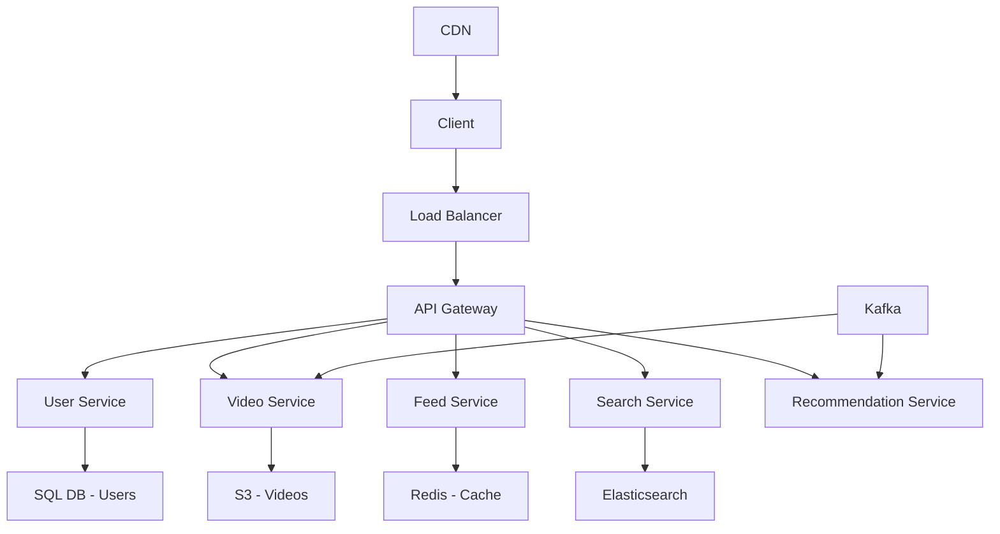
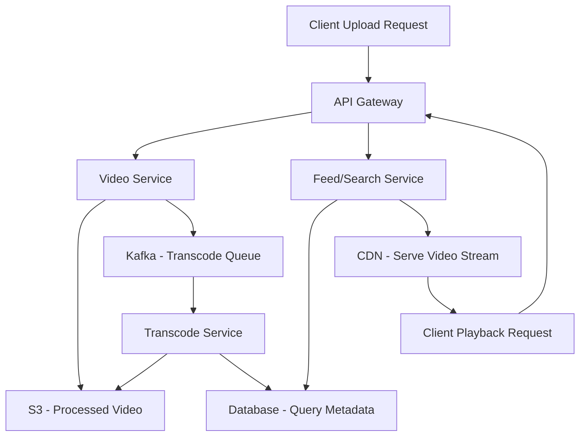
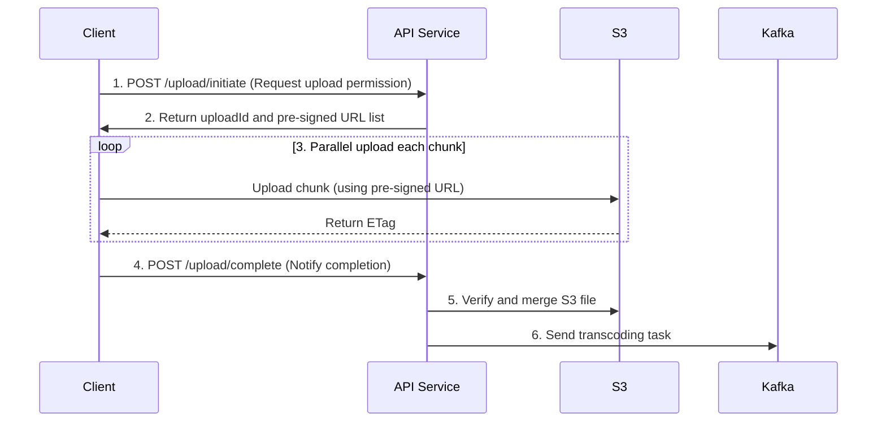
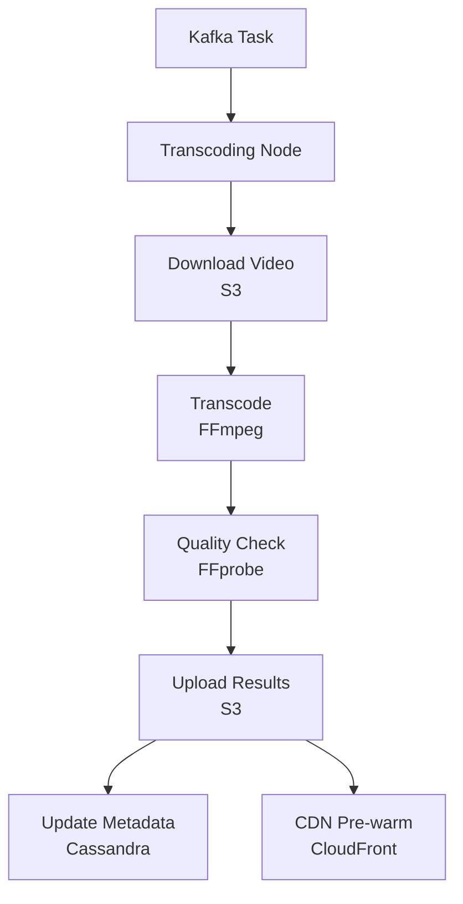
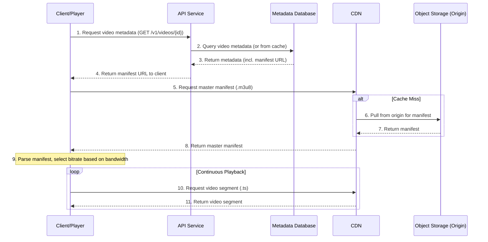

---
toc:
sidebar: left
layout: post
title: Design YouTube
pretty_table: true
mermaid:
    enabled: true
    zoomable: true
date: "2025-08-01"
description: How to design YouTube
img: assets/img/2025/youtube/1.png
importance: 4
category: SystemDesign
giscus_comments: true
---

# Introduction

YouTube is the world's largest video-sharing platform, owned by Google. Users can upload, watch, and share various formats of media, including short videos, long videos, educational content, and music videos. It supports large file uploads, multi-resolution playback, and social interactions such as comments, subscriptions, and recommendations. The platform handles millions of video uploads and billions of view requests daily, making it a typical high-traffic, read-intensive system.

Designing a system similar to YouTube involves managing large-scale data, high throughput, low-latency delivery, and a wide range of features. This guide, based on a detailed system design analysis, breaks down the design process, covering everything from requirements analysis to optimization. We will explore functional requirements, non-functional requirements, capacity estimation, API design, high-level architecture, core workflows, data schemas, scalability, availability, optimization, security considerations, and future expansions.

This document aims to provide a comprehensive technical framework to help understand and implement a YouTube-like system. By emphasizing microservices architecture, asynchronous processing, and distributed components, it focuses on scalability and performance optimization.

## 1. Requirements Analysis and Scope Definition

### 1.1. Functional Requirements

- **Core**:
    - Users can upload videos.
    - Users can watch videos.
- **Secondary**:
    - Users can post comments on videos.
    - Users can subscribe to channels.
    - Search for videos.
    - User accounts and profiles.
- **Extended**:
    - Recommendations, live streaming, data analytics, copyright protection, monetization.

### 1.2. Non-Functional Requirements

- **High Availability**: The system must withstand failures, targeting 99.99% availability.
- **Scalability**: Must handle growing users, videos, and traffic (e.g., from 5 million to 50 million+ DAU).
- **Low Latency**: Video playback should start quickly (first frame load <2 seconds). API responses <500 ms.
- **Durability**: Uploaded videos should not be lost (e.g., 99.999% durability).
- **Consistency**: Many features can accept eventual consistency (e.g., view counts, comments), but others require strong consistency (e.g., user account data, video upload status).
- **Security**: Protect user data and video content from unauthorized access and attacks.
- **Cost-Effectiveness**: Optimize infrastructure and operational costs.

### 1.3. Detailed Requirements Breakdown and Challenges

| Module | Priority | Core Challenges | Design Decisions | Scalability Considerations | Constraints |
| :--- | :--- | :--- | :--- | :--- | :--- |
| **Video Upload** | Highest | 1. Stability for large file uploads (network fluctuations)<br>2. Upload speed optimization<br>3. Format compatibility handling | 1. **Chunked Upload** (100 MB/chunk)<br>2. **Pre-signed URLs** (temporary authorization)<br>3. **Asynchronous Processing Queue** (separate upload from transcoding) | 1. Chunked upload supports resumable uploads<br>2. Dynamic scaling of cloud storage (S 3)<br>3. Support for multiple protocols (HTTP/HTTPS, QUIC) | File size limit (initial 1 GB, target 4 GB+), format restrictions (MP 4, MOV) |
| **Video Playback** | Highest | 1. Low-latency streaming delivery<br>2. Multi-bitrate adaptive streaming (ABR)<br>3. Global distribution coverage | 1. **CDN Distribution** (CloudFront)<br>2. **HLS/DASH Protocols**<br>3. **Edge Caching Strategies** | 1. Dynamic switching of CDN providers (failover)<br>2. Intelligent preloading<br>3. Support for offline downloads | Resolution limit (up to 4 K), first frame load <2 seconds |
| **Comments Feature** | Medium | 1. High-concurrency writes (popular videos)<br>2. Real-time requirements<br>3. Sensitive content filtering | 1. **Read-Write Separation** (master for writes, replicas for reads)<br>2. **Message Queue for Peak Shaving** (Kafka)<br>3. **Asynchronous Moderation** (AI + manual) | 1. Sharding (by video ID hash)<br>2. Hot-cold data separation<br>3. Elastic caching (Redis cluster) | Moderation delay <5 minutes, per-video comment limit (anti-spam) |
| **Subscriptions Feature** | Low | 1. Dynamic push updates (to fans)<br>2. Data consistency (subscriber counts)<br>3. Privacy controls | 1. **Eventual Consistency** (message queue sync)<br>2. **Approximate Counting** (HyperLogLog)<br>3. **RBAC** | 1. Integration with recommendation algorithms<br>2. Batch notification optimization<br>3. Data partitioning by geography | Push frequency limits, display caps (e.g., "1 M+") |

---

## 2. Capacity Estimation and API Design

### 2.1. Capacity Estimation

**Assumptions**:

- **DAU (Daily Active Users)**: 5 million (initial, scalable to 50 million)
- **Uploads**: 10% of DAU upload 1 video daily = 500,000 videos/day
- **Average Video Size**: 300 MB (720 p, H.264 encoding)
- **Views**: Each user watches 5 videos daily = 25 million views/day
- **Transcoding Needs**: Generate 4 resolutions per video (360 p, 720 p, 1080 p, 4 K).
- **CDN Cache Hit Rate**: 80% (90% for popular videos, 50% for cold ones).

**Calculations**:

- **Daily Storage Growth**: 500,000 videos/day * 300 MB/video = 150 TB/day
- **Monthly Storage Growth**: 150 TB/day * 30 days = 4.5 PB/month
- **Daily Playback Egress Traffic**: 25 million views/day * 300 MB/video = 7.5 PB/day
    - **CDN Hits**: 7.5 PB * 80% = 6 PB
    - **Origin Pulls**: 7.5 PB * 20% = 1.5 PB
- **API QPS (Queries Per Second)**:
    - View-related: 25 million * 10 API calls (metadata, URLs, etc.) = 250 million/day
    - Upload-related: 500,000 * 20 API calls (chunked uploads, metadata) = 10 million/day
    - Others (comments, search): 100 million/day
    - **Total**: 360 million ÷ (24*3600 seconds) ≈ 4,167 QPS
    - **Peak**: 4,167 * 3 (popular video releases) ≈ 12,500 QPS

### 2.2. API Design

All APIs require authentication via an API gateway (e.g., using JWT).

**1. Video Upload**

- **`POST /v1/videos/upload/initiate`**
    - **Description**: Initiate a chunked upload task, retrieve `uploadId` and pre-signed URLs for each chunk.
    - **Request Body**:
      ```json
      {
        "fileName": "my_vacation.mp4",
        "fileSize": 104857600, // 100MB
        "partCount": 10,
        "title": "My Vacation",
        "description": "A wonderful time"
      }
      ```
    - **Response Body (200 OK)**:
      ```json
      {
        "videoId": "v12345",
        "uploadId": "upload-abcde",
        "parts": [
          {"partNumber": 1, "signedUrl": "https://s3..."},
          {"partNumber": 2, "signedUrl": "https://s3..."}
        ]
      }
      ```
- **`POST /v1/videos/upload/complete`**
    - **Description**: Notify the server that all chunks have been uploaded.
    - **Request Body**:
      ```json
      {
        "videoId": "v12345",
        "uploadId": "upload-abcde",
        "parts": [
          {"partNumber": 1, "eTag": "etag1"},
          {"partNumber": 2, "eTag": "etag2"}
        ]
      }
      ```
    - **Response Body (200 OK)**:
      ```json
      {
        "status": "processing",
        "message": "Video uploaded successfully, processing in progress"
      }
      ```

**2. Video Playback**

- **`GET /v1/videos/{videoId}`**
    - **Description**: Retrieve video metadata and playback information.
    - **Response Body (200 OK)**:
      ```json
      {
        "videoId": "v12345",
        "title": "My Vacation",
        "description": "A wonderful time",
        "uploader": {"userId": "u6789", "name": "John Doe"},
        "viewCount": 1024,
        "likeCount": 128,
        "createdAt": "2025-08-04T10:00:00Z",
        "playbackUrls": {
          "hls": "https://cdn.example.com/v12345/master.m3u8",
          "dash": "https://cdn.example.com/v12345/master.mpd"
        },
        "thumbnailUrl": "https://cdn.example.com/v12345/thumbnail.jpg"
      }
      ```

**3. Comment on Video (Secondary)**

- **`POST /v1/videos/{videoId}/comments`**
    - **Description**: Post a comment under a video.
    - **Request Body**:
      ```json
      {
        "text": "This video is awesome!",
        "parentCommentId": null // or a comment ID for a reply
      }
      ```
    - **Response Body (201 Created)**:
      ```json
      {
        "commentId": "c9876",
        "status": "pending_moderation"
      }
      ```

**4. Subscribe to Channel (Secondary)**

- **`POST /v1/channels/{channelId}/subscribe`**
    - **Description**: Subscribe or unsubscribe from a channel.
    - **Request Body**:
      ```json
      {
        "action": "subscribe"  // or "unsubscribe"
      }
      ```
    - **Response Body (200 OK)**:
      ```json
      {
        "status": "subscribed",
        "subscriberCount": 1000
      }
      ```

**5. Search Videos (Secondary)**

- **`GET /v1/search`**
    - **Description**: Search for videos with filtering support.
    - **Query Parameters**:
        - Query: Keywords
        - Sort: "views" or "date"
        - Filter: "duration>300" etc.
    - **Response Body (200 OK)**:
      ```json
      {
        "videos": [
          {
            "videoId": "v12345",
            "title": "title",
            "viewCount": 1000
          }
        ],
        "totalResults": 50
      }
      ```

---

## 3. High-Level Design

### 3.1. Architecture Diagram



### 3.2. Core Components

1.  **Client**: Web browsers, mobile apps (iOS, Android), smart TVs.
2.  **Load Balancer (ALB)**: Distributes incoming traffic to the API gateway.
3.  **API Gateway**: Single entry point for client requests, handling authentication, rate limiting, and routing to microservices.
4.  **Microservices**:
    - **User Service**: Manages user profiles, authentication, and authorization.
    - **Video Service**: Handles video metadata and triggers upload processing.
    - **Transcoding Service**: Processes raw videos into various formats/resolutions.
    - **Comment Service**: Manages comments.
    - **Search Service**: Supports video search (using Elasticsearch).
    - **Recommendation Service**: Generates personalized video recommendations.
5.  **Data Storage**:
    - **Metadata Database (PostgreSQL/Cassandra)**: Stores video info, user data, comments, etc.
    - **Object Storage (AWS S 3)**: Stores raw and transcoded video files.
    - **Cache (Redis)**: Stores frequently accessed data (popular video metadata, user sessions, etc.).
    - **Search Index (Elasticsearch)**.
6.  **Message Queue (Kafka)**: Decouples services, especially for asynchronous tasks like video transcoding and notification distribution.
7.  **Content Delivery Network (CDN)**: Caches and delivers video content globally for low latency.

### 3.3. Data Flow Diagram (Mermaid)



---

## 4. Core Workflows Deep Dive

### 4.1. Video Upload Workflow

For large file uploads, the core goals are stability, speed, and user experience. Adopt **chunked uploads**, **pre-signed URLs for direct uploads**, and **asynchronous processing** strategies.

**Workflow Steps**:

1.  **Client Chunking**: Split the video into fixed-size chunks (e.g., 100 MB).
2.  **Request Upload Permission**: Client calls `POST /v1/videos/upload/initiate` to get `uploadId` and pre-signed URLs for each chunk.
3.  **Parallel Chunk Uploads**: Client uses pre-signed URLs to upload chunks directly to AWS S 3 in parallel. This avoids routing traffic through our servers, significantly reducing API service load.
4.  **Resumable Uploads**: Client tracks successfully uploaded chunks. If interrupted, resume from the last failed chunk without restarting.
5.  **Complete Upload**: After all chunks are uploaded, client calls `POST /v1/videos/upload/complete` with ETags for each chunk.
6.  **Trigger Transcoding**: API service verifies S 3 file merge and sends a message with `videoId` to Kafka to trigger asynchronous transcoding.

**Java Code Example (Generating Pre-signed URLs)**:

```java
// Import AWS SDK v2 dependencies
import software.amazon.awssdk.services.s3.presigner.S3Presigner;
import software.amazon.awssdk.services.s3.model.UploadPartRequest;
import software.amazon.awssdk.services.s3.presigner.model.UploadPartPresignRequest;
import software.amazon.awssdk.services.s3.presigner.model.PresignedUploadPartRequest;
import java.time.Duration;

/**
 * S3 Pre-signed URL Generator
 * This service generates time-limited authorized URLs for client chunked uploads.
 */
public class S3PresignedUrlGenerator {

    // S3Presigner is the core object in AWS SDK v2 for creating pre-signed URLs.
    // It should be initialized once and reused; it's thread-safe.
    private final S3Presigner s3Presigner;

    public S3PresignedUrlGenerator() {
        this.s3Presigner = S3Presigner.create();
    }

    /**
     * Generate a pre-signed URL for a specific chunk in an S3 multipart upload.
     *
     * @param bucketName S3 bucket name.
     * @param objectKey  Full object path in S3, e.g., "videos/raw/video123.mp4".
     * @param partNumber Current chunk number (starting from 1).
     * @param uploadId   Unique ID returned by S3 when initializing multipart upload.
     * @return A time-limited URL that the client can use to upload the chunk via HTTP PUT.
     */
    public String generatePresignedUrl(String bucketName, String objectKey, int partNumber, String uploadId) {
        
        try {
            // 1. Build an UploadPartRequest object.
            //    This precisely defines which chunk of which file the client will upload.
            UploadPartRequest uploadRequest = UploadPartRequest.builder()
                    .bucket(bucketName)
                    .key(objectKey)
                    .partNumber(partNumber)
                    .uploadId(uploadId)
                    .build();

            // 2. Build an UploadPartPresignRequest object.
            //    Set the pre-signed URL expiration here.
            //    This is a key security trade-off: Too short may fail on slow networks; too long increases risk.
            //    15 minutes is a common reasonable value.
            UploadPartPresignRequest presignRequest = UploadPartPresignRequest.builder()
                    .signatureDuration(Duration.ofMinutes(15))
                    .uploadPartRequest(uploadRequest)
                    .build();

            // 3. Call s3Presigner's presignUploadPart to generate the final pre-signed request object.
            PresignedUploadPartRequest presignedRequest = s3Presigner.presignUploadPart(presignRequest);
            
            // 4. Extract and return the URL string.
            //    This URL includes all necessary authentication info as query parameters.
            return presignedRequest.url().toString();
        } catch (SdkClientException e) {
            // Error handling: Log and throw a custom exception for upper layers.
            logger.error("Failed to generate presigned URL for bucket: {}, key: {}, part: {}", bucketName, objectKey, partNumber, e);
            throw new PresignException("Unable to generate presigned URL", e);
        }
    }
}
```

**Sequence Diagram**:



### 4.2. Video Transcoding Workflow

The goal of video transcoding is to ensure compatibility, adaptive bitrate (ABR), and cost optimization.

**Workflow Steps**:

1.  **Task Consumption**: Transcoding service cluster (running on K 8 s) consumes tasks from Kafka's `transcoding_jobs` topic.
2.  **Download Raw Video**: Transcoding node downloads the corresponding raw video file from S 3.
3.  **Transcoding Execution**:
    - Use tools like **FFmpeg** to transcode the video into multiple resolutions (e.g., 360 p, 720 p, 1080 p) and formats (HLS, DASH).
    - Generate video segments (e.g., `.ts` files) and manifest files (`.m3u8`).
    - Extract thumbnails and keyframes.
4.  **Upload Processed Results**: Upload all generated files (segments, manifests, thumbnails) back to S 3's target bucket.
5.  **Update Metadata**: Send a message to Kafka's `metadata_update` topic to notify the video service to update the database video status to `ready` and record manifest and thumbnail URLs.
6.  **Optional: CDN Pre-warming**: For popular or important videos, call CDN API to pre-warm content to edge nodes.

**Java Code Example (Kafka Consumer and Transcoding Trigger)**:

```java
// Import Kafka client and JSON processing library dependencies
import org.apache.kafka.clients.consumer.ConsumerRecord;
import org.apache.kafka.clients.consumer.ConsumerRecords;
import org.apache.kafka.clients.consumer.KafkaConsumer;
import com.google.gson.Gson;
import java.time.Duration;
import java.util.Collections;
import java.util.Properties;
import org.slf4j.Logger;
import org.slf4j.LoggerFactory;

/**
 * Transcoding Task Consumer
 * This service continuously listens to a Kafka topic for pending video transcoding tasks.
 */
public class TranscodingJobConsumer {

    private static final Logger logger = LoggerFactory.getLogger(TranscodingJobConsumer.class);

    // Mock dependency representing the actual transcoding business logic service.
    private final TranscodingService transcodingService;
    private final KafkaConsumer<String, String> consumer;
    private final Gson gson = new Gson();

    public TranscodingJobConsumer(TranscodingService transcodingService) {
        this.transcodingService = transcodingService;
        
        // 1. Configure Kafka consumer
        Properties props = new Properties();
        // Kafka cluster addresses
        props.put("bootstrap.servers", "kafka-broker1:9092,kafka-broker2:9092");
        // Consumer group ID. Consumers in the same group share topic partition messages.
        // This allows horizontal scaling by adding more consumer instances.
        props.put("group.id", "transcoding-worker-group");
        // Key and Value deserializers
        props.put("key.deserializer", "org.apache.kafka.common.serialization.StringDeserializer");
        props.put("value.deserializer", "org.apache.kafka.common.serialization.StringDeserializer");
        
        this.consumer = new KafkaConsumer<>(props);
    }

    /**
     * Start the consumer loop to listen and process tasks.
     */
    public void startConsuming() {
        // 2. Subscribe to 'transcoding_jobs' topic
        consumer.subscribe(Collections.singletonList("transcoding_jobs"));

        logger.info("Transcoding service started, waiting for tasks...");

        // 3. Enter infinite loop to continuously poll messages from Kafka
        try {
            while (true) {
                // poll method fetches a batch of messages, with a 100ms timeout.
                // It blocks for up to 100ms if no messages are available.
                ConsumerRecords<String, String> records = consumer.poll(Duration.ofMillis(100));
                
                for (ConsumerRecord<String, String> record : records) {
                    logger.info("Received task: topic = {}, partition = {}, offset = {}, key = {}, value = {}",
                        record.topic(), record.partition(), record.offset(), record.key(), record.value());

                    // 4. Parse message and execute transcoding
                    try {
                        // Assume message body is JSON containing videoId
                        TranscodingJob job = gson.fromJson(record.value(), TranscodingJob.class);
                        // Call core business logic to execute transcoding pipeline
                        transcodingService.processVideo(job.getVideoId());
                        logger.info("Video {} processed successfully.", job.getVideoId());
                    } catch (JsonSyntaxException e) {
                        logger.error("JSON parsing failed: {} - {}", record.value(), e.getMessage());
                        // Optional: Push invalid messages to dead-letter queue
                    } catch (TranscodingException e) {
                        logger.error("Transcoding failed: {} - {}", record.value(), e.getMessage());
                        // Optional: Retry logic or notify ops
                    } catch (Exception e) {
                        logger.error("Unknown error: {} - {}", record.value(), e.getMessage());
                    }
                }
            }
        } finally {
            consumer.close();
        }
    }
    
    // Data class for JSON deserialization
    private static class TranscodingJob {
        private String videoId;
        public String getVideoId() { return videoId; }
    }
}
```

**Transcoding DAG Flowchart**:



### 4.3. Video Playback Workflow

Low-latency playback relies on **CDN (Content Delivery Network)** and **Adaptive Bitrate Streaming (ABR)** technologies to deliver content from the nearest location to the user and adapt to varying network conditions.

**Workflow Steps**:

1.  **Client Requests Video**: User clicks a video in the app; client sends request `GET /v1/videos/{videoId}` to get video metadata.
2.  **API Service Response**: API service validates the request, queries video info from metadata database (or cache), and returns URLs including the CDN-hosted master manifest file.
3.  **Player Fetches Manifest**: Client's video player requests the master manifest from the returned CDN URL.
4.  **CDN Delivery**: Most requests hit CDN edge node caches for millisecond responses.
5.  **Adaptive Bitrate Streaming (ABR)**: Player parses the manifest, dynamically selects the appropriate bitrate stream based on network conditions, and switches automatically as needed for smoothness.

**Java Code Example (Video Metadata API Endpoint)**:

```java
// Import Spring Boot dependencies
import org.springframework.web.bind.annotation.GetMapping;
import org.springframework.web.bind.annotation.PathVariable;
import org.springframework.web.bind.annotation.RestController;
import org.springframework.http.ResponseEntity;
import org.springframework.http.HttpStatus;
import org.slf4j.Logger;
import org.slf4j.LoggerFactory;

/**
 * Video Playback API Controller
 * Using Spring Boot framework, this is a typical RESTful API implementation.
 */
@RestController
public class VideoPlaybackController {

    private static final Logger logger = LoggerFactory.getLogger(VideoPlaybackController.class);

    // Mock dependency representing the video business logic service layer.
    private final VideoService videoService;

    public VideoPlaybackController(VideoService videoService) {
        this.videoService = videoService;
    }

    /**
     * Retrieve metadata required for video playback.
     * This is the first step in the playback flow; clients get all necessary info via this endpoint.
     *
     * @param videoId Unique video identifier.
     * @return DTO object with video metadata and playback URLs. Returns 404 if video not found or inaccessible.
     */
    @GetMapping("/v1/videos/{videoId}")
    public ResponseEntity<VideoPlaybackInfoDTO> getVideoPlaybackInfo(@PathVariable String videoId) {
        
        try {
            // 1. Call service layer to fetch video info.
            //    Service layer handles caching (check Redis first, fallback to DB) and business logic.
            VideoPlaybackInfoDTO videoInfo = videoService.getPlaybackInfo(videoId);
            
            // 2. Return response based on query result.
            if (videoInfo != null) {
                // If found, return 200 OK with video data.
                return ResponseEntity.ok(videoInfo);
            } else {
                // If not found or inaccessible, return 404 Not Found.
                logger.warn("Video not found or inaccessible: {}", videoId);
                return ResponseEntity.status(HttpStatus.NOT_FOUND).body(null);
            }
        } catch (DatabaseException e) {
            logger.error("Database error while fetching video info for ID: {}", videoId, e);
            return ResponseEntity.status(HttpStatus.INTERNAL_SERVER_ERROR).body(null);
        } catch (Exception e) {
            logger.error("Unexpected error for video ID: {}", videoId, e);
            return ResponseEntity.status(HttpStatus.INTERNAL_SERVER_ERROR).body(null);
        }
    }
}

/**
 * Video Playback Information Data Transfer Object (DTO)
 * This class defines the stable data structure returned to clients via API.
 */
class VideoPlaybackInfoDTO {
    private String videoId;
    private String title;
    private String description;
    private String uploaderName;
    private long viewCount;
    // HLS and DASH manifest URLs, pointing to CDN.
    private String hlsManifestUrl;
    private String dashManifestUrl;
    private String thumbnailUrl;

    // Constructor
    public VideoPlaybackInfoDTO(String videoId, String title, String description, String uploaderName, long viewCount,
                                String hlsManifestUrl, String dashManifestUrl, String thumbnailUrl) {
        this.videoId = videoId;
        this.title = title;
        this.description = description;
        this.uploaderName = uploaderName;
        this.viewCount = viewCount;
        this.hlsManifestUrl = hlsManifestUrl;
        this.dashManifestUrl = dashManifestUrl;
        this.thumbnailUrl = thumbnailUrl;
    }

    // Getters and Setters...
}
```

**Sequence Diagram**:



---

## 5. Data Schema Design

### 5.1. Database Selection

| Data Type | Selection | Rationale |
| :--- | :--- | :--- |
| **User Data, Video Metadata** | **PostgreSQL** | Strong consistency requirements (ACID), supports transactions, stable data structures. |
| **Comments, View History** | **Cassandra** | Extremely high write throughput, good horizontal scalability, accepts eventual consistency. |
| **Popular Video Metadata, Sessions** | **Redis** | In-memory database, extremely low read latency for caching. |
| **Video Search Index** | **Elasticsearch** | Powerful full-text search and analytics capabilities. |

### 5.2. Table Schema Design (SQL & CQL)

**PostgreSQL (Users & Video Metadata)**:

```sql
CREATE TABLE Users (
    User_id UUID PRIMARY KEY,
    Username VARCHAR (50) UNIQUE NOT NULL,
    Email VARCHAR (100) UNIQUE NOT NULL,
    Hashed_password TEXT NOT NULL,
    Created_at TIMESTAMPTZ DEFAULT NOW ()
);

CREATE TABLE Videos (
    Video_id UUID PRIMARY KEY,
    Uploader_user_id UUID REFERENCES Users (user_id),
    Title VARCHAR (255) NOT NULL,
    Description TEXT,
    status VARCHAR (20) NOT NULL, -- e.g., 'processing', 'ready', 'failed'
    privacy VARCHAR (20) NOT NULL, -- e.g., 'public', 'private', 'unlisted'
    Manifest_url TEXT,
    Thumbnail_url TEXT,
    Duration_seconds INT,
    Created_at TIMESTAMPTZ DEFAULT NOW ()
);
```

**Cassandra (Comments)**:

```cql
CREATE TABLE CommentsByVideo (
    Video_id UUID,
    Comment_id TIMEUUID,
    User_id UUID,
    Username TEXT,
    Comment_text TEXT,
    Created_at TIMESTAMP,
    PRIMARY KEY (video_id, comment_id)
) WITH CLUSTERING ORDER BY (comment_id DESC);
```

- **Partition Key (`video_id`)**: All comments for one video are stored in the same partition for efficient queries.
- **Clustering Key (`comment_id`)**: Comments sorted in descending time order.

---

## 6. System Scalability Design

To support massive users, implement horizontal scaling at every layer. Core strategies include **stateless services**, **database sharding**, and **leveraging distributed components**.

1.  **Stateless Services**:
    - API and transcoding services are designed stateless, storing no session info.
    - Use Kubernetes HPA (Horizontal Pod Autoscaler) to auto-scale instances based on CPU or memory usage.
2.  **Database Scaling**:
    - **PostgreSQL**:
        - **Read-Write Separation**: Deploy multiple read replicas; route all reads to replicas, writes to master.
        - **Vertical Partitioning**: Separate data for different functions (e.g., users, videos, subscriptions) into different database clusters.
        - **Horizontal Sharding**: When single master write becomes a bottleneck, use middleware like Vitess or Citus for sharding.
    - **Cassandra**:
        - Natively supports horizontal scaling; add nodes to the cluster, and data auto-rebalances.
3.  **Cache Scaling**:
    - Use Redis Cluster to distribute cache data across multiple nodes for high availability and throughput.

### Sharding Strategy Comparison

| Sharding Strategy | Advantages | Disadvantages | Applicable Scenarios |
| :--- | :--- | :--- | :--- |
| **By `user_id` Hash** | - User-related data aggregated, efficient for querying all videos uploaded by a user.<br>- Relatively balanced load. | - Accessing a specific video requires knowing `user_id` first, adding an extra query.<br>- Popular creators may cause hotspots. | User profiles, channel pages. |
| **By `video_id` Hash** | - Very even load distribution, independent access per video.<br>- Direct query via `video_id`, simple and efficient. | - Fetching all videos for a user requires querying multiple shards. | Video metadata, comments, etc., centered on videos (**Recommended**). |

---

## 7. Availability and Fault Tolerance

| Fault Tolerance Aspect | Strategies | Technologies/Tools |
| :--- | :--- | :--- |
| **Service Failures** | Auto-restarts, Multi-AZ deployment | Kubernetes, EC 2 Auto Scaling Groups |
| **Database Failures** | Master-slave replication, auto-failover | PostgreSQL + Patroni, Amazon RDS Multi-AZ |
| **CDN PoP Failures** | Health-check-based DNS failover | Route 53, Akamai GTM |
| **Storage Failures** | Multi-AZ replication within region, Cross-Region Replication (CRR) | S 3 Standard, S 3 CRR |
| **Cascading Failures** | Circuit breakers, request throttling, exponential backoff retries | Resilience 4 j, Sentinel, Istio |
| **Data Loss** | Regular snapshots, Point-in-Time Recovery (PITR) | AWS Backup, S 3 Versioning |
| **Graceful Degradation** | Prioritize core features; temporarily disable or default non-core ones (e.g., recommendations) during failures. | Feature Flags |

---

## 8. Bottleneck Analysis and Optimization

This section analyzes key bottlenecks in a YouTube-like system, including causes, impacts, comparisons (of schemes or strategies), and solutions. The analysis is based on capacity estimates (DAU 250 million, daily videos 5 million, read-write ratio 100:1, daily 1.25 billion views, 4.3 TB/s bandwidth) and architecture (asynchronous transcoding, sharding, caching). It provides comprehensive optimization guidance. Each bottleneck's recommended solution includes implementation details, expected effects, and trade-offs, with Java code examples.

### 8.1. Video Upload Bottleneck

#### Causes
Unstable large files (>10 GB) uploads due to network fluctuations; high concurrent uploads strain servers; metadata sync delays.

#### Impacts
Upload failure rate >10%, user abandonment rate up 20%, resource waste.

#### Comparison

| Strategy/Scheme          | Advantages                                                                 | Disadvantages                                                                 |
|--------------------------|----------------------------------------------------------------------------|-------------------------------------------------------------------------------|
| **Single Upload**        | - Simple implementation.                                                   | - No resumability; failures require full retransmission.                      |
| **Chunked Upload**       | - Supports resumability and parallelism for speed.                         | - Complex chunk management and merging overhead.                              |
| **Pre-signed URLs**      | - Client direct upload to S 3, offloading servers.                          | - Security management for URL expiration.                                     |

#### Solutions
- **Multiple Methods**:
    1. **Chunked Parallelism**: Split into 100 MB chunks, upload in parallel.
    2. **Pre-signed**: Generate temporary URLs for direct S 3 uploads.
    3. **Resumability**: Client tracks uploaded chunks.
- **Recommended Solution**: Chunked uploads combined with pre-signed URLs. Below are detailed implementation steps, each with operations, tool configs, challenges, and handling; code examples listed separately:
    1. **Client Chunking**: Split video into 100 MB chunks. Challenge: Large file memory; Handling: Stream processing.

       Code Example (Java):
       ```java
       Import java. Io. File;
       Import java. Io. RandomAccessFile;
       Import java. Nio. ByteBuffer;
       Import java. Util. ArrayList;
       Import java. Util. List;
  
       /**
        * Chunk Video File
        * This method splits large video files into fixed-size ByteBuffer chunks, supporting streaming to avoid memory overflow.
        */
       public List<ByteBuffer> splitFile (File file, long chunkSize) {
           List<ByteBuffer> chunks = new ArrayList<>();
           Try (RandomAccessFile raf = new RandomAccessFile (file, "r")) {
               Long fileSize = raf. Length ();
               Long offset = 0;
               While (offset < fileSize) {
                   Long remaining = fileSize - offset;
                   Long currentChunkSize = Math. Min (chunkSize, remaining);
                   ByteBuffer buffer = ByteBuffer. Allocate ((int) currentChunkSize);
                   Raf. GetChannel (). Read (buffer, offset);
                   Buffer. Flip ();  // Prepare for reading
                   Chunks. Add (buffer);
                   Offset += currentChunkSize;
               }
               Return chunks;
           } catch (Exception e) {
               Logger. Error ("Failed to split file: {}", file. GetName (), e);
               Throw new FileSplitException ("File split error", e);
           }
       }
       ```

    2. **Request Pre-signed**: API generates S 3 multipart upload URLs. Challenge: Permission control; Handling: Sign for 1 hour.

       Code Example (Java):
       ```java
       Import software. Amazon. Awssdk. Services. S 3. Presigner. S 3 Presigner;
       Import software. Amazon. Awssdk. Services. S 3. Model. UploadPartRequest;
       Import software. Amazon. Awssdk. Services. S 3. Presigner. Model. UploadPartPresignRequest;
       Import software. Amazon. Awssdk. Services. S 3. Presigner. Model. PresignedUploadPartRequest;
       Import java. Time. Duration;
  
       Public String generatePresignedUrl (String bucketName, String objectKey, int partNumber, String uploadId) {
           Try {
               S 3 Presigner s 3 Presigner = S 3 Presigner. Create ();
               UploadPartRequest uploadRequest = UploadPartRequest. Builder ()
                       .bucket (bucketName)
                       .key (objectKey)
                       .partNumber (partNumber)
                       .uploadId (uploadId)
                       .build ();
  
               UploadPartPresignRequest presignRequest = UploadPartPresignRequest. Builder ()
                       .signatureDuration (Duration. OfMinutes (60))
                       .uploadPartRequest (uploadRequest)
                       .build ();
  
               PresignedUploadPartRequest presignedRequest = s 3 Presigner. PresignUploadPart (presignRequest);
               Return presignedRequest. Url (). ToString ();
           } catch (SdkClientException e) {
               Logger. Error ("Failed to generate presigned URL for part: {}", partNumber, e);
               Throw new PresignException ("Presign error", e);
           }
       }
       ```

    3. **Parallel Uploads**: Use thread pool for chunks. Challenge: Concurrency limits; Handling: Limit to 5 threads.

       Code Example (Java):
       ```java
       Import java. Util. List;
       Import java. Util. Concurrent. ExecutorService;
       Import java. Util. Concurrent. Executors;
       Import java. Util. Concurrent. TimeUnit;
       Import java. Nio. ByteBuffer;
  
       public void uploadChunksInParallel (List<ByteBuffer> chunks, List<String> presignedUrls) {
           ExecutorService executor = Executors. NewFixedThreadPool (5);  // Limit concurrent threads
           For (int i = 0; i < chunks. Size (); i++) {
               Final int index = i;
               Executor. Submit (() -> {
                   Try {
                       UploadChunk (presignedUrls. Get (index), chunks. Get (index));
                   } catch (UploadException e) {
                       Logger. Error ("Failed to upload chunk: {}", index, e);
                       // Optional: Retry logic or mark failed chunks
                   }
               });
           }
           Executor. Shutdown ();
           Try {
               If (! Executor. AwaitTermination (60, TimeUnit. MINUTES)) {
                   Executor. ShutdownNow ();
               }
           } catch (InterruptedException e) {
               Executor. ShutdownNow ();
               Thread. CurrentThread (). Interrupt ();
           }
       }
       ```

    4. **Complete Merge**: Notify API to merge, update metadata. Challenge: Merge failures; Handling: Retry mechanism.

       Code Example (Java):
       ```java
       Import software. Amazon. Awssdk. Services. S 3. S 3 Client;
       Import software. Amazon. Awssdk. Services. S 3. Model. CompleteMultipartUploadRequest;
       Import software. Amazon. Awssdk. Services. S 3. Model. CompletedMultipartUpload;
       Import software. Amazon. Awssdk. Services. S 3. Model. CompletedPart;
  
       public void completeUpload (String bucketName, String objectKey, String uploadId, List<CompletedPart> parts) {
           Try {
               S 3 Client s 3 = S 3 Client. Create ();
               CompletedMultipartUpload completedUpload = CompletedMultipartUpload. Builder ()
                       .parts (parts)
                       .build ();
               CompleteMultipartUploadRequest completeRequest = CompleteMultipartUploadRequest. Builder ()
                       .bucket (bucketName)
                       .key (objectKey)
                       .uploadId (uploadId)
                       .multipartUpload (completedUpload)
                       .build ();
               S 3. CompleteMultipartUpload (completeRequest);
               // Update metadata
               Cassandra. Execute ("UPDATE videos SET status = 'uploaded' WHERE video_id = ?", videoId);
           } catch (SdkClientException e) {
               Logger. Error ("Failed to complete upload: {}", uploadId, e);
               Throw new CompleteUploadException ("Complete upload error", e);
           }
       }
       ```

    5. **Monitoring**: Alert if upload failure rate >5%. Challenge: Log scale; Handling: Sampling.

  Expected Effects: Success rate >95%, time reduced 50%. Trade-offs: Client complexity, but better user experience.

### 8.2. Video Transcoding Bottleneck

#### Causes
Compute-intensive; multiple resolutions per video require GPUs; peak-time task backlog; quality checks overhead.

#### Impacts
Transcoding delay >10 min, video availability down, long user waits.

#### Comparison

| Scheme                   | Advantages                                                                 | Disadvantages                                                                 |
|--------------------------|----------------------------------------------------------------------------|-------------------------------------------------------------------------------|
| **Immediate Transcoding**| - Videos quickly available.                                                | - High cost, waste on cold videos.                                            |
| **On-Demand Transcoding**| - Saves compute, only for popular ones.                                    | - High first-play latency.                                                    |
| **Asynchronous Queue**   | - Decouples, priority handling.                                            | - Queue management complexity.                                                |

#### Solutions
- **Multiple Methods**:
    1. **Priority Queue**: Transcode popular videos first.
    2. **GPU Acceleration**: FFmpeg NVENC.
    3. **Spot Instances**: Dynamic scaling.
- **Recommended Solution**: Asynchronous Kafka queue with GPU transcoding. Below are detailed implementation steps, each with operations, tool configs, challenges, and handling; code examples listed separately:
    1. **Task Reception**: Kafka fetches tasks. Challenge: Prioritization; Handling: Partition hot/normal.

       Code Example (Java):
       ```java
       Import org. Apache. Kafka. Clients. Consumer. ConsumerRecord;
       Import org. Apache. Kafka. Clients. Consumer. ConsumerRecords;
       Import org. Apache. Kafka. Clients. Consumer. KafkaConsumer;
       Import java. Time. Duration;
       Import java. Util. Collections;
       Import java. Util. Properties;
       Import org. Slf 4 j. Logger;
       Import org. Slf 4 j. LoggerFactory;
  
       Private static final Logger logger = LoggerFactory.GetLogger (YourClass. Class);
  
       Public void consumeTasks () {
           Properties props = new Properties ();
           Props. Put ("bootstrap. Servers", "localhost: 9092");
           Props. Put ("group. Id", "transcode-group");
           Props. Put ("key. Deserializer", "org. Apache. Kafka. Common. Serialization. StringDeserializer");
           Props. Put ("value. Deserializer", "org. Apache. Kafka. Common. Serialization. StringDeserializer");
           KafkaConsumer<String, String> consumer = new KafkaConsumer<>(props);
           Consumer. Subscribe (Collections. SingletonList ("transcode-queue"));
           Try {
               While (true) {
                   ConsumerRecords<String, String> records = consumer. Poll (Duration. OfMillis (100));
                   for (ConsumerRecord<String, String> record : records) {
                       // Process task
                   }
               }
           } catch (Exception e) {
               Logger. Error ("Kafka consumption error", e);
           } finally {
               Consumer. Close ();
           }
       }
       ```

    2. **Download Video**: From S 3. Challenge: Bandwidth; Handling: Multi-threading.

       Code Example (Java):
       ```java
       Import software. Amazon. Awssdk. Services. S 3. S 3 Client;
       Import software. Amazon. Awssdk. Services. S 3. Model. GetObjectRequest;
       Import java. Io. File;
  
       Public void downloadVideo (String bucket, String key, String destPath) {
           Try {
               S 3 Client s 3 = S 3 Client. Create ();
               GetObjectRequest getRequest = GetObjectRequest. Builder ()
                       .bucket (bucket)
                       .key (key)
                       .build ();
               S 3. GetObject (getRequest, new File (destPath). ToPath ());
           } catch (SdkClientException e) {
               Logger. Error ("S 3 download error for key: {}", key, e);
               Throw new DownloadException ("Download failed", e);
           }
       }
       ```

    3. **Transcoding Execution**: FFmpeg generates HLS segments. Challenge: Quality; Handling: SSIM check >0.95.

       Code Example (Java):
       ```java
       Import java. Lang. ProcessBuilder;
       Import java. Io. IOException;
  
       Public void executeTranscode (String input, String output) {
           Try {
               ProcessBuilder pb = new ProcessBuilder ("ffmpeg", "-i", input, "-vf", "scale=1920:1080", "-hls_time", "10", output);
               Process p = pb. Start ();
               int exitCode = p.waitFor ();
               If (exitCode != 0) {
                   Throw new TranscodeException ("FFmpeg failed with code: " + exitCode);
               }
               // SSIM check (using ffprobe or similar)
           } catch (IOException | InterruptedException e) {
               Logger. Error ("Transcode execution error", e);
               Throw new TranscodeException ("Transcode failed", e);
           }
       }
       ```

    4. **Upload Results**: To S 3, update metadata. Challenge: Failures; Handling: Retries.

       Code Example (Java):
       ```java
       Import software. Amazon. Awssdk. Services. S 3. S 3 Client;
       Import software. Amazon. Awssdk. Services. S 3. Model. PutObjectRequest;
       Import java. Io. File;
  
       Public void uploadResult (String bucket, String key, File file) {
           Int retries = 3;
           While (retries > 0) {
               Try {
                   S 3 Client s 3 = S 3 Client. Create ();
                   PutObjectRequest putRequest = PutObjectRequest. Builder ()
                           .bucket (bucket)
                           .key (key)
                           .build ();
                   S 3. PutObject (putRequest, file. ToPath ());
                   // Update metadata
                   Return;
               } catch (SdkClientException e) {
                   Retries--;
                   If (retries == 0) {
                       Logger. Error ("Upload failed after retries for key: {}", key, e);
                       Throw new UploadException ("Upload failed", e);
                   }
                   Thread. Sleep (1000);  // Exponential backoff can be optimized
               }
           }
       }
       ```

    5. **Monitoring**: Grafana alerts if queue length >1000. Challenge: Cost; Handling: Spot instances.

  Expected Effects: Delay <5 min, cost down 40%. Trade-offs: GPUs expensive, but faster.

### 8.3. Video Playback Bottleneck

#### Causes
Global low latency requires CDN; ABR switching compute complex; cache misses high origin pulls; network fluctuations cause buffering.

#### Impacts
First frame >2 s, user churn 15%, bandwidth costs up.

#### Comparison

| Scheme                   | Advantages                                                                 | Disadvantages                                                                 |
|--------------------------|----------------------------------------------------------------------------|-------------------------------------------------------------------------------|
| **HLS**                  | - iOS compatible, simple.                                                  | - Higher latency.                                                             |
| **DASH**                 | - Dynamic ABR, good scalability.                                           | - Poorer browser support.                                                     |
| **Multi-CDN**            | - Failover, optimized routing.                                             | - Management complexity.                                                      |

#### Solutions
- **Multiple Methods**:
    1. **ABR**: Dynamic resolution switching.
    2. **Geo-DNS**: Route to nearest PoP.
    3. **Cache Pre-warming**: Preload popular videos.
- **Recommended Solution**: HLS/DASH with multi-CDN. Below are detailed implementation steps, each with operations, tool configs, challenges, and handling; code examples listed separately:
    1. **Request Metadata**: API returns CDN manifest URL. Challenge: Auth; Handling: Signing.

       Code Example (Java):
       ```java
       Import org. Springframework. Http. ResponseEntity;
  
       public ResponseEntity<String> getManifest (String videoId) {
           Try {
               String manifestUrl = cdn. GenerateSignedUrl ("manifest. M 3 u 8", videoId);
               Return ResponseEntity. Ok (manifestUrl);
           } catch (SignatureException e) {
               Logger. Error ("Signature generation error for video: {}", videoId, e);
               Return ResponseEntity. Status (HttpStatus. INTERNAL_SERVER_ERROR). Body (null);
           }
       }
       ```

    2. **Fetch Manifest**: Client from CDN. Challenge: Misses; Handling: Origin pull to S 3.

       Code Example (Java):
       ```java
       Import java. Net. Http. HttpClient;
       Import java. Net. Http. HttpRequest;
       Import java. Net. Http. HttpResponse;
       Import java. Net. URI;
  
       Public String fetchManifest (String url) {
           Try {
               HttpClient client = HttpClient. NewHttpClient ();
               HttpRequest request = HttpRequest. NewBuilder (URI. Create (url)). Build ();
               HttpResponse<String> response = client. Send (request, HttpResponse. BodyHandlers. OfString ());
               If (response. StatusCode () == 200) {
                   Return response. Body ();
               } else {
                   Throw new FetchException ("Non-200 status: " + response. StatusCode ());
               }
           } catch (Exception e) {
               Logger. Error ("Manifest fetch error: {}", url, e);
               Throw new FetchException ("Fetch failed", e);
           }
       }
       ```

    3. **ABR Switching**: Request segments based on bandwidth. Challenge: Fluctuations; Handling: Buffering.

       Code Example (Java):
       ```java
       Public String selectSegmentUrl (double bandwidth) {
           If (bandwidth < 5_000_000) {  // <5 Mbps
               Return "720 p/segment. Ts";
           } else {
               Return "1080 p/segment. Ts";
           }
           // In practice, integrate buffering logic
       }
       ```

    4. **Multi-CDN**: DNS failover faulty PoPs. Challenge: Cost; Handling: Route to cheaper providers dynamically.

       Code Example (Java):
       ```java
       Public String getCdnUrl (String videoId) {
           If (isCloudfrontAvailable ()) {
               Return "cloudfront/" + videoId;
           } else {
               Return "akamai/" + videoId;
           }
       }
       ```

    5. **Monitoring**: Track first frame >2 s. Challenge: Global; Handling: Regional metrics.

  Expected Effects: First frame <1 s, hit rate >90%. Trade-offs: Multi-CDN complex, but high availability.

### 8.4. Storage Management Bottleneck

#### Causes
Massive video growth (PB/day); uneven hot-cold data; high replication overhead; high costs.

#### Impacts
Storage costs >$100 k/month, availability down 5%, slow queries.

#### Comparison

| Scheme                   | Advantages                                                                 | Disadvantages                                                                 |
|--------------------------|----------------------------------------------------------------------------|-------------------------------------------------------------------------------|
| **Standard Storage**     | - Fast access.                                                             | - High cost.                                                                  |
| **Tiered Storage**       | - Saves on cold data.                                                      | - Higher access latency.                                                      |
| **Multi-Region Replication** | - High availability.                                                   | - Bandwidth fees.                                                             |

#### Solutions
- **Multiple Methods**:
    1. **Tiering**: Hot to S 3 Standard, cold to Glacier.
    2. **Lifecycle**: Transfer after 30 days.
    3. **Compression**: H.265 to reduce size.
- **Recommended Solution**: Tiered storage with lifecycle policies. Below are detailed implementation steps, each with operations, tool configs, challenges, and handling; code examples listed separately:
    1. **Upload Classification**: Upload to Standard based on heat. Challenge: Heat prediction; Handling: Initial hot.

       Code Example (Java):
       ```java
       Import software. Amazon. Awssdk. Services. S 3. Model. PutObjectRequest;
       Import software. Amazon. Awssdk. Services. S 3. Model. StorageClass;
  
       Public void uploadWithClass (String bucket, String key, File file, boolean isHot) {
           Try {
               PutObjectRequest req = PutObjectRequest. Builder ()
                       .bucket (bucket)
                       .key (key)
                       .storageClass (isHot ? StorageClass. STANDARD : StorageClass. GLACIER)
                       .build ();
               S 3. PutObject (req, file. ToPath ());
           } catch (SdkClientException e) {
               Logger. Error ("Upload error for key: {}", key, e);
               Throw new UploadException ("Upload failed", e);
           }
       }
       ```

    2. **Lifecycle Config**: S 3 policy to Glacier after 30 days. Challenge: Retrieval time; Handling: Expedited retrieval.

       Code Example (Java):
       ```java
       Import software. Amazon. Awssdk. Services. S 3. Model. LifecycleConfiguration;
       Import software. Amazon. Awssdk. Services. S 3. Model. Transition;
  
       Public void setLifecycle (String bucket) {
           Try {
               LifecycleConfiguration config = LifecycleConfiguration. Builder ()
                       .rules (new LifecycleRule (). WithTransition (new Transition (). WithDays (30). WithStorageClass (StorageClass. GLACIER)))
                       .build ();
               S 3. SetBucketLifecycleConfiguration (bucket, config);
           } catch (SdkClientException e) {
               Logger. Error ("Lifecycle config error for bucket: {}", bucket, e);
               Throw new ConfigException ("Config failed", e);
           }
       }
       ```

    3. **Compression Optimization**: Use H.265 during transcoding. Challenge: Compatibility; Handling: Fallback to H.264.

       Code Example (Java):
       ```java
       Import java. Lang. ProcessBuilder;
  
       Public void compressVideo (String input, String output) {
           Try {
               ProcessBuilder pb = new ProcessBuilder ("ffmpeg", "-i", input, "-c: v", "libx 265", output);
               Process p = pb. Start ();
               int exitCode = p.waitFor ();
               If (exitCode != 0) {
                   // Fallback to H.264
                   Pb = new ProcessBuilder ("ffmpeg", "-i", input, "-c: v", "libx 264", output);
                   P = pb. Start ();
                   p.waitFor ();
               }
           } catch (IOException | InterruptedException e) {
               Logger. Error ("Compression error", e);
               Throw new CompressException ("Compression failed", e);
           }
       }
       ```

    4. **Replication**: Cross-region CRR for high availability. Challenge: Cost; Handling: Asynchronous.

       Code Example (Java):
       ```java
       Import software. Amazon. Awssdk. Services. S 3. Model. ReplicationConfiguration;
  
       Public void setReplication (String bucket, String destBucket) {
           Try {
               ReplicationConfiguration config = ReplicationConfiguration. Builder ()
                       .role ("arn:aws:iam::account: role/replication")
                       .rules (new ReplicationRule (). WithDestination (new ReplicationDestination (). WithBucket (destBucket)))
                       .build ();
               S 3. SetBucketReplicationConfiguration (bucket, config);
           } catch (SdkClientException e) {
               Logger. Error ("Replication config error", e);
               Throw new ReplicationException ("Replication failed", e);
           }
       }
       ```

    5. **Monitoring**: Track storage growth >10%/month. Challenge: Prediction; Handling: Alerts for expansion.

  Expected Effects: Cost down 50%, availability 99.999%. Trade-offs: Cold data latency, but major savings.

### 8.5. Search and Recommendation Bottleneck

#### Causes
Slow index updates with 5 million daily videos; large training data for recommendation models, compute-intensive; complex personalized queries.

#### Impacts
Search latency >300 ms, recommendation accuracy <80%, user retention down.

#### Comparison

| Scheme                   | Advantages                                                                 | Disadvantages                                                                 |
|--------------------------|----------------------------------------------------------------------------|-------------------------------------------------------------------------------|
| **Real-Time Indexing**   | - Latest results.                                                          | - High resource usage.                                                        |
| **Batch Processing**     | - Low cost.                                                                | - High latency.                                                               |
| **Hybrid**               | - Balances real-time and cost.                                             | - Complexity.                                                                 |

#### Solutions
- **Multiple Methods**:
    1. **Asynchronous Indexing**: Kafka batch updates to ES.
    2. **Model Training**: Spark offline training with TensorFlow.
    3. **Pre-computation**: Store hot recommendations in Redis.
- **Recommended Solution**: Kafka async with Spark training. Below are detailed implementation steps, each with operations, tool configs, challenges, and handling; code examples listed separately:
    1. **Data Collection**: Kafka collects view events. Challenge: Volume; Handling: Compression.

       Code Example (Java):
       ```java
       Import org. Apache. Kafka. Clients. Producer. KafkaProducer;
       Import org. Apache. Kafka. Clients. Producer. ProducerRecord;
       Import java. Util. Properties;
  
       Public void sendWatchEvent (String eventJson) {
           Try {
               Properties props = new Properties ();
               Props. Put ("bootstrap. Servers", "localhost: 9092");
               KafkaProducer<String, String> producer = new KafkaProducer<>(props);
               producer. Send (new ProducerRecord<>("watch-events", eventJson));
               Producer. Close ();
           } catch (Exception e) {
               Logger. Error ("Send event error", e);
               Throw new SendException ("Send failed", e);
           }
       }
       ```

    2. **Index Update**: Consumer batches to ES. Challenge: Tokenization; Handling: Custom analyzer.

       Code Example (Java):
       ```java
       Import org. Elasticsearch. Action. Bulk. BulkRequest;
       Import org. Elasticsearch. Action. Index. IndexRequest;
       Import org. Elasticsearch. Client. RestHighLevelClient;
  
       Public void updateIndex (String videoDoc) {
           Try (RestHighLevelClient client = new RestHighLevelClient (builder)) {
               BulkRequest bulk = new BulkRequest ();
               Bulk. Add (new IndexRequest ("videos"). Source (videoDoc));
               Client. Bulk (bulk);
           } catch (IOException e) {
               Logger. Error ("Index update error", e);
               Throw new IndexException ("Update failed", e);
           }
       }
       ```

    3. **Train Model**: Spark processes data, trains DNN. Challenge: Time; Handling: Distributed.

       Code Example (Java):
       ```java
       Import org. Apache. Spark. Sql. Dataset;
       Import org. Apache. Spark. Sql. Row;
       Import org. Apache. Spark. Sql. SparkSession;
  
       Public void trainModel () {
           Try {
               SparkSession spark = SparkSession. Builder (). AppName ("RecommendationTraining"). GetOrCreate ();
               Dataset<Row> data = spark. Read (). Json ("watch-events");
               Data. GroupBy ("user_id"). Agg (collect_list ("video_id")). Write (). Json ("features");
               // DNN training logic (integrate TensorFlow)
               Spark. Stop ();
           } catch (Exception e) {
               Logger. Error ("Training error", e);
               Throw new TrainException ("Training failed", e);
           }
       }
       ```

    4. **Online Recommendation**: TensorFlow Serving query. Challenge: Latency; Handling: Cache results.

       Code Example (Java):
       ```java
       Import org. Tensorflow. SavedModelBundle;
       Import org. Tensorflow. Tensor;
  
       public List<String> getRecommendations (Tensor features) {
           Try (SavedModelBundle bundle = SavedModelBundle. Load ("model_path", "serve")) {
               Tensor result = bundle. Session (). Runner ()
                       .feed ("input", features)
                       .fetch ("output")
                       .run (). Get (0);
               // Parse result
               Return parseRecommendations (result);
           } catch (Exception e) {
               Logger. Error ("Recommendation inference error", e);
               Throw new InferenceException ("Inference failed", e);
           }
       }
       ```

    5. **Monitoring**: Alert if accuracy <85%. Challenge: A/B testing; Handling: Traffic splitting.

  Expected Effects: Latency <150 ms, accuracy >90%. Trade-offs: Long training cycles, but strong personalization.

---

## 9. Optimization (Performance and Cost)

### 9.1. Performance Optimization

- **CDN Caching**: Maximize cache hit rate (target 85%), pre-warm upcoming popular videos.
- **Multi-Level Caching**:
    - **Client Caching**: Cache metadata and thumbnails.
    - **Edge Caching (CDN)**: Cache video segments and manifests.
    - **Distributed Caching (Redis)**: Cache popular video metadata, user sessions, homepage recommendation lists.
- **Network Protocols**: Use HTTP/3 (QUIC) on supported clients to reduce connection setup and transmission latency.
- **Lazy Loading**: Load non-initial screen content like comment sections or related videos only when scrolled into view.

### 9.2. Cost Optimization

- **Storage Tiering**: Automatically migrate videos older than one year from S 3 Standard to S 3 Glacier Instant Retrieval to reduce storage costs.
- **Transcoding Optimization**:
    - Fully use **Spot Instances** for transcoding.
    - Adopt more efficient codecs like **AV 1**, saving 30-50% bandwidth and storage compared to H.264, but with higher encoding costs—balance accordingly.
- **CDN Strategies**: Partner with multiple CDN providers, dynamically route traffic to the best value provider.
- **Compute**: Use **Graviton** (ARM-based) instances for stateless services, often providing 20-40% better cost-performance.

---

## 10. Security Considerations

- **Authentication and Authorization**:
    - Strong password policies, Multi-Factor Authentication (MFA).
    - OAuth 2.0/OpenID Connect for client authentication.
    - Role-Based Access Control (RBAC) for internal services.
- **Data Protection**:
    - **In Transit**: All communications use HTTPS/TLS.
    - **At Rest**: Encrypt database and object storage data (AES-256).
- **Content Protection**:
    - **Pre-signed URLs**: Temporary, secure access to S 3 objects.
    - **Digital Rights Management (DRM)**: Widevine for paid content.
    - **Watermarking**: Visible/invisible watermarks to track leaks.
    - **Copyright Detection**: Audio/video fingerprinting system similar to Content ID.
- **API Security**:
    - Input validation to prevent injection attacks (SQLi, XSS).
    - Rate limiting and throttling to prevent abuse.
    - Web Application Firewall (WAF) to filter malicious traffic.
- **DDoS Protection**: Services like AWS Shield, Cloudflare.
- **Audit Logging**: Record critical operations for security audits.

## Summary

This design builds a highly available, scalable YouTube-like system, addressing challenges like large file uploads and high-traffic playback through microservices, asynchronous transcoding, and CDN. Core workflows focus on video uploads (chunked pre-signed) and playback (ABR adaptive), with secondary features like comments, subscriptions, and search providing foundational support. The bottleneck analysis targets upload stability, transcoding compute, and storage costs with optimization strategies to ensure stable operation under high load. Implementation should iterate based on specific scale, emphasizing trade-offs (e.g., immediate vs. On-demand transcoding) and capacity estimates. The document covers from requirements analysis to future expansions, enhanced with code examples, diagrams, and tables for practicality. Through these elements, this guide offers a comprehensive technical framework for building a similar video platform.