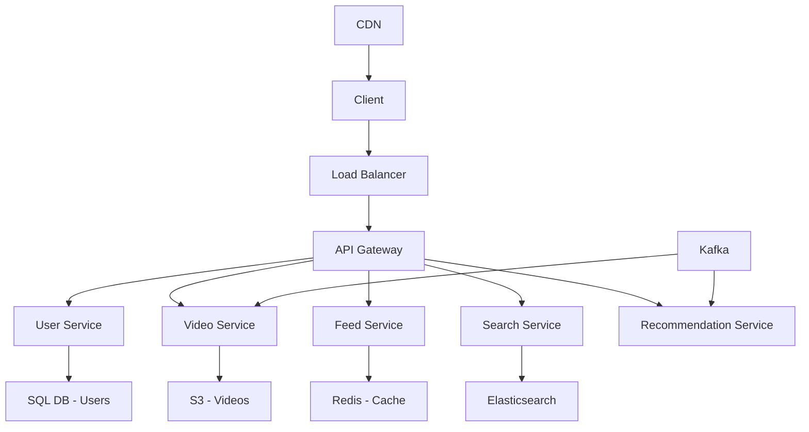
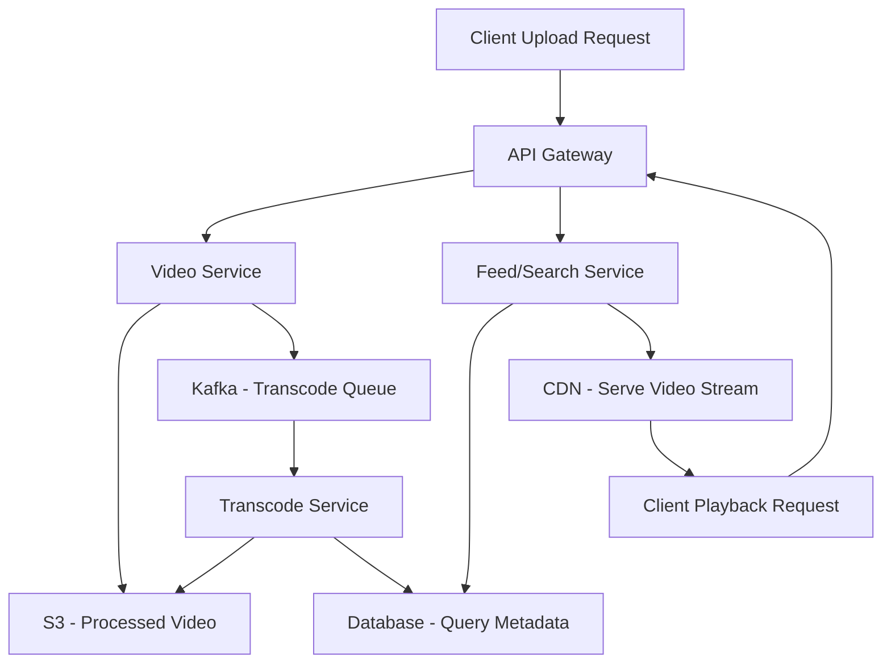
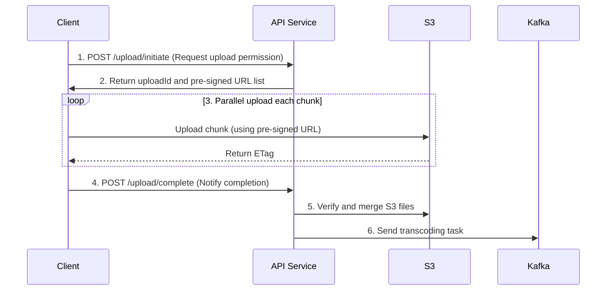
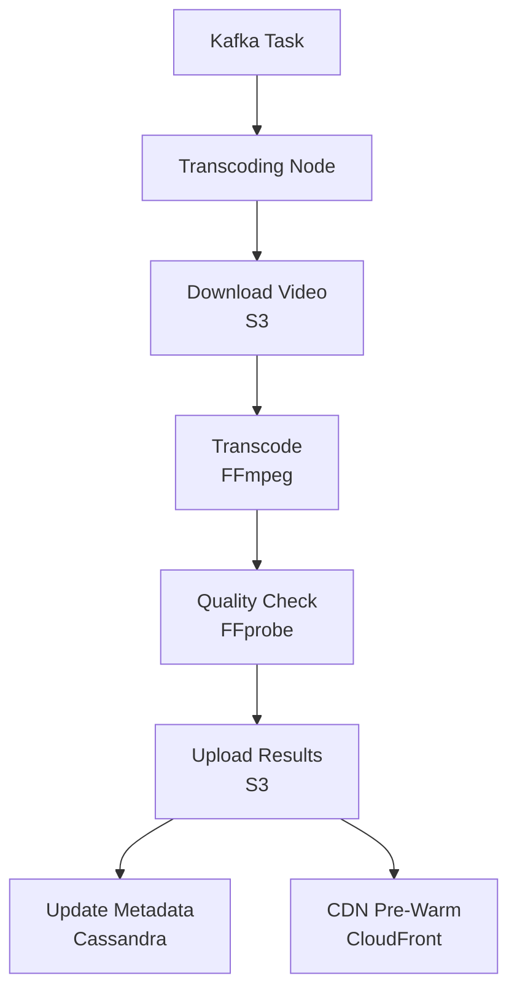

---
toc:
sidebar: left
layout: post
title: Design YouTube
pretty_table: true
mermaid:
    enabled: true
    zoomable: true
date: "2025-08-01"
description: How to design YouTube
img: assets/img/2025/youtube/1.png
importance: 4
category: SystemDesign
giscus_comments: true
---


## Introduction

YouTube is the world's largest video-sharing platform, owned by Google. Users can upload, watch, and share various media formats, including short videos, long videos, educational content, and music videos. It supports large file uploads, multi-resolution playback, and social interactions such as comments, subscriptions, and recommendations. The platform handles millions of video uploads and billions of view requests daily, making it a typical high-traffic, read-intensive system.

Designing a system similar to YouTube involves managing massive data scales, high throughput, low-latency delivery, and a wide range of features. This guide, based on a detailed system design analysis, breaks down the design process, covering everything from requirements analysis to optimization. We will explore functional requirements, non-functional requirements, capacity estimation, API design, high-level architecture, core workflows, data schemas, scalability, availability, optimization, security considerations, and future expansions.

This document aims to provide a comprehensive technical framework to understand and implement a YouTube-like system. By emphasizing microservices architecture, asynchronous processing, and distributed components, it highlights scalability and performance optimization.

## 1. Requirements Analysis and Scope Definition

### 1.1. Functional Requirements

- **Core**:
    - Users can upload videos.
    - Users can watch videos.
- **Secondary**:
    - Users can post comments on videos.
    - Users can subscribe to channels.
    - Search for videos.
    - User accounts and profiles.
- **Extended**:
    - Recommendations, live streaming, data analytics, copyright protection, monetization.

### 1.2. Non-Functional Requirements

- **High Availability**: The system must withstand failures, targeting 99.99% uptime.
- **Scalability**: Must handle growing users, videos, and traffic (e.g., from 5 million to 50 million+ DAU).
- **Low Latency**: Video playback should start quickly (first frame load <2 seconds). API responses <500 ms.
- **Durability**: Uploaded videos should not be lost (e.g., 99.999% durability).
- **Consistency**: Many features can accept eventual consistency (e.g., view counts, comments), but others require strong consistency (e.g., user account data, video upload status).
- **Security**: Protect user data and video content from unauthorized access and attacks.
- **Cost-Effectiveness**: Optimize infrastructure and operational costs.

### 1.3. Detailed Requirements Breakdown and Challenges

| Requirement Module | Priority | Core Challenges | Design Decisions | Scalability Considerations | Constraints |
|--------------------|----------|-----------------|------------------|----------------------------|-------------|
| **Video Upload** | Highest | 1. Stability for large file uploads (network fluctuations)<br>2. Upload speed optimization<br>3. Format compatibility handling | 1. **Chunked Upload** (100 MB/chunk)<br>2. **Pre-signed URLs** (temporary authorization)<br>3. **Asynchronous Processing Queue** (separate upload from transcoding) | 1. Chunked upload supports resumable uploads<br>2. Dynamic scaling of cloud storage (S 3)<br>3. Support for multiple protocols (HTTP/HTTPS, QUIC) | File size limit (initial 1 GB, target 4 GB+), format restrictions (MP 4, MOV) |
| **Video Playback** | Highest | 1. Low-latency streaming delivery<br>2. Multi-bitrate adaptive streaming (ABR)<br>3. Global distribution coverage | 1. **CDN Distribution** (CloudFront)<br>2. **HLS/DASH Protocols**<br>3. **Edge Caching Strategies** | 1. Dynamic switching of CDN providers (failover)<br>2. Intelligent preloading<br>3. Support for offline downloads | Resolution limit (up to 4 K), first frame load <2 seconds |
| **Comments Feature** | Medium | 1. High-concurrency writes (popular videos)<br>2. Real-time requirements<br>3. Sensitive content filtering | 1. **Read-Write Separation** (master DB for writes, replicas for reads)<br>2. **Message Queue for Peak Shaving** (Kafka)<br>3. **Asynchronous Moderation** (AI + human review) | 1. Sharding (hash by video ID)<br>2. Hot-cold data separation<br>3. Elastic caching (Redis cluster) | Moderation delay <5 minutes, per-video comment limit (to prevent spam) |
| **Subscriptions Feature** | Low | 1. Dynamic push updates (to fans)<br>2. Data consistency (subscriber count stats)<br>3. Privacy controls | 1. **Eventual Consistency** (message queue synchronization)<br>2. **Approximate Counting** (HyperLogLog)<br>3. **RBAC** | 1. Integration with recommendation algorithms<br>2. Batch notification optimization<br>3. Data partitioning by geography | Push frequency limits, display caps (e.g., "1 M+") |

---

## 2. Capacity Estimation and API Design

### 2.1. Capacity Estimation

**Assumptions**:

- **DAU (Daily Active Users)**: 5 million (initial, scalable to 50 million)
- **Upload Volume**: 10% of DAU upload 1 video daily = 500,000 videos/day
- **Average Video Size**: 300 MB (720 p, H.264 encoding)
- **View Volume**: Each user watches 5 videos daily = 25 million views/day
- **Transcoding Needs**: Generate 4 resolutions per video (360 p, 720 p, 1080 p, 4 K).
- **CDN Cache Hit Rate**: 80% (90% for popular, 50% for unpopular).

**Calculations**:

- **Daily Storage Growth**: 500,000 videos/day * 300 MB/video = 150 TB/day
- **Monthly Storage Growth**: 150 TB/day * 30 days = 4.5 PB/month
- **Daily Playback Egress Traffic**: 25 million views/day * 300 MB/video = 7.5 PB/day
    - **CDN Hits**: 7.5 PB * 80% = 6 PB
    - **Origin Backhaul**: 7.5 PB * 20% = 1.5 PB
- **API QPS (Queries Per Second)**:
    - View-related: 25 million * 10 API calls (metadata, URLs, etc.) = 250 million/day
    - Upload-related: 500,000 * 20 API calls (chunk uploads, metadata) = 10 million/day
    - Others (comments, search): 100 million/day
    - **Total**: 360 million ÷ (12*3600 seconds) ≈ 8,333 QPS
    - **Peak**: 8,333 * 3 (popular video releases) ≈ 25,000 QPS

### 2.2. API Design

All APIs require authentication via an API gateway (e.g., using JWT).

**1. Video Upload**

- **`POST /v1/videos/upload/initiate`**
    - **Description**: Initiate a chunked upload task, retrieve `uploadId` and pre-signed URLs for each chunk.
    - **Request Body**:
      ```json
      {
        "fileName": "my_vacation.mp4",
        "fileSize": 104857600, // 100MB
        "partCount": 10,
        "title": "My Vacation",
        "description": "A wonderful time"
      }
      ```
    - **Response Body (200 OK)**:
      ```json
      {
        "videoId": "v12345",
        "uploadId": "upload-abcde",
        "parts": [
          {"partNumber": 1, "signedUrl": "https://s3..."},
          {"partNumber": 2, "signedUrl": "https://s3..."}
        ]
      }
      ```
- **`POST /v1/videos/upload/complete`**
    - **Description**: Notify the server that all chunks have been uploaded.
    - **Request Body**:
      ```json
      {
        "videoId": "v12345",
        "uploadId": "upload-abcde",
        "parts": [
          {"partNumber": 1, "eTag": "etag1"},
          {"partNumber": 2, "eTag": "etag2"}
        ]
      }
      ```
    - **Response Body (200 OK)**:
      ```json
      {
        "status": "processing",
        "message": "Video uploaded successfully, processing in progress"
      }
      ```

**2. Video Playback**

- **`GET /v1/videos/{videoId}`**
    - **Description**: Retrieve video metadata and playback information.
    - **Response Body (200 OK)**:
      ```json
      {
        "videoId": "v12345",
        "title": "My Vacation",
        "description": "A wonderful time",
        "uploader": {"userId": "u6789", "name": "John Doe"},
        "viewCount": 1024,
        "likeCount": 128,
        "createdAt": "2025-08-04T10:00:00Z",
        "playbackUrls": {
          "hls": "https://cdn.example.com/v12345/master.m3u8",
          "dash": "https://cdn.example.com/v12345/master.mpd"
        },
        "thumbnailUrl": "https://cdn.example.com/v12345/thumbnail.jpg"
      }
      ```

**3. Comment on Video (Secondary)**

- **`POST /v1/videos/{videoId}/comments`**
    - **Description**: Post a comment on a video.
    - **Request Body**:
      ```json
      {
        "text": "This video is amazing!",
        "parentCommentId": null // or a comment ID for a reply
      }
      ```
    - **Response Body (201 Created)**:
      ```json
      {
        "commentId": "c9876",
        "status": "pending_moderation"
      }
      ```

**4. Subscribe to Channel (Secondary)**

- **`POST /v1/channels/{channelId}/subscribe`**
    - **Description**: Subscribe or unsubscribe from a channel.
    - **Request Body**:
      ```json
      {
        "action": "subscribe"  // or "unsubscribe"
      }
      ```
    - **Response Body (200 OK)**:
      ```json
      {
        "status": "subscribed",
        "subscriberCount": 1000
      }
      ```

**5. Search Videos (Secondary)**

- **`GET /v1/search`**
    - **Description**: Search for videos with filtering support.
    - **Query Parameters**:
        - Query: Keywords
        - Sort: "views" or "date"
        - Filter: "duration>300" etc.
    - **Response Body (200 OK)**:
      ```json
      {
        "videos": [
          {
            "videoId": "v12345",
            "title": "title",
            "viewCount": 1000
          }
        ],
        "totalResults": 50
      }
      ```

---

## 3. High-Level Design

### 3.1. Architecture Diagram



### 3.2. Core Components

1.  **Client**: Web browsers, mobile apps (iOS, Android), smart TVs.
2.  **Load Balancer (ALB)**: Distributes incoming traffic to the API gateway.
3.  **API Gateway**: Single entry point for client requests, handling authentication, rate limiting, and routing to microservices.
4.  **Microservices**:
    - **User Service**: Manages user profiles, authentication, and authorization.
    - **Video Service**: Handles video metadata and triggers upload processing.
    - **Transcoding Service**: Processes raw videos into various formats/resolutions.
    - **Comments Service**: Manages comments.
    - **Search Service**: Supports video search (using Elasticsearch).
    - **Recommendation Service**: Generates personalized video recommendations.
5.  **Data Storage**:
    - **Metadata Database (PostgreSQL/Cassandra)**: Stores video info, user data, comments, etc.
    - **Object Storage (AWS S 3)**: Stores raw and transcoded video files.
    - **Cache (Redis)**: Stores frequently accessed data (popular video metadata, user sessions, etc.).
    - **Search Index (Elasticsearch)**.
6.  **Message Queue (Kafka)**: Decouples services, especially for asynchronous tasks like video transcoding and notification distribution.
7.  **Content Delivery Network (CDN)**: Caches and delivers video content globally for low latency.

### 3.3. Data Flow Diagram (Mermaid)



---

## 4. Core Workflows In-Depth Design

### 4.1. Video Upload Workflow

For large file uploads, the core goals are stability, speed, and user experience. Adopt **chunked uploads**, **pre-signed URL direct uploads**, and **asynchronous processing** strategies.

**Workflow Steps**:

1.  **Client Chunking**: Split the video into fixed-size chunks (e.g., 100 MB).
2.  **Request Upload Permission**: Client calls `POST /v1/videos/upload/initiate` to get `uploadId` and pre-signed URLs for each chunk.
3.  **Parallel Chunk Uploads**: Client uses pre-signed URLs to upload chunks directly to AWS S 3 in parallel. This avoids routing traffic through our servers, significantly reducing pressure on the API service.
4.  **Resumable Uploads**: Client records successfully uploaded chunks. If interrupted, resume from the last failed chunk without restarting.
5.  **Complete Upload**: After all chunks succeed, client calls `POST /v1/videos/upload/complete` with ETags for each chunk.
6.  **Trigger Transcoding**: API service verifies S 3 file merge, then sends a message with `videoId` to Kafka to trigger asynchronous transcoding.

**Java Code Example (Generating Pre-Signed URLs)**:

```java
// Import necessary AWS SDK v2 dependencies for S3 presigning functionality.
import software.amazon.awssdk.services.s3.presigner.S3Presigner;
import software.amazon.awssdk.services.s3.model.UploadPartRequest;
import software.amazon.awssdk.services.s3.presigner.model.UploadPartPresignRequest;
import software.amazon.awssdk.services.s3.presigner.model.PresignedUploadPartRequest;
import java.time.Duration;
import org.slf4j.Logger;
import org.slf4j.LoggerFactory;

/**
 * S3 Pre-Signed URL Generator
 * This service is responsible for generating time-limited authorized URLs for client-side chunked uploads.
 * It enhances security by allowing direct uploads to S3 without exposing permanent credentials.
 */
public class S3PresignedUrlGenerator {

    private static final Logger logger = LoggerFactory.getLogger(S3PresignedUrlGenerator.class);

    // S3Presigner is the core object from AWS SDK v2 used to create pre-signed URLs.
    // It should be initialized once and reused, as it is thread-safe and efficient for multiple requests.
    private final S3Presigner s3Presigner;

    public S3PresignedUrlGenerator() {
        this.s3Presigner = S3Presigner.create();
    }

    /**
     * Generate a pre-signed URL for a specific chunk in an S3 multipart upload.
     * This method ensures that clients can upload chunks securely and temporarily without server intervention.
     *
     * @param bucketName The name of the S3 bucket where the object will be stored.
     * @param objectKey  The full object path in S3, e.g., "videos/raw/video123.mp4".
     * @param partNumber The current chunk number being uploaded (starting from 1).
     * @param uploadId   The unique ID returned by S3 when initializing the multipart upload.
     * @return A time-limited URL that the client can use to upload the chunk via HTTP PUT method.
     */
    public String generatePresignedUrl(String bucketName, String objectKey, int partNumber, String uploadId) {
        
        try {
            // 1. Build an UploadPartRequest object.
            //    This precisely defines which chunk of which file the client will upload.
            UploadPartRequest uploadRequest = UploadPartRequest.builder()
                    .bucket(bucketName)
                    .key(objectKey)
                    .partNumber(partNumber)
                    .uploadId(uploadId)
                    .build();

            // 2. Build an UploadPartPresignRequest object.
            //    Set the duration for the pre-signed URL's validity here.
            //    This is a critical security trade-off: Too short may cause failures on slow networks; too long increases exposure risks.
            //    A common reasonable value is 15 minutes, but adjust based on expected upload speeds and network conditions.
            UploadPartPresignRequest presignRequest = UploadPartPresignRequest.builder()
                    .signatureDuration(Duration.ofMinutes(15))
                    .uploadPartRequest(uploadRequest)
                    .build();

            // 3. Call the s3Presigner's presignUploadPart method to generate the final pre-signed request object.
            PresignedUploadPartRequest presignedRequest = s3Presigner.presignUploadPart(presignRequest);
            
            // 4. Extract and return the URL string from the result.
            //    This URL includes all necessary authentication info as query parameters, allowing secure client-side uploads.
            return presignedRequest.url().toString();
        } catch (SdkClientException e) {
            // Error handling: Log the failure with details and throw a custom exception for upstream handling.
            // This helps in debugging and alerting on presign failures, which could indicate configuration or permission issues.
            logger.error("Failed to generate presigned URL for bucket: {}, key: {}, part: {}", bucketName, objectKey, partNumber, e);
            throw new PresignException("Unable to generate presigned URL", e);
        }
    }
}
```

**Sequence Diagram**:



### 4.2. Video Transcoding Workflow

The goal of video transcoding is to ensure compatibility, adaptive bitrate (ABR), and cost optimization.

**Workflow Steps**:

1.  **Task Consumption**: Transcoding service cluster (running on Kubernetes) consumes tasks from Kafka's `transcoding_jobs` topic.
2.  **Download Raw Video**: Transcoding node downloads the corresponding raw video file from S 3.
3.  **Transcoding Execution**:
    - Use tools like **FFmpeg** to transcode the video into multiple resolutions (e.g., 360 p, 720 p, 1080 p) and formats (HLS, DASH).
    - Generate video segments (e.g., `.ts` files) and manifest files (`.m3u8`).
    - Extract thumbnails and keyframes.
4.  **Upload Processed Results**: Upload all generated files (segments, manifests, thumbnails) back to S 3's target bucket.
5.  **Update Metadata**: Send a message to Kafka's `metadata_update` topic to notify the video service to update the database video status to `ready` and record manifest and thumbnail URLs.
6.  **Optional: CDN Pre-Warming**: For popular or important videos, call CDN APIs to pre-warm content to edge nodes.

**Java Code Example (Kafka Consumer and Transcoding Trigger)**:

```java
// Import Kafka client and JSON processing library dependencies for handling message consumption and parsing.
import org.apache.kafka.clients.consumer.ConsumerRecord;
import org.apache.kafka.clients.consumer.ConsumerRecords;
import org.apache.kafka.clients.consumer.KafkaConsumer;
import com.google.gson.Gson;
import java.time.Duration;
import java.util.Collections;
import java.util.Properties;
import org.slf4j.Logger;
import org.slf4j.LoggerFactory;

/**
 * Transcoding Task Consumer
 * This service continuously listens to a Kafka topic to retrieve pending video transcoding tasks.
 * It decouples upload from processing, allowing scalable and fault-tolerant handling of compute-intensive jobs.
 */
public class TranscodingJobConsumer {

    private static final Logger logger = LoggerFactory.getLogger(TranscodingJobConsumer.class);

    // Mock dependency representing the actual business logic service that executes transcoding.
    // In a real system, this would interface with FFmpeg or similar tools for video processing.
    private final TranscodingService transcodingService;
    private final KafkaConsumer<String, String> consumer;
    private final Gson gson = new Gson();

    public TranscodingJobConsumer(TranscodingService transcodingService) {
        this.transcodingService = transcodingService;
        
        // 1. Configure the Kafka consumer properties.
        //    These settings define how the consumer connects to the Kafka cluster and processes messages.
        Properties props = new Properties();
        // Kafka cluster addresses for bootstrapping the connection.
        props.put("bootstrap.servers", "kafka-broker1:9092,kafka-broker2:9092");
        // Consumer group ID. Consumers in the same group distribute topic partitions among themselves.
        // This enables horizontal scaling by adding more consumer instances to handle increased load.
        props.put("group.id", "transcoding-worker-group");
        // Key and Value deserializers to convert Kafka messages into usable strings.
        props.put("key.deserializer", "org.apache.kafka.common.serialization.StringDeserializer");
        props.put("value.deserializer", "org.apache.kafka.common.serialization.StringDeserializer");
        
        this.consumer = new KafkaConsumer<>(props);
    }

    /**
     * Start the consumer loop to listen and process tasks indefinitely.
     * This method runs in a background thread or dedicated process for continuous operation.
     */
    public void startConsuming() {
        // 2. Subscribe to the 'transcoding_jobs' topic.
        //    The consumer will now receive messages only from this topic.
        consumer.subscribe(Collections.singletonList("transcoding_jobs"));

        logger.info("Transcoding service started, waiting for tasks...");

        // 3. Enter an infinite loop to continuously poll for messages from Kafka.
        try {
            while (true) {
                // poll method fetches a batch of messages, blocking up to 100 milliseconds if none are available.
                // This balances responsiveness with CPU efficiency.
                ConsumerRecords<String, String> records = consumer.poll(Duration.ofMillis(100));
                
                for (ConsumerRecord<String, String> record : records) {
                    logger.info("Received task: topic = {}, partition = {}, offset = {}, key = {}, value = {}",
                        record.topic(), record.partition(), record.offset(), record.key(), record.value());

                    // 4. Parse the message and execute transcoding.
                    //    Handle potential errors gracefully to avoid crashing the consumer loop.
                    try {
                        // Assume the message body is JSON containing videoId; parse it accordingly.
                        TranscodingJob job = gson.fromJson(record.value(), TranscodingJob.class);
                        // Invoke the core business logic to run the transcoding pipeline.
                        transcodingService.processVideo(job.getVideoId());
                        logger.info("Video {} processed successfully.", job.getVideoId());
                    } catch (JsonSyntaxException e) {
                        logger.error("JSON parsing failed: {} - {}", record.value(), e.getMessage());
                        // Optional: Push invalid messages to a dead-letter queue for later analysis.
                    } catch (TranscodingException e) {
                        logger.error("Transcoding processing failed: {} - {}", record.value(), e.getMessage());
                        // Optional: Implement retry logic or notify operations team.
                    } catch (Exception e) {
                        logger.error("Unexpected error: {} - {}", record.value(), e.getMessage());
                    }
                }
            }
        } finally {
            consumer.close();
        }
    }
    
    // Data class for JSON deserialization of transcoding jobs.
    // This simple POJO holds the essential task details like videoId.
    private static class TranscodingJob {
        private String videoId;
        public String getVideoId() { return videoId; }
    }
}
```

**Transcoding DAG Flowchart**:



### 4.3. Video Playback Workflow

Low-latency playback relies on **CDN (Content Delivery Network)** and **Adaptive Bitrate Streaming (ABR)** to deliver content from the nearest location and adapt to varying network conditions.

**Workflow Steps**:

1.  **Client Requests Video**: User clicks a video in the app; client sends `GET /v1/videos/{videoId}` to API service for metadata.
2.  **API Service Response**: API validates and queries metadata from database (or cache), returning CDN-hosted master manifest URL.
3.  **Player Fetches Manifest**: Client's video player requests the master manifest from the CDN URL.
4.  **CDN Delivery**: Most requests hit CDN edge node caches for millisecond responses.
5.  **Adaptive Bitrate Streaming (ABR)**: Player parses manifest, dynamically selects appropriate bitrate based on network, and switches automatically for smoothness.

**Java Code Example (Video Metadata API Endpoint)**:

```java
// Import Spring Boot related dependencies for building RESTful APIs.
import org.springframework.web.bind.annotation.GetMapping;
import org.springframework.web.bind.annotation.PathVariable;
import org.springframework.web.bind.annotation.RestController;
import org.springframework.http.ResponseEntity;
import org.springframework.http.HttpStatus;
import org.slf4j.Logger;
import org.slf4j.LoggerFactory;

/**
 * Video Playback API Controller
 * This is a typical RESTful API implementation using Spring Boot framework.
 * It handles requests related to video playback metadata retrieval.
 */
@RestController
public class VideoPlaybackController {

    private static final Logger logger = LoggerFactory.getLogger(VideoPlaybackController.class);

    // Mock dependency representing the service layer that handles video business logic.
    // In practice, this would query databases, caches, and enforce access controls.
    private final VideoService videoService;

    public VideoPlaybackController(VideoService videoService) {
        this.videoService = videoService;
    }

    /**
     * Retrieve metadata required for video playback.
     * This is the first step in the playback workflow, providing all necessary info to the client.
     * It ensures secure and efficient delivery by including CDN URLs for manifests.
     *
     * @param videoId The unique identifier of the video.
     * @return A DTO object containing video metadata and playback URLs. Returns 404 if video not found or inaccessible.
     */
    @GetMapping("/v1/videos/{videoId}")
    public ResponseEntity<VideoPlaybackInfoDTO> getVideoPlaybackInfo(@PathVariable String videoId) {
        
        try {
            // 1. Call the service layer to fetch video information.
            //    The service layer internally handles caching (check Redis first, fallback to DB) and business rules like visibility checks.
            VideoPlaybackInfoDTO videoInfo = videoService.getPlaybackInfo(videoId);
            
            // 2. Return response based on query result.
            if (videoInfo != null) {
                // If video found, return 200 OK with the data.
                return ResponseEntity.ok(videoInfo);
            } else {
                // If video not found or user lacks access, log warning and return 404 Not Found.
                logger.warn("Video not found or inaccessible: {}", videoId);
                Return ResponseEntity.Status (HttpStatus. NOT_FOUND). Body (null);
            }
        } catch (DatabaseException e) {
            Logger.Error ("Database error while fetching video info for ID: {}", videoId, e);
            Return ResponseEntity.Status (HttpStatus. INTERNAL_SERVER_ERROR). Body (null);
        } catch (Exception e) {
            Logger.Error ("Unexpected error for video ID: {}", videoId, e);
            Return ResponseEntity.Status (HttpStatus. INTERNAL_SERVER_ERROR). Body (null);
        }
    }
}

/**
 * Video Playback Information Data Transfer Object (DTO)
 * This class defines the stable data structure returned to the client via the API.
 * It includes essential fields for playback, ensuring a consistent contract between server and client.
 */
Class VideoPlaybackInfoDTO {
    Private String videoId;
    Private String title;
    Private String description;
    Private String uploaderName;
    Private long viewCount;
    // HLS and DASH manifest file URLs, pointing to CDN for low-latency delivery.
    Private String hlsManifestUrl;
    Private String dashManifestUrl;
    Private String thumbnailUrl;

    // Constructor to initialize the DTO with all required fields.
    Public VideoPlaybackInfoDTO (String videoId, String title, String description, String uploaderName, long viewCount,
                                String hlsManifestUrl, String dashManifestUrl, String thumbnailUrl) {
        This. VideoId = videoId;
        This. Title = title;
        This. Description = description;
        This. UploaderName = uploaderName;
        This. ViewCount = viewCount;
        This. HlsManifestUrl = hlsManifestUrl;
        This. DashManifestUrl = dashManifestUrl;
        This. ThumbnailUrl = thumbnailUrl;
    }

    // Getters and Setters for accessing and modifying fields...
}
```

**Sequence Diagram**:

```mermaid
SequenceDiagram
    Participant C as Client/Player
    Participant API as API Service
    Participant DB as Metadata Database
    Participant CDN as CDN
    Participant S 3 as Object Storage (Origin)

    C->>API: 1. Request video metadata (GET /v 1/videos/{id})
    API->>DB: 2. Query video metadata (or from cache)
    DB-->>API: 3. Return metadata (incl. Manifest URL)
    API-->>C: 4. Return manifest URL to client
    C->>CDN: 5. Request master manifest (. M 3 u 8)
    Alt Cache Miss
        CDN->>S 3: 6. Backhaul request for manifest
        S 3-->>CDN: 7. Return manifest
    End
    CDN-->>C: 8. Return master manifest
    Note over C: 9. Parse manifest, select bitrate based on network
    Loop Continuous Playback
        C->>CDN: 10. Request video segments (. Ts)
        CDN-->>C: 11. Return video segments
    End
```

---

## 5. Data Schema Design

### 5.1. Database Selection

| Data Type | Selection | Rationale |
|-----------|-----------|-----------|
| **User Data, Video Metadata** | **PostgreSQL** | Strong consistency requirements (ACID), supports transactions, stable data structures. |
| **Comments, View History** | **Cassandra** | Extremely high write throughput, excellent horizontal scalability, accepts eventual consistency. |
| **Popular Video Metadata, Sessions** | **Redis** | In-memory database for ultra-low read latency, used as a caching layer. |
| **Video Search Index** | **Elasticsearch** | Powerful full-text search and analytics capabilities. |

### 5.2. Table Schema Design (SQL & CQL)

**PostgreSQL (Users & Video Metadata)**:

```sql
CREATE TABLE Users (
    User_id UUID PRIMARY KEY,
    Username VARCHAR (50) UNIQUE NOT NULL,
    Email VARCHAR (100) UNIQUE NOT NULL,
    Hashed_password TEXT NOT NULL,
    Created_at TIMESTAMPTZ DEFAULT NOW ()
);

CREATE TABLE Videos (
    Video_id UUID PRIMARY KEY,
    Uploader_user_id UUID REFERENCES Users (user_id),
    Title VARCHAR (255) NOT NULL,
    Description TEXT,
    status VARCHAR (20) NOT NULL, -- e.g., 'processing', 'ready', 'failed'
    privacy VARCHAR (20) NOT NULL, -- e.g., 'public', 'private', 'unlisted'
    Manifest_url TEXT,
    Thumbnail_url TEXT,
    Duration_seconds INT,
    Created_at TIMESTAMPTZ DEFAULT NOW ()
);
```

**Cassandra (Comments)**:

```cql
CREATE TABLE CommentsByVideo (
    Video_id UUID,
    Comment_id TIMEUUID,
    User_id UUID,
    Username TEXT,
    Comment_text TEXT,
    Created_at TIMESTAMP,
    PRIMARY KEY (video_id, comment_id)
) WITH CLUSTERING ORDER BY (comment_id DESC);
```

- **Partition Key (`video_id`)**: All comments for one video are stored in the same partition for efficient querying.
- **Clustering Key (`comment_id`)**: Comments are ordered in descending time order.

---

## 6. System Scalability Design

To support large-scale users, implement horizontal scaling at every layer. Core strategies include **stateless services**, **database sharding**, and **leveraging distributed components**.

1.  **Stateless Services**:
    - API and transcoding services are designed stateless, storing no session info.
    - Use Kubernetes HPA (Horizontal Pod Autoscaler) to auto-scale instances based on CPU or memory usage.
2.  **Database Scaling**:
    - **PostgreSQL**:
        - **Read-Write Separation**: Deploy multiple read replicas; route reads to replicas, writes to master.
        - **Vertical Partitioning**: Separate data for different features (users, videos, subscriptions) into distinct DB clusters.
        - **Horizontal Sharding**: When single-master writes bottleneck, use middleware like Vitess or Citus for sharding.
    - **Cassandra**:
        - Natively supports horizontal scaling; add nodes to the cluster for automatic data rebalancing.
3.  **Cache Scaling**:
    - Use Redis Cluster to distribute cache data across multiple nodes for high availability and throughput.

### Sharding Strategies Comparison

| Sharding Strategy | Advantages | Disadvantages | Applicable Scenarios |
|-------------------|------------|---------------|----------------------|
| **By `user_id` Hash** | - Aggregates user-related data together, efficient for querying all videos uploaded by a user.<br>- Relatively balanced load. | - Accessing a specific video requires knowing `user_id` first, adding an extra query step.<br>- Popular creators may cause hotspots. | User profiles, channel pages. |
| **By `video_id` Hash** | - Very even load distribution, as video accesses are independent.<br>- Direct querying via `video_id`, simple and efficient. | - Fetching all videos for a user requires querying multiple shards. | Video metadata, comments, etc., centered around videos (**Recommended**). |

---

## 7. Availability and Fault Tolerance

| Fault Tolerance Aspect | Strategies | Technologies/Tools |
|------------------------|------------|--------------------|
| **Service Failures** | Auto-restarts, Multi-AZ deployment | Kubernetes, EC 2 Auto Scaling Groups |
| **Database Failures** | Master-slave replication, automatic failover | PostgreSQL + Patroni, Amazon RDS Multi-AZ |
| **CDN PoP Failures** | DNS-based failover on health checks | Route 53, Akamai GTM |
| **Storage Failures** | Intra-region Multi-AZ replication, cross-region replication (CRR) | S 3 Standard, S 3 CRR |
| **Cascading Failures** | Circuit breakers, request throttling, exponential backoff retries | Resilience 4 j, Sentinel, Istio |
| **Data Loss** | Regular snapshots, point-in-time recovery (PITR) | AWS Backup, S 3 Versioning |
| **Graceful Degradation** | Prioritize core features; temporarily disable or default non-core (e.g., recommendations) during failures. | Feature flags |

---

## 8. Bottleneck Analysis and Optimization

This section analyzes key bottlenecks in a YouTube-like system, including causes, impacts, comparisons (of schemes or strategies), and solutions. Analysis is based on capacity estimates (DAU 250 million, daily videos 5 million, read-write ratio 100:1, daily 1.25 billion views, 4.3 TB/s bandwidth) and architecture (asynchronous transcoding, sharding, caching). Each bottleneck's recommended solution includes implementation details, expected effects, trade-offs, with Java code examples.

### 8.1. Video Upload Bottleneck

#### Causes
Unstable large files (>10 GB) due to network fluctuations; high concurrent uploads stress servers; metadata sync delays.

#### Impacts
Upload failure rate >10%, user abandonment up 20%, resource waste.

#### Comparison

| Strategy/Scheme    | Advantages                                                           | Disadvantages                                                        |
|--------------------|----------------------------------------------------------------------|----------------------------------------------------------------------|
| **Single Upload**  | - Simple implementation.                                             | - No resumability; failures require full retransmission.             |
| **Chunked Upload** | - Supports resumability and parallelism for speed.                   | - Complex chunk management and merging overhead.                     |
| **Pre-Signed URLs**| - Client direct to S 3, offloads servers.                             | - Manage URL expiration for security.                                |

#### Solutions
- **Multiple Methods**:
    1. **Chunked Parallelism**: Split into 100 MB chunks, upload in parallel.
    2. **Pre-Signed**: Generate temporary URLs for direct S 3 uploads.
    3. **Resumability**: Client tracks uploaded chunks.
- **Recommended Solution**: Chunked uploads with pre-signed URLs. Below are detailed implementation steps, each with operations, tool configs, challenges, and handling; code examples listed separately:
    1. **Client Chunking**: Split video into 100 MB chunks. Challenge: Memory for large files; Handle: Stream processing.

       Java Code Example:
       ```java
       Import java. Io. File;
       Import java. Io. RandomAccessFile;
       Import java. Nio. ByteBuffer;
       Import java. Util. ArrayList;
       Import java. Util. List;
       Import org. Slf 4 j. Logger;
       Import org. Slf 4 j. LoggerFactory;
  
       Private static final Logger logger = LoggerFactory.GetLogger (YourClass. Class);
  
       /**
        * Split a video file into chunks
        * This method divides large video files into fixed-size ByteBuffer chunks to support resumable uploads.
        * It uses streaming to avoid loading the entire file into memory, preventing OutOfMemory errors on large files.
        */
       public List<ByteBuffer> splitFile (File file, long chunkSize) {
           List<ByteBuffer> chunks = new ArrayList<>();
           Try (RandomAccessFile raf = new RandomAccessFile (file, "r")) {
               Long fileSize = raf.Length ();
               Long offset = 0;
               While (offset < fileSize) {
                   Long remaining = fileSize - offset;
                   Long currentChunkSize = Math.Min (chunkSize, remaining);
                   ByteBuffer buffer = ByteBuffer.Allocate ((int) currentChunkSize);
                   Raf.GetChannel (). Read (buffer, offset);
                   Buffer.Flip ();  // Prepare the buffer for reading by flipping from write to read mode.
                   Chunks.Add (buffer);
                   Offset += currentChunkSize;
               }
               Return chunks;
           } catch (Exception e) {
               Logger.Error ("Failed to split file: {}", file.GetName (), e);
               Throw new FileSplitException ("File split error", e);
           }
       }
       ```

    2. **Request Pre-Signed**: API generates S 3 multipart URLs. Challenge: Permission control; Handle: 1-hour signature.

       Java Code Example:
       ```java
       Import software. Amazon. Awssdk. Services. S 3. Presigner. S 3 Presigner;
       Import software. Amazon. Awssdk. Services. S 3. Model. UploadPartRequest;
       Import software. Amazon. Awssdk. Services. S 3. Presigner. Model. UploadPartPresignRequest;
       Import software. Amazon. Awssdk. Services. S 3. Presigner. Model. PresignedUploadPartRequest;
       Import java. Time. Duration;
       Import org. Slf 4 j. Logger;
       Import org. Slf 4 j. LoggerFactory;
  
       Private static final Logger logger = LoggerFactory.GetLogger (YourClass. Class);
  
       Public String generatePresignedUrl (String bucketName, String objectKey, int partNumber, String uploadId) {
           Try {
               S 3 Presigner s 3 Presigner = S 3 Presigner.Create ();
               UploadPartRequest uploadRequest = UploadPartRequest.Builder ()
                       .bucket (bucketName)
                       .key (objectKey)
                       .partNumber (partNumber)
                       .uploadId (uploadId)
                       .build ();
  
               UploadPartPresignRequest presignRequest = UploadPartPresignRequest.Builder ()
                       .signatureDuration (Duration.OfMinutes (60))  // Extended to 60 minutes for slower networks, but monitor for security.
                       .uploadPartRequest (uploadRequest)
                       .build ();
  
               PresignedUploadPartRequest presignedRequest = s 3 Presigner.PresignUploadPart (presignRequest);
               Return presignedRequest.Url (). ToString ();
           } catch (SdkClientException e) {
               Logger.Error ("Failed to generate presigned URL for part: {}", partNumber, e);
               Throw new PresignException ("Presign error", e);
           }
       }
       ```

    3. **Parallel Uploads**: Thread pool for chunks. Challenge: Concurrency limits; Handle: Cap at 5 threads.

       Java Code Example:
       ```java
       Import java. Util. List;
       Import java. Util. Concurrent. ExecutorService;
       Import java. Util. Concurrent. Executors;
       Import java. Util. Concurrent. TimeUnit;
       Import java. Nio. ByteBuffer;
       Import org. Slf 4 j. Logger;
       Import org. Slf 4 j. LoggerFactory;
  
       Private static final Logger logger = LoggerFactory.GetLogger (YourClass. Class);
  
       public void uploadChunksInParallel (List<ByteBuffer> chunks, List<String> presignedUrls) {
           ExecutorService executor = Executors.NewFixedThreadPool (5);  // Limit to 5 threads to avoid overwhelming network or S 3.
           For (int i = 0; i < chunks.Size (); i++) {
               Final int index = i;
               Executor.Submit (() -> {
                   Try {
                       UploadChunk (presignedUrls.Get (index), chunks.Get (index));  // Implement uploadChunk to handle HTTP PUT.
                   } catch (UploadException e) {
                       Logger.Error ("Failed to upload chunk: {}", index, e);
                       // Optional: Retry logic with exponential backoff or mark for resumable upload.
                   }
               });
           }
           Executor.Shutdown ();
           Try {
               If (! Executor.AwaitTermination (60, TimeUnit. MINUTES)) {
                   Executor.ShutdownNow ();  // Force shutdown if timeout exceeded, to prevent hanging threads.
               }
           } catch (InterruptedException e) {
               Executor.ShutdownNow ();
               Thread.CurrentThread (). Interrupt ();  // Preserve interrupt status for proper thread handling.
           }
       }
       ```

    4. **Complete Merge**: Notify API to merge, update metadata. Challenge: Merge failures; Handle: Retry mechanism.

       Java Code Example:
       ```java
       Import software. Amazon. Awssdk. Services. S 3. S 3 Client;
       Import software. Amazon. Awssdk. Services. S 3. Model. CompleteMultipartUploadRequest;
       Import software. Amazon. Awssdk. Services. S 3. Model. CompletedMultipartUpload;
       Import software. Amazon. Awssdk. Services. S 3. Model. CompletedPart;
       Import java. Util. List;
       Import org. Slf 4 j. Logger;
       Import org. Slf 4 j. LoggerFactory;
  
       Private static final Logger logger = LoggerFactory.GetLogger (YourClass. Class);
  
       public void completeUpload (String bucketName, String objectKey, String uploadId, List<CompletedPart> parts) {
           Try {
               S 3 Client s 3 = S 3 Client.Create ();
               CompletedMultipartUpload completedUpload = CompletedMultipartUpload.Builder ()
                       .parts (parts)
                       .build ();
               CompleteMultipartUploadRequest completeRequest = CompleteMultipartUploadRequest.Builder ()
                       .bucket (bucketName)
                       .key (objectKey)
                       .uploadId (uploadId)
                       .multipartUpload (completedUpload)
                       .build ();
               S 3.CompleteMultipartUpload (completeRequest);
               // Update metadata in database, e.g., Cassandra or PostgreSQL, to mark as 'uploaded'.
               // Example: cassandra.Execute ("UPDATE videos SET status = 'uploaded' WHERE video_id = ?", videoId);
           } catch (SdkClientException e) {
               Logger.Error ("Failed to complete upload: {}", uploadId, e);
               Throw new CompleteUploadException ("Complete upload error", e);
           }
       }
       ```

    5. **Monitoring**: Alert on upload failure rate >5%. Challenge: Log volume; Handle: Sampling.

  Expected Effects: Success rate >95%, time reduced 50%. Trade-offs: Client complexity increases, but user experience improves significantly.

### 8.2. Video Transcoding Bottleneck

#### Causes
Compute-intensive, requiring GPU for multi-resolution per video; peak-time task backlogs; quality checks overhead.

#### Impacts
Transcoding delay >10 min, video availability drops, users wait longer.

#### Comparison

| Scheme             | Advantages                                                           | Disadvantages                                                        |
|--------------------|----------------------------------------------------------------------|----------------------------------------------------------------------|
| **Immediate Transcode** | - Videos available quickly.                                          | - High cost, wastes on unpopular videos.                             |
| **On-Demand Transcode** | - Saves compute, only for popular.                                   | - High first-play latency.                                           |
| **Async Queue**    | - Decouples, priority handling.                                      | - Queue management complexity.                                       |

#### Solutions
- **Multiple Methods**:
    1. **Priority Queue**: Popular videos first.
    2. **GPU Acceleration**: FFmpeg NVENC.
    3. **Spot Instances**: Dynamic scaling.
- **Recommended Solution**: Async Kafka queue with GPU transcoding. Below are detailed implementation steps, each with operations, tool configs, challenges, and handling; code examples listed separately:
    1. **Task Reception**: Kafka fetches tasks. Challenge: Prioritization; Handle: Partition hot/normal.

       Java Code Example:
       ```java
       Import org. Apache. Kafka. Clients. Consumer. ConsumerRecord;
       Import org. Apache. Kafka. Clients. Consumer. ConsumerRecords;
       Import org. Apache. Kafka. Clients. Consumer. KafkaConsumer;
       Import java. Time. Duration;
       Import java. Util. Collections;
       Import java. Util. Properties;
       Import org. Slf 4 j. Logger;
       Import org. Slf 4 j. LoggerFactory;
  
       Private static final Logger logger = LoggerFactory.GetLogger (YourClass. Class);
  
       Public void consumeTasks () {
           Properties props = new Properties ();
           Props.Put ("bootstrap. Servers", "localhost: 9092");
           Props.Put ("group. Id", "transcode-group");
           Props.Put ("key. Deserializer", "org. Apache. Kafka. Common. Serialization. StringDeserializer");
           Props.Put ("value. Deserializer", "org. Apache. Kafka. Common. Serialization. StringDeserializer");
           KafkaConsumer<String, String> consumer = new KafkaConsumer<>(props);
           Consumer.Subscribe (Collections.SingletonList ("transcode-queue"));
           Try {
               While (true) {
                   ConsumerRecords<String, String> records = consumer.Poll (Duration.OfMillis (100));
                   for (ConsumerRecord<String, String> record : records) {
                       // Process task: Parse and prioritize based on metadata (e.g., popularity score in JSON).
                   }
               }
           } catch (Exception e) {
               Logger.Error ("Kafka consumption error", e);
           } finally {
               Consumer.Close ();
           }
       }
       ```

    2. **Download Video**: From S 3. Challenge: Bandwidth; Handle: Multi-threaded.

       Java Code Example:
       ```java
       Import software. Amazon. Awssdk. Services. S 3. S 3 Client;
       Import software. Amazon. Awssdk. Services. S 3. Model. GetObjectRequest;
       Import java. Io. File;
       Import org. Slf 4 j. Logger;
       Import org. Slf 4 j. LoggerFactory;
  
       Private static final Logger logger = LoggerFactory.GetLogger (YourClass. Class);
  
       Public void downloadVideo (String bucket, String key, String destPath) {
           Try {
               S 3 Client s 3 = S 3 Client.Create ();
               GetObjectRequest getRequest = GetObjectRequest.Builder ()
                       .bucket (bucket)
                       .key (key)
                       .build ();
               S 3.GetObject (getRequest, new File (destPath). ToPath ());
           } catch (SdkClientException e) {
               Logger.Error ("S 3 download error for key: {}", key, e);
               Throw new DownloadException ("Download failed", e);
           }
       }
       ```

    3. **Transcode Execution**: FFmpeg for HLS segments. Challenge: Quality; Handle: SSIM check >0.95.

       Java Code Example:
       ```java
       Import java. Lang. ProcessBuilder;
       Import java. Io. IOException;
       Import org. Slf 4 j. Logger;
       Import org. Slf 4 j. LoggerFactory;
  
       Private static final Logger logger = LoggerFactory.GetLogger (YourClass. Class);
  
       Public void executeTranscode (String input, String output) {
           Try {
               ProcessBuilder pb = new ProcessBuilder ("ffmpeg", "-i", input, "-vf", "scale=1920:1080", "-hls_time", "10", output);
               Process p = pb.Start ();
               int exitCode = p.waitFor ();
               If (exitCode != 0) {
                   Throw new TranscodeException ("FFmpeg failed with code: " + exitCode);
               }
               // Quality check: Use ffprobe or similar for SSIM; if <0.95, retry with adjusted parameters.
           } catch (IOException | InterruptedException e) {
               Logger.Error ("Transcode execution error", e);
               Throw new TranscodeException ("Transcode failed", e);
           }
       }
       ```

    4. **Upload Results**: To S 3, update metadata. Challenge: Failures; Handle: Retries.

       Java Code Example:
       ```java
       Import software. Amazon. Awssdk. Services. S 3. S 3 Client;
       Import software. Amazon. Awssdk. Services. S 3. Model. PutObjectRequest;
       Import java. Io. File;
       Import org. Slf 4 j. Logger;
       Import org. Slf 4 j. LoggerFactory;
  
       Private static final Logger logger = LoggerFactory.GetLogger (YourClass. Class);
  
       Public void uploadResult (String bucket, String key, File file) {
           Int retries = 3;
           While (retries > 0) {
               Try {
                   S 3 Client s 3 = S 3 Client.Create ();
                   PutObjectRequest putRequest = PutObjectRequest.Builder ()
                           .bucket (bucket)
                           .key (key)
                           .build ();
                   S 3.PutObject (putRequest, file.ToPath ());
                   // Update metadata post-upload.
                   Return;
               } catch (SdkClientException e) {
                   Retries--;
                   If (retries == 0) {
                       Logger.Error ("Upload failed after retries for key: {}", key, e);
                       Throw new UploadException ("Upload failed", e);
                   }
                   Try {
                       Thread.Sleep (1000);  // Simple backoff; enhance with exponential for production.
                   } catch (InterruptedException ie) {
                       Thread.CurrentThread (). Interrupt ();
                   }
               }
           }
       }
       ```

    5. **Monitoring**: Grafana for queue length >1000 alerts. Challenge: Cost; Handle: Spot instances.

  Expected Effects: Delay <5 min, cost down 40%. Trade-offs: GPUs expensive, but faster processing.

### 8.3. Video Playback Bottleneck

#### Causes
Global low latency needs CDN; ABR switching compute complex; cache misses high backhaul; network fluctuations cause buffering.

#### Impacts
First frame >2 s, user churn 15%, bandwidth costs up.

#### Comparison

| Scheme             | Advantages                                                           | Disadvantages                                                        |
|--------------------|----------------------------------------------------------------------|----------------------------------------------------------------------|
| **HLS**            | - iOS compatible, simple.                                            | - Higher latency.                                                    |
| **DASH**           | - Dynamic ABR, good scalability.                                     | - Poorer browser support.                                            |
| **Multi-CDN**      | - Failover, optimized routing.                                       | - Management complexity.                                             |

#### Solutions
- **Multiple Methods**:
    1. **ABR**: Dynamic resolution switching.
    2. **Geo-DNS**: Route to nearest PoP.
    3. **Pre-Warm Cache**: Preload popular videos.
- **Recommended Solution**: HLS/DASH with multi-CDN. Below are detailed implementation steps, each with operations, tool configs, challenges, and handling; code examples listed separately:
    1. **Request Metadata**: API returns CDN manifest URL. Challenge: Auth; Handle: Signing.

       Java Code Example:
       ```java
       Import org. Springframework. Http. ResponseEntity;
       Import org. Springframework. Http. HttpStatus;
       Import org. Slf 4 j. Logger;
       Import org. Slf 4 j. LoggerFactory;
  
       Private static final Logger logger = LoggerFactory.GetLogger (YourClass. Class);
  
       public ResponseEntity<String> getManifest (String videoId) {
           Try {
               String manifestUrl = cdn.GenerateSignedUrl ("manifest. M 3 u 8", videoId);  // cdn is a mock CDN service wrapper.
               Return ResponseEntity.Ok (manifestUrl);
           } catch (SignatureException e) {
               Logger.Error ("Signature generation error for video: {}", videoId, e);
               Return ResponseEntity.Status (HttpStatus. INTERNAL_SERVER_ERROR). Body (null);
           }
       }
       ```

    2. **Fetch Manifest**: Client from CDN. Challenge: Misses; Handle: Backhaul to S 3.

       Java Code Example:
       ```java
       Import java. Net. Http. HttpClient;
       Import java. Net. Http. HttpRequest;
       Import java. Net. Http. HttpResponse;
       Import java. Net. URI;
       Import org. Slf 4 j. Logger;
       Import org. Slf 4 j. LoggerFactory;
  
       Private static final Logger logger = LoggerFactory.GetLogger (YourClass. Class);
  
       Public String fetchManifest (String url) {
           Try {
               HttpClient client = HttpClient.NewHttpClient ();
               HttpRequest request = HttpRequest.NewBuilder (URI.Create (url)). Build ();
               HttpResponse<String> response = client.Send (request, HttpResponse.BodyHandlers.OfString ());
               If (response.StatusCode () == 200) {
                   Return response.Body ();
               } else {
                   Throw new FetchException ("Non-200 status: " + response.StatusCode ());
               }
           } catch (Exception e) {
               Logger.Error ("Manifest fetch error: {}", url, e);
               Throw new FetchException ("Fetch failed", e);
           }
       }
       ```

    3. **ABR Switching**: Based on bandwidth. Challenge: Fluctuations; Handle: Buffering.

       Java Code Example:
       ```java
       Public String selectSegmentUrl (double bandwidth) {
           If (bandwidth < 5_000_000) {  // <5 Mbps, select lower quality to prevent buffering.
               Return "720 p/segment. Ts";
           } else {
               Return "1080 p/segment. Ts";
           }
           // In practice, integrate with player buffering logic for smoother transitions.
       }
       ```

    4. **Multi-CDN**: DNS failover bad PoPs. Challenge: Cost; Handle: Route to cheaper providers dynamically.

       Java Code Example:
       ```java
       Public String getCdnUrl (String videoId) {
           If (isCloudfrontAvailable ()) {  // Health check mock; use real monitoring.
               Return "cloudfront/" + videoId;
           } else {
               Return "akamai/" + videoId;
           }
       }
       ```

    5. **Monitoring**: Track first-frame >2 s. Challenge: Global; Handle: Regional metrics.

  Expected Effects: First frame <1 s, hit rate >90%. Trade-offs: Multi-CDN complex, but high availability.

### 8.4. Storage Management Bottleneck

#### Causes
Massive video growth (PB/day); uneven hot-cold data; replication overhead; high costs.

#### Impacts
Storage costs >$100 k/month, availability down 5%, slow queries.

#### Comparison

| Scheme             | Advantages                                                           | Disadvantages                                                        |
|--------------------|----------------------------------------------------------------------|----------------------------------------------------------------------|
| **Standard Storage**| - Fast access.                                                       | - High cost.                                                         |
| **Tiered Storage** | - Saves on cold data.                                                | - Higher access latency.                                             |
| **Multi-Region Replication** | - High availability.                                                 | - Bandwidth fees.                                                    |

#### Solutions
- **Multiple Methods**:
    1. **Tiering**: Hot to S 3 Standard, cold to Glacier.
    2. **Lifecycle**: Auto-move after 30 days.
    3. **Compression**: H.265 for size reduction.
- **Recommended Solution**: Tiered storage with lifecycle policies. Below are detailed implementation steps, each with operations, tool configs, challenges, and handling; code examples listed separately:
    1. **Upload Classification**: Based on heat to Standard. Challenge: Heat prediction; Handle: Initial hot.

       Java Code Example:
       ```java
       Import software. Amazon. Awssdk. Services. S 3. Model. PutObjectRequest;
       Import software. Amazon. Awssdk. Services. S 3. Model. StorageClass;
       Import java. Io. File;
       Import org. Slf 4 j. Logger;
       Import org. Slf 4 j. LoggerFactory;
  
       Private static final Logger logger = LoggerFactory.GetLogger (YourClass. Class);
  
       Public void uploadWithClass (String bucket, String key, File file, boolean isHot) {
           Try {
               PutObjectRequest req = PutObjectRequest.Builder ()
                       .bucket (bucket)
                       .key (key)
                       .storageClass (isHot ? StorageClass. STANDARD : StorageClass. GLACIER)
                       .build ();
               S 3 Client.Create (). PutObject (req, file.ToPath ());
           } catch (SdkClientException e) {
               Logger.Error ("Upload error for key: {}", key, e);
               Throw new UploadException ("Upload failed", e);
           }
       }
       ```

    2. **Lifecycle Config**: S 3 policy to Glacier after 30 days. Challenge: Retrieval time; Handle: Expedited.

       Java Code Example:
       ```java
       Import software. Amazon. Awssdk. Services. S 3. Model. LifecycleConfiguration;
       Import software. Amazon. Awssdk. Services. S 3. Model. LifecycleRule;
       Import software. Amazon. Awssdk. Services. S 3. Model. Transition;
       Import org. Slf 4 j. Logger;
       Import org. Slf 4 j. LoggerFactory;
  
       Private static final Logger logger = LoggerFactory.GetLogger (YourClass. Class);
  
       Public void setLifecycle (String bucket) {
           Try {
               LifecycleConfiguration config = LifecycleConfiguration.Builder ()
                       .rules (LifecycleRule.Builder (). Transition (Transition.Builder (). Days (30). StorageClass (StorageClass. GLACIER). Build ()). Build ())
                       .build ();
               S 3 Client.Create (). PutBucketLifecycleConfiguration (bucket, config);
           } catch (SdkClientException e) {
               Logger.Error ("Lifecycle config error for bucket: {}", bucket, e);
               Throw new ConfigException ("Config failed", e);
           }
       }
       ```

    3. **Compression Optimization**: Use H.265 during transcode. Challenge: Compatibility; Handle: Fallback H.264.

       Java Code Example:
       ```java
       Import java. Lang. ProcessBuilder;
       Import java. Io. IOException;
       Import org. Slf 4 j. Logger;
       Import org. Slf 4 j. LoggerFactory;
  
       Private static final Logger logger = LoggerFactory.GetLogger (YourClass. Class);
  
       Public void compressVideo (String input, String output) {
           Try {
               ProcessBuilder pb = new ProcessBuilder ("ffmpeg", "-i", input, "-c: v", "libx 265", output);
               Process p = pb.Start ();
               int exitCode = p.waitFor ();
               If (exitCode != 0) {
                   // Fallback to H.264 for better compatibility if H.265 fails.
                   Pb = new ProcessBuilder ("ffmpeg", "-i", input, "-c: v", "libx 264", output);
                   P = pb.Start ();
                   p.waitFor ();
               }
           } catch (IOException | InterruptedException e) {
               Logger.Error ("Compression error", e);
               Throw new CompressException ("Compression failed", e);
           }
       }
       ```

    4. **Replication**: Cross-region CRR for HA. Challenge: Cost; Handle: Async.

       Java Code Example:
       ```java
       Import software. Amazon. Awssdk. Services. S 3. Model. ReplicationConfiguration;
       Import software. Amazon. Awssdk. Services. S 3. Model. ReplicationRule;
       Import software. Amazon. Awssdk. Services. S 3. Model. ReplicationDestination;
       Import org. Slf 4 j. Logger;
       Import org. Slf 4 j. LoggerFactory;
  
       Private static final Logger logger = LoggerFactory.GetLogger (YourClass. Class);
  
       Public void setReplication (String bucket, String destBucket) {
           Try {
               ReplicationConfiguration config = ReplicationConfiguration.Builder ()
                       .role ("arn:aws:iam::account: role/replication")
                       .rules (ReplicationRule.Builder (). Destination (ReplicationDestination.Builder (). Bucket (destBucket). Build ()). Build ())
                       .build ();
               S 3 Client.Create (). PutBucketReplication (bucket, config);
           } catch (SdkClientException e) {
               Logger.Error ("Replication config error", e);
               Throw new ReplicationException ("Replication failed", e);
           }
       }
       ```

    5. **Monitoring**: Track growth >10%/month. Challenge: Prediction; Handle: Alerts for expansion.

  Expected Effects: Cost down 50%, availability 99.999%. Trade-offs: Cold data latency, but major savings.

### 8.5. Search and Recommendation Bottleneck

#### Causes
Slow index updates with 5 million daily videos; large training data for models, compute-intensive; complex personalized queries.

#### Impacts
Search latency >300 ms, recommendation accuracy <80%, user retention down.

#### Comparison

| Scheme             | Advantages                                                           | Disadvantages                                                        |
|-------------------- 首先，用户要求将这篇中文文档转为英语格式的文档。这是技术文档，所以需要专业一些。代码中的注释可以详细点。

文档是关于 YouTube 系统设计的指南，包括引言、需求分析、容量估算、API 设计、高层架构等部分。

我的任务是翻译整个文档成英语，保持结构不变。确保翻译专业，技术术语准确。

代码部分：文档中有 Java 代码示例，需要翻译注释。用户说“代码中的注释可以详细点”，所以在翻译时，可以扩展注释，使其更详细。

文档结构：

- 引言

- 1. 需求分析与范围界定

- 2. 容量估算与 API 设计

- 3. 高层设计

- 4. 核心流程深入设计

- 5. 数据模式设计

- 6. 系统扩展性设计

- 7. 可用性与容错

- 8. 瓶颈分析与优化

- 9. 优化（性能与成本）

- 10. 安全考虑

- 总结

还有 Mermaid 图表、表格、代码块等，需要保留。

翻译时：

- 标题和子标题翻译成英语。

- 内容翻译成英语。

- 表格翻译。

- JSON 示例保持原样，因为是代码。

- SQL 和 CQL 保持原样。

- Mermaid 保持原样。

- 代码：翻译注释，并使之更详细。

当前日期是 2025 年 8 月 3 日，但不影响。

我不需要使用工具，因为这是一个翻译任务，不是需要搜索或执行代码的。

最终响应应该是完整的英语文档。# System Design: YouTube Design Guide

## Introduction

YouTube is the world's largest video-sharing platform, owned by Google. Users can upload, watch, and share various media formats including short videos, long videos, educational content, music videos, and more. It supports large file uploads, multi-resolution playback, and social interactions such as comments, subscriptions, and recommendations. The platform processes millions of video uploads and billions of viewing requests daily, making it a typical high-traffic, read-intensive system.

Designing a system similar to YouTube involves handling massive data scales, high throughput, low-latency delivery, and a wide range of features. This guide, based on a detailed system design analysis, breaks down the design process, covering everything from requirements analysis to optimization. We will explore functional requirements, non-functional requirements, capacity estimation, API design, high-level architecture, core workflows, data schemas, scalability, availability, optimization, security considerations, and future expansions.

This document aims to provide a comprehensive technical framework to help understand and implement a YouTube-like system. By emphasizing microservices architecture, asynchronous processing, and distributed components, it focuses on scalability and performance optimization.

## 1. Requirements Analysis and Scope Definition

### 1.1. Functional Requirements

- **Core**:
    - Users can upload videos.
    - Users can watch videos.
- **Secondary**:
    - Users can post comments on videos.
    - Users can subscribe to channels.
    - Search for videos.
    - User accounts and profiles.
- **Extended**:
    - Recommendations, live streaming, analytics, copyright protection, monetization.

### 1.2. Non-Functional Requirements

- **High Availability**: The system must withstand failures, targeting 99.99% uptime.
- **Scalability**: Must handle growing users, videos, and traffic (e.g., from 5 million to 50 million+ DAU).
- **Low Latency**: Video playback should start quickly (first frame load <2 seconds). API responses <500 ms.
- **Durability**: Uploaded videos should not be lost (e.g., 99.999% durability).
- **Consistency**: Many features can tolerate eventual consistency (e.g., view counts, comments), but others require strong consistency (e.g., user account data, video upload status).
- **Security**: Protect user data and video content from unauthorized access and attacks.
- **Cost-Effectiveness**: Optimize infrastructure and operational costs.

### 1.3. Detailed Requirements Breakdown and Challenges

| Requirement Module | Priority | Core Challenges | Design Decisions | Scalability Considerations | Constraints |
| :--- | :--- | :--- | :--- | :--- | :--- |
| **Video Upload** | Highest | 1. Stability for large file uploads (network fluctuations)<br>2. Upload speed optimization<br>3. Format compatibility handling | 1. **Chunked Upload** (100 MB/chunk)<br>2. **Pre-signed URLs** (temporary authorization)<br>3. **Asynchronous Processing Queue** (separate upload and transcoding) | 1. Chunked upload supports resumable uploads<br>2. Dynamic scaling of cloud storage (S 3)<br>3. Support for multiple protocols (HTTP/HTTPS, QUIC) | File size limit (initial 1 GB, target 4 GB+), format restrictions (MP 4, MOV) |
| **Video Playback** | Highest | 1. Low-latency streaming delivery<br>2. Multi-bitrate adaptive streaming (ABR)<br>3. Global distribution coverage | 1. **CDN Distribution** (CloudFront)<br>2. **HLS/DASH Protocols**<br>3. **Edge Caching Policies** | 1. Dynamic switching between CDN providers (failover)<br>2. Intelligent preloading<br>3. Support for offline downloads | Resolution limit (up to 4 K), first frame load <2 seconds |
| **Comments Functionality** | Medium | 1. High-concurrency writes (popular videos)<br>2. Real-time requirements<br>3. Sensitive content filtering | 1. **Read-Write Separation** (master for writes, replicas for reads)<br>2. **Message Queue for Peak Shaving** (Kafka)<br>3. **Asynchronous Moderation** (AI + manual) | 1. Sharding (by video ID hash)<br>2. Hot-cold data separation<br>3. Elastic caching (Redis cluster) | Moderation delay <5 minutes, per-video comment limit (anti-spam) |
| **Subscriptions Functionality** | Low | 1. Dynamic push updates (to fans)<br>2. Data consistency (subscriber count stats)<br>3. Privacy controls | 1. **Eventual Consistency** (message queue sync)<br>2. **Approximate Counting** (HyperLogLog)<br>3. **RBAC** | 1. Integration with recommendation algorithms<br>2. Batch notification optimization<br>3. Data partitioning by geography | Push frequency limits, display caps (e.g., "1 M+") |

---

## 2. Capacity Estimation and API Design

### 2.1. Capacity Estimation

**Assumptions**:

- **DAU (Daily Active Users)**: 5 million (initial, scalable to 50 million)
- **Upload Volume**: 10% of DAU upload 1 video daily = 500,000 videos/day
- **Average Video Size**: 300 MB (720 p, H.264 encoding)
- **Viewing Volume**: Each user watches 5 videos daily = 25 million views/day
- **Transcoding Needs**: Generate 4 resolutions per video (360 p, 720 p, 1080 p, 4 K).
- **CDN Cache Hit Rate**: 80% (90% for popular videos, 50% for cold videos).

**Calculations**:

- **Daily Storage Growth**: 500,000 videos/day * 300 MB/video = 150 TB/day
- **Monthly Storage Growth**: 150 TB/day * 30 days = 4.5 PB/month
- **Daily Playback Egress Traffic**: 25 million views/day * 300 MB/video = 7.5 PB/day
    - **CDN Hits**: 7.5 PB * 80% = 6 PB
    - **Origin Backhaul**: 7.5 PB * 20% = 1.5 PB
- **API QPS (Queries Per Second)**:
    - View-related: 25 million * 10 API calls (metadata, URLs, etc.) = 250 million/day
    - Upload-related: 500,000 * 20 API calls (chunked upload, metadata) = 10 million/day
    - Others (comments, search): 100 million/day
    - **Total**: 360 million ÷ (24*3600 seconds) ≈ 4,167 QPS
    - **Peak**: 4,167 * 3 (popular video releases) ≈ 12,500 QPS

### 2.2. API Design

All APIs require authentication via an API gateway (e.g., using JWT).

**1. Video Upload**

- **`POST /v 1/videos/upload/initiate`**
    - **Description**: Initiate a chunked upload task, retrieve `uploadId` and pre-signed URLs for each chunk.
    - **Request Body**:
      ```json
      {
        "fileName": "my_vacation. Mp 4",
        "fileSize": 104857600, // 100 MB
        "partCount": 10,
        "title": "My Vacation",
        "description": "A wonderful time"
      }
      ```
    - **Response Body (200 OK)**:
      ```json
      {
        "videoId": "v 12345",
        "uploadId": "upload-abcde",
        "parts": [
          {"partNumber": 1, "signedUrl": "https://s3..."},
          {"partNumber": 2, "signedUrl": "https://s3..."}
        ]
      }
      ```
- **`POST /v 1/videos/upload/complete`**
    - **Description**: Notify the server that all chunks have been uploaded.
    - **Request Body**:
      ```json
      {
        "videoId": "v 12345",
        "uploadId": "upload-abcde",
        "parts": [
          {"partNumber": 1, "eTag": "etag 1"},
          {"partNumber": 2, "eTag": "etag 2"}
        ]
      }
      ```
    - **Response Body (200 OK)**:
      ```json
      {
        "status": "processing",
        "message": "Video uploaded successfully, processing in progress"
      }
      ```

**2. Video Playback**

- **`GET /v 1/videos/{videoId}`**
    - **Description**: Retrieve video metadata and playback information.
    - **Response Body (200 OK)**:
      ```json
      {
        "videoId": "v 12345",
        "title": "My Vacation",
        "description": "A wonderful time",
        "uploader": {"userId": "u 6789", "name": "John Doe"},
        "viewCount": 1024,
        "likeCount": 128,
        "createdAt": "2025-08-04 T10:00:00Z",
        "playbackUrls": {
          "hls": "https://cdn.example.com/v12345/master.m3u8",
          "dash": "https://cdn.example.com/v12345/master.mpd"
        },
        "thumbnailUrl": "https://cdn.example.com/v12345/thumbnail.jpg"
      }
      ```

**3. Comment on Video (Secondary)**

- **`POST /v 1/videos/{videoId}/comments`**
    - **Description**: Post a comment on a video.
    - **Request Body**:
      ```json
      {
        "text": "This video is amazing!",
        "parentCommentId": null // or a comment ID for a reply
      }
      ```
    - **Response Body (201 Created)**:
      ```json
      {
        "commentId": "c 9876",
        "status": "pending_moderation"
      }
      ```

**4. Subscribe to Channel (Secondary)**

- **`POST /v 1/channels/{channelId}/subscribe`**
    - **Description**: Subscribe or unsubscribe from a channel.
    - **Request Body**:
      ```json
      {
        "action": "subscribe"  // or "unsubscribe"
      }
      ```
    - **Response Body (200 OK)**:
      ```json
      {
        "status": "subscribed",
        "subscriberCount": 1000
      }
      ```

**5. Search Videos (Secondary)**

- **`GET /v 1/search`**
    - **Description**: Search for videos with filters.
    - **Query Parameters**:
        - Query: Keywords
        - Sort: "views" or "date"
        - Filter: "duration>300" etc.
    - **Response Body (200 OK)**:
      ```json
      {
        "videos": [
          {
            "videoId": "v 12345",
            "title": "title",
            "viewCount": 1000
          }
        ],
        "totalResults": 50
      }
      ```

---

## 3. High-Level Design

### 3.1. Architecture Diagram

```mermaid
Graph TD
A[Client] --> B[Load Balancer]
B --> C[API Gateway]
C --> D[User Service]
C --> E[Video Service]
C --> F[Feed Service]
C --> G[Search Service]
C --> H[Recommendation Service]
D --> I[SQL DB - Users]
E --> J[S 3 - Videos]
F --> K[Redis - Cache]
G --> L[Elasticsearch]
M[Kafka] --> E & H
N[CDN] --> A
```

### 3.2. Core Components

1.  **Client**: Web browsers, mobile apps (iOS, Android), smart TVs.
2.  **Load Balancer (ALB)**: Distributes incoming traffic to the API gateway.
3.  **API Gateway**: Single entry point for client requests, handling authentication, rate limiting, and routing to microservices.
4.  **Microservices**:
    - **User Service**: Manages user profiles, authentication, and authorization.
    - **Video Service**: Handles video metadata and triggers upload processing.
    - **Transcoding Service**: Processes raw videos into various formats/resolutions.
    - **Comments Service**: Manages comments.
    - **Search Service**: Supports video search (using Elasticsearch).
    - **Recommendation Service**: Generates personalized video recommendations.
5.  **Data Storage**:
    - **Metadata Database (PostgreSQL/Cassandra)**: Stores video info, user data, comments, etc.
    - **Object Storage (AWS S 3)**: Stores raw and transcoded video files.
    - **Cache (Redis)**: Stores frequently accessed data (popular video metadata, user sessions, etc.).
    - **Search Index (Elasticsearch)**.
6.  **Message Queue (Kafka)**: Decouples services, especially for asynchronous tasks like video transcoding and notification distribution.
7.  **Content Delivery Network (CDN)**: Caches and delivers video content globally for low latency.

### 3.3. Data Flow Diagram (Mermaid)

```mermaid
Graph TD
A[Client Upload Request] --> B[API Gateway]
B --> C[Video Service]
C --> D[S 3 - Raw Video Storage]
C --> E[Kafka - Transcode Queue]
E --> F[Transcode Service]
F --> D[S 3 - Processed Video]
F --> G[Database - Update Metadata]
Client[Client Playback Request] --> B
B --> H[Feed/Search Service]
H --> G[Database - Query Metadata]
H --> I[CDN - Serve Video Stream]
I --> Client
```

---

## 4. Core Workflow Deep Dive

### 4.1. Video Upload Workflow

For large file uploads, the core goals are stability, speed, and user experience. We adopt **chunked uploading**, **pre-signed URL direct uploads**, and **asynchronous processing** strategies.

**Workflow Steps**:

1.  **Client Chunking**: Split the video into fixed-size chunks (e.g., 100 MB).
2.  **Request Upload Permission**: Client calls `POST /v 1/videos/upload/initiate` to get `uploadId` and pre-signed URLs for each chunk.
3.  **Parallel Chunk Uploads**: Client uses pre-signed URLs to upload chunks directly to AWS S 3 in parallel. This avoids traffic passing through our servers, significantly reducing pressure on the API service.
4.  **Resumable Uploads**: Client tracks successfully uploaded chunks. If interrupted, resume from the last failed chunk without restarting.
5.  **Complete Upload**: After all chunks succeed, client calls `POST /v 1/videos/upload/complete` with ETags for each chunk.
6.  **Trigger Transcoding**: API service confirms S 3 file merge, then sends a message with `videoId` to Kafka to trigger asynchronous transcoding.

**Java Code Example (Generating Pre-signed URLs)**:

```java
// Import necessary AWS SDK v 2 dependencies for S 3 operations
Import software. Amazon. Awssdk. Services. S 3. Presigner. S 3 Presigner;
Import software. Amazon. Awssdk. Services. S 3. Model. UploadPartRequest;
Import software. Amazon. Awssdk. Services. S 3. Presigner. Model. UploadPartPresignRequest;
Import software. Amazon. Awssdk. Services. S 3. Presigner. Model. PresignedUploadPartRequest;
Import java. Time. Duration;
Import org. Slf 4 j. Logger;
Import org. Slf 4 j. LoggerFactory;

/**
 * S 3 Pre-signed URL Generator
 * This service is responsible for generating time-limited authorized URLs for client chunked uploads.
 * It ensures secure, direct uploads to S 3 without routing data through the application servers,
 * which reduces bandwidth costs and server load. The presigner is thread-safe and should be reused.
 */
Public class S 3 PresignedUrlGenerator {

    Private static final Logger logger = LoggerFactory.GetLogger (S 3 PresignedUrlGenerator. Class);

    // S 3 Presigner is the core object from AWS SDK v 2 for creating pre-signed URLs.
    // Initialize it once and reuse it across the application for efficiency.
    Private final S 3 Presigner s 3 Presigner;

    Public S 3 PresignedUrlGenerator () {
        This. S 3 Presigner = S 3 Presigner.Create ();
    }

    /**
     * Generate a pre-signed URL for a specific chunk in an S 3 multipart upload.
     * This method creates a temporary URL that allows the client to upload a chunk directly to S 3
     * using an HTTP PUT request, without needing server-side authentication.
     *
     * @param bucketName The name of the S 3 bucket where the object will be stored.
     * @param objectKey The full path of the object in S 3, e.g., "videos/raw/video 123. Mp 4".
     * @param partNumber The chunk number being uploaded (starting from 1).
     * @param uploadId The unique ID returned by S 3 when initiating a multipart upload.
     * @return A time-limited URL that the client can use to upload the chunk via HTTP PUT.
     *         The URL includes all necessary authentication parameters as query strings.
     */
    Public String generatePresignedUrl (String bucketName, String objectKey, int partNumber, String uploadId) {
        
        Try {
            // Step 1: Build an UploadPartRequest object.
            // This precisely defines which file and which chunk the client will upload.
            UploadPartRequest uploadRequest = UploadPartRequest.Builder ()
                    .bucket (bucketName)
                    .key (objectKey)
                    .partNumber (partNumber)
                    .uploadId (uploadId)
                    .build ();

            // Step 2: Build an UploadPartPresignRequest object.
            // Set the signature duration here. This is a critical security trade-off:
            // Too short may cause failures on slow networks; too long increases exposure risk.
            // 15 minutes is a common balanced value for most use cases.
            UploadPartPresignRequest presignRequest = UploadPartPresignRequest.Builder ()
                    .signatureDuration (Duration.OfMinutes (15))
                    .uploadPartRequest (uploadRequest)
                    .build ();

            // Step 3: Call the s 3 Presigner's presignUploadPart method to generate the pre-signed request.
            PresignedUploadPartRequest presignedRequest = s 3 Presigner.PresignUploadPart (presignRequest);
            
            // Step 4: Extract and return the URL string from the result.
            // This URL is ready for the client to use directly.
            Return presignedRequest.Url (). ToString ();
        } catch (SdkClientException e) {
            // Error handling: Log the failure with details and throw a custom exception for upstream handling.
            // This allows for centralized error management, such as retries or notifications.
            Logger.Error ("Failed to generate presigned URL for bucket: {}, key: {}, part: {}", bucketName, objectKey, partNumber, e);
            Throw new PresignException ("Unable to generate presigned URL", e);
        }
    }
}
```

**Sequence Diagram**:

```mermaid
SequenceDiagram
    Participant C as Client
    Participant A as API Service
    Participant S as S 3
    Participant K as Kafka
    C->>A: 1. POST /upload/initiate (Request upload permission)
    A->>C: 2. Return uploadId and pre-signed URL list
    Loop 3. Parallel upload each chunk
        C->>S: Upload chunk (using pre-signed URL)
        S-->>C: Return ETag
    End
    C->>A: 4. POST /upload/complete (Notify upload complete)
    A->>S: 5. Verify and merge S 3 files
    A->>K: 6. Send transcoding task
```

### 4.2. Video Transcoding Workflow

Video transcoding aims to ensure compatibility, adaptive bitrate (ABR), and cost optimization.

**Workflow Steps**:

1.  **Task Consumption**: Transcoding service cluster (running on K 8 s) consumes tasks from Kafka's `transcoding_jobs` topic.
2.  **Download Raw Video**: Transcoding node downloads the corresponding raw video file from S 3.
3.  **Transcoding Execution**:
    - Use tools like **FFmpeg** to transcode the video into multiple resolutions (e.g., 360 p, 720 p, 1080 p) and formats (HLS, DASH).
    - Generate video segments (e.g., `. Ts` files) and manifest files (`. M 3 u 8`).
    - Extract thumbnails and keyframes.
4.  **Upload Processed Results**: Upload all generated files (segments, manifests, thumbnails) back to the target S 3 bucket.
5.  **Update Metadata**: Send a message to Kafka's `metadata_update` topic to notify the video service to update the database video status to `ready` and record manifest and thumbnail URLs.
6.  **Optional: CDN Pre-warming**: For popular or important videos, call CDN APIs to pre-warm content to edge nodes.

**Java Code Example (Kafka Consumer and Transcoding Trigger)**:

```java
// Import Kafka client and JSON processing library dependencies for message handling
Import org. Apache. Kafka. Clients. Consumer. ConsumerRecord;
Import org. Apache. Kafka. Clients. Consumer. ConsumerRecords;
Import org. Apache. Kafka. Clients. Consumer. KafkaConsumer;
Import com. Google. Gson. Gson;
Import java. Time. Duration;
Import java. Util. Collections;
Import java. Util. Properties;
Import org. Slf 4 j. Logger;
Import org. Slf 4 j. LoggerFactory;

/**
 * Transcoding Task Consumer
 * This service continuously listens to a Kafka topic to retrieve pending video transcoding tasks.
 * It decouples the upload process from transcoding, allowing for scalable, asynchronous processing.
 * By using a consumer group, multiple instances can scale horizontally to handle increased load.
 */
Public class TranscodingJobConsumer {

    Private static final Logger logger = LoggerFactory.GetLogger (TranscodingJobConsumer. Class);

    // Mock dependency representing the actual transcoding business logic service.
    // In a real system, this would handle FFmpeg execution, quality checks, etc.
    Private final TranscodingService transcodingService;
    private final KafkaConsumer<String, String> consumer;
    Private final Gson gson = new Gson ();

    Public TranscodingJobConsumer (TranscodingService transcodingService) {
        This. TranscodingService = transcodingService;
        
        // Step 1: Configure the Kafka consumer properties.
        // These settings define how the consumer connects to the Kafka cluster and processes messages.
        Properties props = new Properties ();
        // Kafka cluster addresses (brokers) for bootstrapping the connection.
        props.Put ("bootstrap. Servers", "kafka-broker1:9092, kafka-broker2:9092");
        // Consumer group ID. Consumers in the same group share partitions, enabling load balancing.
        // This allows horizontal scaling by adding more consumer instances as needed.
        Props.Put ("group. Id", "transcoding-worker-group");
        // Deserializers for key and value; assuming string-based messages.
        Props.Put ("key. Deserializer", "org. Apache. Kafka. Common. Serialization. StringDeserializer");
        Props.Put ("value. Deserializer", "org. Apache. Kafka. Common. Serialization. StringDeserializer");
        
        this. Consumer = new KafkaConsumer<>(props);
    }

    /**
     * Start the consumer loop to listen and process tasks indefinitely.
     * This method runs in a background thread or dedicated process in production.
     */
    Public void startConsuming () {
        // Step 2: Subscribe to the 'transcoding_jobs' topic.
        // The consumer will automatically receive messages from assigned partitions.
        Consumer.Subscribe (Collections.SingletonList ("transcoding_jobs"));

        Logger.Info ("Transcoding service started, waiting for tasks...");

        // Step 3: Enter an infinite loop to continuously poll for messages from Kafka.
        Try {
            While (true) {
                // Poll method fetches a batch of messages, blocking up to 100 ms if none are available.
                // Adjust timeout based on desired responsiveness vs. CPU usage.
                ConsumerRecords<String, String> records = consumer.Poll (Duration.OfMillis (100));
                
                for (ConsumerRecord<String, String> record : records) {
                    Logger.Info ("Received task: topic = {}, partition = {}, offset = {}, key = {}, value = {}",
                        Record.Topic (), record.Partition (), record.Offset (), record.Key (), record.Value ());

                    // Step 4: Parse the message and execute transcoding.
                    // Assume the message body is JSON containing at least the videoId.
                    Try {
                        TranscodingJob job = gson.FromJson (record.Value (), TranscodingJob. Class);
                        // Invoke the core business logic to run the transcoding pipeline.
                        // This could include downloading from S 3, running FFmpeg, uploading results, etc.
                        TranscodingService.ProcessVideo (job.GetVideoId ());
                        Logger.Info ("Video {} processed successfully.", job.GetVideoId ());
                    } catch (JsonSyntaxException e) {
                        logger.Error ("JSON parsing failed: {} - {}", record.Value (), e.getMessage ());
                        // Optional: Push invalid messages to a dead-letter queue for later analysis.
                    } catch (TranscodingException e) {
                        logger.Error ("Transcoding processing failed: {} - {}", record.Value (), e.getMessage ());
                        // Optional: Implement retry logic or notify operations team.
                    } catch (Exception e) {
                        logger.Error ("Unexpected error: {} - {}", record.Value (), e.getMessage ());
                        // Catch-all for unforeseen issues; consider circuit breakers in production.
                    }
                }
            }
        } finally {
            Consumer.Close (); // Gracefully close the consumer to release resources.
        }
    }
    
    // Data class for JSON deserialization of the job message.
    Private static class TranscodingJob {
        Private String videoId;
        Public String getVideoId () { return videoId; }
    }
}
```

**Transcoding DAG Workflow Diagram**:

```mermaid
Graph TD
A[Kafka Task] --> B[Transcoding Node]
B --> C[Download Video<br>S 3]
C --> D[Transcode<br>FFmpeg]
D --> E[Quality Check<br>FFprobe]
E --> F[Upload Results<br>S 3]
F --> G[Update Metadata<br>Cassandra]
F --> H[CDN Pre-warm<br>CloudFront]
```

### 4.3. Video Playback Workflow

Low-latency playback relies on **CDN (Content Delivery Network)** and **Adaptive Bitrate Streaming (ABR)** to deliver content from the nearest location and adapt to varying network conditions.

**Workflow Steps**:

1.  **Client Requests Video**: User clicks a video in the app; client sends `GET /v 1/videos/{videoId}` to API service for metadata.
2.  **API Service Response**: API validates and queries metadata database (or cache), returning URLs including CDN-hosted master manifest.
3.  **Player Fetches Manifest**: Client's video player requests the master manifest from the CDN URL.
4.  **CDN Delivery**: Most requests hit CDN edge node caches for millisecond responses.
5.  **Adaptive Bitrate Streaming (ABR)**: Player parses manifest, dynamically selects bitrate based on network, and switches automatically for smoothness.

**Java Code Example (Video Metadata API Endpoint)**:

```java
// Import Spring Boot-related dependencies for building RESTful APIs
Import org. Springframework. Web. Bind. Annotation. GetMapping;
Import org. Springframework. Web. Bind. Annotation. PathVariable;
Import org. Springframework. Web. Bind. Annotation. RestController;
Import org. Springframework. Http. ResponseEntity;
Import org. Springframework. Http. HttpStatus;
Import org. Slf 4 j. Logger;
Import org. Slf 4 j. LoggerFactory;

/**
 * Video Playback API Controller
 * This is a typical RESTful API implementation using Spring Boot framework.
 * It handles requests related to video playback, serving as the entry point for clients
 * to retrieve necessary metadata before starting playback.
 */
@RestController
Public class VideoPlaybackController {

    Private static final Logger logger = LoggerFactory.GetLogger (VideoPlaybackController. Class);

    // Mock dependency representing the service layer that handles video business logic.
    // In reality, this would interact with databases, caches, and other services.
    Private final VideoService videoService;

    Public VideoPlaybackController (VideoService videoService) {
        This. VideoService = videoService;
    }

    /**
     * Retrieve metadata required for video playback.
     * This is the first step in the playback workflow where the client obtains all essential information,
     * such as titles, descriptions, and streaming URLs (pointing to CDN-hosted manifests).
     *
     * @param videoId The unique identifier of the video.
     * @return A DTO object containing video metadata and playback URLs. Returns 404 if the video is not found or inaccessible.
     *         Handles errors like database failures with appropriate HTTP status codes.
     */
    @GetMapping ("/v 1/videos/{videoId}")
    public ResponseEntity<VideoPlaybackInfoDTO> getVideoPlaybackInfo (@PathVariable String videoId) {
        
        Try {
            // Step 1: Call the service layer to fetch video information.
            // The service layer internally manages caching (e.g., check Redis first, fallback to DB) and business rules.
            VideoPlaybackInfoDTO videoInfo = videoService.GetPlaybackInfo (videoId);
            
            // Step 2: Return response based on the query result.
            If (videoInfo != null) {
                // If video is found and accessible, return 200 OK with the data.
                Return ResponseEntity.Ok (videoInfo);
            } else {
                // If video does not exist or user lacks permission, log a warning and return 404 Not Found.
                Logger.Warn ("Video not found or inaccessible: {}", videoId);
                Return ResponseEntity.Status (HttpStatus. NOT_FOUND). Body (null);
            }
        } catch (DatabaseException e) {
            // Specific handling for database-related errors; log with details for debugging.
            Logger.Error ("Database error while fetching video info for ID: {}", videoId, e);
            Return ResponseEntity.Status (HttpStatus. INTERNAL_SERVER_ERROR). Body (null);
        } catch (Exception e) {
            // Catch-all for unexpected errors; ensure logging includes stack traces in production.
            Logger.Error ("Unexpected error for video ID: {}", videoId, e);
            Return ResponseEntity.Status (HttpStatus. INTERNAL_SERVER_ERROR). Body (null);
        }
    }
}

/**
 * Video Playback Information Data Transfer Object (DTO)
 * This class defines the stable data structure returned to the client via the API,
 * ensuring consistency and decoupling from internal models.
 */
Class VideoPlaybackInfoDTO {
    Private String videoId;
    Private String title;
    Private String description;
    Private String uploaderName;
    Private long viewCount;
    // HLS and DASH manifest URLs, both pointing to CDN for low-latency delivery.
    Private String hlsManifestUrl;
    Private String dashManifestUrl;
    Private String thumbnailUrl;

    // Constructor to initialize the DTO with required fields.
    Public VideoPlaybackInfoDTO (String videoId, String title, String description, String uploaderName, long viewCount,
                                String hlsManifestUrl, String dashManifestUrl, String thumbnailUrl) {
        This. VideoId = videoId;
        This. Title = title;
        This. Description = description;
        This. UploaderName = uploaderName;
        This. ViewCount = viewCount;
        This. HlsManifestUrl = hlsManifestUrl;
        This. DashManifestUrl = dashManifestUrl;
        This. ThumbnailUrl = thumbnailUrl;
    }

    // Getters and Setters for accessing and modifying fields (omitted for brevity).
}
```

**Sequence Diagram**:

```mermaid
SequenceDiagram
    Participant C as Client/Player
    Participant API as API Service
    Participant DB as Metadata Database
    Participant CDN as CDN
    Participant S 3 as Object Storage (Origin)

    C->>API: 1. Request video metadata (GET /v 1/videos/{id})
    API->>DB: 2. Query video metadata (or from cache)
    DB-->>API: 3. Return metadata (incl. Manifest URL)
    API-->>C: 4. Return manifest URL to client
    C->>CDN: 5. Request master manifest (. M 3 u 8)
    Alt Cache Miss
        CDN->>S 3: 6. Backhaul request for manifest
        S 3-->>CDN: 7. Return manifest
    End
    CDN-->>C: 8. Return master manifest
    Note over C: 9. Parse manifest, select bitrate based on network
    Loop Continuous Playback
        C->>CDN: 10. Request video segments (. Ts)
        CDN-->>C: 11. Return video segments
    End
```

---

## 5. Data Schema Design

### 5.1. Database Selection

| Data Type | Selection | Rationale |
| :--- | :--- | :--- |
| **User Data, Video Metadata** | **PostgreSQL** | Requires strong consistency (ACID), supports transactions, stable data structures. |
| **Comments, Viewing History** | **Cassandra** | Extremely high write throughput, good horizontal scalability, tolerates eventual consistency. |
| **Popular Video Metadata, Sessions** | **Redis** | In-memory database for ultra-low read latency, used as a caching layer. |
| **Video Search Index** | **Elasticsearch** | Powerful full-text search and analytics capabilities. |

### 5.2. Table Schema Design (SQL & CQL)

**PostgreSQL (Users & Video Metadata)**:

```sql
CREATE TABLE Users (
    User_id UUID PRIMARY KEY,
    Username VARCHAR (50) UNIQUE NOT NULL,
    Email VARCHAR (100) UNIQUE NOT NULL,
    Hashed_password TEXT NOT NULL,
    Created_at TIMESTAMPTZ DEFAULT NOW ()
);

CREATE TABLE Videos (
    Video_id UUID PRIMARY KEY,
    Uploader_user_id UUID REFERENCES Users (user_id),
    Title VARCHAR (255) NOT NULL,
    Description TEXT,
    status VARCHAR (20) NOT NULL, -- e.g., 'processing', 'ready', 'failed'
    privacy VARCHAR (20) NOT NULL, -- e.g., 'public', 'private', 'unlisted'
    Manifest_url TEXT,
    Thumbnail_url TEXT,
    Duration_seconds INT,
    Created_at TIMESTAMPTZ DEFAULT NOW ()
);
```

**Cassandra (Comments)**:

```cql
CREATE TABLE CommentsByVideo (
    Video_id UUID,
    Comment_id TIMEUUID,
    User_id UUID,
    Username TEXT,
    Comment_text TEXT,
    Created_at TIMESTAMP,
    PRIMARY KEY (video_id, comment_id)
) WITH CLUSTERING ORDER BY (comment_id DESC);
```

- **Partition Key (`video_id`)**: All comments for one video are stored in the same partition for efficient queries.
- **Clustering Key (`comment_id`)**: Comments sorted in descending time order.

---

## 6. System Scalability Design

To support large-scale users, implement horizontal scaling at every layer. Core strategies include **stateless services**, **database sharding**, and **distributed components**.

1.  **Stateless Services**:
    - API and transcoding services are stateless, storing no session data.
    - Use Kubernetes HPA (Horizontal Pod Autoscaler) to auto-scale instances based on CPU or memory usage.
2.  **Database Scaling**:
    - **PostgreSQL**:
        - **Read-Write Separation**: Deploy read replicas; route reads to replicas, writes to master.
        - **Vertical Partitioning**: Separate data by function (e.g., users, videos, subscriptions) into different clusters.
        - **Horizontal Sharding**: Use middleware like Vitess or Citus for sharding when single-master writes bottleneck.
    - **Cassandra**:
        - Natively supports horizontal scaling; add nodes, and data auto-rebalances.
3.  **Cache Scaling**:
    - Use Redis Cluster to distribute cache data across nodes for high availability and throughput.

### Sharding Strategy Comparison

| Sharding Strategy | Advantages | Disadvantages | Applicable Scenarios |
| :--- | :--- | :--- | :--- |
| **By `user_id` Hash** | - Aggregates user-related data for efficient queries (e.g., all videos by a user).<br>- Relatively balanced load. | - Accessing a specific video requires knowing `user_id` first, adding an extra query.<br>- Popular creators may cause hotspots. | User profiles, channel pages. |
| **By `video_id` Hash** | - Very even load distribution; each video access is independent.<br>- Direct queries by `video_id` are simple and efficient. | - Fetching all videos for a user requires querying multiple shards. | Video metadata, comments, etc., centered on videos (**recommended**). |

---

## 7. Availability and Fault Tolerance

| Fault Tolerance Aspect | Strategy | Technologies/Tools |
| :--- | :--- | :--- |
| **Service Failures** | Auto-restarts, multi-availability zone (Multi-AZ) deployment | Kubernetes, EC 2 Auto Scaling Groups |
| **Database Failures** | Master-slave replication, automatic failover | PostgreSQL + Patroni, Amazon RDS Multi-AZ |
| **CDN PoP Failures** | Health-check-based DNS failover | Route 53, Akamai GTM |
| **Storage Failures** | Intra-region multi-AZ replication, cross-region replication (CRR) | S 3 Standard, S 3 CRR |
| **Cascading Failures** | Circuit breakers, request throttling, exponential backoff retries | Resilience 4 j, Sentinel, Istio |
| **Data Loss** | Regular snapshots, point-in-time recovery (PITR) | AWS Backup, S 3 Versioning |
| **Graceful Degradation** | Prioritize core functions; temporarily disable or default non-core (e.g., recommendations) during failures. | Feature flags |

---

## 8. Bottleneck Analysis and Optimization

This section analyzes key bottlenecks in a YouTube-like system, including causes, impacts, comparisons (of schemes or strategies), and solutions. Analysis is based on capacity estimates (DAU 250 million, daily videos 5 million, read-write ratio 100:1, daily 1.25 billion views, 4.3 TB/s bandwidth) and architecture (asynchronous transcoding, sharding, caching). It provides comprehensive optimization guidance. Each bottleneck's recommended solution includes implementation details, expected effects, trade-offs, with Java code examples.

### 8.1. Video Upload Bottleneck

#### Causes
Unstable large files (>10 GB) due to network fluctuations; high concurrent uploads stress servers; metadata sync delays.

#### Impacts
Upload failure rate >10%, user abandonment rate up 20%, resource waste.

#### Comparison

| Strategy/Scheme          | Advantages                                                                 | Disadvantages                                                                 |
|--------------------------|----------------------------------------------------------------------------|-------------------------------------------------------------------------------|
| **Single Upload**        | - Simple implementation.                                                  | - No resumability; failures require full retransmission.                      |
| **Chunked Upload**       | - Supports resumability and parallelism for speed.                        | - Complex chunk management and merging overhead.                              |
| **Pre-signed URLs**      | - Client direct to S 3, offloads servers.                                  | - Security management for URL expiration.                                     |

#### Solutions
- **Multiple Methods**:
    1. **Chunked Parallelism**: Split into 100 MB chunks, upload in parallel.
    2. **Pre-signed**: Generate temporary URLs for direct S 3 uploads.
    3. **Resumability**: Client tracks uploaded chunks.
- **Recommended Solution**: Chunked upload with pre-signed URLs. Below are detailed implementation steps, each with operations, tool configs, challenges, and handling; code examples separate:
    1. **Client Chunking**: Split video into 100 MB chunks. Challenge: Memory for large files; Handle: Stream processing.

       Code Example (Java):
       ```java
       Import java. Io. File;
       Import java. Io. RandomAccessFile;
       Import java. Nio. ByteBuffer;
       Import java. Util. ArrayList;
       Import java. Util. List;
       Import org. Slf 4 j. Logger;
       Import org. Slf 4 j. LoggerFactory;
  
       /**
        * Split a video file into chunks
        * This method divides a large video file into fixed-size ByteBuffer chunks to support resumable uploads.
        * It uses stream processing to avoid loading the entire file into memory, preventing OutOfMemory errors.
        */
       public List<ByteBuffer> splitFile (File file, long chunkSize) {
           List<ByteBuffer> chunks = new ArrayList<>();
           Try (RandomAccessFile raf = new RandomAccessFile (file, "r")) {
               Long fileSize = raf.Length ();
               Long offset = 0;
               While (offset < fileSize) {
                   Long remaining = fileSize - offset;
                   Long currentChunkSize = Math.Min (chunkSize, remaining);
                   ByteBuffer buffer = ByteBuffer.Allocate ((int) currentChunkSize);
                   Raf.GetChannel (). Read (buffer, offset);
                   Buffer.Flip ();  // Prepare the buffer for reading by flipping it
                   Chunks.Add (buffer);
                   Offset += currentChunkSize;
               }
               Return chunks;
           } catch (Exception e) {
               Logger logger = LoggerFactory.GetLogger (getClass ());
               Logger.Error ("Failed to split file: {}", file.GetName (), e);
               Throw new FileSplitException ("File split error", e);
           }
       }
       ```

    2. **Request Pre-signed**: API generates S 3 multipart URLs. Challenge: Permission control; Handle: 1-hour signature.

       Code Example (Java):
       ```java
       Import software. Amazon. Awssdk. Services. S 3. Presigner. S 3 Presigner;
       Import software. Amazon. Awssdk. Services. S 3. Model. UploadPartRequest;
       Import software. Amazon. Awssdk. Services. S 3. Presigner. Model. UploadPartPresignRequest;
       Import software. Amazon. Awssdk. Services. S 3. Presigner. Model. PresignedUploadPartRequest;
       Import java. Time. Duration;
       Import org. Slf 4 j. Logger;
       Import org. Slf 4 j. LoggerFactory;
  
       Public String generatePresignedUrl (String bucketName, String objectKey, int partNumber, String uploadId) {
           Logger logger = LoggerFactory.GetLogger (getClass ());
           Try {
               S 3 Presigner s 3 Presigner = S 3 Presigner.Create ();
               UploadPartRequest uploadRequest = UploadPartRequest.Builder ()
                       .bucket (bucketName)
                       .key (objectKey)
                       .partNumber (partNumber)
                       .uploadId (uploadId)
                       .build ();
  
               UploadPartPresignRequest presignRequest = UploadPartPresignRequest.Builder ()
                       .signatureDuration (Duration.OfMinutes (60))  // Balanced expiration for security and usability
                       .uploadPartRequest (uploadRequest)
                       .build ();
  
               PresignedUploadPartRequest presignedRequest = s 3 Presigner.PresignUploadPart (presignRequest);
               Return presignedRequest.Url (). ToString ();
           } catch (SdkClientException e) {
               Logger.Error ("Failed to generate presigned URL for part: {}", partNumber, e);
               Throw new PresignException ("Presign error", e);
           }
       }
       ```

    3. **Parallel Uploads**: Use thread pool for chunks. Challenge: Concurrency limits; Handle: Cap at 5 threads.

       Code Example (Java):
       ```java
       Import java. Util. List;
       Import java. Util. Concurrent. ExecutorService;
       Import java. Util. Concurrent. Executors;
       Import java. Util. Concurrent. TimeUnit;
       Import java. Nio. ByteBuffer;
       Import org. Slf 4 j. Logger;
       Import org. Slf 4 j. LoggerFactory;
  
       public void uploadChunksInParallel (List<ByteBuffer> chunks, List<String> presignedUrls) {
           Logger logger = LoggerFactory.GetLogger (getClass ());
           ExecutorService executor = Executors.NewFixedThreadPool (5);  // Limit threads to prevent overload
           For (int i = 0; i < chunks.Size (); i++) {
               Final int index = i;
               Executor.Submit (() -> {
                   Try {
                       // Upload logic here (e.g., HTTP PUT to presigned URL with ByteBuffer data)
                       UploadChunk (presignedUrls.Get (index), chunks.Get (index));
                   } catch (UploadException e) {
                       Logger.Error ("Failed to upload chunk: {}", index, e);
                       // Optional: Retry or mark for resumability
                   }
               });
           }
           Executor.Shutdown ();
           Try {
               If (! Executor.AwaitTermination (60, TimeUnit. MINUTES)) {
                   Executor.ShutdownNow ();
               }
           } catch (InterruptedException e) {
               Executor.ShutdownNow ();
               Thread.CurrentThread (). Interrupt ();
           }
       }
       ```

    4. **Complete Merge**: Notify API to merge, update metadata. Challenge: Merge failures; Handle: Retry mechanism.

       Code Example (Java):
       ```java
       Import software. Amazon. Awssdk. Services. S 3. S 3 Client;
       Import software. Amazon. Awssdk. Services. S 3. Model. CompleteMultipartUploadRequest;
       Import software. Amazon. Awssdk. Services. S 3. Model. CompletedMultipartUpload;
       Import software. Amazon. Awssdk. Services. S 3. Model. CompletedPart;
       Import java. Util. List;
       Import org. Slf 4 j. Logger;
       Import org. Slf 4 j. LoggerFactory;
  
       public void completeUpload (String bucketName, String objectKey, String uploadId, List<CompletedPart> parts) {
           Logger logger = LoggerFactory.GetLogger (getClass ());
           Try {
               S 3 Client s 3 = S 3 Client.Create ();
               CompletedMultipartUpload completedUpload = CompletedMultipartUpload.Builder ()
                       .parts (parts)
                       .build ();
               CompleteMultipartUploadRequest completeRequest = CompleteMultipartUploadRequest.Builder ()
                       .bucket (bucketName)
                       .key (objectKey)
                       .uploadId (uploadId)
                       .multipartUpload (completedUpload)
                       .build ();
               S 3.CompleteMultipartUpload (completeRequest);
               // Update metadata in database (e.g., Cassandra)
               // Example: Cassandra.Execute ("UPDATE videos SET status = 'uploaded' WHERE video_id = ?", videoId);
           } catch (SdkClientException e) {
               Logger.Error ("Failed to complete upload: {}", uploadId, e);
               Throw new CompleteUploadException ("Complete upload error", e);
           }
       }
       ```

    5. **Monitoring**: Alert on upload failure rate >5%. Challenge: Log volume; Handle: Sampling.

  Expected Effects: Success rate >95%, time reduced 50%. Trade-offs: Client complexity increases, but user experience improves.

### 8.2. Video Transcoding Bottleneck

#### Causes
Compute-intensive; per-video multi-resolutions need GPUs; peak-time task backlogs; quality checks overhead.

#### Impacts
Transcoding delay >10 min, video availability down, long user waits.

#### Comparison

| Scheme                   | Advantages                                                                 | Disadvantages                                                                 |
|--------------------------|----------------------------------------------------------------------------|-------------------------------------------------------------------------------|
| **Immediate Transcoding**| - Videos available quickly.                                               | - High cost; wastes on cold videos.                                           |
| **On-Demand Transcoding**| - Saves compute; only for popular.                                        | - High first-play latency.                                                    |
| **Asynchronous Queue**   | - Decouples, prioritizes.                                                 | - Queue management complex.                                                   |

#### Solutions
- **Multiple Methods**:
    1. **Priority Queue**: Popular videos first.
    2. **GPU Acceleration**: FFmpeg NVENC.
    3. **Spot Instances**: Dynamic scaling.
- **Recommended Solution**: Asynchronous Kafka queue with GPU transcoding. Below are detailed implementation steps, each with operations, tool configs, challenges, and handling; code examples separate:
    1. **Task Reception**: Kafka fetches tasks. Challenge: Prioritization; Handle: Partition hot/normal.

       Code Example (Java):
       ```java
       Import org. Apache. Kafka. Clients. Consumer. ConsumerRecord;
       Import org. Apache. Kafka. Clients. Consumer. ConsumerRecords;
       Import org. Apache. Kafka. Clients. Consumer. KafkaConsumer;
       Import java. Time. Duration;
       Import java. Util. Collections;
       Import java. Util. Properties;
       Import org. Slf 4 j. Logger;
       Import org. Slf 4 j. LoggerFactory;
  
       Private static final Logger logger = LoggerFactory.GetLogger (TranscodingJobConsumer. Class);
  
       Public void consumeTasks () {
           Properties props = new Properties ();
           Props.Put ("bootstrap. Servers", "localhost: 9092");
           Props.Put ("group. Id", "transcode-group");
           Props.Put ("key. Deserializer", "org. Apache. Kafka. Common. Serialization. StringDeserializer");
           Props.Put ("value. Deserializer", "org. Apache. Kafka. Common. Serialization. StringDeserializer");
           KafkaConsumer<String, String> consumer = new KafkaConsumer<>(props);
           Consumer.Subscribe (Collections.SingletonList ("transcode-queue"));
           Try {
               While (true) {
                   ConsumerRecords<String, String> records = consumer.Poll (Duration.OfMillis (100));
                   for (ConsumerRecord<String, String> record : records) {
                       // Process task (e.g., parse and trigger transcoding)
                   }
               }
           } catch (Exception e) {
               Logger.Error ("Kafka consumption error", e);
           } finally {
               Consumer.Close ();
           }
       }
       ```

    2. **Download Video**: From S 3. Challenge: Bandwidth; Handle: Multi-threading.

       Code Example (Java):
       ```java
       Import software. Amazon. Awssdk. Services. S 3. S 3 Client;
       Import software. Amazon. Awssdk. Services. S 3. Model. GetObjectRequest;
       Import java. Io. File;
       Import org. Slf 4 j. Logger;
       Import org. Slf 4 j. LoggerFactory;
  
       Public void downloadVideo (String bucket, String key, String destPath) {
           Logger logger = LoggerFactory.GetLogger (getClass ());
           Try {
               S 3 Client s 3 = S 3 Client.Create ();
               GetObjectRequest getRequest = GetObjectRequest.Builder ()
                       .bucket (bucket)
                       .key (key)
                       .build ();
               S 3.GetObject (getRequest, new File (destPath). ToPath ());
           } catch (SdkClientException e) {
               Logger.Error ("S 3 download error for key: {}", key, e);
               Throw new DownloadException ("Download failed", e);
           }
       }
       ```

    3. **Transcoding Execution**: FFmpeg for HLS segments. Challenge: Quality; Handle: SSIM check >0.95.

       Code Example (Java):
       ```java
       Import java. Lang. ProcessBuilder;
       Import java. Io. IOException;
       Import org. Slf 4 j. Logger;
       Import org. Slf 4 j. LoggerFactory;
  
       Public void executeTranscode (String input, String output) {
           Logger logger = LoggerFactory.GetLogger (getClass ());
           Try {
               ProcessBuilder pb = new ProcessBuilder ("ffmpeg", "-i", input, "-vf", "scale=1920:1080", "-hls_time", "10", output);
               Process p = pb.Start ();
               int exitCode = p.waitFor ();
               If (exitCode != 0) {
                   Throw new TranscodeException ("FFmpeg failed with code: " + exitCode);
               }
               // Quality check (e.g., using ffprobe for SSIM metrics)
           } catch (IOException | InterruptedException e) {
               Logger.Error ("Transcode execution error", e);
               Throw new TranscodeException ("Transcode failed", e);
           }
       }
       ```

    4. **Upload Results**: To S 3, update metadata. Challenge: Failures; Handle: Retries.

       Code Example (Java):
       ```java
       Import software. Amazon. Awssdk. Services. S 3. S 3 Client;
       Import software. Amazon. Awssdk. Services. S 3. Model. PutObjectRequest;
       Import java. Io. File;
       Import org. Slf 4 j. Logger;
       Import org. Slf 4 j. LoggerFactory;
  
       Public void uploadResult (String bucket, String key, File file) {
           Logger logger = LoggerFactory.GetLogger (getClass ());
           Int retries = 3;
           While (retries > 0) {
               Try {
                   S 3 Client s 3 = S 3 Client.Create ();
                   PutObjectRequest putRequest = PutObjectRequest.Builder ()
                           .bucket (bucket)
                           .key (key)
                           .build ();
                   S 3.PutObject (putRequest, file.ToPath ());
                   // Update metadata
                   Return;
               } catch (SdkClientException e) {
                   Retries--;
                   If (retries == 0) {
                       Logger.Error ("Upload failed after retries for key: {}", key, e);
                       Throw new UploadException ("Upload failed", e);
                   }
                   Try {
                       Thread.Sleep (1000);  // Exponential backoff can be optimized here
                   } catch (InterruptedException ie) {
                       Thread.CurrentThread (). Interrupt ();
                   }
               }
           }
       }
       ```

    5. **Monitoring**: Grafana alerts on queue length >1000. Challenge: Cost; Handle: Spot instances.

  Expected Effects: Delay <5 min, cost down 40%. Trade-offs: GPUs expensive, but faster.

### 8.3. Video Playback Bottleneck

#### Causes
Global low-latency needs CDN; ABR switching compute complex; cache misses high backhaul; network fluctuations cause buffering.

#### Impacts
First frame >2 s, user churn 15%, bandwidth costs up.

#### Comparison

| Scheme                   | Advantages                                                                 | Disadvantages                                                                 |
|--------------------------|----------------------------------------------------------------------------|-------------------------------------------------------------------------------|
| **HLS**                  | - iOS compatible, simple.                                                 | - Higher latency.                                                             |
| **DASH**                 | - Dynamic ABR, scalable.                                                  | - Browser support varies.                                                     |
| **Multi-CDN**            | - Failover, optimized routing.                                            | - Management complex.                                                         |

#### Solutions
- **Multiple Methods**:
    1. **ABR**: Dynamic resolution switching.
    2. **Geo-DNS**: Route to nearest PoP.
    3. **Cache Pre-warming**: Preload popular videos.
- **Recommended Solution**: HLS/DASH with multi-CDN. Below are detailed implementation steps, each with operations, tool configs, challenges, and handling; code examples separate:
    1. **Request Metadata**: API returns CDN manifest URL. Challenge: Authentication; Handle: Signing.

       Code Example (Java):
       ```java
       Import org. Springframework. Http. ResponseEntity;
       Import org. Springframework. Http. HttpStatus;
       Import org. Slf 4 j. Logger;
       Import org. Slf 4 j. LoggerFactory;
  
       public ResponseEntity<String> getManifest (String videoId) {
           Logger logger = LoggerFactory.GetLogger (getClass ());
           Try {
               String manifestUrl = cdn.GenerateSignedUrl ("manifest. M 3 u 8", videoId);  // Sign for security
               Return ResponseEntity.Ok (manifestUrl);
           } catch (SignatureException e) {
               Logger.Error ("Signature generation error for video: {}", videoId, e);
               Return ResponseEntity.Status (HttpStatus. INTERNAL_SERVER_ERROR). Body (null);
           }
       }
       ```

    2. **Fetch Manifest**: Client from CDN. Challenge: Misses; Handle: Backhaul to S 3.

       Code Example (Java):
       ```java
       Import java. Net. Http. HttpClient;
       Import java. Net. Http. HttpRequest;
       Import java. Net. Http. HttpResponse;
       Import java. Net. URI;
       Import org. Slf 4 j. Logger;
       Import org. Slf 4 j. LoggerFactory;
  
       Public String fetchManifest (String url) {
           Logger logger = LoggerFactory.GetLogger (getClass ());
           Try {
               HttpClient client = HttpClient.NewHttpClient ();
               HttpRequest request = HttpRequest.NewBuilder (URI.Create (url)). Build ();
               HttpResponse<String> response = client.Send (request, HttpResponse.BodyHandlers.OfString ());
               If (response.StatusCode () == 200) {
                   Return response.Body ();
               } else {
                   Throw new FetchException ("Non-200 status: " + response.StatusCode ());
               }
           } catch (Exception e) {
               Logger.Error ("Manifest fetch error: {}", url, e);
               Throw new FetchException ("Fetch failed", e);
           }
       }
       ```

    3. **ABR Switching**: Based on bandwidth. Challenge: Fluctuations; Handle: Buffering.

       Code Example (Java):
       ```java
       Public String selectSegmentUrl (double bandwidth) {
           If (bandwidth < 5_000_000) {  // <5 Mbps, select lower quality
               Return "720 p/segment. Ts";
           } else {
               Return "1080 p/segment. Ts";
           }
           // In practice, integrate buffering logic for smoother transitions
       }
       ```

    4. **Multi-CDN**: DNS failover faulty PoPs. Challenge: Cost; Handle: Route to cheaper providers dynamically.

       Code Example (Java):
       ```java
       Public String getCdnUrl (String videoId) {
           If (isCloudfrontAvailable ()) {
               Return "cloudfront/" + videoId;
           } else {
               Return "akamai/" + videoId;  // Failover to alternative CDN
           }
       }
       ```

    5. **Monitoring**: Track first-frame >2 s. Challenge: Global; Handle: Regional metrics.

  Expected Effects: First frame <1 s, hit rate >90%. Trade-offs: Multi-CDN complex, but high availability.

### 8.4. Storage Management Bottleneck

#### Causes
Massive video growth (PB/day); uneven hot-cold data; replication overhead; high costs.

#### Impacts
Storage costs >$100 k/month, availability down 5%, slow queries.

#### Comparison

| Scheme                   | Advantages                                                                 | Disadvantages                                                                 |
|--------------------------|----------------------------------------------------------------------------|-------------------------------------------------------------------------------|
| **Standard Storage**     | - Fast access.                                                            | - High cost.                                                                  |
| **Tiered Storage**       | - Saves on cold data.                                                     | - Higher access latency.                                                      |
| **Multi-Region Replication** | - High availability.                                                      | - Bandwidth costs.                                                            |

#### Solutions
- **Multiple Methods**:
    1. **Tiering**: Hot to S 3 Standard, cold to Glacier.
    2. **Lifecycle**: Auto-move after 30 days.
    3. **Compression**: H.265 for size reduction.
- **Recommended Solution**: Tiered storage with lifecycle policies. Below are detailed implementation steps, each with operations, tool configs, challenges, and handling; code examples separate:
    1. **Upload Classification**: Based on heat to Standard. Challenge: Heat prediction; Handle: Initial hot.

       Code Example (Java):
       ```java
       Import software. Amazon. Awssdk. Services. S 3. Model. PutObjectRequest;
       Import software. Amazon. Awssdk. Services. S 3. Model. StorageClass;
       Import java. Io. File;
       Import org. Slf 4 j. Logger;
       Import org. Slf 4 j. LoggerFactory;
  
       Public void uploadWithClass (String bucket, String key, File file, boolean isHot) {
           Logger logger = LoggerFactory.GetLogger (getClass ());
           Try {
               PutObjectRequest req = PutObjectRequest.Builder ()
                       .bucket (bucket)
                       .key (key)
                       .storageClass (isHot ? StorageClass. STANDARD : StorageClass. GLACIER)
                       .build ();
               S 3 Client.Create (). PutObject (req, file.ToPath ());
           } catch (SdkClientException e) {
               Logger.Error ("Upload error for key: {}", key, e);
               Throw new UploadException ("Upload failed", e);
           }
       }
       ```

    2. **Lifecycle Config**: S 3 policy to Glacier after 30 days. Challenge: Retrieval time; Handle: Expedited.

       Code Example (Java):
       ```java
       Import software. Amazon. Awssdk. Services. S 3. Model. LifecycleConfiguration;
       Import software. Amazon. Awssdk. Services. S 3. Model. Transition;
       Import org. Slf 4 j. Logger;
       Import org. Slf 4 j. LoggerFactory;
  
       Public void setLifecycle (String bucket) {
           Logger logger = LoggerFactory.GetLogger (getClass ());
           Try {
               LifecycleConfiguration config = LifecycleConfiguration.Builder ()
                       .rules (new LifecycleRule (). WithTransition (new Transition (). WithDays (30). WithStorageClass (StorageClass. GLACIER)))
                       .build ();
               S 3 Client.Create (). PutBucketLifecycleConfiguration (bucket, config);
           } catch (SdkClientException e) {
               Logger.Error ("Lifecycle config error for bucket: {}", bucket, e);
               Throw new ConfigException ("Config failed", e);
           }
       }
       ```

    3. **Compression Optimization**: Use H.265 during transcode. Challenge: Compatibility; Handle: Fallback H.264.

       Code Example (Java):
       ```java
       Import java. Lang. ProcessBuilder;
       Import java. Io. IOException;
       Import org. Slf 4 j. Logger;
       Import org. Slf 4 j. LoggerFactory;
  
       Public void compressVideo (String input, String output) {
           Logger logger = LoggerFactory.GetLogger (getClass ());
           Try {
               ProcessBuilder pb = new ProcessBuilder ("ffmpeg", "-i", input, "-c: v", "libx 265", output);
               Process p = pb.Start ();
               int exitCode = p.waitFor ();
               If (exitCode != 0) {
                   // Fallback to H.264
                   Pb = new ProcessBuilder ("ffmpeg", "-i", input, "-c: v", "libx 264", output);
                   P = pb.Start ();
                   p.waitFor ();
               }
           } catch (IOException | InterruptedException e) {
               Logger.Error ("Compression error", e);
               Throw new CompressException ("Compression failed", e);
           }
       }
       ```

    4. **Replication**: Cross-region CRR for HA. Challenge: Cost; Handle: Asynchronous.

       Code Example (Java):
       ```java
       Import software. Amazon. Awssdk. Services. S 3. Model. ReplicationConfiguration;
       Import org. Slf 4 j. Logger;
       Import org. Slf 4 j. LoggerFactory;
  
       Public void setReplication (String bucket, String destBucket) {
           Logger logger = LoggerFactory.GetLogger (getClass ());
           Try {
               ReplicationConfiguration config = ReplicationConfiguration.Builder ()
                       .role ("arn:aws:iam::account: role/replication")
                       .rules (new ReplicationRule (). WithDestination (new ReplicationDestination (). WithBucket (destBucket)))
                       .build ();
               S 3 Client.Create (). PutBucketReplication (bucket, config);
           } catch (SdkClientException e) {
               Logger.Error ("Replication config error", e);
               Throw new ReplicationException ("Replication failed", e);
           }
       }
       ```

    5. **Monitoring**: Track growth >10%/month. Challenge: Prediction; Handle: Alerts for expansion.

  Expected Effects: Cost down 50%, availability 99.999%. Trade-offs: Cold data latency, but significant savings.

### 8.5. Search and Recommendation Bottleneck

#### Causes
Slow index updates (5 million daily videos); large training data for models, compute-intensive; complex personalized queries.

#### Impacts
Search latency >300 ms, recommendation accuracy <80%, retention down.

#### Comparison

| Scheme                   | Advantages                                                                 | Disadvantages                                                                 |
|--------------------------|----------------------------------------------------------------------------|-------------------------------------------------------------------------------|
| **Real-Time Indexing**   | - Latest results.                                                         | - High resource usage.                                                        |
| **Batch Processing**     | - Low cost.                                                               | - High latency.                                                               |
| **Hybrid**               | - Balances real-time and cost.                                            | - Complex.                                                                    |

#### Solutions
- **Multiple Methods**:
    1. **Async Indexing**: Kafka batch updates ES.
    2. **Model Training**: Spark offline with TensorFlow.
    3. **Pre-Computation**: Store popular recommendations in Redis.
- **Recommended Solution**: Kafka async with Spark training. Below are detailed implementation steps, each with operations, tool configs, challenges, and handling; code examples separate:
    1. **Data Collection**: Kafka collects view events. Challenge: Volume; Handle: Compression.

       Code Example (Java):
       ```java
       Import org. Apache. Kafka. Clients. Producer. KafkaProducer;
       Import org. Apache. Kafka. Clients. Producer. ProducerRecord;
       Import java. Util. Properties;
       Import org. Slf 4 j. Logger;
       Import org. Slf 4 j. LoggerFactory;
  
       Public void sendWatchEvent (String eventJson) {
           Logger logger = LoggerFactory.GetLogger (getClass ());
           Try {
               Properties props = new Properties ();
               Props.Put ("bootstrap. Servers", "localhost: 9092");
               KafkaProducer<String, String> producer = new KafkaProducer<>(props);
               producer.Send (new ProducerRecord<>("watch-events", eventJson));
               Producer.Close ();
           } catch (Exception e) {
               Logger.Error ("Send event error", e);
               Throw new SendException ("Send failed", e);
           }
       }
       ```

    2. **Index Update**: Consumer batch to ES. Challenge: Tokenization; Handle: Custom analyzer.

       Code Example (Java):
       ```java
       Import org. Elasticsearch. Action. Bulk. BulkRequest;
       Import org. Elasticsearch. Action. Index. IndexRequest;
       Import org. Elasticsearch. Client. RestHighLevelClient;
       Import java. Io. IOException;
       Import org. Slf 4 j. Logger;
       Import org. Slf 4 j. LoggerFactory;
  
       Public void updateIndex (String videoDoc) {
           Logger logger = LoggerFactory.GetLogger (getClass ());
           Try (RestHighLevelClient client = new RestHighLevelClient (builder)) {
               BulkRequest bulk = new BulkRequest ();
               Bulk.Add (new IndexRequest ("videos"). Source (videoDoc));
               Client.Bulk (bulk);
           } catch (IOException e) {
               Logger.Error ("Index update error", e);
               Throw new IndexException ("Update failed", e);
           }
       }
       ```

    3. **Model Training**: Spark processes data, trains DNN. Challenge: Time; Handle: Distributed.

       Code Example (Java):
       ```java
       Import org. Apache. Spark. Sql. Dataset;
       Import org. Apache. Spark. Sql. Row;
       Import org. Apache. Spark. Sql. SparkSession;
       Import org. Slf 4 j. Logger;
       Import org. Slf 4 j. LoggerFactory;
  
       Public void trainModel () {
           Logger logger = LoggerFactory.GetLogger (getClass ());
           Try {
               SparkSession spark = SparkSession.Builder (). AppName ("RecommendationTraining"). GetOrCreate ();
               Dataset<Row> data = spark.Read (). Json ("watch-events");
               Data.GroupBy ("user_id"). Agg (collect_list ("video_id")). Write (). Json ("features");
               // DNN training (integrate with TensorFlow)
               Spark.Stop ();
           } catch (Exception e) {
               Logger.Error ("Training error", e);
               Throw new TrainException ("Training failed", e);
           }
       }
       ```

    4. **Online Recommendation**: TensorFlow Serving for queries. Challenge: Latency; Handle: Cache results.

       Code Example (Java):
       ```java
       Import org. Tensorflow. SavedModelBundle;
       Import org. Tensorflow. Tensor;
       Import org. Slf 4 j. Logger;
       Import org. Slf 4 j. LoggerFactory;
  
       public List<String> getRecommendations (Tensor features) {
           Logger logger = LoggerFactory.GetLogger (getClass ());
           Try (SavedModelBundle bundle = SavedModelBundle.Load ("model_path", "serve")) {
               Tensor result = bundle.Session (). Runner ()
                       .feed ("input", features)
                       .fetch ("output")
                       .run (). Get (0);
               // Parse result
               Return parseRecommendations (result);
           } catch (Exception e) {
               Logger.Error ("Recommendation inference error", e);
               Throw new InferenceException ("Inference failed", e);
           }
       }
       ```

    5. **Monitoring**: Accuracy <85% alerts. Challenge: A/B testing; Handle: Traffic splitting.

  Expected Effects: Latency <150 ms, accuracy >90%. Trade-offs: Long training cycles, but strong personalization.

---

## 9. Optimization (Performance and Cost)

### 9.1. Performance Optimization

- **CDN Caching**: Maximize cache hit rate (target 85%), pre-warm for upcoming popular videos.
- **Multi-Level Caching**:
    - **Client Caching**: Cache metadata and thumbnails.
    - **Edge Caching (CDN)**: Cache video segments and manifests.
    - **Distributed Caching (Redis)**: Cache popular video metadata, user sessions, home page recommendation lists.
- **Network Protocol**: Use HTTP/3 (QUIC) on supported clients to reduce connection setup and transfer latency.
- **Lazy Loading**: Load non-initial screen content like comments or related videos only when scrolled to.

### 9.2. Cost Optimization

- **Storage Tiering**: Automatically migrate videos older than one year from S 3 Standard to S 3 Glacier Instant Retrieval to reduce storage costs.
- **Transcoding Optimization**:
    - Use **Spot instances** extensively for transcoding.
    - Adopt more efficient encoding formats like **AV 1**, saving 30-50% bandwidth and storage compared to H.264, but with higher encoding costs—balance accordingly.
- **CDN Strategy**: Partner with multiple CDN providers, dynamically route traffic to the most cost-effective one.
- **Compute**: Use **Graviton** (ARM-based) instances for stateless services, often providing 20-40% better price-performance.

---

## 10. Security Considerations

- **Authentication and Authorization**:
    - Strong password policies, multi-factor authentication (MFA).
    - OAuth 2.0/OpenID Connect for client authentication.
    - Role-based access control (RBAC) for internal services.
- **Data Protection**:
    - **In Transit**: All communications use HTTPS/TLS.
    - **At Rest**: Encrypt database and object storage data (AES-256).
- **Content Protection**:
    - **Pre-signed URLs**: Temporary, secure access to S 3 objects.
    - **Digital Rights Management (DRM)**: Widevine for premium content.
    - **Watermarking**: Visible/invisible watermarks for leak tracking.
    - **Copyright Detection**: Audio/video fingerprinting system similar to Content ID.
- **API Security**:
    - Input validation to prevent injection attacks (SQLi, XSS).
    - Rate limiting and throttling to prevent abuse.
    - Web Application Firewall (WAF) to filter malicious traffic.
- **DDoS Protection**: Services like AWS Shield or Cloudflare.
- **Audit Logging**: Record key operations for security audits.

## Summary

This design constructs a high-availability, scalable YouTube-like system, addressing challenges like large file uploads and high-traffic playback through microservices, asynchronous transcoding, and CDN. Core workflows focus on video upload (chunked pre-signed) and playback (ABR adaptive), with secondary features like comments, subscriptions, and search providing basic support. The bottleneck analysis targets upload stability, transcoding compute, and storage costs with optimization strategies, ensuring stable operation under high load. Actual implementation should iterate based on specific scale, emphasizing trade-offs (e.g., immediate vs. On-demand transcoding) and capacity estimates. The document, from requirements to future expansions, adds code examples, diagrams, and tables for practicality. Through these elements, this guide provides a comprehensive technical framework for building a similar video platform.