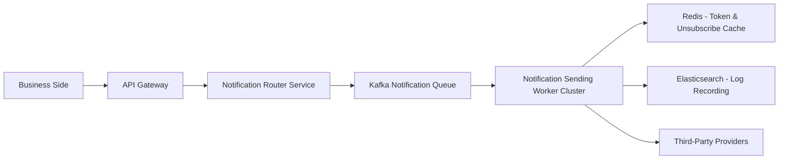
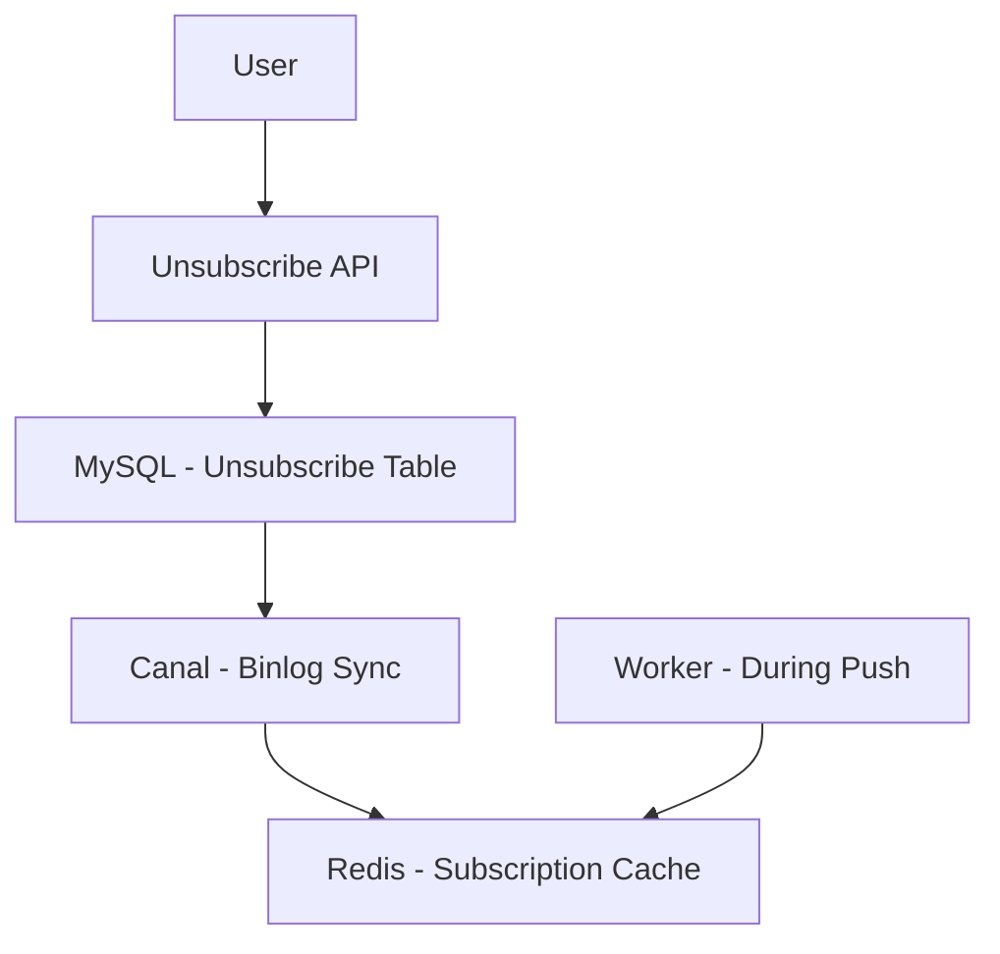
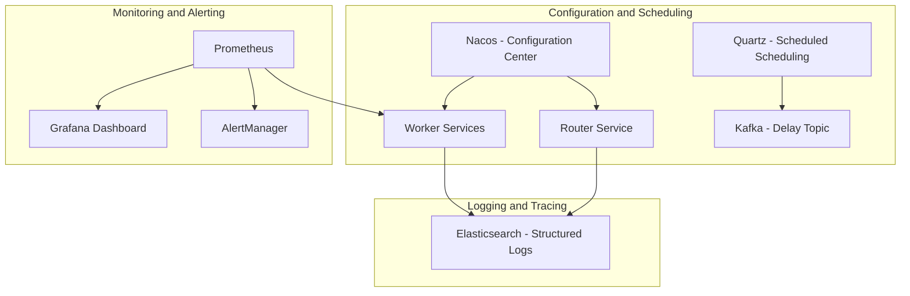
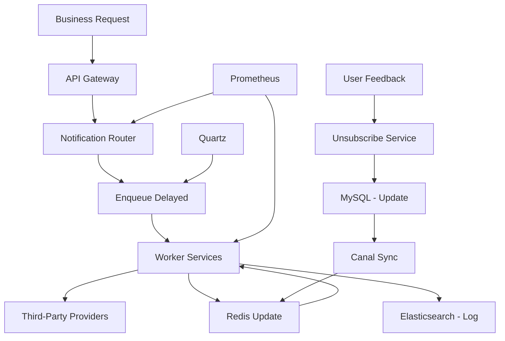
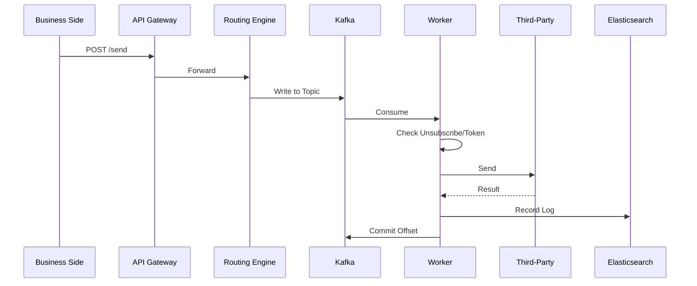
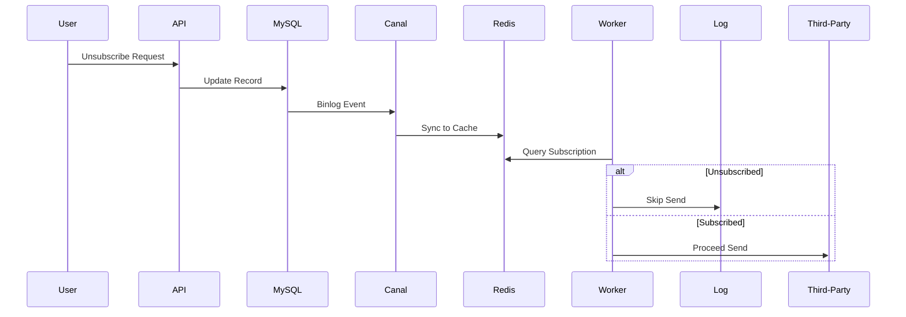
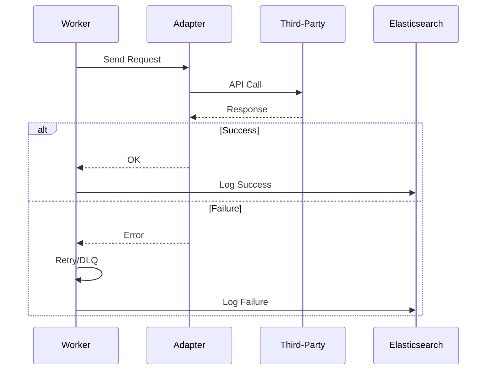
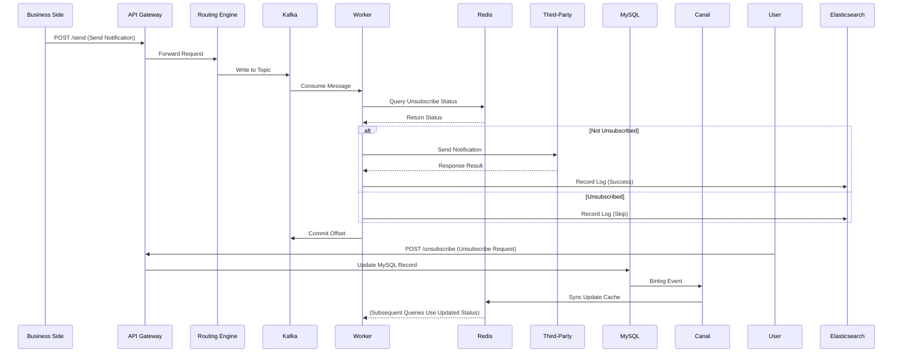

---
toc:
    sidebar: left
layout: post
title: Design Notification
pretty_table: true
mermaid:
    enabled: true
    zoomable: true
date: "2025-08-06"
description: How to design Notification
img: assets/img/2025/notification/1.png
importance: 5
category: SystemDesign
giscus_comments: true
---


## Understanding the Problem (What is a Notification System)

A notification system is a distributed software architecture designed to send various types of messages (such as push notifications, SMS, or emails) to users, enabling real-time or near-real-time information delivery and user interaction. This system typically handles large-scale traffic, ensures reliable message delivery, supports user customization (such as unsubscribing), and enables data tracking. It is widely used in scenarios like e-commerce, social networking, and finance.

### Why Do We Need a Notification System?
Notification systems primarily address the following practical issues:
1. Enhancing User Interaction and Experience

    - Real-time delivery of critical information (e.g., order updates, promotions) to improve user retention.

    - Support for multiple channels (e.g., app push, SMS, email) to accommodate different user preferences.

    - Personalized content to increase user satisfaction and reduce disruptions.

2. Improving Business Operational Efficiency

    - Automated message triggering to minimize manual intervention.

    - Tracking delivery rates and click behaviors to support data analysis and A/B testing.

    - Compliance management (e.g., privacy protection, unsubscribe mechanisms) to reduce legal risks.

3. Technical Characteristics

    - High availability and scalability, supporting billions of notifications.

    - Asynchronous decoupling for system stability and low latency.

    - Cost optimization through caching and batch processing to reduce third-party call expenses.

### Example
Consider an e-commerce platform where a user places an order and needs timely confirmation:  
Original Scenario: Users might manually refresh pages or check emails for order status, leading to oversights.  
With a Notification System: The system automatically sends a push notification "Your order has been confirmed and is expected to ship within 3 days," with SMS as a backup. If the user unsubscribes from push notifications, the system switches to email, ensuring reliable delivery while recording click rates to optimize future marketing.  
This process not only enhances user convenience but also helps the platform analyze user behavior and improve overall operational efficiency.

---

## 1. Requirements Analysis and Scope Definition

### 1.1. Functional Requirements

- **Core**:
    - Support for multiple notification types: push notifications, SMS, emails.
    - Business-side triggering of notification sending.
- **Secondary**:
    - User unsubscribe management, allowing unsubscribes by type.
    - Notification log recording and querying.
    - Adaptation and switching of third-party services.
- **Extensions**:
    - Delayed task scheduling, priority scheduling, content personalization, A/B testing, data analysis, compliance auditing.

### 1.2. Non-Functional Requirements

- **High Availability**: The system must withstand failures, targeting 99.99% availability with multi-availability zone deployment.
- **Scalability**: Handle growth from 100,000 to 10 billion notifications per day (e.g., from 1 QPS to 70,000 QPS).
- **Low Latency**: Push notifications <2 seconds, SMS/emails <5 minutes. API response <200 ms.
- **Durability**: Notification logs must not be lost (99.999% durability).
- **Consistency**: At-least-once consistency for notification delivery, eventual consistency for unsubscribes; strong consistency for critical operations like verification codes.
    - **Consistency Model Trade-offs (Based on CAP Theorem)**: Under the CAP theorem (Consistency, Availability, Partition Tolerance), this system prioritizes AP (Availability and Partition Tolerance) since network partitions are inevitable in distributed environments. Unsubscribes use eventual consistency, sacrificing short-term C (Consistency) for high A (Availability), suitable for non-critical scenarios (e.g., marketing notifications with up to 1-minute delay). For critical notifications like verification codes, employ strong consistency using distributed locks (e.g., Redis Lock) to ensure C, but this reduces A and throughput (potential bottleneck: lock contention increases latency by 10-20%). Trade-off: If business requires high consistency, introduce Saga patterns for compensating transactions; otherwise, eventual consistency reduces complexity and boosts performance.
- **Security**: Encrypted transmission and storage, anti-abuse measures, and content filtering. Notification content desensitization: Sensitive information (e.g., phone numbers, emails) masked in logs and transmission (e.g., 138****1234), decrypted only during sending; use HashiCorp Vault for key management.
- **Cost-Effectiveness**: Optimize third-party call costs, controlling expenses per million notifications within reasonable limits.

### 1.3. Detailed Requirements Breakdown and Challenges

| Module | Priority | Core Challenges | Design Decisions | Scalability Considerations | Constraints |
| :--- | :--- | :--- | :--- | :--- | :--- |
| **Notification Sending** | Highest | 1. Consistent handling of multiple types<br>2. Peak shaving for high concurrency<br>3. Third-party rate limiting | 1. **Kafka asynchronous queue**<br>2. **Worker microservices**<br>3. **Circuit breaking and retries** | 1. Partition expansion (initial 5 partitions, dynamic increase)<br>2. Kubernetes HPA<br>3. Multi-provider routing | Push latency <2 seconds, SMS/email <5 minutes; types limited to (push/sms/email) |
| **Unsubscribe Management** | High | 1. Real-time effectiveness<br>2. Data consistency<br>3. User privacy | 1. **Redis caching**<br>2. **Canal synchronization**<br>3. **RBAC control** | 1. Sharding (by user_id hash)<br>2. Batch update optimization<br>3. Geographic partitioning | Unsubscribe effective latency <1 minute, display limits (e.g., "Unsubscribed") |
| **Log Recording** | Medium | 1. High write throughput<br>2. Query efficiency<br>3. Storage costs | 1. **Elasticsearch**<br>2. **TraceID**<br>3. **Hot-cold separation** | 1. Sharding expansion (by time)<br>2. Index optimization<br>3. S 3 archiving | Query latency <500 ms, retention 30 days |
| **Monitoring and Alerting** | Low | 1. Real-time metric collection<br>2. Alert accuracy<br>3. Visualization | 1. **Prometheus**<br>2. **Grafana**<br>3. **SLO definition** | 1. Distributed tracing<br>2. Automated alerting<br>3. Metric extension | Success rate >99.9%, Lag >10000 alerting |

---

## 2. Capacity Estimation and API Design

### 2.1. Capacity Estimation

**Assumptions**:

- **DAU (Daily Active Users)**: 10 million (initial, scalable to 100 million).
- **Notification Volume**: 10 million pushes, 1 million SMS, 5 million emails per day.
- **Peak**: Push QPS ≈ 694 (10 million / 86400 seconds), SMS/email QPS ≈ 11.57 / 57.87.
- **Notification Size**: Push 1 KB, SMS 100 bytes, email 5 KB.
- **Unsubscribe Rate**: 5% of users unsubscribe from certain types.
- **Third-Party Limits**: APNs unlimited, Twilio QPS 100, SendGrid batch 1000.

**Calculations**:

- **Daily Storage Growth**: Notification logs 10 million * 1 KB + 1 million * 100 bytes + 5 million * 5 KB ≈ 10 GB + 100 MB + 25 GB = 35.1 GB/day.
- **Monthly Storage Growth**: 35.1 GB/day * 30 days ≈ 1 TB/month.
- **Daily Egress Traffic**: Push 10 million * 1 KB ≈ 10 GB, SMS 1 million * 100 bytes ≈ 100 MB, email 5 million * 5 KB ≈ 25 GB.
    - **Total Traffic**: 35 GB/day.
- **API QPS**:
    - Sending-related: 10 million * 5 API calls (routing, queries, etc.) = 50 million/day ≈ 578 QPS.
    - Unsubscribe-related: 1 million * 2 API calls = 2 million/day ≈ 23 QPS.
    - Others (queries, configs): 5 million/day ≈ 58 QPS.
    - **Total**: 50 million + 2 million + 5 million ÷ 86400 ≈ 659 QPS.
    - **Peak**: 659 * 3 (burst events) ≈ 1977 QPS.

### 2.2. API Design

All APIs are authenticated via API Gateway using JWT.

**1. Send Notification**

- **`POST /v1/notifications/send`**
    - **Description**: Trigger sending one or more notification types.
    - **Request Body**:
      ```json
      {
        "userId": "u12345",
        "types": ["push", "sms"],
        "content": {
          "title": "New Message",
          "body": "You have a new notification",
          "data": {"key": "value"}
        },
        "priority": "high",
        "delaySeconds": 0
      }
      ```
    - **Response Body (200 OK)**:
      ```json
      {
        "messageId": "m98765",
        "status": "queued",
        "message": "Notification scheduled"
      }
      ```

**2. Unsubscribe Notification**

- **`POST /v1/notifications/unsubscribe`**
    - **Description**: User unsubscribes from specific notification types.
    - **Request Body**:
      ```json
      {
        "userId": "u12345",
        "types": ["email"]
      }
      ```
    - **Response Body (200 OK)**:
      ```json
      {
        "status": "unsubscribed",
        "updatedTypes": ["email"]
      }
      ```

**3. Query Notification Logs**

- **`GET /v1/notifications/logs/{userId}?startTime=2025-08-01T00:00:00Z&endTime=2025-08-05T00:00:00Z&page=1&size=20`**
    - **Description**: Retrieve user notification history.
    - **Response Body (200 OK)**:
      ```json
      {
        "logs": [
          {
            "messageId": "m98765",
            "type": "push",
            "status": "sent",
            "sentAt": "2025-08-04T10:00:00Z"
          }
        ],
        "total": 50
      }
      ```

**4. Configure Notification**

- **`POST /v1/notifications/config`**
    - **Description**: Update system configurations (e.g., third-party keys).
    - **Request Body**:
      ```json
      {
        "provider": "apns",
        "apiKey": "new_key"
      }
      ```
    - **Response Body (200 OK)**:
      ```json
      {
        "status": "updated"
      }
      ```

---

## 3. High-Level Design

### 3.1. Architecture Diagrams

To avoid clutter from excessive connections in a single diagram, the following provides layered architecture diagrams: the main send notification path diagram, unsubscribe synchronization diagram, and system operations and monitoring diagram. These focus on different aspects for clarity.

**Diagram 1: Send Notification Main Path Diagram (Send Path Diagram)**  
Purpose: Focus on the primary data flow from business requests to third-party sending, simplifying configuration and monitoring lines.



**Diagram 2: Unsubscribe Synchronization Diagram (Unsubscribe Sync Diagram)**  
Purpose: Separately illustrate unsubscribe-related components, highlighting the Canal synchronization mechanism to avoid main diagram confusion.



**Diagram 3: System Operations and Monitoring Diagram (Ops & Monitoring Diagram)**  
Purpose: Focus on relationships between DevOps, configuration center, monitoring, and alerting components.



### 3.2. Core Components

1.  **Client/Business Side**: Web/App or internal services that trigger notifications.
2.  **Load Balancer (ALB)**: Distributes traffic to the API Gateway.
3.  **API Gateway**: Single entry point for authentication, rate limiting, and routing.
4.  **Microservices**:
    - **Notification Router Service**: Parses requests and routes to Kafka.
    - **Push/SMS/Email Workers**: Consume queues and send notifications.
    - **Unsubscribe Service**: Manages user unsubscribes.
5.  **Data Storage**:
    - **Message Queue (Kafka)**: For asynchronous tasks.
    - **Cache (Redis)**: For unsubscribes, tokens, and configurations.
    - **Database (MySQL)**: For persistent data.
    - **Logs (Elasticsearch)**: For notification records.
6.  **Configuration Center (Nacos)**: For dynamic parameters.
7.  **Monitoring (Prometheus/Grafana)**: For metrics and alerts.
8.  **Task Scheduler (Quartz)**: For delayed notifications.

### 3.3. Data Flow Diagram (Mermaid)



---

## 4. Core Process In-Depth Design

### 4.1. Notification Sending Process

Objective: Ensure real-time and reliability using asynchronous queues for decoupling.

**Process Steps**:

1.  **Business Side Request**: Invoke API to send notification.
2.  **API Gateway Handling**: Authentication and rate limiting.
3.  **Routing Engine**: Generate message_id and route to Kafka Topic (partitioned by type).
4.  **Worker Consumption**: Check Redis for unsubscribes/invalid tokens.
5.  **Sending**: Call third-party and record results in ES.
6.  **Retry**: Failures go to DLQ or retry.

**Java Code Example (Notification Routing Engine)**:

```java
package com.example.notification;

import com.google.gson.Gson;
import org.apache.kafka.clients.admin.AdminClient;
import org.apache.kafka.clients.admin.NewPartitions;
import org.apache.kafka.clients.producer.KafkaProducer;
import org.apache.kafka.clients.producer.ProducerRecord;
import org.apache.kafka.common.serialization.StringSerializer;

import java.util.Collections;
import java.util.List;
import java.util.Map;
import java.util.Properties;
import java.util.UUID;

/**
 * Notification Routing Engine
 * Responsible for parsing requests, generating unique IDs, and routing to Kafka.
 */
public class NotificationRouter {

    private final KafkaProducer<String, String> producer;
    private final Gson gson = new Gson();

    public NotificationRouter() {
        Properties props = new Properties();
        props.put("bootstrap.servers", "kafka:9092"); // Configure Kafka broker address
        props.put("key.serializer", StringSerializer.class.getName()); // Specify key serializer
        props.put("value.serializer", StringSerializer.class.getName()); // Specify value serializer
        props.put("acks", "all"); // Ensure reliability, all replicas confirm
        this.producer = new KafkaProducer<>(props);
    }

    /**
     * Process send request, generate message_id, and route to Kafka.
     *
     * @param request Send request body.
     * @return messageId.
     */
    public String routeNotification(NotificationRequest request) {
        try {
            String messageId = UUID.randomUUID().toString(); // Use UUID to generate unique ID
            NotificationMessage msg = new NotificationMessage(messageId, request.getUserId(), request.getTypes(), request.getContent(), request.getPriority()); // Create notification message object
            String json = gson.toJson(msg); // Convert message to JSON
            String topic = determineTopic(request.getTypes()); // Determine Kafka topic
            producer.send(new ProducerRecord<>(topic, json)); // Send message to Kafka
            return messageId;
        } catch (Exception e) {
            throw new RuntimeException("Failed to route notification", e); // Handle exception
        }
    }

    private String determineTopic(List<String> types) {
        // Logic: Route by primary type or mixed Topic
        if (types.contains("push")) return "push-topic"; // If contains push type, return push topic
        if (types.contains("sms")) return "sms-topic"; // If contains SMS type, return SMS topic
        return "email-topic"; // Default return email topic
    }
}

// Data Class: Notification Message
class NotificationMessage {
    private String messageId; // Message ID
    private String userId; // User ID
    private List<String> types; // Notification type list
    private Map<String, Object> content; // Notification content
    private String priority; // Priority

    public NotificationMessage(String messageId, String userId, List<String> types, Map<String, Object> content, String priority) {
        this.messageId = messageId;
        this.userId = userId;
        this.types = types;
        this.content = content;
        this.priority = priority;
    }
}

// Request Data Class: Send Request
class NotificationRequest {
    private String userId; // User ID
    private List<String> types; // Notification types
    private Map<String, Object> content; // Content
    private String priority; // Priority

    // Getters...
    public String getUserId() { return userId; }
    public List<String> getTypes() { return types; }
    public Map<String, Object> getContent() { return content; }
    public String getPriority() { return priority; }
}
```

**Sequence Diagram**:



### 4.2. Unsubscribe Process

**Process Steps**:

1.  **User Request**: Invoke unsubscribe API.
2.  **Update Database**: MySQL insert/update unsubscribe record.
3.  **Sync Cache**: Canal listens to Binlog and updates Redis.
4.  **Effectiveness**: Worker queries Redis to skip unsubscribed.

**Distributed Transaction Trade-offs**: Unsubscribe involves MySQL→Canal→Redis data flow, using eventual consistency to avoid distributed transaction overhead (e.g., 2 PC increases latency by 20-50% and reduces availability). Failure rollback: If Canal sync fails, use retry queue (Kafka DLQ) for resync; in extreme cases, Worker fallback to MySQL (increases read load by 5%). Trade-off: Sacrifice brief inconsistency (<1 s) for high availability; if strong consistency needed, introduce Seata distributed transactions, but increases complexity and may impact QPS.

**Java Code Example (Unsubscribe Service)**:

```java
package com.example.notification;

Import org. Springframework. Jdbc. Core. JdbcTemplate;
Import redis. Clients. Jedis. Jedis;

Import java. Util. List;

/**
 * Unsubscribe Service
 * Handles unsubscribe requests and syncs to cache.
 */
Public class UnsubscribeService {

    Private final JdbcTemplate jdbcTemplate; // JDBC template for database operations
    Private final Jedis jedis; // Redis client for cache operations

    Public UnsubscribeService (JdbcTemplate jdbcTemplate, Jedis jedis) {
        This. JdbcTemplate = jdbcTemplate;
        This. Jedis = jedis;
    }

    /**
     * Process unsubscribe request, update MySQL and asynchronously sync Redis.
     *
     * @param userId User ID.
     * @param types Unsubscribe type list.
     */
    public void unsubscribe (String userId, List<String> types) {
        Try {
            For (String type : types) { // Traverse each unsubscribe type
                JdbcTemplate.Update ("INSERT INTO unsubscriptions (user_id, notification_type, is_unsubscribed) VALUES (?, ?, true) " +
                           "ON DUPLICATE KEY UPDATE is_unsubscribed = true", userId, type); // Update or insert database record
            }
            // Canal will asynchronously update Redis, but can immediately publish event to accelerate sync
            Jedis.Publish ("unsubscribe_channel", userId + ": " + String.Join (",", types)); // Publish event to Redis channel
        } catch (Exception e) {
            Throw new RuntimeException ("Failed to unsubscribe", e); // Handle exception
        }
    }
}
```

**Sequence Diagram**:



### 4.3. Third-Party Call Process

**Process Steps**:

1.  **Worker Consumption**: Retrieve notification.
2.  **Adapter Selection**: Route based on configuration.
3.  **Call**: HTTP send with retry mechanism.
4.  **Feedback**: Webhook updates status.

**Java Code Example (APNs Adapter)**:

```java
Package com. Example. Notification;

Import software. Amazon. Awssdk. Services. Apns. ApnsClient;
Import software. Amazon. Awssdk. Services. Apns. Model. SendNotificationRequest;
Import software. Amazon. Awssdk. Services. Apns. Model. SendNotificationResponse;

Import java. Util. Map;

/**
 * APNs Adapter
 * Encapsulates push logic.
 */
Public class ApnsAdapter {

    Private final ApnsClient client; // APNs client instance

    Public ApnsAdapter () {
        This. Client = ApnsClient.Create (); // Create APNs client
    }

    /**
     * Send push notification.
     *
     * @param token Device token.
     * @param payload Payload.
     * @return Status code.
     */
    public int sendPush (String token, Map<String, Object> payload) {
        Try {
            SendNotificationRequest req = SendNotificationRequest.Builder ()
                    .token (token) // Set device token
                    .payload (payload) // Set push payload
                    .build (); // Build request
            SendNotificationResponse response = client.SendNotification (req); // Send notification
            Return response.SdkHttpResponse (). StatusCode (); // Return HTTP status code
        } catch (Exception e) {
            If (e instanceof software. Amazon. Awssdk. Services. Apns. Model. ApnsException && ((software. Amazon. Awssdk. Services. Apns. Model. ApnsException) e). StatusCode () == 410) {
                MarkInvalidToken (token); // If token invalid, mark as invalid
            }
            Throw new RuntimeException ("APNs send failed", e); // Handle exception
        }
    }

    Private void markInvalidToken (String token) {
        // Update MySQL/Redis, mark token as invalid
    }
}
```

**Sequence Diagram**:



---

## 5. Data Model Design

### 5.1. Database Selection

| Data Type | Selection | Rationale |
| :--- | :--- | :--- |
| **User Unsubscribes, Configurations** | **MySQL** | Strong consistency, transaction support, structured data. |
| **Notification Logs** | **Elasticsearch** | High write throughput, full-text search, aggregation analysis. |
| **Cache (Unsubscribes/Tokens)** | **Redis** | In-memory speed, low-latency reads. |
| **Queue** | **Kafka** | High throughput, persistence, partition expansion. |

### 5.2. Table Structure Design (SQL)

**MySQL (Unsubscribes & Configurations)**:

```sql
CREATE TABLE unsubscriptions (
    User_id BIGINT NOT NULL,
    Notification_type VARCHAR (20) NOT NULL,
    Is_unsubscribed BOOLEAN DEFAULT FALSE,
    Updated_at TIMESTAMP DEFAULT CURRENT_TIMESTAMP ON UPDATE CURRENT_TIMESTAMP,
    PRIMARY KEY (user_id, notification_type)
);

CREATE TABLE notification_configs (
    Config_id INT AUTO_INCREMENT PRIMARY KEY,
    Provider VARCHAR (50) NOT NULL,
    Api_key VARCHAR (255) NOT NULL,
    Updated_at TIMESTAMP DEFAULT CURRENT_TIMESTAMP
);
```

**Elasticsearch (Notification Logs)**:

```json
{
  "mappings": {
    "properties": {
      "message_id": {"type": "keyword"},
      "user_id": {"type": "long"},
      "notification_type": {"type": "keyword"},
      "status": {"type": "keyword"},
      "created_at": {"type": "date"}
    }
  }
}
```

---

## 6. System Scalability Design

To support large-scale expansion, adopt stateless services and distributed components.

1.  **Stateless Services**: API Gateway and Workers are stateless, with Kubernetes HPA auto-scaling based on CPU >70%.
2.  **Database Scaling**:
    - **MySQL**: Read-write separation, master for writes, replicas for reads; horizontal sharding (by user_id hash using Vitess).
    - **Kafka**: Dynamic partition expansion (from 5 to 100), multi-broker cluster. Rebalance impact analysis: Partition reassignment may cause brief consumption interruptions (<10 s), increasing business latency by 5-10%; trade-off: Use Kafka's incremental rebalance protocol to minimize interruptions, monitor lag and execute during low-peak periods.
    - **Redis**: Cluster mode for sharding data.
3.  **Cache Scaling**: Redis Sentinel for high availability, Cluster for sharding.

### Sharding Strategy Comparison

| Sharding Strategy | Advantages | Disadvantages | Applicable Scenarios |
| :--- | :--- | :--- | :--- |
| **By user_id Hash** | - Data aggregation, efficient user queries.<br>- Load balancing. | - Hotspots for popular users.<br>- Complex cross-user queries. | User unsubscribes, token management (**Recommended**). |
| **By Time** | - Fast time-based queries.<br>- Easy archiving. | - Hotspots for new data.<br>- Idle old data. | Log recording. |
| **By Type** | - Type isolation.<br>- Simple expansion. | - Uneven types.<br>- Multi-shard for mixed queries. | Queue Topic separation. |

---

## 7. Availability and Fault Tolerance

| Fault Tolerance Aspect | Strategy | Technologies/Tools |
| :--- | :--- | :--- |
| **Service Failures** | Auto-restart, multi-AZ deployment | Kubernetes, EC 2 Auto Scaling |
| **Database Failures** | Master-slave replication, auto-failover | MySQL + Vitess, RDS Multi-AZ |
| **Third-Party Failures** | Circuit breaking, provider switching | Hystrix, weighted routing |
| **Queue Failures** | Multi-replicas, lag monitoring | Kafka Replication Factor=3 |
| **Cascading Failures** | Rate limiting, exponential backoff retries | Sentinel, Resilience 4 j |
| **Data Loss** | Snapshots, Binlog recovery | AWS Backup, S 3 Versioning |
| **Graceful Degradation** | Prioritize core notifications, delay non-critical | Priority queues, feature toggles |

---

## 8. Bottleneck Analysis and Optimization

This section analyzes key bottlenecks in the notification system, including causes, impacts, comparisons, and solutions for each. The analysis is based on capacity estimates (daily 35 GB storage, 659 QPS) and architecture design (e.g., asynchronous queues, sharding), providing comprehensive optimization guidance. Recommended solutions for each bottleneck include implementation details, expected effects, and trade-offs, with Java code examples.

### 8.1. High-Concurrency Push Bottleneck

#### Causes
Peak push QPS >1977, Kafka consumption lag; third-party rate limiting (e.g., APNs connection pool full); network fluctuations leading to retry failures; Worker thread contention.

#### Impacts
Latency >2 seconds, user complaints increase by 20%; resource CPU >90%, costs rise by 30%; delivery rate drops <99%.

#### Comparison

| Strategy/Solution          | Advantages                                                                 | Disadvantages                                                                 |
|--------------------|----------------------------------------------------------------------|----------------------------------------------------------------------|
| **Single Queue**         | - Simple implementation.                                                       | - No priority, verification codes block marketing.                                         |
| **Multi-Partition Queue**     | - Parallel consumption, high throughput.                                               | - Complex configuration, uneven partitions.                                               |
| **Token Bucket Rate Limiting**     | - Smooth traffic, prevent third-party overload.                                         | - Risk of high-priority starvation.                                                 |

#### Solutions
- **Multiple Methods**:
    1. **Partition Expansion**: Dynamically increase Kafka partitions.
    2. **Worker Optimization**: Multi-threaded consumption.
    3. **Worker Rate Limiting**: Redis token bucket.
- **Recommended Solution**: Multi-partition Kafka combined with token bucket rate limiting. Implementation details are listed below by steps, including specific operations, tool configurations, potential challenges, and handling methods. Code examples are provided separately:
    1. **Kafka Partition Configuration**: Initial 5 partitions, dynamically increase based on QPS (AdminClient createPartitions). Challenge: Node rebalancing interruptions; Handling: Monitor rebalancing time <10 s.

       Code Example (Java):
       ```java
       Package com. Example. Notification;
  
       Import org. Apache. Kafka. Clients. Admin. AdminClient;
       Import org. Apache. Kafka. Clients. Admin. NewPartitions;
  
       Import java. Util. Collections;
       Import java. Util. Properties;
  
       Public class KafkaAdmin {
           Public void increasePartitions (String topic, int newPartitions) {
               Properties props = new Properties ();
               Props.Put ("bootstrap. Servers", "kafka: 9092"); // Configure Kafka broker address
               Try (AdminClient admin = AdminClient.Create (props)) { // Create AdminClient
                   NewPartitions newParts = NewPartitions.IncreaseTo (newPartitions); // Create new partition config
                   Admin.CreatePartitions (Collections.SingletonMap (topic, newParts)); // Apply partition increase
               } catch (Exception e) {
                   Throw new RuntimeException ("Failed to increase partitions", e); // Handle exception
               }
           }
       }
       ```

    2. **Worker Multi-Threaded Consumption**: Each Worker with 10 threads consuming partitions. Challenge: Thread contention; Handling: Thread pool limit of 20.

       Code Example (Java):
       ```java
       Package com. Example. Notification;
  
       Import java. Util. Concurrent. ExecutorService;
       Import java. Util. Concurrent. Executors;
  
       Public class WorkerManager {
           Public void startConsumers () {
               ExecutorService executor = Executors.NewFixedThreadPool (10); // Create fixed-size thread pool
               For (int i = 0; i < 10; i++) { // Start 10 consumption threads
                   Executor.Submit (this::consumePartition); // Submit consumption task
               }
           }
  
           Private void consumePartition () {
               // Consumption logic... // Implement Kafka partition consumption code here
           }
       }
       ```

    3. **Token Bucket Rate Limiting Integration**: Redis Lua script for token bucket. Challenge: Distributed consistency; Handling: Single-point Redis.

       Code Example (Java):
       ```java
       Package com. Example. Notification;
  
       Import redis. Clients. Jedis. Jedis;
  
       Public class RateLimiter {
           Private final Jedis jedis; // Redis client
  
           Public RateLimiter (Jedis jedis) {
               This. Jedis = jedis;
           }
  
           Public boolean acquireToken (String key, int tokens) {
               // Lua script: Check and deduct tokens
               String lua = "local current = redis.Call ('get', KEYS[1]) " +
                            "if current and tonumber (current) >= tonumber (ARGV[1]) then " +
                            "redis.Call ('decrby', KEYS[1], ARGV[1]) return 1 else return 0 end";
               Object result = jedis.Eval (lua, 1, key, String.ValueOf (tokens)); // Execute Lua script
               Return "1".Equals (result.ToString ()); // Return if acquired successfully
           }
       }
       ```

    4. **Monitoring and Scaling**: Prometheus tracks Lag >1000 alerts, HPA scales Workers.

       Code Example (Java):
       ```java
       Package com. Example. Notification;
  
       Public class Monitor {
           Public void checkLag (long lag) {
               If (lag > 1000) { // Check if lag exceeds threshold
                   // Trigger scaling logic
                   ScaleUpWorkers (); // Call scaling method
               }
           }
  
           Private void scaleUpWorkers () {
               // Call Kubernetes API for scaling // Implement Kubernetes HPA scaling call here
           }
       }
       ```

    5. **Testing**: Use Locust to simulate 2000 QPS.

  Expected Effects: QPS >2000, latency <1.5 seconds. Trade-off: Increased partition complexity, but good scalability.

### 8.2. Third-Party Service Failure Bottleneck

#### Causes
Third-party rate limiting/downtime; API timeouts; accumulation of invalid tokens.

#### Impacts
Delivery rate <99%, retry resource waste 40%; poor user experience.

#### Comparison

| Solution               | Advantages                                                                 | Disadvantages                                                                 |
|--------------------|----------------------------------------------------------------------|----------------------------------------------------------------------|
| **Single Provider**       | - Simple integration.                                                       | - Single point of failure.                                                         |
| **Multi-Provider Routing**   | - Failover.                                                       | - Complex configuration.                                                         |
| **Circuit Breaker**         | - Quick isolation.                                                       | - Manual recovery needed.                                                       |

#### Solutions
- **Multiple Methods**:
    1. **Multi-Providers**: Weighted routing.
    2. **Circuit Breaking**: Hystrix.
    3. **Token Cleanup**: Daily tasks.
- **Recommended Solution**: Multi-provider weighted routing combined with circuit breaker. Implementation details are listed below by steps, including specific operations, tool configurations, potential challenges, and handling methods. Code examples are provided separately:
    1. **Provider Configuration**: Nacos stores weights (e.g., Twilio 70%, Aliyun 30%). Challenge: Weight tuning; Handling: Dynamically adjust based on success rates.

       Code Example (Java):
       ```java
       Package com. Example. Notification;
  
       Import java. Util. Map;
       Import java. Util. Random;
  
       Public class ProviderRouter {
           private Map<String, Integer> providers; // Provider weights loaded from Nacos
  
           Public String selectProvider () {
               Int totalWeight = providers.Values (). Stream (). MapToInt (Integer::intValue). Sum (); // Calculate total weight
               Int random = new Random (). NextInt (totalWeight); // Generate random number
               Int current = 0;
               for (Map. Entry<String, Integer> entry : providers.EntrySet ()) { // Traverse providers
                   Current += entry.GetValue (); // Accumulate weight
                   If (random < current) return entry.GetKey (); // Select provider based on random
               }
               Return null; // Return null if not found
           }
       }
       ```

    2. **Circuit Breaker Integration**: Wrap calls with HystrixCommand, timeout 2 s for breaking. Challenge: False positives; Handling: Threshold 10% failure rate.

       Code Example (Java):
       ```java
       Package com. Example. Notification;
  
       Import com. Netflix. Hystrix. HystrixCommand;
       Import com. Netflix. Hystrix. HystrixCommandGroupKey;
  
       public class SendCommand extends HystrixCommand<Integer> {
           Protected SendCommand () {
               Super (HystrixCommandGroupKey.Factory.AsKey ("SendGroup")); // Set Hystrix group key
           }
  
           @Override
           Protected Integer run () throws Exception {
               // Send logic
               Return sendToProvider (); // Execute actual send
           }
  
           @Override
           Protected Integer getFallback () {
               Return switchProvider (); // Switch provider on circuit break
           }
  
           Private int sendToProvider () {
               // Actual send // Implement third-party API call here
               Return 200; // Return success code
           }
  
           Private int switchProvider () {
               // Switch provider // Implement fallback provider logic here
               Return 200; // Return success code
           }
       }
       ```

    3. **Token Cleanup Task**: Quartz daily scan for invalid tokens. Challenge: Slow scans; Handling: Batch deletion.

       Code Example (Java):
       ```java
       Package com. Example. Notification;
  
       Import org. Springframework. Jdbc. Core. JdbcTemplate;
  
       Import java. Util. Date;
  
       Public class TokenCleaner {
           Private final JdbcTemplate jdbcTemplate; // JDBC template
  
           Public TokenCleaner (JdbcTemplate jdbcTemplate) {
               This. JdbcTemplate = jdbcTemplate;
           }
  
           Public void cleanInvalidTokens (Date oldDate) {
               JdbcTemplate.BatchUpdate ("DELETE FROM invalid_tokens WHERE invalidated_at < ?", new Object[]{oldDate}); // Batch delete invalid tokens
           }
       }
       ```

    4. **Webhook Feedback**: Parse status and update ES.

       Code Example (Java):
       ```java
       Package com. Example. Notification;
  
       Import org. Springframework. Web. Bind. Annotation. PostMapping;
  
       Public class WebhookController {
           @PostMapping ("/webhook") // Handle Webhook POST request
           Public void handleWebhook (WebhookPayload payload) {
               // esClient.UpdateStatus (payload.GetMessageId (), payload.GetStatus ()); // Update Elasticsearch status
           }
       }
  
       Class WebhookPayload {
           Private String messageId; // Message ID
           Private String status; // Status
  
           // Getters...
           Public String getMessageId () { return messageId; }
           Public String getStatus () { return status; }
       }
       ```

    5. **Monitoring**: Grafana tracks switch rate >5% alerts.

  Expected Effects: Availability >99.99%, seamless switching. Trade-off: Multi-integration complexity, but high reliability.

### 8.3. Unsubscribe Consistency Bottleneck

#### Causes
Database update and cache sync delays; slow high-concurrency unsubscribe queries; cross-service consistency.

#### Impacts
Mis-delivery rate >1%, privacy risks; query latency >200 ms.

#### Comparison

| Solution               | Advantages                                                                 | Disadvantages                                                                 |
|--------------------|----------------------------------------------------------------------|----------------------------------------------------------------------|
| **Direct Cache Write**       | - Real-time.                                                           | - Weak consistency.                                                         |
| **Binlog Sync**    | - Reliable.                                                           | - Second-level latency.                                                         |
| **Eventual Consistency**     | - High performance.                                                         | - Brief inaccuracies.                                                         |

#### Solutions
- **Multiple Methods**:
    1. **Canal Sync**.
    2. **TTL Cache**.
    3. **Query Merging**.
- **Recommended Solution**: Canal Binlog sync combined with TTL cache. Implementation details are listed below by steps, including specific operations, tool configurations, potential challenges, and handling methods. Code examples are provided separately:
    1. **Canal Configuration**: Listen to MySQL Binlog, filter unsubscriptions table. Challenge: Slow Binlog parsing; Handling: Incremental sync.

       Code Example (Java):
       ```java
       Package com. Example. Notification;
  
       Import com. Alibaba. Otter. Canal. Client. CanalConnector;
       Import com. Alibaba. Otter. Canal. Client. CanalConnectors;
  
       Import java. Net. InetSocketAddress;
  
       Public class CanalClient {
           Public void start () {
               CanalConnector connector = CanalConnectors.NewSingleConnector (new InetSocketAddress ("localhost", 11111), "example", "", ""); // Create Canal connector
               Connector.Connect (); // Connect to Canal server
               Connector.Subscribe ("database. Unsubscriptions"); // Subscribe to database table
           }
       }
       ```

    2. **Sync Logic**: Parse events and update Redis. Challenge: Event loss; Handling: Reconnect mechanism.

       Code Example (Java):
       ```java
       Package com. Example. Notification;
  
       Import com. Alibaba. Otter. Canal. Protocol. CanalEntry;
       Import com. Alibaba. Otter. Canal. Protocol. Message;
       Import redis. Clients. Jedis. Jedis;
  
       Public class CanalSync {
           Private final Jedis jedis; // Redis client
  
           Public CanalSync (Jedis jedis) {
               This. Jedis = jedis;
           }
  
           Public void processMessage (Message message, CanalConnector connector) {
               For (CanalEntry. Entry entry : message.GetEntries ()) { // Traverse Binlog events
                   // Parse RowChange...
                   CanalEntry. RowChange rowChange = CanalEntry.RowChange.ParseFrom (entry.GetStoreValue ()); // Parse row change
                   // Assume extract userId and type
                   String userId = "extractedUserId"; // Extract user ID
                   String type = "extractedType"; // Extract type
                   Jedis.Set ("unsub: " + userId + ": " + type, "true"); // Update Redis cache
               }
               Connector.Ack (message.GetId ()); // Acknowledge message
           }
       }
       ```

    3. **TTL Application**: Redis EX 1 minute. Challenge: Early expiration; Handling: Refresh mechanism.

       Code Example (Java):
       ```java
       Package com. Example. Notification;
  
       Import redis. Clients. Jedis. Jedis;
  
       Public class CacheManager {
           Private final Jedis jedis; // Redis client
  
           Public CacheManager (Jedis jedis) {
               This. Jedis = jedis;
           }
  
           Public void setWithTTL (String key, String value, int seconds) {
               Jedis.Setex (key, seconds, value); // Set key-value with TTL
           }
       }
       ```

    4. **Worker Query**: First Redis, fallback to MySQL on miss.

       Code Example (Java):
       ```java
       Package com. Example. Notification;
  
       Import org. Springframework. Jdbc. Core. JdbcTemplate;
       Import redis. Clients. Jedis. Jedis;
  
       Public class SubscriptionChecker {
           Private final Jedis jedis; // Redis client
           Private final JdbcTemplate jdbcTemplate; // JDBC template
  
           Public SubscriptionChecker (Jedis jedis, JdbcTemplate jdbcTemplate) {
               This. Jedis = jedis;
               This. JdbcTemplate = jdbcTemplate;
           }
  
           Public String isUnsubscribed (String userId, String type) {
               String unsub = jedis.Get ("unsub: " + userId + ": " + type); // First check Redis
               If (unsub == null) { // If miss
                   Unsub = jdbcTemplate.QueryForObject ("SELECT is_unsubscribed FROM unsubscriptions WHERE user_id=? AND notification_type=?", String. Class, userId, type); // Query MySQL
                   Jedis.Setex ("unsub: " + userId + ": " + type, 60, unsub); // Cache result
               }
               Return unsub; // Return result
           }
       }
       ```

    5. **Monitoring**: Sync latency >5 s alerts.

  Expected Effects: Consistency latency <1 s, mis-delivery <0.1%. Trade-off: Canal deployment requires resources, but high security.

---

## 9. Optimization (Performance and Cost)

### 9.1. Performance Optimization

- **Batch Processing**: SMS/emails in batches of 1000 to reduce API calls.
- **Cache Preheating**: Preload Redis for popular user unsubscribes.
- **Network Optimization**: HTTP/2 multiplexing, long connection pools.
- **Lazy Loading**: Paginated log queries, ES aggregations.

### 9.2. Cost Optimization

- **Provider Dynamic Switching**: Monitor costs and switch to lower-price providers.
- **Invalid Push Cleanup**: Weekly cleanup of 10% invalid tokens.
- **Serverless**: Use AWS Lambda for low-priority tasks.
- **Compression**: Gzip notification content to save 20% traffic.

### 9.3. Security Considerations

- **Authentication and Authorization**: JWT/OAuth, multi-factor authentication.
- **Data Protection**: HTTPS transmission, static AES-256. Notification content desensitization: Automatically mask sensitive fields (e.g., PII) in routing and logs using libraries like Apache Commons Text for regex replacement; decrypt only before Worker sending.
- **Content Protection**: Sensitive word filtering, DRM watermarking.
- **API Security**: Input validation, rate limiting, WAF.
- **DDoS Protection**: Cloudflare.
- **Audit Logs**: Record operations to ES.

### 9.4. Monitoring and Operations

- **Metrics**: QPS, latency, success rate, lag.
- **Logs**: JSON format, TraceID.
- **Alerts**: Prometheus rules, PagerDuty.
- **Automation**: CI/CD, zero-downtime configurations.

---

## Summary

This design constructs a highly available and scalable notification system, addressing various challenges through technologies like Kafka asynchronous decoupling, Redis caching, and multi-provider routing. Core processes focus on sending and unsubscribing, with bottleneck analysis providing targeted optimizations to ensure stability under high loads. Actual implementation should iterate based on scale, emphasizing trade-offs (e.g., third-party vs. In-house) and cost control. These elements provide a comprehensive technical framework for building similar notification systems.

**Overall Sequence Diagram (Combined Send Notification and Unsubscribe Version)**:


