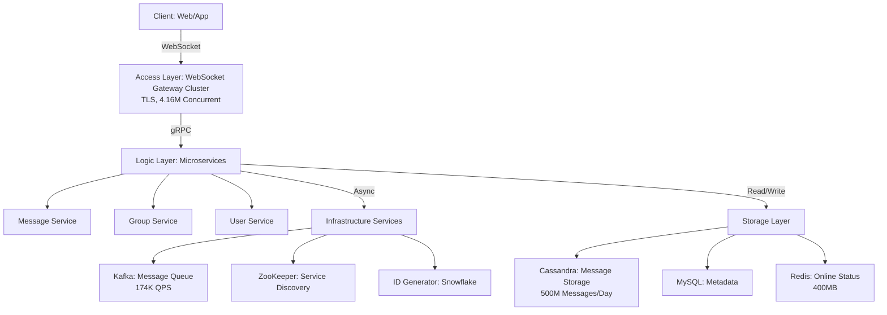
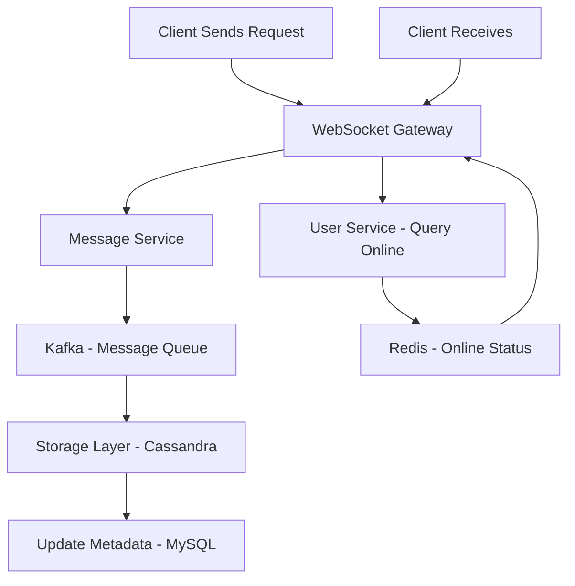
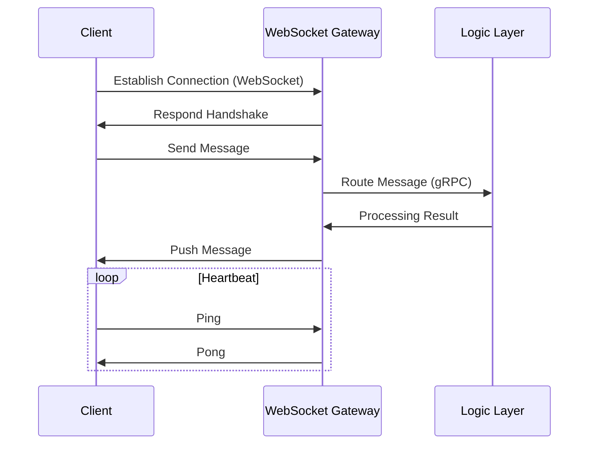
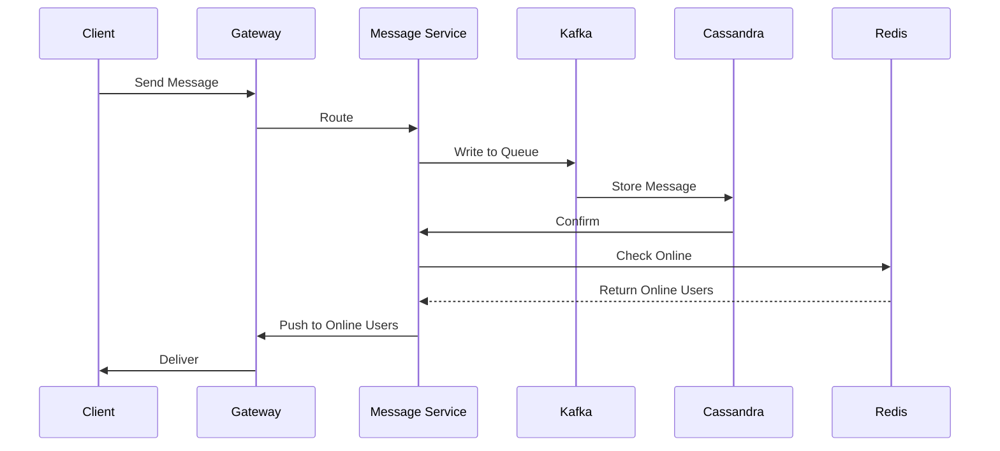

---
toc:
    sidebar: left
layout: post
title: Design Chat
pretty_table: true
mermaid:
    enabled: true
    zoomable: true
date: "2025-08-01"
description: How to design Chat System
img: assets/img/2025/chat/1.png
importance: 6
category: SystemDesign
giscus_comments: true
---

## Understanding the Problem (What is a Chat System)

A chat system is a distributed real-time communication platform that supports one-on-one and group messaging between users, enabling instant interaction and information sharing. This system typically handles high-concurrency connections, reliable message delivery, and features such as persistent storage, read/unread status, offline push notifications, and more. It is widely used in social networking, collaboration, and enterprise internal communication scenarios.

### Why Do We Need a Chat System?

Chat systems primarily address the following practical issues:
1. Enhance User Interaction and Experience

    - Real-time message delivery (e.g., text, files) to foster immediate communication and improve user retention.

    - Support for multi-device synchronization and offline push notifications to accommodate various scenarios and preferences.

    - Personalized features (e.g., read receipts, message retraction) to boost user satisfaction and reduce misunderstandings.

2. Business Operational Efficiency

    - Automated message routing and storage to minimize manual management.

    - Tracking of message delivery and interaction behaviors to support data analysis and optimization.

    - Compliance management (e.g., privacy protection, anti-spam mechanisms) to mitigate risks.

3. Technical Characteristics

    - High availability and scalability, supporting billions of DAU and millions of concurrent connections.

    - Asynchronous decoupling to ensure system stability and low latency.

    - Cost optimization through caching and partitioning to reduce storage and computational overhead.

### Example

Suppose a social platform where a user wants to share news with friends:  
Original scenario: Users might send links via email or SMS, which can lead to delays or missed responses.  
With a chat system: The system delivers the message "Check out this news!" in real-time, supporting read receipts and group discussions. If the user is offline, the system pushes notifications to ensure timely interaction, while recording interaction data to optimize recommendations.  
This process not only improves communication efficiency but also helps the platform analyze user behavior to enhance overall user engagement.

## 1. Requirements Analysis and Scope Definition

### 1.1. Functional Requirements

- **Core**:
    - Support for one-on-one and group chats (up to 100 people, extendable to 100,000), with real-time message delivery and persistent storage.
- **Secondary**:
    - Support for message read/unread status, offline push, message retraction, file transfer, etc. If time permits, these can be discussed in depth.
- **Extensions**:
    - Message search, anti-spam and moderation, intelligent recommendations/bots, value-added services based on behavior and content.

### 1.2. Non-Functional Requirements

- **High Availability**: The system must withstand failures, targeting 99.99% availability (annual downtime < 52.6 minutes), with multi-AZ deployment.
- **Scalability**: Must handle growing users, messages, and traffic (e.g., from 5 million to 50 million DAU), supporting horizontal scaling.
- **Low Latency**: P 99 latency requires messages to be delivered within 200 ms. API responses <200 ms.
- **Persistence**: Messages stored permanently, targeting zero loss (e.g., 99.999% persistence).
- **Consistency**: Messages ordered within groups and individual chats, allowing eventual consistency, prioritizing availability.
- **Security**: Prevent unauthorized access, data breaches, DDoS attacks, with trade-offs for end-to-end encryption (E 2 EE).
- **Cost-Effectiveness**: Optimize infrastructure and operational costs, such as using Spot instances and container optimization.

### 1.3. Detailed Requirements Breakdown and Challenges

| Requirement Module | Priority | Core Challenges | Design Decisions | Scalability Considerations | Constraints |
|--------------------|----------|-----------------|------------------|----------------------------|-------------|
| **Communication Protocol** | Highest | 1. Low latency, bidirectional communication, low overhead<br>2. Connection management and compatibility | 1. **WebSocket** (preferred)<br>2. **HTTP Long Polling** (fallback) | 1. Horizontal scaling of gateway clusters<br>2. Service discovery (ZooKeeper/etcd) | P 99 latency <200 ms, support for modern browsers, fallback for legacy environments |
| **Message Flow Processing** | Highest | 1. No message loss, no duplicates, ordered<br>2. High-concurrency delivery | 1. **Kafka asynchronous queue**<br>2. **Snowflake ID generator** | 1. Multi-partition expansion (initial 5 partitions, dynamic increase)<br>2. Kubernetes HPA | Peak QPS 174,000, zero message loss |
| **Storage Design** | High | 1. High write throughput and scalability<br>2. Consistency vs availability | 1. **Cassandra** (message storage)<br>2. **MySQL** (metadata)<br>3. **Redis** (online status) | 1. Sharding expansion (by time/group ID)<br>2. Hot-cold data separation<br>3. Elastic cache clusters | 500 million messages/day, 150 GB/day storage, eventual consistency allowed |
| **Online Status Management** | Medium | 1. Real-time synchronization and concurrent updates<br>2. Status broadcasting | 1. **Redis Pub/Sub**<br>2. Heartbeat mechanism | 1. Geo-partitioned data<br>2. Batch notification optimization | 4.16 million concurrent connections, status change latency <1 s |
| **Group Chat Expansion** | Low | 1. Message storms and member management<br>2. Hotspot group read/write | 1. **Read diffusion** (for large groups)<br>2. **Pagination/lazy loading** | 1. CDN caching for hot group messages<br>2. Subscription viewport optimization<br>3. Multicast/fan-out | Group size up to 100,000, push frequency limits |

---

## 2. Capacity Estimation and API Design

### 2.1. Capacity Estimation

**Assumptions**:

- **DAU (Daily Active Users)**: 50 million (initial, scalable to 500 million).
- **Concurrent Connections**: 50 million DAU, assuming average 2 hours/day activity per user, concurrent connections ≈ 50 million × (2/24) ≈ 4.16 million. The system must support millions of concurrent connections.
- **Message Volume**: Assuming 10 messages/user/day, daily messages = 50 million × 10 = 500 million/day.
- **Peak QPS**: Assuming 3 x average QPS: 500 million / 86,400 seconds × 3 ≈ 174,000 QPS.
- **Message Size**: Average 300 bytes (text).
- **Storage**: 150 GB/day, 55 TB after one year.
- **Online Status**: Redis 400 MB.

**Calculations**:

- **Daily Storage Increment**: 500 million/day * 300 bytes/message ≈ 150 GB/day.
- **Monthly Storage Increment**: 150 GB/day * 30 days ≈ 4.5 TB/month.
- **API QPS**:
    - Send-related: 500 million * 2 API calls (routing, storage) = 1 billion/day ≈ 115,700 QPS.
    - Others (status updates, pulls): 500 million/day ≈ 57,900 QPS.
    - **Total**: 1 billion + 500 million ÷ 86,400 ≈ 173,600 QPS.
    - **Peak**: 173,600 * 3 ≈ 520,800 QPS.

### 2.2. API Design

All APIs require authentication via an API gateway (e.g., using JWT). APIs focus on architectural explanations, emphasizing message routing and status synchronization.

**1. Send Message**

- **`POST /v1/messages/send`**
    - **Description**: Send a message to a user or group, routed to Kafka for processing.
    - **Request Body**:
      ```json
      {
        "to": "user123 or group456",
        "content": "Hello",
        "type": "text"
      }
      ```
    - **Response Body (200 OK)**:
      ```json
      {
        "messageId": "m98765",
        "status": "sent"
      }
      ```

**2. Pull Messages**

- **`GET /v1/messages/{conversationId}?lastMessageId=lastId&limit=50`**
    - **Description**: Pull historical messages with pagination, querying from Cassandra.
    - **Response Body (200 OK)**:
      ```json
      {
        "messages": [
          {
            "messageId": "m98765",
            "content": "Hello",
            "timestamp": "2025-08-04T10:00:00Z"
          }
        ]
      }
      ```

**3. Update Online Status**

- **`POST /v1/status/update`**
    - **Description**: Update user online status, synchronized to Redis.
    - **Request Body**:
      ```json
      {
        "userId": "u12345",
        "status": "online"
      }
      ```
    - **Response Body (200 OK)**:
      ```json
      {
        "status": "updated"
      }
      ```

**4. Query Online Status**

- **`GET /v1/status/{userId}`**
    - **Description**: Query user online status from Redis.
    - **Response Body (200 OK)**:
      ```json
      {
        "status": "online",
        "lastActive": "2025-08-04T10:00:00Z"
      }
      ```

---

## 3. High-Level Design

### 3.1. Architecture Diagram



### 3.2. Core Components

1.  **Client**: Web/App, supporting WebSocket connections.
2.  **Load Balancer (ALB)**: Distributes incoming traffic to WebSocket gateways.
3.  **API Gateway**: Single entry point for client requests, handling authentication, rate limiting, and routing to microservices.
4.  **Microservices**:
    - **Message Service**: Handles message routing and delivery.
    - **Group Service**: Manages group members and status.
    - **User Service**: Manages user profiles, authentication, and authorization.
5.  **Data Storage**:
    - **Message Storage (Cassandra)**: Stores message data.
    - **Metadata Database (MySQL)**: Stores user data and group metadata.
    - **Cache (Redis)**: Stores online status and hot data.
6.  **Message Queue (Kafka)**: Decouples services, especially for async tasks like message delivery and notification distribution.
7.  **Service Discovery (ZooKeeper)**: For dynamic service registration and discovery.

### 3.3. Data Flow Diagram (Mermaid)



---

## 4. Core Process In-Depth Design

### 4.1. Communication Protocol Selection Process

For real-time chat, the core goal is to ensure low latency, bidirectional communication, and low overhead. Adopt **WebSocket** and **HTTP Long Polling** strategies.

**Process Steps**:

1.  **Connection Establishment**: Client establishes a persistent connection via WebSocket.
2.  **Message Sending**: Client sends messages, server pushes proactively.
3.  **Heartbeat Keep-Alive**: Send Ping/Pong frames every 30 seconds.
4.  **Fallback Handling**: Switch to HTTP Long Polling for legacy environments.
5.  **Serialization and Compression**: Use Protobuf for serialization and LZ 4 for compression.
6.  **Extensions**: Support gRPC streaming as an alternative.

**Java Code Example (WebSocket Gateway)**:

```java
import io.netty.channel.ChannelHandlerContext;
import io.netty.channel.SimpleChannelInboundHandler;
import io.netty.handler.codec.http.websocketx.TextWebSocketFrame;

public class WebSocketHandler extends SimpleChannelInboundHandler<TextWebSocketFrame> {
    @Override
    protected void channelRead0(ChannelHandlerContext ctx, TextWebSocketFrame msg) throws Exception {
        // Process message
        String content = msg.text();
        // Route to logic layer
        ctx.channel().writeAndFlush(new TextWebSocketFrame("Echo: " + content));
    }
}
```

**Sequence Diagram**:



### 4.2. Message Flow Processing Process

For reliable message delivery, the core goal is to ensure no loss, no duplicates, and ordering. Adopt **Kafka** and **ID Generator** strategies.

**Process Steps**:

1.  **Message Sending**: Client sends to gateway, generates unique ID (Snowflake).
2.  **Routing**: Logic layer routes to Kafka (partitioning for ordering).
3.  **Storage**: Kafka consumer stores in Cassandra.
4.  **Delivery**: Push to online users, store in inbox for offline.
5.  **Retry**: Retry on failure or use DLQ.
6.  **Ordering**: Intra-partition ordering, cross-partition sorting by timestamp.

**Java Code Example (Message Routing)**:

```java
import org.apache.kafka.clients.producer.KafkaProducer;
import org.apache.kafka.clients.producer.ProducerRecord;
import java.util.Properties;
import java.util.UUID;

public class MessageRouter {
    private KafkaProducer<String, String> producer;

    public MessageRouter() {
        Properties props = new Properties();
        props.put("bootstrap.servers", "kafka:9092");
        this.producer = new KafkaProducer<>(props);
    }

    public void routeMessage(String conversationId, String content) {
        String messageId = UUID.randomUUID().toString();
        producer.send(new ProducerRecord<>("messages", conversationId, content));
    }
}
```

**Sequence Diagram**:



---

## 5. Data Model Design

### 5.1. Database Selection

| Requirement Type | Selection | Reasons | Comparison Alternatives | Trade-offs |
|------------------|-----------|---------|--------------------------|------------|
| **Message Storage** | Cassandra | High write throughput, distributed scaling, eventual consistency | HBase | Cassandra offers better read/write balance, suitable for chat's mixed workloads |
| **Metadata Storage** | MySQL | Relational, transaction support | PostgreSQL | MySQL has a mature ecosystem, strong transactional consistency, but scaling requires sharding |
| **Online Status/Cache** | Redis | Real-time read/write, low latency | Memcached | Redis supports Pub/Sub and persistence, ideal for status synchronization |

### 5.2. Table Schema Design

**Message Table (Cassandra)**:
```sql
CREATE TABLE messages (
    conversation_id UUID,
    message_id UUID,
    sender_id UUID,
    content TEXT,
    timestamp TIMESTAMP,
    PRIMARY KEY (conversation_id, timestamp, message_id)
) WITH CLUSTERING ORDER BY (timestamp DESC);
```

**User Table (MySQL)**:
```sql
CREATE TABLE users (
    user_id BIGINT PRIMARY KEY,
    username VARCHAR(50),
    last_active TIMESTAMP
);
```

**Online Status (Redis)**:
```json
{
  "user:123": "online",
  "lastActive": "2025-08-04T10:00:00Z"
}
```

---

## 6. System Scalability Design

When users grow from 50 million to 200 million, and messages from 500 million to 2 billion, the system cannot rely on simply stacking more powerful servers (vertical scaling); instead, it must linearly improve capacity by adding more ordinary servers (**horizontal scaling**).


1. **Horizontal Scaling**

    - **Core Concept**: Design services (e.g., WebSocket gateways, logic layer microservices) as **stateless**. This means services store no session information internally; any server can handle any user's request. User states (e.g., online info) are stored in shared external storage like Redis.
    - **Implementation**: With stateless services, use **Kubernetes HPA (Horizontal Pod Autoscaler)**. When CPU usage exceeds a threshold (e.g., 70%), it automatically increases service instances (Pods) to share the load; during off-peak, it scales down to save costs.
2. **Partitioning Strategy**

    - **Core Concept**: When a single data node (Kafka or Cassandra) cannot handle massive data and concurrency, data must be "sharded" across multiple nodes.
    - **Implementation**: As noted, hash partitioning by `conversation_id` ensures all messages for the same chat session are routed to the same partition, preserving order while distributing load. Dynamically increase partitions as needed.
3. **Large Group Scaling**

    - **Core Concept**: For a 100,000-member group, replicating and pushing each message to every member (**write diffusion**) would overwhelm the server.
    - **Implementation**: Use **read diffusion**. Store a single copy of the message in the database (Cassandra). Group members pull new messages or are notified via subscriptions. This reduces write pressure from N (members) to 1, with caching to optimize reads.
4. **Global Scaling**

    - **Core Concept**: For a global app, reduce latency for users worldwide by deploying in multiple geographic regions (e.g., North America, Europe, Asia).
    - **Implementation**: **Multi-Region Deployment**. Users connect to the nearest data center. Sync messages across centers using **Kafka MirrorMaker** to mirror data between Kafka clusters.

- **Horizontal Scaling**: Gateways and logic layers are stateless, auto-scaled via Kubernetes HPA.
- **Partitioning Strategy**: Kafka/Cassandra hashed by conversation_id, supporting dynamic partition increases.
- **Large Group Scaling**: Shift from write to read diffusion; store one copy, users pull/subscribe.
- **Global Scaling**: Multi-region deployment, nearest access, cross-region sync with Kafka MirrorMaker.

| Sharding Strategy | Advantages | Disadvantages | Applicable Scenarios |
|-------------------|------------|---------------|----------------------|
| **Hash Sharding** | Even distribution | Hotspot issues | Message storage |
| **Range Sharding** | Ordered queries | Uneven distribution | Time-series messages |
| **Composite Sharding** | Flexible | Complex | Large group read diffusion |

---

## 7. Availability and Fault Tolerance

High availability means the system can withstand various failures, targeting 99.99% availability (annual downtime less than 52.6 minutes).


1. **Replication**

    - **Core Concept**: "Don't put all eggs in one basket." Store multiple copies of each data piece on different machines.
    - **Implementation**: Set **replication factor to 3** for Kafka and Cassandra. Each message is stored on 3 different servers; even if one or two fail, data remains safe and service uninterrupted.
2. **Failover**

    - **Core Concept**: Automatically switch traffic to healthy nodes when a node fails, transparently to users.
    - **Implementation**:
        - **Service Discovery**: **ZooKeeper** acts as a registry; healthy WebSocket gateways register. On failure, ZooKeeper notifies the load balancer to stop routing new connections.
        - **Client Reconnection**: If a connection drops, clients retry with **backoff strategy** (e.g., wait 1 s, 2 s, 4 s, 8 s...) to avoid reconnection storms.
3. **Graceful Degradation**

    - **Core Concept**: "Sacrifice non-essentials to protect the core." Under extreme pressure (e.g., traffic spikes), disable non-core features to ensure core functionality.
    - **Implementation**: Temporarily disable "message read receipts" to save write operations and bandwidth, prioritizing message send/receive.
4. **Chaos Engineering**

    - **Core Concept**: Proactively create failures in controlled environments to test resilience.
    - **Implementation**: Use tools like Chaos Monkey to randomly kill instances, simulate network delays, and observe recovery; ensure alarms trigger promptly to identify design flaws.


- **Replication**: Kafka/Cassandra replication factor 3 for data redundancy.
- **Failover**: ZooKeeper for service discovery; client reconnection with backoff on gateway failure.
- **Degradation**: Disable non-core features (e.g., read receipts) during surges.
- **Chaos Engineering**: Fault injection to verify MTTR <1 minute.

| Fault Tolerance Aspect | Strategy | Tools |
|------------------------|----------|-------|
| **Node Failure** | Automatic failover | ZooKeeper |
| **Network Partition** | Eventual consistency | Cassandra |
| **DDoS** | Rate limiting | WAF |

---

## 8. Bottleneck Analysis and Optimization

### 8.1. Concurrent Connections Bottleneck

#### Causes

The system needs to support **4.16 million** concurrent long connections. Traditional "one thread per connection" models exhaust memory and threads quickly. Even thread pools suffer from context switching overhead. Single-server connection limits (e.g., 65,535 ports, memory-constrained) apply; notes estimate 100,000 connections per machine.

#### Impacts

Servers crash from memory exhaustion or CPU spikes. Mass disconnections cause "reconnection storms," leading to avalanches.

#### Comparison

| Scheme | Advantages | Disadvantages |
|--------|------------|---------------|
| **epoll** | Efficient I/O | Requires high-performance frameworks |
| **Thread Pool** | Simple | High context switching |

#### Solutions

1. **High-Performance Network I/O Model**: Abandon blocking I/O; use non-blocking with **epoll** on Linux. Event-driven: one thread manages thousands of connections, notified only when data is ready, reducing resource use.
2. **Appropriate Network Framework**: Use mature frameworks like Java's **Netty** or **Go** (native epoll support).
3. **Horizontal Scaling of Gateway Clusters**: Use **Kubernetes HPA** to auto-scale WebSocket gateways.
4. **Heartbeat and Monitoring**: **30-second heartbeats** detect zombie connections. Use **Prometheus** to monitor connections; alert at >80% threshold.


- **Recommended Solution**: Netty epoll with Kubernetes HPA. Detailed implementation steps follow, numbered with operations, tool configs, challenges, and handling; code examples separate:
    1. **Gateway Deployment**: Kubernetes deploys Netty gateways. Challenge: State management; Handling: Service discovery.
       Code Example (Java):
       ```java
       Import io. Netty. Bootstrap. ServerBootstrap;
       Import io. Netty. Channel. Epoll. EpollEventLoopGroup;
  
       Public class WebSocketServer {
           Public void start () {
               EpollEventLoopGroup bossGroup = new EpollEventLoopGroup (1);
               EpollEventLoopGroup workerGroup = new EpollEventLoopGroup ();
               ServerBootstrap b = new ServerBootstrap ();
               b.group (bossGroup, workerGroup);
               // Configure channel etc.
               b.bind (8080). Sync ();
           }
       }
       ```

    2. **HPA Configuration**: Scale on CPU >70%. Challenge: Latency; Handling: Pre-warming.

       Code Example (YAML):
       ```yaml
       ApiVersion: autoscaling/v 2
       Kind: HorizontalPodAutoscaler
       Metadata:
         Name: websocket-gateway
       Spec:
         ScaleTargetRef:
           ApiVersion: apps/v 1
           Kind: Deployment
           Name: websocket-gateway
         MinReplicas: 10
         MaxReplicas: 100
         Metrics:
         - Type: Resource
           Resource:
             Name: cpu
             Target:
               Type: Utilization
               AverageUtilization: 70
       ```

    3. **Heartbeat Optimization**: 30 s Ping. Challenge: Traffic; Handling: Merging.

       Code Example (Java):
       ```java
       Import io. Netty. Handler. Timeout. IdleStateHandler;
  
       Public class HeartbeatHandler extends IdleStateHandler {
           Public HeartbeatHandler () {
               Super (0, 0, 30); // 30 s all idle
           }
  
           @Override
           Protected void channelIdle (ChannelHandlerContext ctx, IdleStateEvent evt) throws Exception {
               // Send Ping
               Ctx.WriteAndFlush (new PingWebSocketFrame ());
           }
       }
       ```

    4. **Monitoring**: Prometheus tracks connections >80% alert.

       Code Example (Java):
       ```java
       Import io. Prometheus. Client. Gauge;
  
       Public class Metrics {
           Static final Gauge connections = Gauge.Build ()
               .name ("websocket_connections")
               .help ("Current WebSocket connections")
               .register ();
           Public void increment () { connections.Inc (); }
           Public void decrement () { connections.Dec (); }
       }
       ```

    5. **Testing**: Simulate 5 million connections with Locust.

  Expected Results: 100,000 connections/machine, latency <100 ms. Trade-off: epoll efficient but requires Linux support.

### 8.2. Message Throughput Bottleneck

#### Causes

Peak QPS reaches **174,000**. Direct database writes would overwhelm it. Insufficient Kafka partitions create single-partition bottlenecks.

#### Impacts

Severe message delays; users feel messages aren't sending. Kafka lag risks data loss.

#### Comparison

| Scheme | Advantages | Disadvantages |
|--------|------------|---------------|
| **Kafka Multi-Partition** | High throughput | Ordering complexity |
| **RabbitMQ** | Simple | Weak scaling |

#### Solutions

1. **Kafka Multi-Partition**: Hash by `conversation_id` to distribute messages; start with 5 partitions, dynamically increase.
2. **Read Diffusion Model**: Minimize write pressure for large groups.
3. **Async Processing and Batching**: Async storage/distribution; batch Kafka pulls and Cassandra writes.
4. **Cache Hot Messages**: Store recent messages in **Redis** to reduce backend read pressure.
5. **Monitor Lag**: Use Prometheus; alert on lag >1,000 to prompt consumer scaling or logic checks.


- **Recommended Solution**: Kafka multi-partition with read diffusion. Detailed implementation steps follow:
    1. **Partition Configuration**: Hash by conversation_id. Challenge: Hotspots; Handling: Dynamic repartitioning.
       Code Example (Java):
       ```java
       Import org. Apache. Kafka. Clients. Admin. AdminClient;
       Import org. Apache. Kafka. Clients. Admin. NewPartitions;
       Import java. Util. Collections;
  
       Public class KafkaAdmin {
           Public void increasePartitions (String topic, int newPartitions) {
               AdminClient admin = AdminClient.Create (props);
               Admin.CreatePartitions (Collections.SingletonMap (topic, NewPartitions.IncreaseTo (newPartitions)));
           }
       }
       ```

    2. **Read Diffusion**: Store one copy for large groups, users pull. Challenge: Latency; Handling: Caching.

       Code Example (Java):
       ```java
       Public class MessageFetcher {
           public List<Message> fetch (String conversationId, long lastId) {
               // Query from Cassandra
               Return cassandra.Query ("SELECT * FROM messages WHERE conversation_id = ? AND message_id > ?", conversationId, lastId);
           }
       }
       ```

    3. **Cache Integration**: Redis for hot messages. Challenge: Consistency; Handling: TTL.

       Code Example (Java):
       ```java
       Import redis. Clients. Jedis. Jedis;
  
       Public class CacheManager {
           Jedis jedis = new Jedis ("localhost");
           Public void cacheMessage (String key, String value) {
               Jedis.Setex (key, 60, value); // 60 s TTL
           }
           Public String getCached (String key) {
               Return jedis.Get (key);
           }
       }
       ```

    4. **Monitoring**: Lag >1,000 alert.

       Code Example (Java):
       ```java
       Import io. Prometheus. Client. Gauge;
  
       Public class KafkaMetrics {
           Static final Gauge lag = Gauge.Build ()
               .name ("kafka_lag")
               .help ("Kafka consumer lag")
               .register ();
           Public void setLag (long value) { lag.Set (value); }
       }
       ```

    5. **Testing**: Simulate 200,000 QPS with Locust or JMeter.

  Expected Results: Throughput >200,000 QPS, latency <150 ms. Trade-off: Increased partitions add complexity but enhance scaling.

### 8.3. Storage Bottleneck

#### Causes

Daily addition of **150 GB**, 55 TB/year. Massive data incurs high costs; most "cold data" (e.g., year-old records) is rarely accessed but occupies expensive storage. Hot sessions strain the database.

#### Impacts

Degraded query performance, uncontrolled storage costs.

#### Comparison

| Scheme | Advantages | Disadvantages |
|--------|------------|---------------|
| **Cassandra** | Good scaling | Weak consistency |
| **HBase** | Big data handling | Complex |

#### Solutions

1. **Appropriate Database**: **Cassandra** for high-write throughput and horizontal scaling.
2. **Hot-Cold Data Tiering**: Store hot data (30 days) in high-performance Cassandra; migrate cold data to cheap object storage (e.g., AWS S 3 Glacier) via scheduled tasks (Quartz Job).
3. **Data Compression**: Compress message content with **LZ 4** before storage to reduce space and bandwidth.
4. **TTL (Time-To-Live)**: Set auto-expiration for temporary data (e.g., Redis cache).
5. **Partition Key Design**: Cassandra's `PRIMARY KEY (conversation_id, timestamp, message_id)` partitions by conversation_id, clusters by descending timestamp for efficient latest-message queries.


- **Recommended Solution**: Cassandra tiering with TTL. Detailed implementation steps follow:
    1. **Partition Design**: By time/group ID. Challenge: Uneven; Handling: Monitor and rebalance.

       Code Example (CQL):
       ```sql
       CREATE TABLE messages_by_time (
           Time_bucket TEXT,
           Timestamp TIMESTAMP,
           Message_id UUID,
           PRIMARY KEY (time_bucket, timestamp, message_id)
       );
       ```

    2. **Cold Data Migration**: Move after 30 days to low-cost storage. Challenge: Slow access; Handling: Pre-warming.

       Code Example (Java):
       ```java
       Import org. Quartz. Job;
       Import org. Quartz. JobExecutionContext;
  
       Public class ColdDataMigrationJob implements Job {
           Public void execute (JobExecutionContext context) {
               // Query old data and migrate
               // Simplified: Use AWS SDK or similar
           }
       }
       ```

    3. **Compression**: LZ 4. Challenge: CPU; Handling: Async.

       Code Example (Java):
       ```java
       Import org. Apache. Commons. Compress. Compressors. Lz 4. LZ 4 CompressorOutputStream;
       Import java. Io. ByteArrayOutputStream;
  
       Public class Compressor {
           Public byte[] compress (String data) {
               ByteArrayOutputStream baos = new ByteArrayOutputStream ();
               LZ 4 CompressorOutputStream lz 4 = new LZ 4 CompressorOutputStream (baos);
               Lz 4.Write (data.GetBytes ());
               Lz 4.Close ();
               Return baos.ToByteArray ();
           }
       }
       ```

    4. **Replication**: Factor 3 for high availability. Challenge: Bandwidth; Handling: Async.

       Code Example (Java):
       ```java
       // Cassandra config example - Set replication in cluster builder
       Cluster cluster = Cluster.Builder (). AddContactPoint ("node 1"). Build ();
       ```

    5. **Monitoring**: Growth >10%/month alert.

  Expected Results: 50% cost reduction, 99.999% availability. Trade-off: Cold data latency but significant savings.

### 8.4. Online Status Bottleneck

#### Causes

**4.16 million** online users generate massive concurrent writes for status updates (online/offline, heartbeats). A user's status change may notify all friends, causing "notification storms."

#### Impacts

Delayed updates; inaccurate friend status views. Overloaded Redis affects other services.

#### Comparison

| Scheme | Advantages | Disadvantages |
|--------|------------|---------------|
| **Redis Pub/Sub** | Real-time | High memory |
| **Kafka** | Persistent | High latency |

#### Solutions

1. **Use Redis**: Memory-based for high read/write performance. Use Hash: `HSET "user: status" "userId" "online"` to save memory over per-user keys.
2. **Redis Pub/Sub**: Publish status changes to a channel (e.g., `status:channel`); subscribed services (gateways) receive and push to relevant users.
3. **Heartbeat Optimization**: Maintain heartbeats client-gateway; update backend Redis only on actual changes.
4. **Batching and Sparse Updates**: Merge short-interval updates; push only to active subscribers (e.g., chatting contacts), not all friends.


- **Recommended Solution**: Redis Pub/Sub with batching. Detailed implementation steps follow:
    1. **Status Storage**: Hash structure. Challenge: Memory; Handling: Partitioning.

       Code Example (Java):
       ```java
       Import redis. Clients. Jedis. Jedis;
  
       Public class StatusManager {
           Jedis jedis = new Jedis ("localhost");
           Public void setStatus (String userId, String status) {
               Jedis.Hset ("user: status", userId, status);
           }
       }
       ```

    2. **Subscription**: Pub/Sub broadcasting. Challenge: Storms; Handling: Sparse.

       Code Example (Java):
       ```java
       Jedis.Publish ("status: channel", jsonStatus);
       ```

    3. **Heartbeat**: 30 s updates. Challenge: Load; Handling: Merging.

       Code Example (Java):
       ```java
       Import java. Util. Concurrent. Executors;
       Import java. Util. Concurrent. ScheduledExecutorService;
       Import java. Util. Concurrent. TimeUnit;
  
       ScheduledExecutorService scheduler = Executors.NewScheduledThreadPool (1);
       Scheduler.ScheduleAtFixedRate (() -> sendHeartbeat (), 0, 30, TimeUnit. SECONDS);
       ```

    4. **Monitoring**: Latency >500 ms alert.

  Expected Results: Latency <500 ms. Trade-off: High memory but strong real-time.

### 8.5. Group Chat Scaling Bottleneck

#### Causes

For a 100,000-member group, **write diffusion** amplifies one message to 100,000 operations, causing storms and push overload.

#### Impacts

Drastic message delays; overloaded push modules, system instability.

#### Comparison

| Scheme | Advantages | Disadvantages |
|--------|------------|---------------|
| **Read Diffusion** | Fewer writes | More reads |
| **Write Diffusion** | Faster reads | Write amplification |

#### Solutions

1. **Read Diffusion Model**: Store once; notify online users to pull, offline pull on login.
2. **CDN Caching**: Cache history for hot groups on **CDN**; users fetch from nearest edges to reduce origin load.
3. **Member Management Optimization**: Use **pagination** for loading 100,000 members.
4. **Subscription Viewport**: Clients report visible sessions; server pushes only those, reducing irrelevant updates.

- **Recommended Solution**: Read diffusion with CDN. Detailed implementation steps follow:
    1. **Message Storage**: Store one copy. Challenge: Slow pulls; Handling: Indexing.

       Code Example (Java):
       ```java
       // Cassandra single-copy storage example
       Session.Execute ("INSERT INTO messages (conversation_id, message_id, content) VALUES (?, ?, ?)", conversationId, messageId, content);
       ```

    2. **User Pull**: Paginated queries. Challenge: Hotspots; Handling: Caching.

       Code Example (Java):
       ```java
       PreparedStatement ps = session.Prepare ("SELECT * FROM messages WHERE conversation_id = ? LIMIT ?");
       ResultSet rs = session.Execute (ps.Bind (conversationId, limit));
       ```

    3. **Caching**: CDN for hot messages. Challenge: Invalidation; Handling: TTL.

       Code Example (Java):
       ```java
       // AWS CloudFront example
       Import software. Amazon. Awssdk. Services. Cloudfront. CloudFrontClient;
  
       CloudFrontClient client = CloudFrontClient.Create ();
       // Pre-warm cache API call
       ```

    4. **Member Management**: Paginated loading.

       Code Example (SQL):
       ```sql
       SELECT * FROM group_members WHERE group_id = ? LIMIT ?, ?;
       ```

    5. **Monitoring**: Push rate >5% alert.

  Expected Results: Supports 100,000-member groups, latency <200 ms. Trade-off: Increased read pressure but optimized writes.

---

## 9. Optimization (Performance and Cost)

### 9.1. Performance Optimization

Beyond macro bottlenecks, micro-level optimizations abound.

- **Zero-Copy Technology**: Message forwarding involves memory copies, consuming CPU. Frameworks like Kafka/Netty use OS "zero-copy" (e.g., `sendfile`) to send data directly from kernel buffers to NIC, avoiding app-kernel copies.
- **Weak Network Optimization**: For poor networks (e.g., subways, elevators):
    - **Custom Retransmission**: Smarter app-layer retransmission than TCP.
    - **Message Sharding**: Split large files/images to avoid full retransmits.
    - **Header Compression**: Compress protocol headers to reduce per-packet overhead.
- **Lazy Loading**: General optimization.
    - **Historical Messages**: Load first screen on app open; paginate more on scroll.
    - **Session Lists**: Load visible sessions only, not hundreds at once.

### 9.2. Cost Optimization

For billion-DAU systems, cost is a key business factor.

- **Hot-Cold Data Tiering**: As discussed in storage bottlenecks, migrate cold data from Cassandra to cheap S 3 for major savings.
- **Serverless Architecture**: For non-core, fluctuating tasks (e.g., reports, complaints), use Serverless (e.g., AWS Lambda); pay only on invocation.
- **Resource Scheduling Optimization**:
    - **Spot Instances**: Use low-cost preemptible instances on AWS for interruptible tasks (e.g., analytics), potentially 10% of on-demand costs.
    - **Container Optimization**: Fine-tune container resources (Request/Limit) and scheduling for higher cluster utilization.

### 9.3. Security Considerations

Security is the system's lifeline; any oversight can be catastrophic.

- **Authentication & Authorization**:
    - **JWT/OAuth**: Use standards for identity verification.
    - **RBAC (Role-Based Access Control)**: Ensure operations match permissions (e.g., group admins can remove members).
- **Data Protection**:
    - **Transport Encryption**: All client-server comms use **WSS/TLS** to prevent eavesdropping.
    - **At-Rest Encryption**: Encrypt stored data with **AES-256**; even if leaked, it's unusable.
    - **End-to-End Encryption (E 2 EE)**: For high-security (e.g., Signal, WhatsApp), encrypt on sender device, decrypt on receiver; server can't access content.
- **API Security**:
    - **Input Validation**: Strictly check all parameters to prevent SQL injection, XSS.
    - **Rate Limiting**: Limit API frequencies to thwart abuse/attacks.
- **DDoS Protection**: Use services like **Cloudflare, AWS Shield** to scrub malicious traffic at ingress.
- **Audit Logging**: Record operations for security audits.

### 9.4. Monitoring and Operations

Stable operation requires robust monitoring and efficient ops.

- **Monitoring Metrics**: Focus on Four Golden Signals:
    - **Latency**: API response time, end-to-end message delivery.
    - **Traffic**: QPS, connections.
    - **Errors**: API error rates, delivery failures.
    - **Saturation**: CPU/memory/disk/network usage, Kafka lag.
- **Logging**:
    - **Structured Logs**: Output as **JSON** for easy parsing.
    - **Full-Chain Tracing**: Generate **TraceID** per request, propagate across microservices; use **Jaeger** or **SkyWalking** to trace chains for quick issue location.
- **Alerting**:
    - Define rules in **Prometheus**; notify on-duty engineers via **PagerDuty** when thresholds breach.
- **Automation**:
    - **CI/CD**: Build pipelines for automated testing/deployment.
    - **AIOps**: Use ML on historical data for fault prediction and capacity planning.

---

## Summary

This design constructs a high-availability, scalable chat system for billions of DAU through a Q&A format, addressing high-concurrency connections and reliable message delivery using layered architecture, WebSocket, Kafka, and Cassandra. Core processes focus on communication protocols (WebSocket) and message flows (read diffusion), with foundational support for secondary features like online status and group scaling. Bottleneck analysis provides optimization strategies for concurrent connections, message throughput, and storage costs, ensuring stability under high loads. Actual implementation should iterate based on scale, emphasizing trade-offs (e.g., WebSocket vs HTTP Long Polling) and capacity estimates. The document covers requirements clarification to future optimizations, enhanced with code examples, diagrams, and tables for practicality. These elements provide a comprehensive technical framework for building similar billion-DAU chat systems, while offering clear thinking paths and visual aids for interviews.