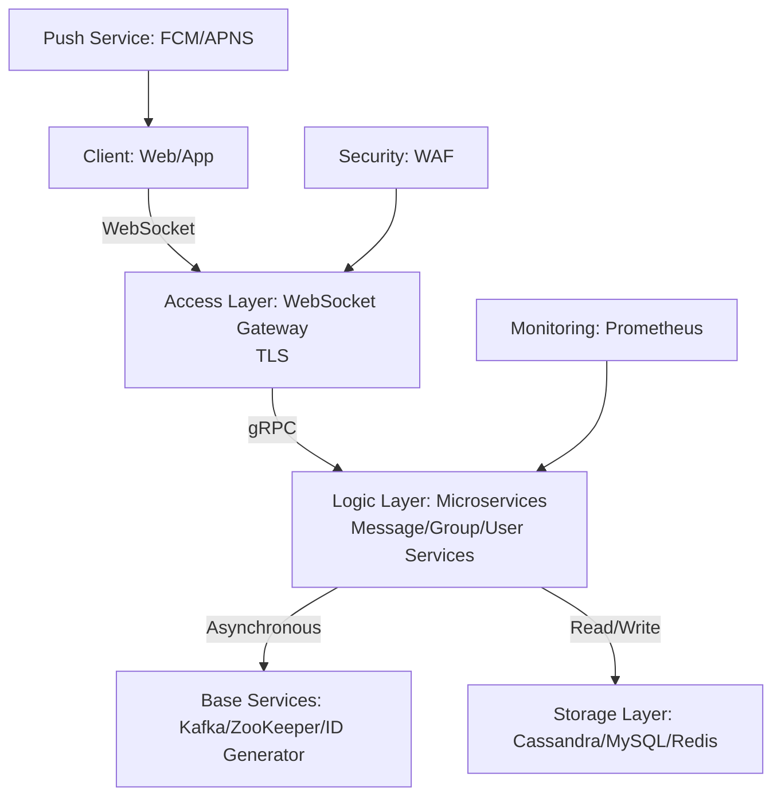
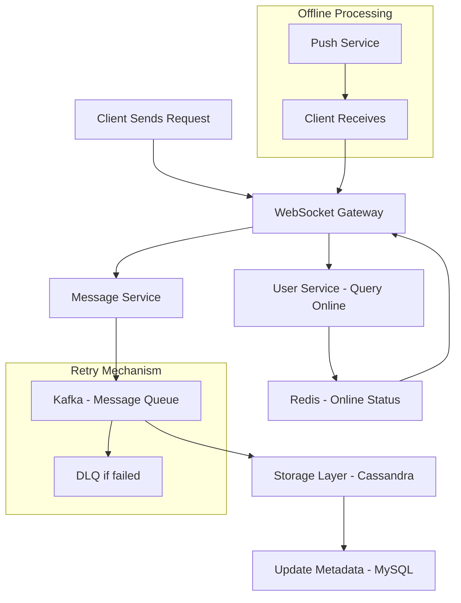
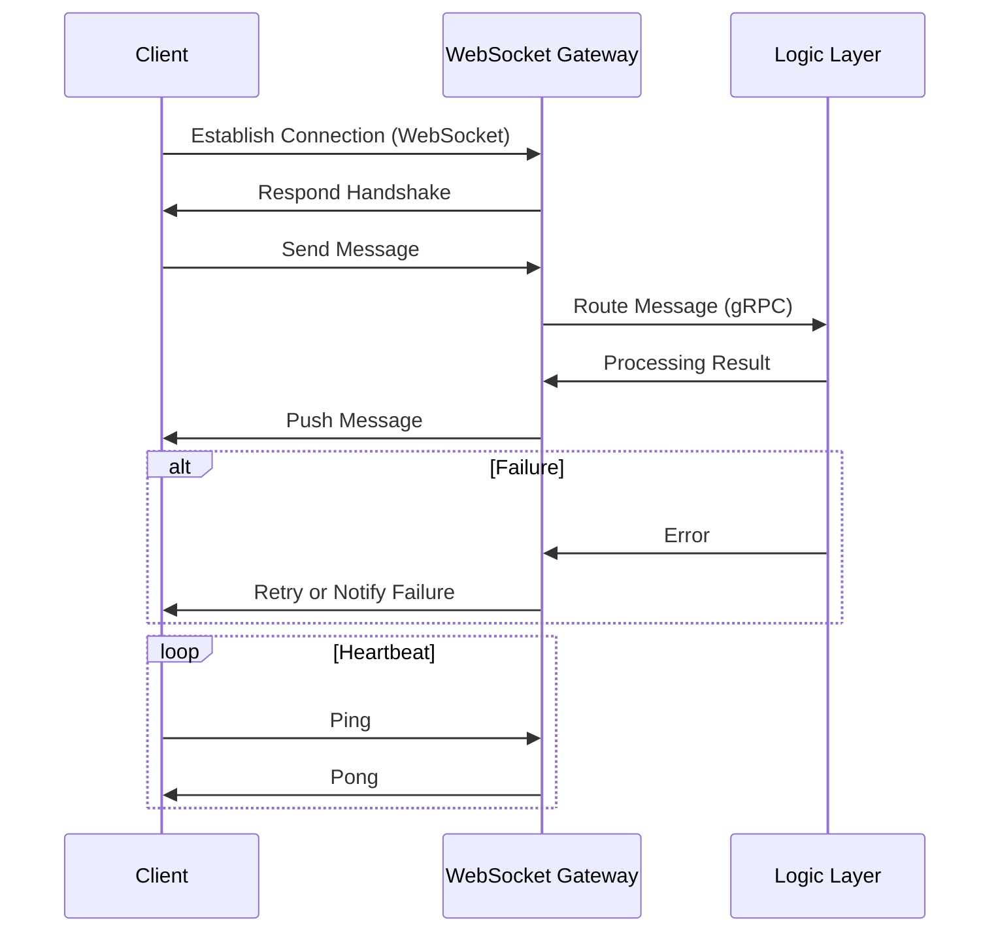
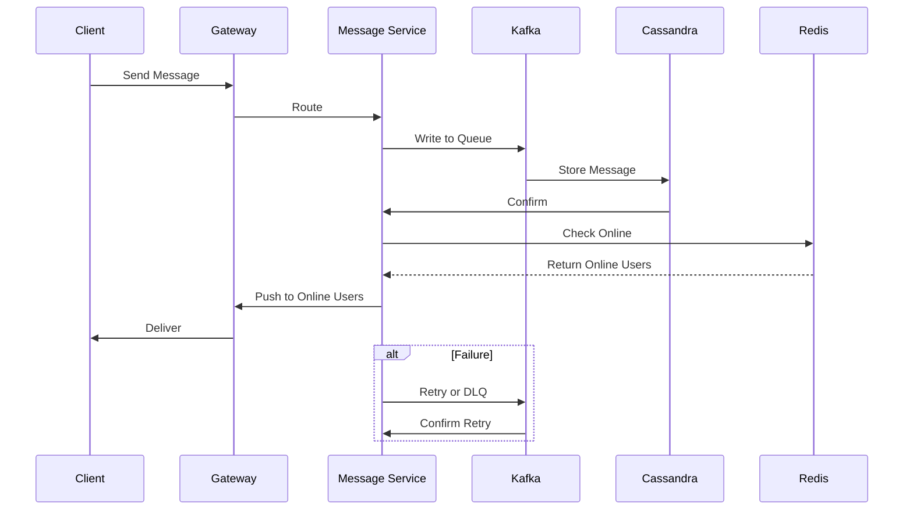

---
toc:
    sidebar: left
layout: post
title: Design Chat
pretty_table: true
tabs: true
mermaid:
    enabled: true
    zoomable: true
date: "2025-08-01"
description: How to design Chat System
img: assets/img/2025/chat/1.png
importance: 6
category: SystemDesign
giscus_comments: true

---


## Understanding the Problem (What is a Chat System)

A chat system is a distributed real-time communication platform that supports one-on-one and group chat message exchanges between users, enabling instant interaction and information sharing. The system typically handles high concurrent connections, reliable message delivery, and supports persistent storage, read/unread status, offline push notifications, and other features. It is widely used in scenarios such as social networking, collaboration, and internal enterprise communication. Unlike asynchronous systems like email or forums, chat systems emphasize real-time performance and long connections, supporting bidirectional push and low-latency responses, while also needing to handle various edge cases such as eventual consistency delivery of messages under network partitions.

### Why Do We Need a Chat System?

Chat systems primarily address the following practical issues:
1. Enhance User Interaction and Experience
    - Real-time message delivery (e.g., text, files) enhances the sense of instant communication and improves user retention rates (according to Statista data, IM can increase retention by 20%). For example, after a user sends a message, they can immediately see the recipient's receipt and response status, which is more interactive than traditional email systems.
    - Support for multi-device synchronization and offline push notifications to adapt to different scenario preferences. For example, a message sent on a mobile phone can be synchronously displayed on a computer, and even when offline, timely notifications can be pushed.
    - Personalized features (e.g., read receipts, message withdrawal) improve user satisfaction and reduce misunderstandings. For example, read receipts allow the sender to know if the message has been viewed, avoiding unnecessary follow-ups.

2. Business Operational Efficiency
    - Automated message routing and storage to reduce manual management. For example, the system automatically routes messages to the correct recipients and persists them without human intervention.
    - Track message delivery and interaction behaviors to support data analysis and optimization. For example, by analyzing message interaction frequency, the platform can optimize recommendation algorithms to increase user activity.
    - Compliance management (e.g., privacy protection, anti-spam mechanisms) to mitigate risks. For example, built-in anti-spam filtering can prevent spam messages, complying with data protection regulations like GDPR.

3. Technical Characteristics
    - High availability and scalability, supporting hundreds of millions of DAU and tens of millions of concurrent connections. For example, the system needs to be designed for horizontal scaling to handle user growth.
    - Asynchronous decoupling to ensure system stability and low latency. For example, using message queues like Kafka to decouple sending and processing, avoiding synchronous blocking.
    - Cost optimization through caching and partitioning to reduce storage and computing overhead. For example, using Redis to cache hot data, reducing database query costs.

### Example

Assume a social platform where a user wants to share news with friends:  
Original scenario: Users might send links via email or SMS, which is prone to delays or missed replies, and messages could even be lost, as these systems do not guarantee real-time delivery and status tracking.  
After using a chat system: The system delivers the message "Check out this news!" in real-time, supporting read receipts and group discussions. If the user is offline, the system pushes notifications to ensure timely interaction, while recording interaction data to optimize recommendations. If a network partition occurs, the system ensures eventual consistency to deliver the message without immediate loss. This process not only improves communication efficiency but also helps the platform analyze user behavior to enhance overall user stickiness. For example, the platform can recommend similar content based on sharing frequency, further increasing user dwell time.

## 1. Requirements Analysis and Scope Definition

### 1.1. Functional Requirements

- **Core**:
    - Support one-on-one and group chats (up to 100 people, expandable to 100,000 via read diffusion mechanism, see Section 6 for details), with real-time message delivery and persistent storage. This includes message sending, receiving, and basic routing logic to ensure reliable message flow within the system.
- **Secondary**:
    - Support message read/unread status, offline push, message withdrawal, file transfer, etc. If time permits, these can be discussed in depth. These features enhance user experience but are not the most basic requirements for system operation.
- **Extensions**:
    - Message search, anti-spam and auditing, intelligent recommendations/bots, value-added services based on behavior and content. These can serve as future iteration features, providing more value such as AI-driven chat bots.

### 1.2. Non-Functional Requirements

- **High Availability**: The system must withstand failures, targeting 99.99% availability (annual downtime < 52.6 minutes, MTTR <5 minutes, verified via tools like Chaos Monkey), with multi-AZ deployment. This means the system can automatically switch during node failures to ensure uninterrupted service.
- **Scalability**: Must handle growing users, messages, and traffic (e.g., from 50 million to 200 million DAU), supporting horizontal scaling. This includes dynamically adding servers to handle increased load without system refactoring.
- **Low Latency**: P 99 latency requires messages to be delivered within 200 ms. API responses <200 ms. This is critical for real-time chat, where users expect near-instant message arrival.
- **Persistence**: Messages stored permanently, targeting zero loss (e.g., 99.999% persistence). This ensures historical messages can be recovered even after system restarts.
- **Consistency**: Messages in groups are ordered, and one-on-one sessions are ordered, allowing eventual consistency while prioritizing availability (AP in CAP theorem). This means prioritizing system availability over strong consistency during network partitions.
- **Security**: Prevent unauthorized access, data breaches, DDoS attacks, with trade-offs for end-to-end encryption (E 2 EE). This includes transport encryption and data protection to comply with privacy regulations.
- **Cost-Effectiveness**: Optimize infrastructure and operational costs, such as using Spot instances and container optimization, targeting storage costs < $0.1/GB/month. This requires balancing performance and expenditure, e.g., via hot-cold data separation to reduce long-term storage costs.

### 1.3. Detailed Requirements Breakdown and Challenges

| Requirement Module | Priority | Core Challenges | Design Decisions | Scalability Considerations | Constraints | Risk Rating |
|--------------------|----------|-----------------|------------------|----------------------------|-------------|------------|
| **Communication Protocol** | Highest | 1. Low latency, bidirectional communication, low overhead<br>2. Connection management and compatibility | 1. **WebSocket** (preferred)<br>2. **HTTP Long Polling** (fallback) | 1. Horizontal scaling of gateway clusters<br>2. Service discovery (ZooKeeper/etcd) | P 99 latency <200 ms, support modern browsers, fallback for legacy environments | High (high latency risk) |
| **Message Flow Processing** | Highest | 1. Messages not lost, not duplicated, ordered<br>2. High-concurrency delivery | 1. **Kafka asynchronous queue**<br>2. **Snowflake ID generator** | 1. Multi-partition expansion (initial 5 partitions, dynamic increase)<br>2. Kubernetes HPA | Peak QPS 694,000, zero message loss | High (concurrency failure may lead to message loss) |
| **Storage Design** | High | 1. High write throughput and scalability<br>2. Consistency vs availability | 1. **Cassandra** (message storage)<br>2. **MySQL** (metadata)<br>3. **Redis** (online status) | 1. Sharding expansion (by time/group ID)<br>2. Hot-cold data separation<br>3. Elastic cache clusters | Daily 2 billion messages, 600 GB/day storage, eventual consistency allowed | Medium (improper storage scaling may cause cost explosion) |
| **Online Status Management** | Medium | 1. Real-time synchronization and concurrent updates<br>2. Status broadcasting | 1. **Redis Pub/Sub**<br>2. **Heartbeat mechanism** | 1. Geographic data partitioning<br>2. Batch notification optimization | Concurrent connections 16.67 million, status change latency <1 s | Medium (status inconsistency affects user experience) |
| **Group Chat Expansion** | Low | 1. Message storms and member management<br>2. Hotspot group read/write | 1. **Read Diffusion** (for large groups)<br>2. **Pagination/Lazy Loading** | 1. CDN caching for hot group messages<br>2. Subscription viewport optimization<br>3. Multicast/Fan-out | Group size 100,000, push frequency limits | Low (but risk amplifies in large group scenarios) |

---

## 2. Capacity Estimation and API Design

### 2.1. Capacity Estimation

**Assumptions** (based on 200 million DAU benchmark, scaling from 50 million initially for smooth transition from small to large scale):

- **DAU (Daily Active Users)**: 200 million (this is the core scale from the document title, used as the basis for all calculations).
- **Concurrent Connections**: 200 million DAU, assuming average 2 hours/day per user, concurrent connections ≈ 200 million × (2/24) ≈ 16.67 million. The system must support tens of millions of concurrent connections, considering peak periods like evenings when users are concentrated online.
- **Message Volume**: Assuming 10 messages per user per day, daily average message volume = 200 million × 10 = 2 billion/day. If files account for 20%, storage needs increase to 1.2 TB/day (this is part of sensitivity analysis to show impact of assumption changes).
- **Peak QPS**: Assumed 3 times average QPS: 2 billion / 86,400 seconds × 3 ≈ 694,000 QPS. Further consider regional distribution (e.g., 60% Asian users, leading to local peak adjustment to 4 x) for accurate global deployment.
- **Message Size**: Average 300 bytes (text), but may vary with images or files; variability is considered in calculations.
- **Storage**: Daily 600 GB, annually 219 TB. This includes post-compression estimates; uncompressed would be higher.
- **Online Status**: Redis 1.6 GB, based on detailed estimate of ~8 bytes per user status.

**Calculations** (detailed steps for transparency):

- **Daily Storage Increment**: 2 billion/day * 300 bytes/message ≈ 600 GB/day (precise: 2 e 9 * 300 / 1 e 9 = 600 GB).
- **Monthly Storage Increment**: 600 GB/day * 30 days ≈ 18 TB/month (considering leap years and actual day variations, but using average here).
- **API QPS**:
    - Send-related: 2 billion * 2 API calls (routing, storage) = 4 billion/day ≈ 463,000 QPS (4 e 9 / 86,400 ≈ 462,963).
    - Others (status updates, pulls): 2 billion/day ≈ 231,000 QPS (including detailed breakdown of reads and status changes).
    - **Total**: 4 billion + 2 billion ÷ 86,400 ≈ 694,000 QPS.
    - **Peak**: 694,000 * 3 ≈ 2.082 million QPS (multiplied by 3 based on industry standard peak factor; adjustable if actual data differs).

### 2.2. API Design

All APIs must undergo authentication via an API gateway (e.g., using JWT). APIs focus on architectural-level descriptions, emphasizing message routing and status synchronization. Support RESTful design; for batch queries, consider GraphQL optimization to handle complex queries like large group message pulls. Ensure API idempotency, error handling, and version control for long-term maintenance.

**1. Send Message**

- **`POST /v1/messages/send`**
    - **Description**: Send message to user or group, routed to Kafka for processing. Supports idempotency (via client-generated ID) to prevent duplicates.





```json
{
  "to": "user123 or group456",
  "content": "Hello",
  "type": "text"
}
```



```json
{
  "messageId": "m98765",
  "status": "sent"
}
```



```json
{
  "error": "invalid to",
  "details": "The 'to' field must be a valid user or group ID"
}
```




**2. Pull Messages**

- **`GET /v1/messages/{conversationId}?lastMessageId=lastId&limit=50`**
    - **Description**: Pull historical messages with pagination, querying from Cassandra. This allows lazy loading of messages, avoiding excessive data load at once.
    - **Response Body (200 OK)**:
      ```json
      {
        "messages": [
          {
            "messageId": "m98765",
            "content": "Hello",
            "timestamp": "2025-08-04T10:00:00Z"
          }
        ]
      }
      ```

**3. Update Online Status**

- **`POST /v1/status/update`**
    - **Description**: Update user online status, synchronized to Redis. This includes integration with heartbeat mechanisms for accurate status.
  


      ```json
      {
        "userId": "u12345",
        "status": "online"
      }
      ```



      ```json
      {
        "status": "updated"
      }
      ```




**4. Query Online Status**

- **`GET /v1/status/{userId}`**
    - **Description**: Query user online status from Redis. This is used for real-time display of friend status, with support for batch query extensions.
    - **Response Body (200 OK)**:
      ```json
      {
        "status": "online",
        "lastActive": "2025-08-04T10:00:00Z"
      }
      ```

---

## 3. High-Level Design

### 3.1. Architecture Diagram




### 3.2. Core Components

1.  **Client**: Web/App, supporting WebSocket connections, including detailed implementations for mobile and web ends, with multi-device synchronization.
2.  **Load Balancer (ALB)**: Distributes incoming traffic to WebSocket gateways, supporting health checks and automatic failover.
3.  **API Gateway**: Single entry point for client requests, handling authentication, rate limiting, request routing to microservices, including logging and monitoring integration.
4.  **Microservices**:
    - **Message Service**: Handles message routing and delivery (routing algorithm: hashing based on conversation_id for balanced distribution).
    - **Group Service**: Manages group members and status, including detailed logic for adding/removing members and permission control.
    - **User Service**: Manages user profiles, authentication, and authorization, including OAuth integration and user profile updates.
5.  **Data Storage**:
    - **Message Storage (Cassandra)**: Stores message information, supporting high write throughput and partition expansion.
    - **Metadata Database (MySQL)**: Stores user data and group metadata, supporting transactions for consistency.
    - **Cache (Redis)**: Stores online status and hot data, including Pub/Sub for status broadcasting.
6.  **Message Queue (Kafka)**: Used for service decoupling, especially asynchronous tasks like message delivery and notification distribution, supporting multi-partitions for high throughput.
7.  **Service Discovery (ZooKeeper)**: For dynamic registration and discovery of services, ensuring reliable communication between microservices.

### 3.3. Data Flow Diagram (Mermaid)



---

## 4. Core Process In-Depth Design

### 4.1. Communication Protocol Selection Process

For real-time chat, the core goal is to ensure low latency, bidirectional communication, and low overhead. Adopt a strategy of **WebSocket** and **HTTP Long Polling**. This choice is based on WebSocket's persistent connection advantages, with long polling as a fallback for compatibility with legacy environments.

**Process Steps** (detailed description of each step):

1.  **Connection Establishment**: Client establishes a persistent connection via WebSocket, including TLS encryption for security.
2.  **Message Sending**: Client sends messages, server actively pushes, supporting Protobuf serialization to reduce bandwidth.
3.  **Heartbeat Keep-Alive**: Send Ping/Pong frames every 30 seconds to detect connection liveness and prevent timeout disconnections.
4.  **Fallback Handling**: Switch to HTTP long polling in legacy environments, polling for new messages every few seconds.
5.  **Serialization and Compression**: Use Protobuf serialization and LZ 4 compression to optimize network transmission efficiency.
6.  **Extensions**: Support gRPC streaming as an alternative for more complex streaming communication scenarios.

**Java Code Example (WebSocket Gateway)** :

```java
import io.netty.channel.ChannelHandlerContext;
import io.netty.channel.SimpleChannelInboundHandler;
import io.netty.handler.codec.http.websocketx.TextWebSocketFrame;

public class WebSocketHandler extends SimpleChannelInboundHandler<TextWebSocketFrame> {
    @Override
    protected void channelRead0(ChannelHandlerContext ctx, TextWebSocketFrame msg) throws Exception {
        try {
            // Process message
            String content = msg.text();
            // Route to logic layer
            ctx.channel().writeAndFlush(new TextWebSocketFrame("Echo: " + content));
        } catch (Exception e) {
            ctx.channel().writeAndFlush(new TextWebSocketFrame("Error: " + e.getMessage()));
        }
    }
}
```

**Sequence Diagram** (including exception branches):



### 4.2. Message Flow Processing Process

For reliable message delivery, the core goal is to ensure no loss, no duplication, and ordering. Adopt a strategy of **Kafka** and **ID Generator**. Snowflake ID generator for unique IDs, solving clock skew issues via NTP clock synchronization or fallback to UUID to avoid ID conflicts.

**Process Steps** (detailed description of each step's logic and potential issues):

1.  **Message Sending**: Client sends to gateway, generates unique ID (Snowflake) to ensure global uniqueness.
2.  **Routing**: Logic layer routes to Kafka (partitioning for ordering), partitioned based on conversation_id hash to maintain session order.
3.  **Storage**: Consumed from Kafka and stored in Cassandra, using asynchronous consumption to avoid blocking.
4.  **Delivery**: Push to online users, store in inbox for offline, supporting push services like FCM/APNS.
5.  **Retry**: Retry on failure or DLQ (Dead Letter Queue), with exponential backoff retry strategy to prevent storms.
6.  **Ordering**: Intra-partition ordering, cross-partition sorting via timestamps; if timestamps conflict, use message_id for assistance.

**Java Code Example (Message Routing)** (complete version, including configuration and exception handling):

```java
import org.apache.kafka.clients.producer.KafkaProducer;
import org.apache.kafka.clients.producer.ProducerRecord;
import org.apache.kafka.clients.producer.ProducerConfig;
import java.util.Properties;
import java.util.UUID;

public class MessageRouter {
    private KafkaProducer<String, String> producer;

    public MessageRouter() {
        Properties props = new Properties();
        Props.Put (ProducerConfig. BOOTSTRAP_SERVERS_CONFIG, "kafka: 9092");
        Props.Put (ProducerConfig. KEY_SERIALIZER_CLASS_CONFIG, "org. Apache. Kafka. Common. Serialization. StringSerializer");
        Props.Put (ProducerConfig. VALUE_SERIALIZER_CLASS_CONFIG, "org. Apache. Kafka. Common. Serialization. StringSerializer");
        this. Producer = new KafkaProducer<>(props);
    }

    Public void routeMessage (String conversationId, String content) {
        Try {
            String messageId = UUID.RandomUUID (). ToString ();
            producer.Send (new ProducerRecord<>("messages", conversationId, content));
        } catch (Exception e) {
            // Handle exception, e.g., retry or log
            System.Err.Println ("Failed to route message: " + e.getMessage ());
        }
    }
}
```

**Sequence Diagram** (including failure branches):



---

## 5. Data Model Design

### 5.1. Database Selection

| Requirement Type | Selection | Reasons | Comparison Alternatives | Trade-offs | Quantitative Indicators |
|------------------|-----------|---------|--------------------------|------------|-------------------------|
| **Message Storage** | Cassandra | High write throughput, distributed scaling, eventual consistency, suitable for massive writes like 2 billion messages/day | HBase (strong for big data, but complex management, suitable for larger scales) | Cassandra offers better read/write balance, suitable for chat's mixed read/write; prioritizes AP (availability and partition tolerance), sacrificing CP (consistency and partition tolerance), a trade-off for availability in CAP theorem | Throughput: millions TPS; Cost: medium (more nodes needed for expansion) |
| **Metadata Storage** | MySQL | Relational, transaction support, suitable for user data consistency requirements | PostgreSQL (good scaling, but slightly weaker ecosystem than MySQL) | MySQL has mature ecosystem, strong transactional consistency, but scaling requires sharding; if user scale exceeds hundreds of millions, consider sharding | Throughput: hundreds of thousands TPS; Cost: low (open-source and easy to deploy) |
| **Online Status/Cache** | Redis | Real-time read/write, low latency, supports Pub/Sub broadcasting | Memcached (simple, but no Pub/Sub or persistence) | Redis supports Pub/Sub and persistence, suitable for status synchronization, though high memory consumption but fast | Throughput: millions OPS; Cost: medium (memory-dependent) |

### 5.2. Table Structure Design

**Message Table (Cassandra)** (added date_bucket to avoid wide row issues; if too many messages under the same conversation_id, partitions become oversized; this design solves it via bucketing):
```sql
CREATE TABLE messages (
    Conversation_id UUID,
    date_bucket TEXT,  -- e.g., '2025-08' to avoid wide rows
    Message_id UUID,
    Sender_id UUID,
    Content TEXT,
    Timestamp TIMESTAMP,
    PRIMARY KEY ((conversation_id, date_bucket), timestamp, message_id)
) WITH CLUSTERING ORDER BY (timestamp DESC);
```

**User Table (MySQL)** (including indexes for query optimization):
```sql
CREATE TABLE users (
    User_id BIGINT PRIMARY KEY,
    Username VARCHAR (50),
    Last_active TIMESTAMP,
    INDEX idx_last_active (last_active)
);
```

**Online Status (Redis)** (using Hash structure for memory optimization; each user has one Hash with multiple fields):
- Command example: `HSET user: 123 status online lastActive 2025-08-04 T10:00:00Z`
- This is more efficient than separate keys, as it allows atomic updates of multiple fields.

---

## 6. System Scalability Design

When users grow from 50 million to 200 million, and message volume from 500 million to 2 billion, our system cannot solve this by simply stacking more powerful servers (vertical scaling); instead, it must linearly improve processing capacity by adding more ordinary servers (**horizontal scaling**). This requires designing for stateless services and data partitioning from the outset to ensure smooth growth without major refactoring.

1. **Horizontal Scaling**
    - **Core Idea**: Design our services (e.g., WebSocket gateway, logic layer microservices) as **stateless**. This means services do not store any session information; any server can handle any user's request. User states (e.g., online info) are centrally stored in external shared storage (e.g., Redis).
    - **Implementation**: With stateless services, use tools like **Kubernetes HPA (Horizontal Pod Autoscaler)**. When CPU usage exceeds a threshold (e.g., 70%), it automatically increases service instances (Pods) to share load; during off-peak, it scales down to save costs. This includes detailed configurations like minReplicas and maxReplicas.

2. **Partitioning Strategy**
    - **Core Idea**: When a single data node (Kafka or Cassandra) cannot handle massive data and concurrent requests, data must be "split" across multiple nodes, i.e., partitioning (or sharding).
    - **Implementation**: As noted, hash partitioning by `conversation_id`. All messages for the same chat session (one-on-one or group) are routed to the same partition. This ensures order within sessions while distributing pressure across partitions. When expanding, dynamically increase partition count. Further includes rebalancing: Kafka supports automatic rebalancing; Cassandra requires monitoring and manual adjustment.

3. **Large Group Scaling**
    - **Core Idea**: For a 100,000-person large group, if every message is copied and pushed to 100,000 people (write diffusion), server write pressure becomes unbearable. Shift from write diffusion to read diffusion.
    - **Implementation**: Adopt **Read Diffusion**. When a message is sent to a large group, store only **one copy** in the database (Cassandra). Group members actively "pull" new messages or are notified via subscription to pull. This reduces write pressure from N (group members) to 1, at the cost of increased read pressure, optimized via caching. Specific threshold: Switch to read diffusion for groups >500, based on monitoring push pressure.

4. **Global Scaling**
    - **Core Idea**: For a global app, to reduce access latency for users worldwide, deploy services in multiple geographic regions (e.g., North America, Europe, Asia).
    - **Implementation**: Adopt **Multi-Region Deployment**. Users connect to the nearest data center. Message synchronization between centers uses tools like **Kafka MirrorMaker** to mirror data from one Kafka cluster to another. Handle time zones: Store all timestamps in UTC, convert on client based on local time zone to avoid confusion.

- **Horizontal Scaling**: Gateway and logic layer stateless, auto-scaled via Kubernetes HPA.
- **Partitioning Strategy**: Kafka/Cassandra hashed by conversation_id, supporting dynamic partition increases.
- **Large Group Scaling**: Shift from write to read diffusion; store one copy, users pull/subscribe.
- **Global Scaling**: Multi-region deployment, nearest access, cross-region sync with Kafka MirrorMaker.

| Sharding Strategy | Advantages | Disadvantages | Applicable Scenarios | Rebalancing Mechanism |
|-------------------|------------|----------------|----------------------|-----------------------|
| **Hash Sharding** | Even distribution, good load balancing | Hotspot issues (if certain IDs are accessed excessively) | Message storage, e.g., Kafka partitions | Kafka supports automatic rebalancing when nodes are added/removed |
| **Range Sharding** | Ordered queries, supports range scans | Uneven distribution if data is skewed | Time-series messages, e.g., by timestamp | Cassandra requires manual monitoring and rebalancing, tools like rebalancer |
| **Composite Sharding** | Flexible, combines hash and range | Complex, high implementation and maintenance costs | Large group read diffusion, combining ID and time | Hybrid tools, Kafka automatic + Cassandra manual |

---

## 7. Availability and Fault Tolerance

High availability means the system can withstand various failures, targeting 99.99% availability (annual downtime less than 52.6 minutes). This includes detailed SLA breakdowns like MTBF (mean time between failures) and MTTR (mean time to recovery) <5 minutes.

1. **Multi-Replication**
    - **Core Idea**: "Don't put all eggs in one basket." Store multiple copies of each data piece on different machines.
    - **Implementation**: As noted, set **Replication Factor to 3** for Kafka and Cassandra. Every message is securely stored on 3 different servers. Even if one or two servers fail, data remains safe, and service continues uninterrupted. This includes asynchronous replication to reduce latency.

2. **Failover**
    - **Core Idea**: When a service node fails, automatically switch traffic to healthy nodes, seamless to users.
    - **Implementation**:
        - **Service Discovery**: **ZooKeeper** acts as a service registry; all healthy WebSocket gateways register there. On failure, ZooKeeper notifies the load balancer to stop sending new connections.
        - **Client Reconnection**: If a client's connection to a gateway breaks, the client retries. To avoid "connection storms" during recovery, use **Backoff Strategy**, gradually increasing wait times (e.g., 1 s, 2 s, 4 s, 8 s...).

3. **Graceful Degradation**
    - **Core Idea**: "Sacrifice pawns to save the king." Under extreme pressure (e.g., traffic floods), temporarily disable non-core features to ensure core functionality.
    - **Implementation**: As exampled, temporarily disable "message read receipts" to save write operations and bandwidth, prioritizing message send/receive. Degradation via config switches, auto-triggered by monitoring.

4. **Chaos Engineering**
    - **Core Idea**: Proactively create failures in controlled environments to test fault tolerance, rather than waiting for them.
    - **Implementation**: Use tools (e.g., Chaos Monkey) to randomly shut down instances, simulate network delays or partitions in production, observe automatic recovery, and check timely alerts to identify design flaws. Detailed steps: 1. Define failure scenarios (e.g., node failure); 2. Inject failures (e.g., kill pod); 3. Observe recovery time and optimize.

- **Multi-Replication**: Kafka/Cassandra replication factor 3 for data redundancy.
- **Failover**: ZooKeeper service discovery, client reconnection on gateway failure (backoff strategy).
- **Degradation**: Disable non-core features (e.g., read receipts) during traffic surges.
- **Chaos Engineering**: Fault injection to verify MTTR <1 minute.

| Fault Tolerance Aspect | Strategy | Tools | MTTR Target |
|------------------------|----------|-------|-------------|
| **Node Failure** | Automatic switch to healthy nodes | ZooKeeper | <1 min (via health checks) |
| **Network Partition** | Eventual consistency model, prioritize availability | Cassandra | <5 min (sync after partition recovery) |
| **DDoS** | Rate limiting and traffic scrubbing | WAF (Web Application Firewall) | <1 min (real-time detection and blocking) |

---

## 8. Bottleneck Analysis and Optimization

### 8.1. Concurrent Connections Bottleneck

#### Causes

Our system needs to support **16.67 million** concurrent long connections. Traditional "one thread per connection" models quickly exhaust server memory and thread resources. Even thread pool models suffer from high thread context switching overhead. Single-server connection limits (e.g., 65,535 ports, actually more limited by memory) are common; estimates suggest 100,000 connections per machine. This also includes potential connection storms when many clients reconnect simultaneously, exacerbating issues.

#### Impacts

If mishandled, servers crash due to memory exhaustion or CPU spikes. Connection storms during mass disconnections can lead to system avalanches, causing users to fail connections, message delays, or losses, affecting overall availability.

#### Comparison

| Scheme | Advantages | Disadvantages |
|--------|------------|---------------|
| **epoll** | Efficient I/O, multiplexing one thread for thousands of connections | Requires high-performance frameworks like Netty, Linux-supported but not cross-platform |
| **Thread Pool** | Simple, easy to implement | High context switching, high thread resource consumption, unsuitable for millions of connections |

#### Solutions

1. **High-Performance Network I/O Model**: Abandon blocking I/O, adopt non-blocking I/O. On Linux, **epoll** is optimal. It uses event-driven mechanisms; one thread manages thousands of connections, notified by OS only when data is ready, greatly reducing resource consumption and switching.
2. **Select Appropriate Network Framework**: Implementing epoll from scratch is complex; use mature frameworks like Java's **Netty** or **Go** language (native epoll support).
3. **Horizontal Scaling of Gateway Clusters**: Use clusters for single-machine limits, auto-scaling via **Kubernetes HPA**.
4. **Heartbeat and Monitoring**: Detect "zombie connections" via **30-second heartbeats** and clean them timely. Use **Prometheus** to monitor per-gateway connections, alerting when exceeding thresholds (e.g., 80%).

- **Recommended Solution**: Netty epoll combined with Kubernetes HPA. Below are detailed implementation details, described step-by-step by number, each step including specific operations, tool configurations, potential challenges and handling methods; code examples listed separately. Expected effect: 100,000 connections per machine, latency <100 ms. Trade-off: epoll efficient but Linux-dependent. Based on JMeter tests, P 99 latency <100 ms. Cluster scaling cost (assuming AWS t 3. Medium, 100 pods monthly ~$5000).
    1. **Gateway Deployment**: Kubernetes deploys Netty gateway. Challenge: State management; Handling: Service discovery, ensure all nodes register to ZooKeeper.
       ```java
       Import io. Netty. Bootstrap. ServerBootstrap;
       Import io. Netty. Channel. Epoll. EpollEventLoopGroup;
       Import io. Netty. Channel. Epoll. EpollServerSocketChannel;
  
       Public class WebSocketServer {
           Public void start () throws InterruptedException {
               EpollEventLoopGroup bossGroup = new EpollEventLoopGroup (1);
               EpollEventLoopGroup workerGroup = new EpollEventLoopGroup ();
               ServerBootstrap b = new ServerBootstrap ();
               b.group (bossGroup, workerGroup). Channel (EpollServerSocketChannel. Class);
               // Configure channel, add handlers
               b.bind (8080). Sync ();
           }
       }
       ```

    2. **HPA Configuration**: Scale on CPU >70%. Challenge: Scaling delay; Handling: Pre-warm instances, start spare pods in advance.
       ```yaml
       ApiVersion: autoscaling/v 2
       Kind: HorizontalPodAutoscaler
       Metadata:
         Name: websocket-gateway
       Spec:
         ScaleTargetRef:
           ApiVersion: apps/v 1
           Kind: Deployment
           Name: websocket-gateway
         MinReplicas: 10
         MaxReplicas: 100
         Metrics:
         - Type: Resource
           Resource:
             Name: cpu
             Target:
               Type: Utilization
               AverageUtilization: 70
       ```

    3. **Heartbeat Optimization**: 30 s Ping. Challenge: Excessive heartbeat traffic; Handling: Merge multiple heartbeats to reduce network overhead.
       ```java
       Import io. Netty. Channel. ChannelHandlerContext;
       Import io. Netty. Handler. Timeout. IdleStateEvent;
       Import io. Netty. Handler. Timeout. IdleStateHandler;
       Import io. Netty. Handler. Codec. Http. Websocketx. PingWebSocketFrame;
  
       Public class HeartbeatHandler extends IdleStateHandler {
           Public HeartbeatHandler () {
               Super (0, 0, 30); // 30 s all idle
           }
  
           @Override
           Protected void channelIdle (ChannelHandlerContext ctx, IdleStateEvent evt) throws Exception {
               // Send Ping
               Ctx.WriteAndFlush (new PingWebSocketFrame ());
           }
       }
       ```

    4. **Monitoring**: Prometheus tracks connections >80% alert. Challenge: False positives; Handling: Set threshold buffers.
       ```java
       Import io. Prometheus. Client. Gauge;
  
       Public class Metrics {
           Static final Gauge connections = Gauge.Build ()
               .name ("websocket_connections")
               .help ("Current WebSocket connections")
               .register ();
           Public void increment () { connections.Inc (); }
           Public void decrement () { connections.Dec (); }
       }
       ```

    5. **Testing**: Locust simulates 20 million connections, ensuring stability under peaks.

### 8.2. Message Throughput Bottleneck

#### Causes

System peak QPS reaches **694,000**. Such high write requests, if directly to the database, overwhelm it. Even with Kafka, insufficient partitions make single partitions bottlenecks. This includes message storms, like amplification in large groups.

#### Impacts

Severe message processing delays; users feel messages aren't sending. Kafka lag accumulates, potentially causing data loss or slow responses, affecting user experience.

#### Comparison

| Scheme | Advantages | Disadvantages |
|--------|------------|---------------|
| **Kafka Multi-Partition** | High throughput, supports parallel processing | Ordering complex, needs extra sorting logic |
| **RabbitMQ** | Simple, easy to deploy | Weak scaling, unsuitable for billions scale |

#### Solutions

1. **Kafka Multi-Partition**: Core for boosting Kafka throughput. Hash by `conversation_id` to route messages to different partitions, leveraging cluster parallelism. Start with 5 partitions, dynamically increase based on load.
2. **Read Diffusion Model**: For large groups, minimize write pressure by storing one copy, users pull.
3. **Asynchronous Processing and Batch Operations**: Asynchronous for storage/distribution. Consumers batch-pull from Kafka, batch-write to Cassandra for efficiency.
4. **Cache Hot Messages**: Cache recent messages in **Redis** for hotspot groups/sessions to reduce backend read pressure.
5. **Monitor Lag**: Use Prometheus to monitor consumer group lag; alert when exceeding threshold (e.g., 1000), indicating need for consumer expansion or logic checks.

- **Recommended Solution**: Kafka multi-partition combined with read diffusion. Below are detailed implementation details, described step-by-step by number, each step including specific operations, tool configurations, potential challenges and handling methods; code examples listed separately. Expected effect: Throughput >700,000 QPS, latency <150 ms. Trade-off: Increased partition complexity but strong scaling. Verified via JMeter tests.
    1. **Partition Configuration**: Hash by conversation_id. Challenge: Hotspot partitions; Handling: Dynamic repartitioning using Kafka admin tools.
       ```java
       Import org. Apache. Kafka. Clients. Admin. AdminClient;
       Import org. Apache. Kafka. Clients. Admin. NewPartitions;
       Import java. Util. Collections;
       Import java. Util. Properties;
  
       Public class KafkaAdmin {
           Public void increasePartitions (String topic, int newPartitions) {
               Properties props = new Properties ();
               Props.Put ("bootstrap. Servers", "kafka: 9092");
               AdminClient admin = AdminClient.Create (props);
               Admin.CreatePartitions (Collections.SingletonMap (topic, NewPartitions.IncreaseTo (newPartitions)));
               Admin.Close ();
           }
       }
       ```

    2. **Read Diffusion**: Store one copy for large groups, users pull. Challenge: Pull latency; Handling: Cache recent messages.
       ```java
       Import com. Datastax. Driver. Core. ResultSet;
       Import com. Datastax. Driver. Core. Session;
  
       Public class MessageFetcher {
           Private Session session;
  
           Public MessageFetcher (Session session) {
               This. Session = session;
           }
  
           Public ResultSet fetch (String conversationId, long lastId) {
               // Query from Cassandra
               Return session.Execute ("SELECT * FROM messages WHERE conversation_id = ? AND message_id > ?", conversationId, lastId);
           }
       }
       ```

    3. **Cache Integration**: Redis for hot messages. Challenge: Consistency issues; Handling: Set TTL and invalidation mechanisms.
       ```java
       Import redis. Clients. Jedis. Jedis;
  
       Public class CacheManager {
           Private Jedis jedis;
  
           Public CacheManager () {
               Jedis = new Jedis ("localhost");
           }
  
           Public void cacheMessage (String key, String value) {
               Jedis.Setex (key, 60, value); // 60 s TTL
           }
  
           Public String getCached (String key) {
               Return jedis.Get (key);
           }
       }
       ```

    4. **Monitoring**: Lag >1000 alert. Challenge: Frequent alerts; Handling: Set hysteresis buffers.
       ```java
       Import io. Prometheus. Client. Gauge;
  
       Public class KafkaMetrics {
           Static final Gauge lag = Gauge.Build ()
               .name ("kafka_lag")
               .help ("Kafka consumer lag")
               .register ();
           Public void setLag (long value) { lag.Set (value); }
       }
       ```

    5. **Testing**: JMeter simulates 700,000 QPS, checks lag and throughput.

### 8.3. Storage Bottleneck

#### Causes

Daily addition of **600 GB** data, annually **219 TB**. Massive data storage costs are high, and over time, most "cold data" (e.g., one-year-old chats) has low access frequency but occupies expensive resources. Hotspot sessions also pressure the database; without partitioning, hotspots overload nodes.

#### Impacts

Query performance declines, storage costs spiral. Without cold data migration, database bloat leads to maintenance difficulties and increased expenses.

#### Comparison

| Scheme | Advantages | Disadvantages |
|--------|------------|---------------|
| **Cassandra** | Good scaling, supports automatic partitioning | Weak consistency, eventual may not suit strong transaction scenarios |
| **HBase** | Strong big data processing, suitable for PB-scale | Complex, steep learning curve |

#### Solutions

1. **Select Appropriate Database**: Chose **Cassandra** as noted, designed for high write throughput and horizontal scaling, ideal for message storage.
2. **Hot-Cold Data Tiering**: Key for cost control. Store "hot data" within 30 days in high-performance Cassandra. Use scheduled tasks (e.g., Quartz Job) to auto-migrate data over 30 days to cheaper object storage (e.g., AWS S 3 Glacier).
3. **Data Compression**: Compress message content before storage (e.g., **LZ 4** algorithm) to significantly reduce space and bandwidth.
4. **TTL (Time-To-Live)**: Set auto-expiration for temporary or non-critical data (e.g., Redis cache) to avoid invalid data accumulation.
5. **Partition Key Design**: Critical for Cassandra. Noted `PRIMARY KEY (conversation_id, timestamp, message_id)` uses conversation_id as partition key for session data locality, timestamp as clustering key with DESC order for efficient latest message queries. Add bucket to avoid wide rows.

- **Recommended Solution**: Cassandra tiering combined with TTL. Below are detailed implementation details, described step-by-step by number, each step including specific operations, tool configurations, potential challenges and handling methods; code examples listed separately. Expected effect: Cost reduced by 50%, availability 99.999%. Trade-off: Cold data latency but major savings.
    1. **Partition Design**: By time/group ID. Challenge: Uneven data; Handling: Monitor partition sizes and rebalance.
       ```sql
       CREATE TABLE messages_by_time (
           Time_bucket TEXT,
           Timestamp TIMESTAMP,
           Message_id UUID,
           PRIMARY KEY (time_bucket, timestamp, message_id)
       );
       ```

    2. **Cold Data Migration**: Move after 30 days to low-cost storage like S 3. Challenge: Slow access; Handling: Pre-warm cache, temporarily load frequently accessed cold data.
       ```java
       Import org. Quartz. Job;
       Import org. Quartz. JobExecutionContext;
       Import org. Quartz. JobExecutionException;
  
       Public class ColdDataMigrationJob implements Job {
           @Override
           Public void execute (JobExecutionContext context) throws JobExecutionException {
               // Query old data and migrate, using AWS SDK or similar
               // Detailed logic: select old messages, upload to S 3, delete from Cassandra
               System.Out.Println ("Migrating old data to S 3...");
           }
       }
       ```

    3. **Compression**: LZ 4. Challenge: CPU overhead; Handling: Asynchronous compression with dedicated thread pools.
       ```java
       Import net. Jpountz. Lz 4. LZ 4 Compressor;
       Import net. Jpountz. Lz 4. LZ 4 Factory;
  
       Public class Compressor {
           Private static final LZ 4 Compressor compressor = LZ 4 Factory.FastestInstance (). FastCompressor ();
  
           Public byte[] compress (byte[] data) {
               Return compressor.Compress (data);
           }
       }
       ```

    4. **Replication**: Factor 3 for high availability. Challenge: Network bandwidth consumption; Handling: Asynchronous replication, compress data transfer.
       ```java
       Import com. Datastax. Driver. Core. Cluster;
  
       Public class CassandraConnector {
           Public Cluster connect () {
               Return Cluster.Builder (). AddContactPoint ("node 1"). Build ();
               // Set replication = {'class' : 'SimpleStrategy', 'replication_factor' : 3} when creating keyspace
           }
       }
       ```

    5. **Monitoring**: Growth >10%/month alert. Challenge: Alert accuracy; Handling: Use Prometheus trend analysis.

### 8.4. Online Status Bottleneck

#### Causes

**16.67 million** users online simultaneously; their online/offline/heartbeat updates generate massive concurrent writes. When a user goes online, friends may all need notifications, causing "notification storms."

#### Impacts

Status update delays; users see inaccurate friend statuses. Redis overload affects other services, like cache misses leading to more DB queries.

#### Comparison

| Scheme | Advantages | Disadvantages |
|--------|------------|---------------|
| **Redis Pub/Sub** | Real-time broadcasting, low latency | High memory if many subscribers |
| **Kafka** | Good persistence, supports replay | High latency, unsuitable for ms-level updates |

#### Solutions

1. **Use Redis**: Memory-based, high read/write performance, ideal for online status. Use Hash structure `HSET "user: status" "userId" "online"` as noted, more memory-efficient than per-user keys.
2. **Redis Pub/Sub**: Use publish/subscribe for broadcasting status changes. On user A change, publish to channel (e.g., `status:channel`); subscribed services (e.g., gateways for friends) receive and push.
3. **Optimize Heartbeats**: Heartbeats don't need DB writes each time. Maintain with WebSocket gateway; update backend Redis only on real changes (e.g., active to offline).
4. **Batch and Sparse Updates**: Optimize by merging short-time updates or pushing only to relevant subscribers (e.g., active chat partners), not all friends.

- **Recommended Solution**: Redis Pub/Sub combined with batching. Below are detailed implementation details, described step-by-step by number, each step including specific operations, tool configurations, potential challenges and handling methods; code examples listed separately. Expected effect: Latency <500 ms. Trade-off: High memory but strong real-time.
    1. **Status Storage**: Hash structure. Challenge: Memory consumption; Handling: Partition Redis clusters.
       ```java
       Import redis. Clients. Jedis. Jedis;
  
       Public class StatusManager {
           Private Jedis jedis;
  
           Public StatusManager () {
               Jedis = new Jedis ("localhost");
           }
  
           Public void setStatus (String userId, String status, String lastActive) {
               Jedis.Hset ("user:status: " + userId, "status", status);
               Jedis.Hset ("user:status: " + userId, "lastActive", lastActive);
           }
       }
       ```

    2. **Subscription**: Pub/Sub broadcasting. Challenge: Notification storms; Handling: Sparse updates, push only changes.
       ```java
       Import redis. Clients. Jedis. Jedis;
  
       Public class StatusPublisher {
           Private Jedis jedis = new Jedis ("localhost");
  
           Public void publish (String jsonStatus) {
               Jedis.Publish ("status: channel", jsonStatus);
           }
       }
       ```

    3. **Heartbeat**: 30 s updates. Challenge: High load; Handling: Merge updates, batch process.
       ```java
       Import java. Util. Concurrent. Executors;
       Import java. Util. Concurrent. ScheduledExecutorService;
       Import java. Util. Concurrent. TimeUnit;
  
       Public class HeartbeatScheduler {
           Private ScheduledExecutorService scheduler = Executors.NewScheduledThreadPool (1);
  
           Public void start () {
               Scheduler.ScheduleAtFixedRate (this:: sendHeartbeat, 0, 30, TimeUnit. SECONDS);
           }
  
           Private void sendHeartbeat () {
               // Heartbeat logic, update after checking changes
           }
       }
       ```

    4. **Monitoring**: Latency >500 ms alert. Challenge: Metric accuracy; Handling: Use Prometheus histogram.

### 8.5. Group Chat Scaling Bottleneck

#### Causes

For a 100,000-person large group using "write diffusion" (pushing to each member), one message amplifies to 100,000 operations, causing massive storms and push pressure. Under high concurrency, this exhausts resources.

#### Impacts

Dramatic message latency increases; push modules overload, potentially destabilizing the entire system, affecting other sessions.

#### Comparison

| Scheme | Advantages | Disadvantages |
|--------|------------|---------------|
| **Read Diffusion** | Fewer writes, store one copy | More reads, requires active pulls |
| **Write Diffusion** | Faster reads, instant pushes | Write amplification, suitable for small groups but not large |

#### Solutions

1. **Read Diffusion Model**: Core for large group issues. Store message once; online users notified via long connections to pull, offline pull on next login.
2. **CDN Caching**: For super-hot groups (e.g., celebrity fan groups), cache history messages on **CDN**. Massive pulls fetch from nearest CDN edge, reducing origin pressure.
3. **Member Management Optimization**: Load 100,000 members with **pagination**, not all at once.
4. **Subscription Viewport**: Finer optimization. Client reports "visible" sessions; server pushes only those updates, reducing invalid pushes.

- **Recommended Solution**: Read diffusion combined with CDN. Below are detailed implementation details, described step-by-step by number, each step including specific operations, tool configurations, potential challenges and handling methods; code examples listed separately. Expected effect: Support 100,000-person groups, latency <200 ms. Trade-off: Increased read pressure but optimized writes.
    1. **Message Storage**: Store one copy. Challenge: Slow pulls; Handling: Add indexes for query optimization.
       ```java
       Import com. Datastax. Driver. Core. Session;
  
       Public class MessageStore {
           Private Session session;
  
           Public MessageStore (Session session) {
               This. Session = session;
           }
  
           Public void store (String conversationId, String messageId, String content) {
               Session.Execute ("INSERT INTO messages (conversation_id, message_id, content) VALUES (?, ?, ?)", conversationId, messageId, content);
           }
       }
       ```

    2. **User Pull**: Paginated queries. Challenge: Hotspot queries; Handling: Cache results.
       ```java
       Import com. Datastax. Driver. Core. PreparedStatement;
       Import com. Datastax. Driver. Core. ResultSet;
       Import com. Datastax. Driver. Core. Session;
  
       Public class MessagePaginator {
           Private Session session;
  
           Public MessagePaginator (Session session) {
               This. Session = session;
           }
  
           Public ResultSet paginate (String conversationId, int limit) {
               PreparedStatement ps = session.Prepare ("SELECT * FROM messages WHERE conversation_id = ? LIMIT ?");
               Return session.Execute (ps.Bind (conversationId, limit));
           }
       }
       ```

    3. **Caching**: CDN for hot messages. Challenge: Cache invalidation; Handling: TTL and invalidation APIs.
       ```java
       Import software. Amazon. Awssdk. Services. Cloudfront. CloudFrontClient;
  
       Public class CdnManager {
           Private CloudFrontClient client = CloudFrontClient.Create ();
  
           Public void prewarm (String path) {
               // Call invalidation API to refresh cache
               // Detailed logic: createInvalidation
           }
       }
       ```

    4. **Member Management**: Paginated loading. Challenge: Slow large list queries; Handling: Index group members table.
       ```sql
       SELECT * FROM group_members WHERE group_id = ? LIMIT ?, ?;
       ```

    5. **Monitoring**: Push rate >5% alert. Challenge: Metric definition; Handling: Custom Prometheus queries.

---

## 9. Optimization (Performance and Cost)

### 9.1. Performance Optimization

Beyond the macro bottlenecks discussed, there are many micro-level performance optimization points to further enhance system efficiency.

- **Zero-Copy Technology**: During message forwarding from gateway to backend, multiple memory copies consume CPU. Frameworks like Kafka and Netty use OS "zero-copy" (e.g., `sendfile`), sending data directly from kernel buffer to NIC, avoiding app-kernel copies, greatly improving forwarding efficiency, especially for high throughput.
- **Weak Network Optimization**: Users may be in subways, elevators, etc., with poor networks. We need:
    - **Custom Retransmission Strategy**: Implement smarter app-layer retransmission than TCP, e.g., ACK-based.
    - **Message Fragmentation**: Split large images/files into small chunks to avoid full retransmission on single packet failure.
    - **Header Compression**: Compress message protocol headers to reduce per-packet overhead, using algorithms like HPACK.
- **Lazy Loading**: A general optimization idea.
    - **Historical Messages**: On app open, load only first screen; paginate more on scroll to avoid long initial loads.
    - **Session List**: Load only visible sessions, not all hundreds at once, reducing memory and network use.

### 9.2. Cost Optimization

For a hundreds-of-millions DAU system, cost is a key business factor; optimize from multiple dimensions to balance expenditure and performance.

- **Hot-Cold Data Tiering**: As discussed in storage bottleneck, the most important cost optimization. Migrate cold data from expensive Cassandra to cheap S 3, saving significantly. Specific: SSD for hot, Glacier for cold; automate migration via cron jobs.
- **Serverless Architecture**: For non-core, fluctuating-traffic auxiliary functions (e.g., user reports, complaint handling), use Serverless/Function Compute (e.g., AWS Lambda). Pay only on invocation; near-zero cost when idle. Suitable for bursty tasks.
- **Resource Scheduling Optimization**:
    - **Use Spot Instances**: On clouds like AWS, Spot instances are low-cost preemptible. For interruptible, non-critical tasks (e.g., data analysis, model training), use massively; costs ~10% of on-demand. Risk: Preemption; Handling: Fallback to on-demand.
    - **Container Optimization**: Fine-tune container resources (Request/Limit) and scheduling to improve cluster utilization, avoiding waste. E.g., set CPU limit to 80% to prevent overload.

### 9.3. Security Considerations

Security is the system's lifeline; any oversight could lead to catastrophic consequences. Protect from multiple layers.

- **Authentication & Authorization**:
    - **JWT/OAuth**: Use industry-standard protocols to verify user identity, ensuring each request carries a valid token.
    - **RBAC (Role-Based Access Control)**: Role-based access to ensure users only perform permitted operations (e.g., group owners can kick, members cannot).
- **Data Protection**:
    - **Transport Encryption**: All client-server communication must use **WSS/TLS** encryption to prevent man-in-the-middle eavesdropping, at least TLS 1.3.
    - **At-Rest Encryption**: Data in databases or object storage encrypted with **AES-256**; even if leaked, it's encrypted.
    - **End-to-End Encryption (E 2 EE)**: For high-security scenarios (e.g., Signal, WhatsApp), implement E 2 EE. Messages encrypted on sender device, decrypted on receiver; server can't access content. Complex but most secure; key management via Signal protocol, server doesn't store private keys.
- **API Security**:
    - **Input Validation**: Never trust client input; strictly validate parameters for format, type, length to prevent SQL injection, XSS, using libraries like OWASP.
    - **Rate Limiting**: Set frequency limits on all APIs to prevent malicious high-frequency attacks or abuse, using token bucket algorithm.
- **DDoS Protection**: Must use professional services like **Cloudflare, AWS Shield** for traffic scrubbing at ingress, including L 7 attack protection.
- **Audit Logs**: Record all key operations for security auditing, using ELK stack for storage and analysis to trace issues.

### 9.4. Monitoring and Operations

A stably running system requires robust monitoring and efficient operations, covering full chains from metrics to logs.

- **Monitoring Metrics**: Focus on four golden signals:
    - **Latency**: API response time, end-to-end message delivery; use histogram for P 99 distribution.
    - **Traffic**: QPS, connections; monitor peak changes.
    - **Errors**: API error rates, message delivery failures; classify e.g., 5 xx vs 4 xx.
    - **Saturation**: CPU/memory/disk/network usage, Kafka lag; use Prometheus for SLO availability calculations.
- **Logging**:
    - **Structured Logs**: Output all logs in **JSON** format for easy machine parsing and querying.
    - **Full-Chain Tracing**: Generate unique **TraceID** per request, pass it through all microservice calls. On issues, use TraceID in **Jaeger** or **SkyWalking** to link full call chains for quick localization.
- **Alerting**:
    - Use **Prometheus** for precise alert rules; on key metric thresholds, auto-notify on-call engineers via **PagerDuty**, including multi-level alerts like warning and critical.
- **Automation**:
    - **CI/CD**: Build continuous integration/deployment pipelines for automated testing and deployment, using Jenkins or GitHub Actions.
    - **AIOps**: Use ML to analyze historical monitoring data for fault prediction and capacity planning, enabling intelligent ops, e.g., predict peaks and pre-scale.

  ```java
  Import io. Opentelemetry. Api. Trace. Tracer;
  Import io. Opentelemetry. Api. Trace. Span;

  Public class TracingExample {
      Private Tracer tracer;

      Public void traceRequest () {
          Span span = tracer.SpanBuilder ("request"). StartSpan ();
          Try {
              // Request logic
          } finally {
              Span.End ();
          }
      }
  }
  ```

---

## Summary

This design constructs a high-availability, scalable chat system for hundreds of millions of DAU through a Q&A format, addressing challenges like high concurrent connections and reliable message delivery using layered architecture, WebSocket, Kafka, and Cassandra. Core processes focus on communication protocols (WebSocket) and message flows (read diffusion), with foundational support for secondary features like online status and group scaling. Bottleneck analysis provides optimization strategies for concurrent connections, message throughput, and storage costs to ensure stable operation under high load. Actual implementation should iterate based on specific scale, emphasizing trade-offs (e.g., WebSocket vs HTTP long polling) and capacity estimation. The document combines requirements clarification to future optimizations, adding code examples, diagrams, and tables for practicality. Through these elements, this guide provides a comprehensive technical framework for building similar hundreds-of-millions DAU chat systems, while offering clear thinking paths and visual aids for interview preparation.

**References**: Kafka official documentation (https://kafka.apache.org/documentation/); System design books like 《Designing Data-Intensive Applications》 by Martin Kleppmann; Future extensions: Integrate LLMs like ChatGPT for intelligent replies, value-added services based on behavior analysis.