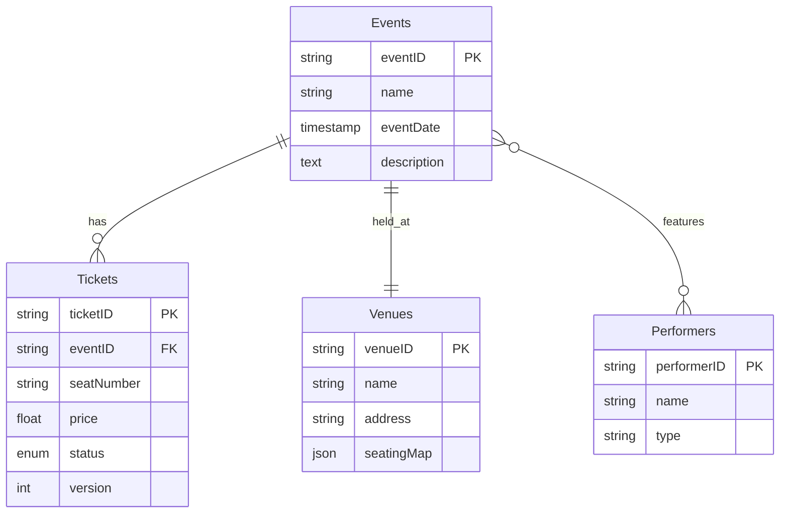
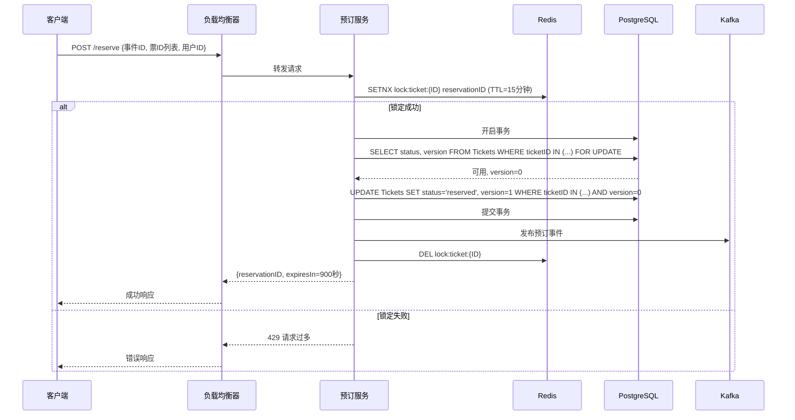
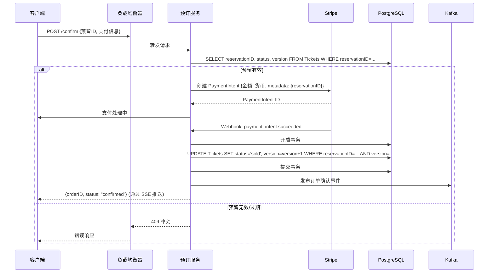
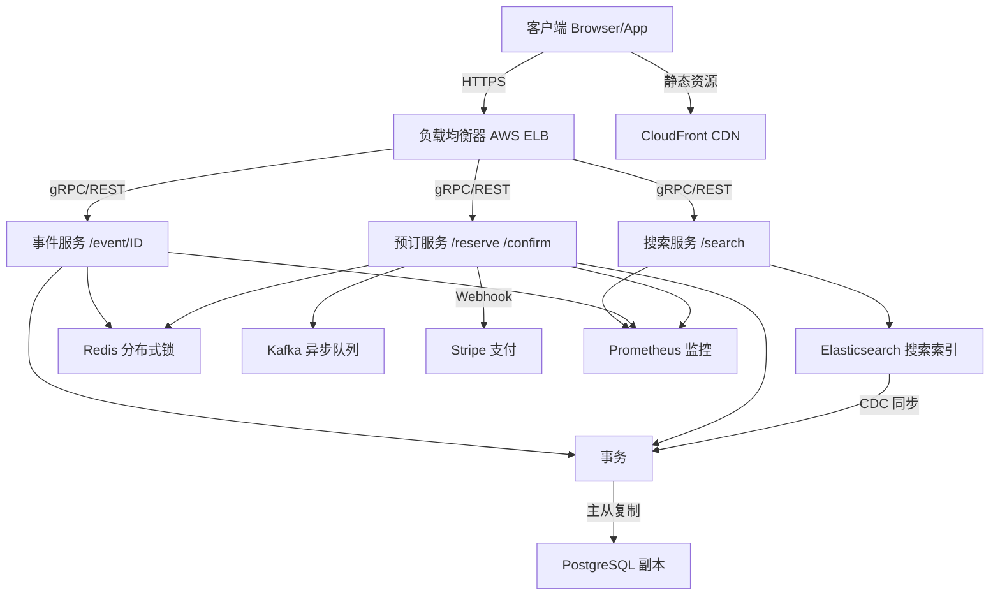
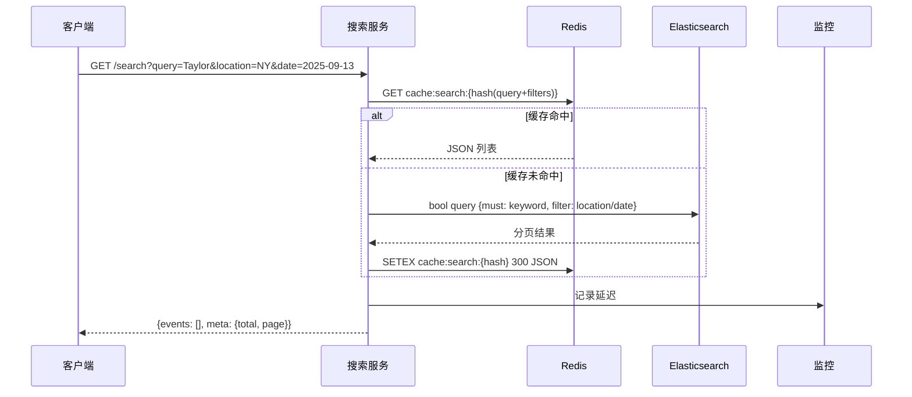
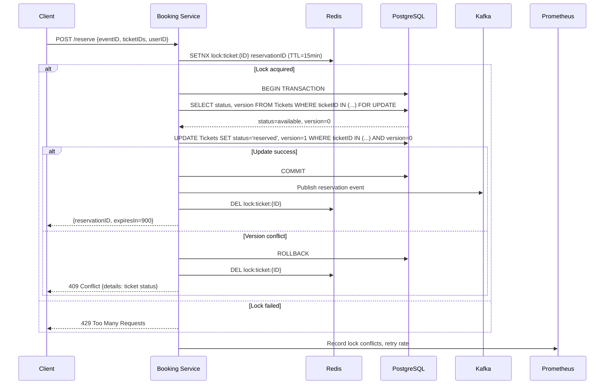
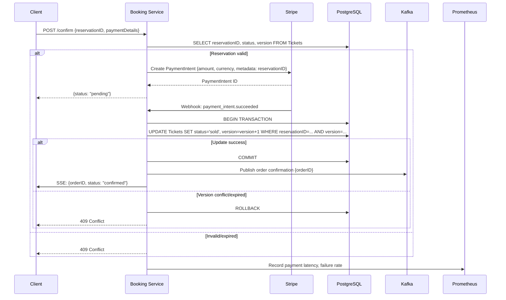
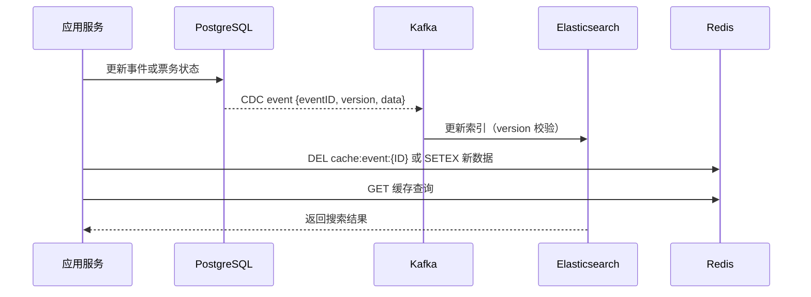

---
toc:
    sidebar: left
layout: post
title: Design TicketMaster
pretty_table: true
tabs: true
mermaid:
    enabled: true
    zoomable: true
date: "2025-09-14"
description: How to design TicketMaster
img: assets/img/2025/Ticket/TicketMaster.png
importance: 6
category: SystemDesign
giscus_comments: true

---


## 介绍

Ticketmaster 是一个处理大型活动票务销售和分销的全球平台，支持网站和移动端购票、转让及验证入场。本文档以结构化方法设计一个高可扩展、高并发的票务系统，涵盖需求分析、容量估算、数据模型、架构组件及优化策略。设计重点包括一致性、可扩展性和优化用户体验。

## 需求分析

### 功能需求

- **搜索事件**
    - 支持按关键词、地点、日期或类型搜索。
    - 返回分页列表，每页 20 条，包含事件基本信息（ID、名称、日期、地点）。

- **查看事件详情**
    - 提供完整信息：表演者、场馆、座位图、票务可用性、价格和座位选项。

- **预订票务**

    - **预留**：用户选座后临时锁定票务（15 分钟）。
    - **确认**：完成支付，票务状态更新为售出。
- **扩展功能（可选，暂不讨论）**
    - 查看订单历史
    - 退票
    - 票务转让

### 非功能需求

- **可扩展性**
    - 支持高峰流量，如热门事件开票时的百万级并发。
- **可用性**
    - 搜索和查看功能保持 99.99% 正常运行。
    - 预订流程保证强一致性。
- **性能**
    - 响应时间 <1 秒，搜索响应 <500ms。
- **可靠性**
    - 数据不丢失，故障恢复时间 <1 分钟。
- **安全性（可选，暂不讨论）**
    - 防止刷票（速率限制、CAPTCHA）。
    - 遵守数据保护规范（加密、用户同意）。
- **优先级**
    - 一致性 > 可用性 > 可扩展性


## 容量估算
- **目标**：量化记录规模、存储量、分片数和缓存需求，为后续设计提供依据。

1. **假设与推算**
    - **日活跃用户 (DAU)**：500 万，高峰并发 50 万。
    - **峰值 QPS**：每用户每秒 0.02 请求，峰值 QPS 约 10,000（读 9900 / 写 100）。
    - **事件规模**：每年 50,000 场事件，每场 10,000 张票，3 年总票务量 15 亿张。
2. **记录规模（3 年）**
    - **Events** - 事件：约 150,000 条记录，150MB。
    - **Tickets** - 门票：约 15 亿条记录，750GB。
    - **Venues - 场馆**：约 10,000 条记录，20MB。
    - **Performers** - 表演者：约 50,000 条记录，25MB。
3. **存储规划**
    - - **PostgreSQL 主数据**：750GB（主要是票务信息）
    - 索引占约 30% → 225GB
    - 主从备份 2 份 → (750 + 225) × 2 ≈ **2TB**
    - **Elasticsearch 索引**：压缩率约 50% → **1TB**
    - **总存储**：PostgreSQL + Elasticsearch = 2TB + 1TB = **3TB**
        - 考虑 20% 年增长 → 规划 **5TB** 容量
4. **分片与路由**
    - PostgreSQL 按 eventID 分片，单分片 1k QPS，峰值需 10 分片，每分片约 75GB。
    - 路由基于 eventID 哈希。
5. **缓存**
    - 热门事件占查询 80%，Redis 缓存命中率 95%。
    - **数据量估算**：
        - - 热门事件详情 50,000 条，每条约 10KB → 约 500MB
        - 热门查询结果 100,000 条，每条约 5KB → 约 500MB
        - **总热门数据量** ≈ 1GB
    - - **内存规划**：Redis 预留 16GB，包含数据、索引和冗余。
    - **策略**：
        - - TTL 5-10 分钟，保证缓存不过期太久
        - 数据更新时立即失效，保证用户看到最新票务信
6. **硬件需求**
    - 平时 QPS 1k：约 50 台服务器。
    - 高峰 QPS 10k：约 100 台服务器，支持 50% 自动扩展。
7. **总结**
    - 系统支持 15 亿票务记录，3TB 存储，10 分片，Redis 16GB 缓存，100 台服务器高峰运行。
    - 保证 <500ms 响应延迟和 99.99% 可用性。

## 核心实体与 API

### 核心实体

1. **Events（事件）**

    - eventID (PK, UUID)、name、eventDate、description

2. **Venues（场馆）**

    - venueID (PK, UUID)、name、address、seatingMap (JSON)

3. **Performers（表演者）**

    - performerID (PK, UUID)、name、type

4. **Tickets（票务）**

    - ticketID (PK, UUID)、eventID (FK, UUID)、seatNumber、price、status (available/reserved/sold)、version (乐观锁)


**实体关系**：

- Events 一对一 Venues（held_at）

- Events 多对多 Performers（features）

- Events 一对多 Tickets（has）




### API 设计

API 使用 **RESTful** 风格，基于 HTTPS，JWT 认证，响应 JSON，分页和元数据支持，错误码遵循 HTTP 状态码（如 429 限流，409 冲突）。

#### 1. 搜索事件

- **GET /search?query={}&location={}&date={}&type={}&page={}&size=20**

- **功能**：按关键词、地点、日期、类型搜索事件，返回分页列表。

- **响应示例**：


```json
{
  "events": [{"eventID", "name", "date", "location"}],
  "meta": {"total", "page", "size"}
}
```

- **错误**：400（参数无效），429（限流）


#### 2. 查看事件详情

- **GET /event/{eventID}**

- **功能**：返回事件详情，包括表演者、场馆、可用票务和座位图。

- **响应示例**：


```json
{
  "event": {
    "eventID", "name", "date", 
    "venue", "performers", 
    "tickets": [{"ticketID", "seatNumber", "price", "status"}]
  }
}
```

- **错误**：404（事件不存在）


#### 3. 预留票务

- **POST /reserve**

- **请求体**：{ "eventID", "ticketIDs": [], "userID" }

- **功能**：锁定票务，返回预留 ID 和过期时间（15 分钟）。

- **响应示例**：{ "reservationID", "expiresIn": 900 }

- **错误**：409（票已预留），429（限流）


#### 4. 确认订单

- **POST /confirm**

- **请求体**：{ "reservationID", "paymentDetails": {cardNumber, expiry, cvv} }

- **功能**：完成支付，更新票务状态为售出。

- **响应示例**：{ "orderID", "status": "confirmed" }

- **错误**：409（预留失效），402（支付失败）


#### 5. 认证与安全

- **JWT** 验证用户身份，token 有效期 1 小时，可刷新。

- 支付信息加密存储（AES-256），用户同意记录日志，符合 GDPR。


### 6. 错误响应示例

```json
{
  "error": {
    "code": 409,
    "message": "Tickets already reserved or sold",
    "details": [{"ticketID": "123", "status": "reserved"}]
  }
}
```

#### 预留票务时序图




#### 确认订单时序图




## 5. 高级设计

整体采用分层微服务架构，支持水平扩展、高可用性和低延迟。客户端请求通过负载均衡器分发到独立微服务，缓存优化读性能，数据库保证一致性，消息队列处理异步任务。微服务间使用 gRPC 通信，外部 API 保持 RESTful。

### 架构组件

1. **负载均衡器**：AWS ELB，分发流量，支持自动扩缩和故障转移，基于路径的 L7 路由。

2. **微服务**：

    - **搜索服务**：GET /search，查询 Elasticsearch 索引，支持模糊搜索和过滤。

    - **事件服务**：GET /event/{eventID}，优先从 Redis 缓存读取，未命中则访问 PostgreSQL。

    - **预订服务**：POST /reserve 和 /confirm，使用 Redis 锁 + PostgreSQL 事务处理。

3. **缓存**：Redis，存储热门事件和搜索结果，TTL 5~10 分钟，命中率预期 95%。

4. **数据库**：

    - PostgreSQL：主存储，按 eventID 分片（10 分片），支持事务和主从复制。

    - Elasticsearch：搜索索引，5 节点集群，CDC 同步 PostgreSQL 数据。

5. **消息队列**：Kafka，用于异步任务（支付确认、邮件通知），16 分区，保留 7 天。

6. **CDN**：CloudFront，缓存静态资源（如座位图），全球分布，延迟 <100ms。

7. **监控**：Prometheus + Grafana，跟踪 QPS、延迟和错误率，触发 Auto Scaling。


### 架构图




## 6. 深入探讨

### 问题
- PostgreSQL LIKE 查询全表扫描，事件数量百万级时延迟 >1 秒，无法满足 <500ms。
- 高峰 QPS 9900（读），O(n) 查询导致数据库 CPU/IO 瓶颈，用户放弃率升高 20%。

### 解决方案

1. **全文搜索**：引入 Elasticsearch

    - 建立索引映射 Events 字段（name、description、venue、date），启用 n-gram 分词支持模糊匹配。

    - 数据同步：Debezium CDC 捕获 PostgreSQL 变更，通过 Kafka 保证顺序，延迟 <1 秒。

    - 查询：搜索服务 GET /search 构造 bool 查询 + BM25 排序，返回分页（20 条/页）。

2. **缓存优化**：Redis

    - 存储热门查询结果（key=SHA256(query+filters)），TTL 5 分钟。

    - 命中率 95%，80% 查询来自 20% 热门事件。

3. **扩展性**：

    - Elasticsearch 5 节点，每节点 2 分片，单节点 2k QPS。

    - Prometheus 监控延迟 >500ms，触发扩容或分片优化。

4. **GDPR 合规**：

    - 搜索日志匿名化，用户敏感信息加密。


### 权衡分析

|方案|优点|缺点|
|---|---|---|
|Elasticsearch|支持复杂模糊匹配、BM25 排序、聚合，水平扩展，适合大规模（150k 事件，5 亿票）|集群运维复杂，额外资源开销|
|PostgreSQL GIN|集成简单，强一致性，适合小规模|模糊查询慢，单机 QPS <1k|
|Redis 缓存|命中率 95%，响应 <50ms，降低 80% DB 负载|需维护失效策略|
|无缓存|简单|查询延迟 200-500ms，高峰 QPS 过载|

**选择**：Elasticsearch + Redis，优先性能和可扩展性，接受运维复杂性。

### 原因

- LIKE 查询 O(n) 随事件增长线性上升，高峰 QPS 9900 导致 CPU >90%，用户体验差。
- Elasticsearch 倒排索引降低至 O(log n)，Redis 缓存热门查询（80% 流量）提速 10 倍，总体延迟 <200ms。
- 实例：Ticketmaster 使用 Elastic Stack 支撑百万 QPS，崩溃率降 90%。

### 搜索时序图




### 问题 2：高峰热门事件 QPS 过载

**现象**：Taylor Swift 等热门开票时，QPS >10k，数据库过载，座位图过期，用户重复点击导致流失。

**原因**：

- Tickets 表 15 亿行，读延迟 >1 秒。

- 票务状态频繁变化，传统 API 返回静态数据，用户手动刷新造成 30% 无效请求。


**解决方案**：

1. **虚拟等待队列**：Redis ZSET 管理 queue:event:{eventID}，会员优先、随机防刷，POST /queue/join 加入，定时出队（每秒 100 用户）。

2. **实时更新**：SSE 推送队列进度和座位状态（Kafka 广播）。

3. **扩展性**：ELB + Kubernetes Auto Scaling（CPU>80%），PostgreSQL 按 eventID 分片（10 分片，每分片 75GB，1k QPS），2 从扩展读负载。

4. **监控**：Prometheus 跟踪 QPS、延迟、错误率，动态调整出队速率。

5. **CDN 缓存**：CloudFront 缓存座位图（TTL 1min），延迟 <100ms。


**权衡**：

- **虚拟队列 vs 速率限制**：队列公平、实时反馈，降低用户焦虑；速率限制简单但不透明，易增加 QPS。

- **SSE vs 长轮询 vs WebSocket**：SSE 单向、低开销，适合实时座位更新；WebSocket 内存消耗大；长轮询延迟高。

- **选择**：队列 + SSE，优先用户体验和可扩展性。


### 问题 3：并发预订一致性

**现象**：高峰期一张票卖两次（overbooking），库存错误，用户投诉。

**原因**：

- 分布式高峰 QPS 写请求高，多个请求同时访问同一票务记录。

- 单纯数据库事务（乐观锁/悲观锁）在高并发下效率低。


**解决方案**：

1. **Redis 分布式锁**：SETNX 锁票务（TTL 15min），快速过滤并发。

2. **乐观锁事务**：锁成功后，PostgreSQL 执行 SELECT FOR UPDATE + UPDATE Tickets，事务失败回滚。

3. **异步通知**：Kafka 发布预订成功事件。

4. **错误处理**：锁失败返回 429，事务冲突返回 409，返回票务状态。

5. **监控**：锁冲突率 >1%，事务重试率 >5%，可调整 TTL 或分片策略。


**权衡**：

- **SETNX + 乐观锁**：降低 90% 并发冲突，延迟 <100ms，需管理锁 TTL。

- **纯乐观锁**：简单，但高并发重试率高，延迟 >500ms。

- **悲观锁**：强一致性，单分片 QPS <1k，高峰易卡顿。

- **选择**：SETNX + 乐观锁，兼顾一致性和性能。

#### 并发预订时序图




### 问题 4：支付集成与异步处理

**现象**：同步支付高峰期延迟秒级，阻塞预订服务，用户流失。

**原因**：

- Stripe 等第三方支付响应慢（网络/验证 200ms–2s），高峰写 QPS 100，同步模式放大延迟。


**解决方案**：

1. **异步支付**：POST /confirm 创建 PaymentIntent，立即返回“支付处理中”，Webhook 异步回调处理。

2. **事务更新**：Webhook 验证 reservationID，PostgreSQL 执行 UPDATE Tickets，成功发布 Kafka 事件。

3. **幂等处理**：Webhook 重试，事务检查 status=sold 避免重复。

4. **监控**：Prometheus 跟踪支付延迟、失败率、Kafka 积压，动态扩容消费者。

5. **GDPR**：支付信息加密传输，持久化前脱敏。


**权衡**：

- **Webhook vs 同步**：Webhook 异步、延迟低、解耦服务；同步简单但高峰阻塞。

- **Stripe vs 自建支付**：Stripe 高可用、快速集成、合规，费用高；自建灵活但开发复杂。

- **选择**：Stripe + Webhook + Kafka，优先可靠性和快速部署。


#### 支付时序图




### 问题5：数据一致性保证

**问题**：数据库（PostgreSQL）与搜索引擎（Elasticsearch）、缓存（Redis）之间存在数据同步延迟或不一致风险。高峰期用户查询和预订操作可能看到过期数据，导致库存错误或搜索结果不准确。

**原因**：

- PostgreSQL → Elasticsearch 使用 CDC（Debezium）同步，存在 ~1 秒延迟。

- 双写模式若处理不当，会出现写入失败或事务异常导致数据不同步。

- 缓存更新策略不当（过期/主动失效）会产生脏数据或缓存雪崩。


**解决方案**：

1. **数据库与搜索同步**

    - 使用 **CDC** 捕获变更，Kafka 保证事件顺序，延迟 <1 秒。

    - **双写模式**：仅在原子事务成功后写入 Elasticsearch，保证最终一致性。

    - **版本号机制**：在事件或票务记录中维护 version，每次更新递增，消费者通过 version 校验更新，防止旧数据覆盖新数据。

2. **缓存一致性策略**

    - **Cache Aside**（推荐）：应用更新数据库后主动删除缓存，下次访问重建。

    - **Write Through / Write Behind**：适用于写入集中且对延迟容忍高的场景。

    - **雪崩防护**：热门数据加随机 TTL、限流更新，避免大量缓存同时过期。

3. **监控指标设计**

    - 数据延迟监控：PostgreSQL → Elasticsearch 延迟、Redis 缓存命中率。

    - 一致性校验：定期对比主库和搜索引擎数据，发现差异报警。

    - 告警阈值设置：延迟 >2 秒或一致性错误 >0.1% 触发通知。


**权衡**：

- **CDC vs 双写**：CDC 延迟可接受（<1 秒），系统解耦；双写强一致性，但实现复杂、易出错。

- **缓存策略**：Cache Aside 灵活、可控；Write Through 写入延迟低，但数据库压力高。

- **选择**：CDC + Cache Aside + 版本号机制，兼顾性能、可扩展性和一致性。


**原因**：  
高峰期用户查询和预订并发高，若数据不同步或缓存过期，会导致库存错误、搜索结果不准确和用户体验下降。通过 CDC + 版本号 + Cache Aside，可确保最终一致性，延迟 <1 秒，缓存命中率 >95%，整体系统稳定性和用户体验提升。

#### 数据一致性时序图（Mermaid）




## 总结

整体设计围绕 **高并发、高可用、良好用户体验** 展开。  
通过 **Elasticsearch 搜索优化、Redis 缓存与队列、分布式锁、异步支付** 等手段，系统在百万级 QPS 下依然保持稳定。  
微服务架构和消息队列保证了 **扩展性和解耦性**，同时监控和自动伸缩机制让系统在高峰期依然可靠。

简而言之，这套方案 **既解决性能瓶颈，又确保用户体验和运维可控**，适合大规模票务平台的生产环境。