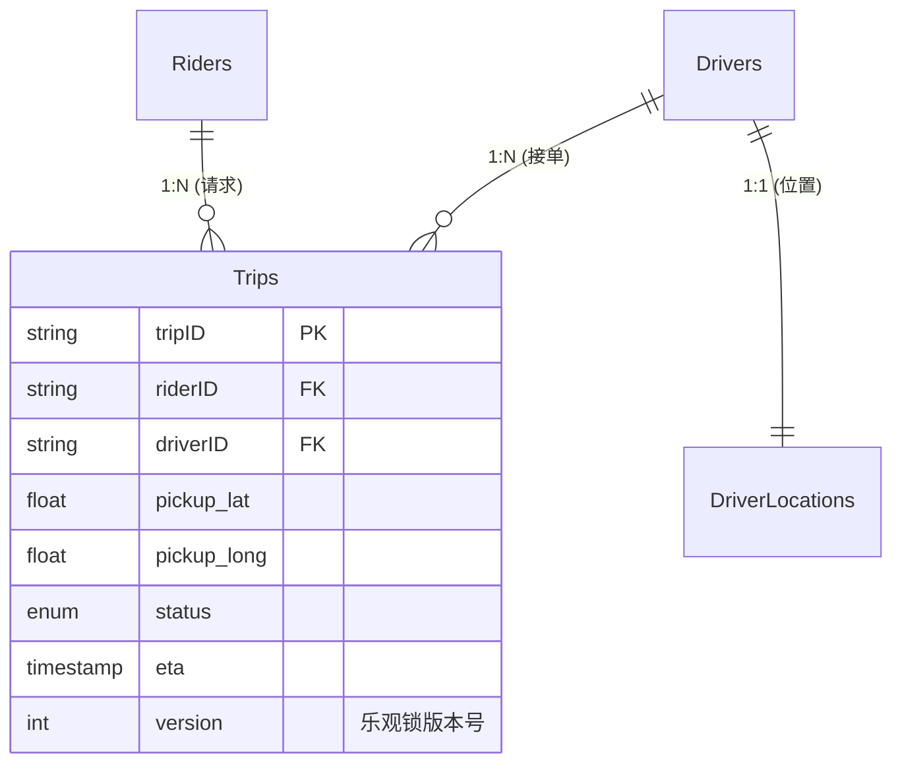
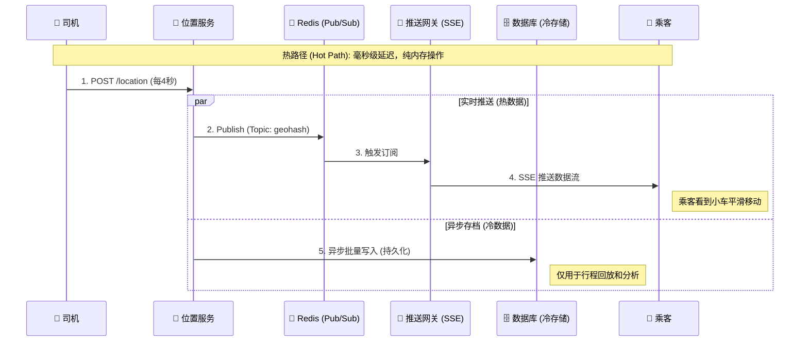
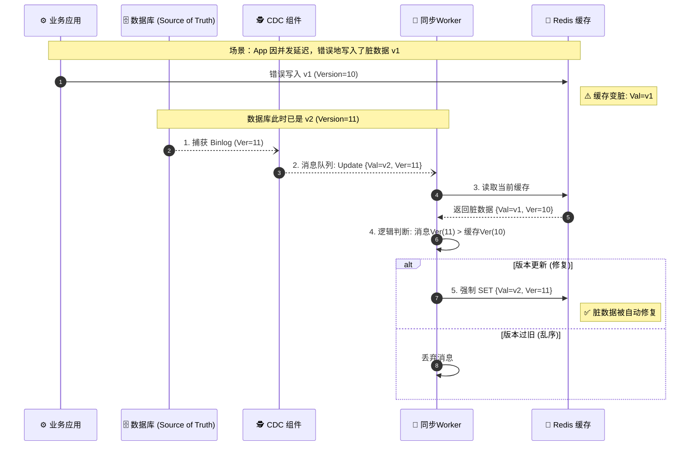
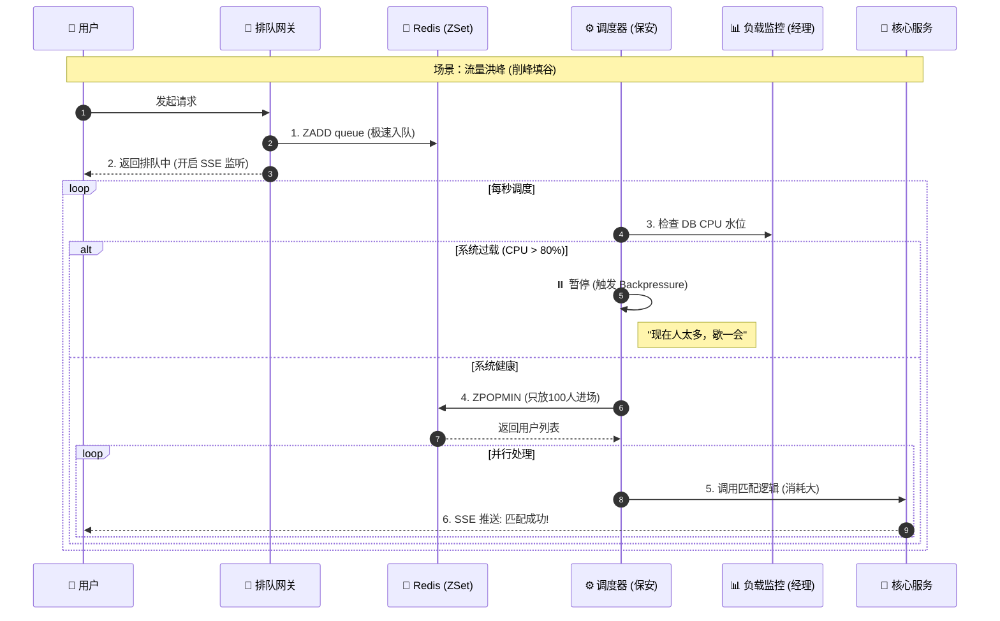
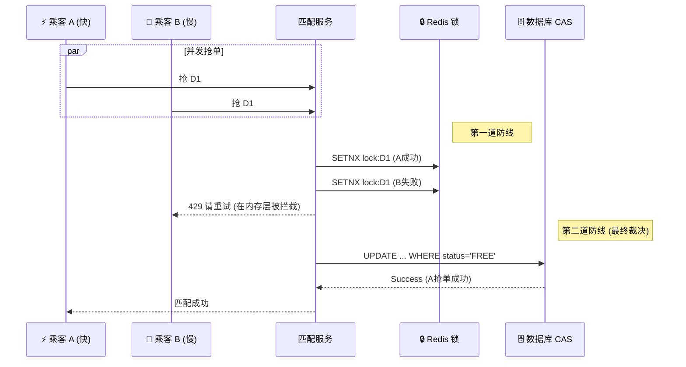

---
toc:
sidebar: left
layout: post
title: Design Uber
pretty_table: true
tabs: true
mermaid:
enabled: true
zoomable: true
date: "2026-01-04"
description: How to design Uber
img: assets/img/2026/Uber/designUber.png
importance: 7
redirect: https://zhengxingxing.com/assets/html/uber_design.html
category: SystemDesign
giscus_comments: true

---

## 1. 介绍

Uber 是一个连接乘客和司机，提供按需乘车服务的全球平台。本文档不仅仅是一个架构图的堆砌，而是从**工程落地**的角度，深入探讨如何构建一个支持**百万级 QPS**、**写多读少**、且在**高并发下保持数据最终一致性**的分布式系统。

核心挑战：
1.  **极端的读写比 (1:15)**：与传统 Web 系统完全相反。
2.  **实时性要求**：位置更新不能卡顿，匹配必须精准。
3.  **一致性难题**：如何在缓存、数据库、地理索引之间同步数据而不产生“僵尸数据”。

---

## 2. 需求分析

在设计之前，必须明确业务边界和技术指标。

### 2.1 功能需求
- **司机实时位置更新**：司机端每 4 秒上报一次 GPS 坐标。
- **乘客查看附近车辆**：乘客打开 App，看到周围的小车在地图上实时移动。
- **打车匹配 (Ride Matching)**：乘客下单，系统调度算法匹配最近/最优的司机。
- **行程管理**：从接单、开始行程到结束行程的状态流转及支付。

### 2.2 非功能需求 (关键指标)
- **高并发 (High Concurrency)**：需支撑峰值 100万 QPS 的吞吐量。
- **低延迟 (Low Latency)**：匹配请求响应时间 < 1秒；位置更新端到端延迟 < 500ms。
- **高可用 (High Availability)**：位置服务允许短暂的数据不一致（AP），但不能不可用；核心交易（匹配）必须强一致（CP）。
- **可扩展性 (Scalability)**：系统需能随着城市和用户的增加线性扩展。

---

## 3. 容量估算 (工程落地视角)

这里我们拒绝简单的“数学乘法”，而是采用**工程采购**的视角来估算。

### 3.1 核心 QPS 估算
- **用户规模**：2000 万日活乘客，300 万日活司机。
- **写 QPS (Write Heavy)**：
    - 司机位置上报：300 万司机 $\div$ 4秒 = **75,000 QPS**。
    - 加上心跳、日志、状态流转等，写 QPS 约为 **475,000**。
- **读 QPS**：
    - 主要是乘客打开 App 时的初始化查询和非实时信息的读取，约 **50,000 QPS**。
    - *注意：乘客看地图上小车移动的流量不计入读 QPS（详见下文 Push 模型）。*
- **峰值 QPS**：考虑 50% 的安全缓冲和突发流量，系统设计目标为 **~1,000,000 (1M) QPS**。

### 3.2 存储与内存估算 (32GB 之谜)
**问题**：热门位置数据（300万司机 * 20% 活跃 * 50 Bytes）计算出来只有 **130 MB**，为什么架构师通常会规划 **32 GB** 的 Redis 集群？

| 维度 | 理论计算值 | 工程放大系数 | 工程落地值 | 解释 |
| :--- | :--- | :--- | :--- | :--- |
| **核心数据** | 130 MB | x 3 | ~400 MB | Redis 的内部结构（dictEntry、指针）、内存碎片会导致实际占用是数据本身的 3 倍左右。 |
| **业务支撑** | 忽略 | N/A | ~5 GB | Redis 不只存位置，还要存 **GeoHash 索引**、**用户 Session**、**分布式锁**、**限流计数器**等。 |
| **吞吐量驱动** | 1 台 | **QPS 驱动** | **16 台** | **这是关键！** 单台 Redis 生产环境极限约为 8万 QPS。为了抗住 100万 QPS，必须切分出 12-16 个分片 (Shards)。 |
| **硬件规格** | 任意 | 云厂商限制 | 32 GB | 云服务商通常不卖“100MB 内存 + 万兆网卡”的机器。为了获得**高网络带宽**，被迫购买 2GB/4GB 规格的实例。 |
| **高可用** | 1 份 | x 2 | 64 GB | 主从复制 (Master-Slave) 备份。 |

---

## 4. 数据模型设计

我们采用 **查询驱动设计 (Query-Driven Design)**。在 NoSQL (Cassandra/DynamoDB) 中，为了读取效率，我们接受数据冗余，将一张大表拆分为多张“视图表”。

### 4.1 核心实体关系 (ERD)

### 4.2 分片策略
为了避免全表扫描，针对不同的查询场景设计不同的表：

1.  **`Trips` (主表)**
    - **用途**：根据 TripID 查询订单详情、状态。
    - **Partition Key**: `tripID`。
2.  **`TripsByRider` (乘客历史表)**
    - **用途**：乘客打开“我的行程”列表。
    - **Partition Key**: `riderID` (让该乘客的所有单子在同一台机器上)。
    - **Clustering Key**: `timestamp DESC` (按时间倒序存储，读取最新的一页极快)。
3.  **`TripsByDriver` (司机历史表)**
    - **用途**：司机查看业绩。
    - **Partition Key**: `driverID`。

---

## 5. 核心架构与流程

### 5.1 为什么读写比是 1:15？(Push 模型详解)

这是 Uber 架构的灵魂。如果按照传统的 HTTP 请求/响应模式，1000 万乘客每秒刷新一次位置，数据库瞬间就会崩溃。

**解决方案：Push (推送) 模型**

*   **原理**：利用 **WebSocket** 或 **SSE (Server-Sent Events)** 建立长连接。
*   **流程**：
    1.  乘客 App 启动时，与 **Push Service** 建立一条 TCP 长连接，并订阅“我当前屏幕范围内的 GeoHash”。
    2.  司机上传位置给 **Location Service**。
    3.  Location Service 将位置写入 **Redis Pub/Sub**（内存操作，极快）。
    4.  Redis 通知 Push Service：“这个区域有车动了”。
    5.  Push Service 通过长连接直接将坐标推送到乘客手机。

**结果**：数据像水流一样流过内存，**完全不经过硬盘数据库**。因此，这部分巨大的流量不计入“数据库读 QPS”。

#### Push 模型架构图

---

## 6. 深入探讨：关键难题与解决方案

### 6.1 难题一：僵尸数据与一致性闭环

**场景还原**：
我们使用 **Cache Aside** 策略（先读缓存，没有查库回写；写时更库删缓存）。
但在高并发下，有一个极端的 **Race Condition**：
1.  **读线程 A**：查缓存未命中 -> 查数据库得到旧值 `v1` -> **(突然卡顿，比如 GC)**。
2.  **写线程 B**：更新数据库为 `v2` -> 删除缓存。
3.  **读线程 A**：(苏醒) 将手里的旧值 `v1` 写入缓存。
4.  **后果**：数据库是新值 `v2`，缓存是旧值 `v1`。**这就是“僵尸数据”，它会一直存在直到缓存过期。**

**解决方案：CDC + Version 自动修复**
我们引入 **CDC (Change Data Capture)** 组件作为“监控者”。

1.  **应用层**：只管写数据库，不用太担心缓存一致性。
2.  **数据库**：每次更新 `v2`，版本号 `version` 递增。
3.  **CDC 组件**：监听数据库日志 (Binlog)，发现变动，发送消息 `{key, val:v2, ver:11}`。
4.  **同步 Worker**：收到消息，去检查 Redis。
    - 如果 Redis 里的版本是 `10` (旧)，直接覆盖为 `11`。
    - 如果 Redis 里的版本是 `11` (新)，忽略。

**效果**：即使应用层写错了缓存，CDC 也会在几百毫秒后强制修复它。

#### 一致性修复时序图

### 6.2 难题二：高峰削峰与背压机制 (Backpressure)

**场景还原**：
演唱会散场，5万人同时点击“叫车”。如果这 5万个请求直接打到数据库进行匹配计算（涉及锁、地理计算），数据库 CPU 会瞬间飙升到 100% 并死机。

**解决方案：虚拟队列 + 背压**

这不是简单的排队，而是一个**动态调节**系统：
1.  **入队 (Gate)**：所有请求先进入 Redis ZSet，快速返回“排队中”。Redis 抗并发能力极强，充当“蓄水池”。
2.  **调度 (Worker)**：后台 Worker 充当“保安”。
3.  **监控 (Monitor)**：Worker 每秒询问监控系统：“现在数据库 CPU 多少？”
    - 如果 CPU < 60%：Worker 从 Redis 取出 500 人，放入匹配服务。
    - 如果 CPU > 80%：**背压触发**，Worker 暂停取人，让请求在 Redis 里多积压一会儿。

**效果**：无论前端流量多大，后端永远只处理它能承受的量，系统永不崩溃（只会变慢）。

#### 虚拟队列与背压图解

### 6.3 难题三：并发预订 (一车多卖)

**场景还原**：
两个乘客 A 和 B 同时抢司机 D1。如果不加控制，两人都会读取到 D1 状态为“空闲”，然后分别写入“已分配”，导致数据覆盖。

**解决方案：双重防线**

1.  **第一道防线：Redis 分布式锁**
    - 使用 `SET lock:driver:D1 NX EX 5`。
    - 作用：**快速失败**。挡住 99% 的无效竞争，保护数据库。
    - 如果 A 拿到了锁，B 会直接收到“请重试”，根本不会去查库。

2.  **第二道防线：数据库 CAS (Compare-And-Swap)**
    - 万一 Redis 锁失效（比如 Redis 挂了），两个请求都到了数据库。
    - 使用 SQL：`UPDATE Drivers SET status='BUSY' WHERE id='D1' AND status='FREE'`。
    - 数据库的行锁机制保证只有一个能更新成功 (Affected Rows = 1)，另一个失败 (Affected Rows = 0)。

#### 并发一致性图解

---

## 7. 架构权衡 (Trade-offs)

Uber 是一个混合系统，不同的模块做了不同的 CAP 选择。

| 业务场景 | CAP 选择 | 核心策略 | 牺牲了什么？ |
| :--- | :--- | :--- | :--- |
| **位置追踪** | **AP** (可用性) | 异步写库，优先读缓存，无锁写入 | **数据准确性**：乘客可能看到车瞬移、位置滞后几秒。但这比地图白屏要好。 |
| **订单匹配** | **CP** (一致性) | 分布式锁 + 强一致写 + 事务 | **可用性**：网络抖动或锁冲突时，用户请求会报错/重试。宁可报错，绝不超卖。 |
| **数据同步** | **Eventual** | CDC + Version 兜底 | **实时性**：各端数据同步有几百毫秒的延迟。 |

---

## 8. 总结

本设计方案通过以下核心手段解决了 Uber 的关键挑战：

1.  **Push 模型**：彻底解决了 1:15 读写比带来的数据库读取压力。
2.  **CDC + Version**：构建了数据一致性的自我修复闭环，解决了缓存脏数据问题。
3.  **虚拟队列 + 背压**：实现了流量的削峰填谷，保护核心数据库不被压垮。
4.  **双重锁机制**：在保证性能的前提下，杜绝了“一车多卖”的业务事故。

这不仅仅是一个架构图，更是一套**既解决性能瓶颈，又确保运维可控**的工程化解决方案。
